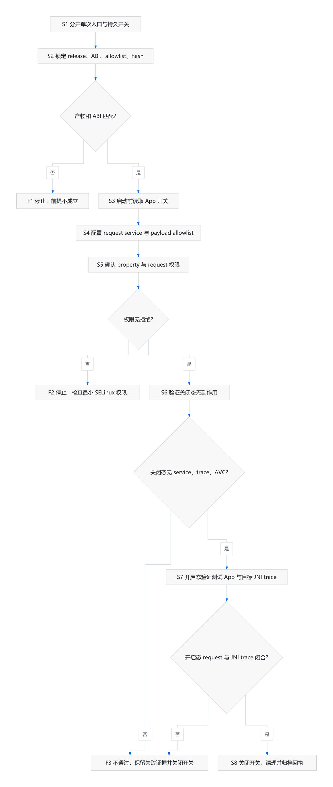

# Android ROM 持久 jnilog 注入流程：开关、请求与验收

本文把一份 Android ROM 集成报告整理成可审查的步骤，说明如何区分手动单次注入与 App 级持久 jnilog 开关，并验证开关两态。它不是通用 ROM 移植手册；框架位置、SELinux policy、ABI、注入后端和 payload 都必须按目标构建重新确认。

## 前提与输入

- 有可修改、可恢复的 Android ROM 构建与测试环境，并已确认目标 App、包名和进程启动钩子位置。
- 有与目标 ABI 匹配的 xfinject daemon/library 和 jnilog payload；按 release、文件名、ABI 与 SHA-256 锁定产物，并维护 payload allowlist。来源报告使用 arm64 产物并固定到 xfinject release `v0.1.0`。
- 能分别配置 App 级持久开关、启动前 request 和 init one-shot service；framework 负责检查开关、写 request、启动 service，不直接加载 payload。
- 能审查针对 property 读取、request 目录/文件写入的 SELinux 变更，并可采集 service、AVC 与 JNI trace 日志。
- 先用可控测试 App 验证，再进入目标 App；任何 ABI、ROM build 或 payload 变化都视为需要重验。

## 步骤与分支

| 步骤 ID | 动作 | 观察与产物 | 条件与下一步 |
|---|---|---|---|
| S1 | 将手动单次注入入口与 App 级持久 jnilog 开关分开定义。 | UI/配置中能区分“一次提交 request”和“之后每次启动都注入”。 | 语义混在一起时停止，回到功能设计；否则 S2。 |
| S2 | 锁定 xfinject 与 jnilog release 产物、ABI、allowlist 和每个文件的 SHA-256。 | 可审计的版本清单与 payload lock。 | 缺 release、ABI 不匹配或 hash 不一致时走 F1；否则 S3。 |
| S3 | 在目标进程启动前读取该 App 的持久开关；关闭时不创建自动注入 request，开启时生成最小 request。 | 记录开关逻辑与 request。来源案例的 request 使用 package、payload id、backend 与 wait-for-launch 等字段。 | 不确定开关与 request 关系时走 F1；否则 S4。 |
| S4 | 让 init one-shot service 执行 request，由 xfinjectd 等待目标进程并负责注入；framework 不直接 `System.loadLibrary` payload。 | service 定义、request 路径、allowlist 与启动日志。 | service 身份、request 路径或 payload 装配不清时走 F1；否则 S5。 |
| S5 | 为读取 feature property、创建 request 目录/文件配置必要的 SELinux 权限，并核对 service 域与文件上下文。 | 对应 policy 变更和 AVC 检查结果。 | 出现相关拒绝或需扩大到不明范围时走 F2；否则 S6。 |
| S6 | 先在开关关闭状态启动测试 App，确认没有 autostart service、JniLog 输出或新增 AVC。 | 关闭态日志与配置快照。 | 任一副作用出现时走 F3；全部满足后，在独立测试记录中打开开关并继续 S7。 |
| S7 | 在开关开启状态先对测试 App、再按授权范围对目标 App 验证启动 request、service 退出与 JNI 调用输出。 | request、service、JNI trace 与目标范围记录。 | 缺少预期 JNI 事件、service 异常退出或证据不完整时走 F3；通过后 S8。 |
| S8 | 关闭持久开关，停止测试进程并归档本次构建、payload hash、开关两态日志和残留检查。 | 可复核的验收回执与清理记录。 | 输出与清理均闭合后结束；否则走 F3。 |

图源：[flow.mmd](./xfinject-jnilog-rom-procedure/flow.mmd)；[SVG](./xfinject-jnilog-rom-procedure/flow.svg)。节点 ID 与本节步骤一致。

## 输出

- xfinject/jnilog release、ABI、allowlist 与 SHA-256 锁定清单。
- App 级开关到启动前 request、init service 和 xfinjectd 的配置/变更记录。
- 开关关闭与开启两态的测试日志、JNI trace 和 AVC 检查结果；样本身份应按项目可见性策略脱敏。
- 关闭开关、停止测试进程及清理临时状态的回执。

## 验收

以下是来源报告给出的验收形状，不是本轮运行结果：

| claim_id | 结论 | 来源与定位 | basis | 适用范围 | 限制 |
|---|---|---|---|---|---|
| C1 | 手动单次注入与 App 级持久 jnilog 开关是两个不同入口；持久开关由启动前路径触发。 | s1，`xfq-20260622-01.md` 第 71-96、153-165 行 | source-report | 来源报告中的 ROMManager/framework 设计 | 不外推为其他 ROM 的 UI 或启动钩子设计。 |
| C2 | 开关开启时由 framework 写 request 并启动 one-shot service，实际 payload 注入交给 xfinjectd。 | s1，第 167-203 行 | source-report | 来源报告的 xfinject autostart 路径 | 具体 request schema、service context 与路径需按目标实现重验。 |
| C3 | 来源报告为 property 读取和 request 文件创建补充了对应 SELinux 权限，并记录了 property/file AVC。 | s1，第 206-220 行 | source-report | 报告中的 system_server 触发链 | 不构成通用 policy patch；不能照搬宽泛权限。 |
| C4 | payload release、ABI 与 SHA-256 可作为发布/设备侧一致性核对点。 | s1，第 223-241 行 | source-report | 报告使用的 xfinject `v0.1.0` arm64 产物 | 本轮未独立下载、构建或复核这些二进制。 |
| C5 | 报告区分了开关关闭时无副作用、开启后测试 App/目标 App 出现 JNI trace，并在验证后关闭开关。 | s1，第 295-343 行 | source-report | 报告中的测试与目标 App 样本 | 仅为来源作者记录；不代表当前设备或其他 App 已通过。 |

目标实施至少满足：关闭态无 request/service/JniLog 副作用且无新增相关 AVC；开启态能将已锁定 payload 注入指定测试进程并观察到预期 JNI 事件；测试后开关关闭且证据/清理回执齐全。三者缺一，不标记为完成。

## 失败出口

- **F1：构建或 payload 前提不成立。** 停止集成；确认 ABI、release、allowlist 与 hash 后再继续，不以文件存在代替兼容性验收。
- **F2：property/request 权限拒绝。** 保留精确 AVC 与触发步骤，只调整实现所需的最小 property/file 权限；若 service domain 或路径关系不清，停止而不是扩大授权。
- **F3：开关两态验收不闭合。** 不宣称注入成功；分别核对开关值、request、service 启动/退出、payload hash、目标进程启动时序与 JNI 输出，关闭开关并保留失败证据。

来源：`xfq-20260622-01.md` 的完整集成记录。该记录包含特定设备、App 与本地分支细节；本文不复制这些身份信息，也不将其结果提升为本轮验证。
