# Shopee SHPSSDK requestDefense：x-sap-ri 与四键签名

> 来源: 语雀 xiayutian23/htolhb
> 原始发布时间: 2026-03-22
> 归档日期: 2026-09-15
> 分类: signature-algorithms
>
> Shopee 菲律宾包 `com.shopee.ph` 版本 33731 无加固。OkHttp 反欺诈拦截器走 `SHPSSDK.requestDefense`，最终 native 在 `libshpssdk.so!0x995dc`。请求头是 `x-sap-ri` 加四个变化键：时间戳小端、自定义 SHA-256、ChaCha20 / RC6 / Salsa20、xxhash、mmh3 与自定义 Base64。正文按原文结构归档，截图已落成本地文件，便于按 unidbg + SearchData / traceWrite 复现。

## 收录说明

原文：[Shopee算法分析](https://www.yuque.com/xiayutian23/htolhb/898b01574e69d4e48bdf5b17ce3f0958)（公开密码文档）。作者 2026-03-22 写完，语雀页 2026-03-23 发布、2026-09-11 仍有更新。截图共 296 张，已从语雀 CDN 下载到 `signature-algorithms/shopee-shpssdk-request-defense/`，不再依赖外链。Hook 输出里的 `device_id` / `ctx_id` / `session_ids` 已脱敏。未收录语雀验证页与平台 UI。

作者写明仍有缺口，复现时按待验证处理，不要当成整包 completed：

- 九套短键算法的选取是否真随机（文内 TODO）
- 最长值另外三个分支（ChaCha20 / RC6 / 自定义 0x40）正文未写完
- 最长值明文里的指纹块暂当固定值（文内 TODO）
- unidbg 里 ChaCha20 前四字节与真机不一致，纯算要用真机明文

## 案例边界

| 项 | 内容 |
|---|---|
| 包名 | `com.shopee.ph`（地区后缀可变：my/sg/th/id/vn/tw/cn） |
| 观察版本 | 33731，XAPK，无加固 |
| Java 入口 | `com.shopee.shpssdk.SHPSSDK.requestDefense` → `uvwvvwvvw` → `wvvvuwwu.vuwuuwvw(byte[], byte[])` |
| Native | `libshpssdk.so!0x995dc` |
| 目标字段 | 请求头 `x-sap-ri` + 四个变化四字节键及其值 |
| GET / POST | GET 三个短键；POST 多一个短值 |
| 固定盐 | `gkXKQn1X6TZ1OR49` |
| 运行时 | Pixel 6 + JustTrustMe；unidbg 补 `RandomFileIO` / 文件访问 / AndroidModule |

## 字段速查

| 字段 | 构成 |
|---|---|
| `x-sap-ri` | 10 位 unix 时间戳小端 8 hex + 44 hex 随机，下标 14 固定 `1`，下标 16–17 固定 `01` |
| 第一个键 | 与 URL/body 绑定，trace 里 `and w11, w13, w11` 得到 `0x1a9ec9b9` 这类稳定键 |
| 其余三键 | 九套算法（1–9），选择字节形如 `03 09 03 07`：剩余键数 / 短值算法号 / POST 短值算法号 / 长值算法号 |
| 第二个值 | 自定义 Base64(ChaCha20)；后半 `00 16 01 69 02 41 03 6b` = 时间戳小端异或第 7 次随机 |
| POST 第三值 | 三分支：0 Salsa20、1 RC6、2 ChaCha20，均叠自定义 SHA-256 / `deadbeef` |
| 长值 | 四分支：0 ChaCha20、1 RC6、2 自定义 0x40、3 Salsa20；Salsa20 路径已给出 Python：`custom_sha256` + Salsa20 + xxhash32 xor 时间戳 + 随机异或 + 自定义 Base64 |

## 复现顺序

1. 样本落到 `workspace/<项目>/samples/`，不要放 `workspace` 根。动态默认 Pixel 6。
2. HashMap.put 盯 `x-sap-ri`，确认 `SHPSSDK.requestDefense` 与 `libshpssdk.so!0x995dc`。
3. unidbg 固定 `RandomFileIO` 与 10 位时间戳，主动调用 `vuwuuwvw(urlBytes, bodyBytes)`。
4. memcpy 日志 + SearchData + traceWrite 追运算点，不要停在赋值/写内存。
5. 短键按算法号 1–9 分别闭合；长值先复现已给出的 Salsa20 分支，其余分支标待验证。

原文从下一节开始，结构保持作者分节。

## 1. 前言
- 包名：com.shopee.ph，ph代表菲律宾地区的，此应用有多种地区；

```plain
马来西亚：https://shopee.my
新加坡：https://shopee.sg
泰国：https://shopee.th
印度尼西亚：https://shopee.id
越南：https://shopee.vn
菲律宾：https://shopee.ph
台湾：https://shopee.tw
大陆：https://shopee.cn
```

- 大致都是一样的，只是结尾的地区不同，抓包使用justtrustme即可，这个应用是xapk，可以推到设备使用mt安装，也可以解压后用adb的命令来装；

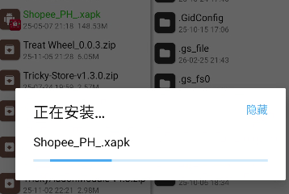

- 我使用前面的方式，推过去之后可能后缀没了，自己改一下点击选择安装即可；
- 版本是：33731，没有加固；


## 2. 抓包&定位
- 先来抓包吧，把justtrustme勾选上就好；不过有些可能需要登录账号，我这里不想登录，不过不登录刷新不出东西，但有些接口也有这几个目标字段；
- tips：最近开始必须都要登录才能看数据了；

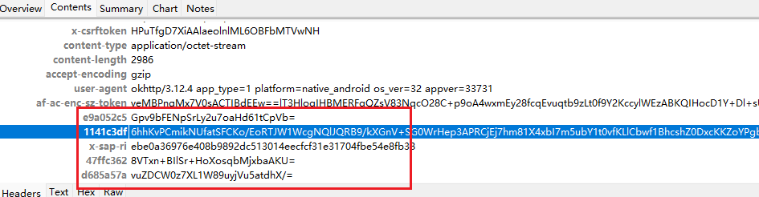

- 我们的目标就是请求头的这五个字段，一个x-sap-ri，剩下四个四字节键和值，这四个键也是变化的，其中有一个结果比较长，剩下三个比较短；
- 定位的话hook hashmap的put方法来定位，这里只能以sap-ri来匹配了；

```javascript
Java.perform(function (){
    var hashMap = Java.use("java.util.HashMap");
    hashMap.put.implementation = function (a, b) {
        if(a!=null && a.equals("x-sap-ri")){
            console.log(Java.use("android.util.Log").getStackTraceString(Java.use("java.lang.Throwable").$new()))
            console.log("hashMap.put: ", a, b);
        }
        return this.put(a, b);
    }
})
```

- 触发对应的接口；

```plain
java.lang.Throwable
    at java.util.HashMap.put(Native Method)
    at org.json.JSONObject.put(JSONObject.java:276)
    at org.json.JSONTokener.readObject(JSONTokener.java:394)
    at org.json.JSONTokener.nextValue(JSONTokener.java:104)
    at org.json.JSONObject.<init>(JSONObject.java:168)
    at org.json.JSONObject.<init>(JSONObject.java:185)
    at com.shopee.shpssdk.SHPSSDK.uvwvvwvvw(Unknown Source:50)
    at com.shopee.shpssdk.SHPSSDK.requestDefense(Unknown Source:66)
    at com.shopee.app.network.antifraud.b.intercept(SourceFile:47)
    at okhttp3.internal.http.RealInterceptorChain.proceed(SourceFile:19)
    at okhttp3.internal.http.RealInterceptorChain.proceed(SourceFile:1)
    at com.shopee.app.network.antifraud.a.intercept(SourceFile:9)
····
    at java.util.concurrent.ThreadPoolExecutor.runWorker(ThreadPoolExecutor.java:1167)
    at java.util.concurrent.ThreadPoolExecutor$Worker.run(ThreadPoolExecutor.java:641)
    at java.lang.Thread.run(Thread.java:920)

hashMap.put:  x-sap-ri d0e8a369cf5fe61cbe850b1701035d4845816bf810178ed090cc
```

- 日志太长了，我省略了一部分；com.shopee.shpssdk.SHPSSDK这个肯定是比较显眼的，去看看；

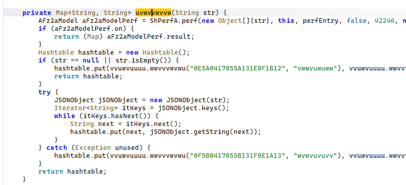

- 拿起来没什么特别的，我们尝试hook一下这个函数；

```javascript
function hook_mointor_uvwvvwvvw(){
    Java.perform(function () {
        let com_shopee_shpssdk_SHPSSDK = Java.use("com.shopee.shpssdk.SHPSSDK");
        com_shopee_shpssdk_SHPSSDK["uvwvvwvvw"].implementation = function (str) {
            console.log(`[->] com_shopee_shpssdk_SHPSSDK.uvwvvwvvw is called! args are as follows:\n    ->str= ${str}`);
            var retval = this["uvwvvwvvw"](str);
            console.log(`[<-] com_shopee_shpssdk_SHPSSDK.uvwvvwvvw ended! \n    retval= ${retval}`);
            return retval;
        };
    });
}
hook_mointor_uvwvvwvvw();
```

- 触发接口，发现确实走了这里，并且参数已经有我们的目标了；

```plain
[->] com_shopee_shpssdk_SHPSSDK.uvwvvwvvw is called! args are as follows:
    ->str= {"47ffc362": "nW6tuy51Fzec2IQxDJgMx/PlRMk=", "68d3f29e": "4L8ais8kBDqogPUL4m+jhIPIArs=", "6e7909a8": "4o1f7ZWoYTQhnKW8DBGlSSvC+jO=", "befc0ac1": "7H5obeYqNKbw/Kqa7x8l1JHQ83ks9J2vontoPB0KynPCJv8WppVwuHJFZTHcCF23FouW7zLFxfK5SIi1yHtrSK+8j5UVwb6WH1+xuZ9v/Fy+2VN7I6BWZQ1w7MT+X6f2KSwkeyrLB1QNCU7A9Ru4suLECjEUHAwhyMKJRjiTOcvo/q/m/rOOCR+J6L9/g9S4jB7d34vPKNGSGMgD0rvCs/6qQgz86afTGpA86viQspt7RnY+EwJjCetT0Bx/n266n5C8gvV8ruNvzEX/RP51Q9lSG703ihskd2N1AmPCyuA6W9op8T1Vzba4EEnPQhkPT4mKEuP9OD9bgCdKN9Ll0ABEDJxQzWc+Pd0Y0jhfo0o3aDhOKEDKz450H44pO8kl1HI0GDNIuuucX7sfNJ5mdLahIZfu8+hCALln50WiakItjlJrqMWJD53Pyee7ck7yes42yETWLycH/ZDiEqzlPXeJePbCxtz5kvBluzvfdAhmNG5g/rGRoYnTZssO/ROaLbrXcRVvbK1qgjR0x2oE6wLpE5bhGz6haauYa2T9wBmWH1qHAUVdrsFDMkkfd+0d6p5jECHFW8MgBe1MbwJEA5LzqtUQOGVd+iI7Hz1hn7X+4xnYPV+FYYBHhTVYdQwRD6ipRJebIOY8Cn+syD+0KqKiX0i69h4mobStrEVe9jeSrDLsstlaGh4PQP+Udf79F7v6Nug4swjDIewZD7p1rcHdxmxP+B0O2WIJZIgOGNodNqoQHXgPG50B7l9kbOnEv4PlYYE/sSz12W4VRY4GghkeC7hpOq7Hr6DValAdQIM14lINpZcC54AuTcgc2LWkQXnqNiEJvjx/nDUs2wvD3PTD93W7Dz+aTTU3m9dvAcjPHaareiSRRnK9ZSCTmY23Y5Gkl1P2BoX9VLKtYP7R4sHUoE05EGboqqUR6RNSBYf39jiXQX86Bm3mF0sXw6k+seUCByqVGOD+EirRLGrKXPbaQwcxhIdn/YYgxuyp2fH7CsrkIpOcUMC6keUojJLqaQH/PGc3NExk6WPGdWsNFIgkXgHwTzQUr0Xf0vzY+wuvFnJRKQenk2nA22Rj/tFZ2q79Pj23RQpX0KpJUoWFY3y8M9YtjwLSXDrRQ0pNb6BhPDv9lTG6DiurYYZIKpbWFY7HO7/1I9ADY4QhrinC9JeKUYcYgZYsm+36CndS4bkoUWOY0d+sgCafNqzGpKZF07eoVVL0NWM6gSEAGYTaMiXBTxmhcxt+Cf7WzWDKH9igxUCiFsyS7KkprkMy8XuDO+UbI0dvTNmcIXfbB4pHWCHSayDyfyV4KA1UcG3CUuxG+jqp3yDxTHzfEhNBl859j7xsEGvkYAYFymU4OEGTIHewC6z62xcNonCavc3QsAMRMy/syiSxnRW1a8f6vVaFvQ510zo0GF6cmM23flTY0Pjv3eznIVO4T/uobDpmBWWdWmr3LILZSHxtJWekd1TLPWqBh32nkye/e3q6gzeADgLzDq8SQM7mc3E7BRF2Vc1i0xdYRfSGkH0dq/T=", "x-sap-ri": "aae9a36986f402a52f60df1c01c6ad3709607c86357df52520b6"}
[<-] com_shopee_shpssdk_SHPSSDK.uvwvvwvvw ended! 
    retval= [object Object]
```

- 抓包情况：

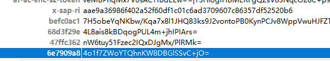

- 那我们往上走一步，看看是哪个方法；

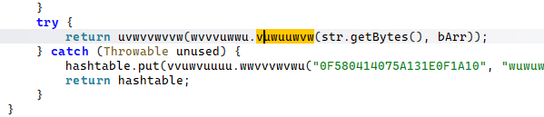

- 应该就是我选中的这个方法，它正好是一个native函数；

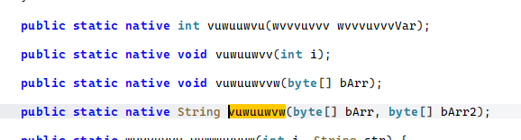

- hook一下看看参数和结果；

```javascript
function hook_mointor_vuwuuwvw() {
    Java.perform(function () {
        let com_shopee_shpssdk_wvvvuwwu = Java.use("com.shopee.shpssdk.wvvvuwwu");
        com_shopee_shpssdk_wvvvuwwu["vuwuuwvw"].implementation = function (bArr, bArr2) {
            console.log(`[->] com_shopee_shpssdk_wvvvuwwu.vuwuuwvw is called! args are:`);
            showByteArray(bArr, "bArr");
            showByteArray(bArr2, "bArr2");
            var retval = this["vuwuuwvw"](bArr, bArr2);
            console.log(`[<-] com_shopee_shpssdk_wvvvuwwu.vuwuuwvw ended! \n    retval= ${retval}`);
            return retval;
        };
    });

    function showByteArray(byteArray, name) {
        if (byteArray == null) return;
        var result = Java.use('java.lang.String').$new(Java.array('byte', byteArray)).toString();
        console.log(name + ": " + result);
    }
}
hook_mointor_vuwuuwvw();
```

- 结果如下：

```plain
[->] com_shopee_shpssdk_wvvvuwwu.vuwuuwvw is called! args are:
bArr: https://live.shopee.ph/api/v1/full_screen/playlist
bArr2: {"ctx_id":"<device-id>-1772350690578-34","device_id":"<device-id>","page_no":1,"source":"home_tab","need_play_param":true,"offset":0,"is_preload":true,"user_ctx":"{\"from_source\":\"home_tab\",\"first_rcmd_request\":true}","cached_session":{"last_ts":1772350110772,"session_ids":[<session-id>,<session-id>]}}

[<-] com_shopee_shpssdk_wvvvuwwu.vuwuuwvw ended! 
    retval= {"2952479e": "QsK9VIcTH7/YzOlX/nrrEgTA4Lk=", "6146faa1": "n3Z/XItbCXzTDpxg0RLHYdvwzbjnNUKwaGZ2zPHhWelnvez8yFMgw2fTsBN4cyfDFezAwtWf18hqqXCcDr2UevHenKqMjO0SkjT04Hj6TiDoGUo9uaRwtbH7UU/sBntyRfWuhAltm1lwOOPtNwpOZT513vEbrnaXFxs4t5nSo5AafqS013KmfIkqvBPmVhs9yOhSjCh4xqJUhuXDxWebBZv/fOQf2buXIXJaKqkoTD6TBHJjKl9NDsYAgWRi41bNJ+GDBSbgF1epEJCE8Joy+aSPXAbLYlGHwBjuwbJUBrgyeoOzEdrBjWqm8Ds11u3tnT7BupU2pz76IplYs3h8aSaOtu0i03WzqhbonA6S1PWxkuf8YHYzWD/g8w4vWlK4OeMcxh8CN3WE0SU1OV+KNBHKVU/FH+dpXVPrLpHHEze+Zgg9xWBPOeb39nUXkm25lJHX9Hn8bPb4vROqN/zzV7ldGzOjcM7OJixuAl6aTDvoDyGsD9zTzTsMny6glh+hKhj+VzUc4sskSBs7e/elacrbSVcNjZM4k78kq/NqMkCMVSWaibRgc5IoP0rL7Rsd9n9NqIW3Wp4TWWRjz+fQIumKYG2rSBNlD7YxYnik9VZvxXJCvJS6Pybl0ubMDgoTlOAxQD/jDI3RXiSN0nizS50e9xuzCrObyYzPw8bJii1DvkEIRFQpI/OuHB8CeVoKS8gYBab7SfvwHa6L+ms/8+45DUvAXmlEtzhadDh/ETZIGqHhlqxebtD3TJf+4XQkR9dPc4wBv3Pw7GsL7fZBMd3ptG693BahW7EruytCPv2tS6DpqoBx5CogwSt3WcAaB5osBKV8+aaJSCM62bkKU5UQSwgBH5ssEhXsG1RhQ+v4NhwYK/DX5EGxEARS3K4pXB1w022H2Y54UVd8af2O67H63qKsVQp46UvQjUknZM3hnJkvKeodFEIAxRsW2MtuxCForrzsDZsmOwRjZlTEORcdWgQuwUN6OE50I5McfDSTnslWueUc+y0LdlIpJZ/f5Ek5VRC+smuELsUQlKt11viYtaH4Spv9VilmUq0zKOFxxE3m5vgDpulOx8KbPxJWvRtjBYMlQFIhmrgkFpyPjfH5e+Q0X7g+A8jXUI3zRbkqcSh02aJzbC+A3pYKk2pwJCCMOecmdsZlkSA/lk0L+wQv56pTTdfr1jrLPVayXLxhSGNW8s+gqwYzoWmHLI3dAaQCuJRdODhDj1ugrwxG+GSnsMPaPhb0dEQNZm8vqig0bnbgjM6j3pBPM+VsFd5BY5rlrRamUiDEcUv/xm1KFFBuKKrXhIU6C5FmQHNg3QeJOWNtO6HFgGZ5FP0iMkI8d/0hnFJdOvHnmPYejVcROLQAM4g+60ovkeZOnnLuPZ01SsOFkPc5GHNkSsyUj2bR0JrYqrWVdp5mm2JUZnfVB9FedQzU8/t5jttHSaitAxpCDG+Q2wdsrjWS32Bp0tfNqHIxdGAR4ay704Xb1I42RpQc/lYDt6dqNEor7j==", "66a0ff35": "w0wTFVjxktXuBb2XjQRsH2VyXn8=", "beb5428c": "1WwW2sYTfsyBLrneJ+jwlpZMNUQ=", "x-sap-ri": "e1eca3693393de9df46975140156ddfa616adf07ef5825bf1f4d"}
```

- 参数1是url，参数2就是请求体的内容；如果是get请求，url有参数的也会体现在参数1，而参数2就是null；并且get请求只有三个四字节键和值，比post少一个；接下来看看是哪一个so以及函数地址；

```plain
[Pixel 6::Shopee ]-> findso()
artmethod对象地址: m:s0x76fe2f9878
提取的artmethod地址: 0x76fe2f9878
符号信息: 0x746b4b35dc libshpssdk.so!0x995dc
so文件名: libshpssdk.so
函数偏移: 0x995dc
```

- so是libshpssdk.so，偏移是0x995dc，方法名是vuwuuwvw；接下来写主动调用；

```javascript
function call(){
    Java.perform(function (){
        let wvvvuwwu = Java.use("com.shopee.shpssdk.wvvvuwwu");
        var str = 'https://mall.shopee.ph/api/v4/pages/bottom_tab_bar'
        var StringClass = Java.use('java.lang.String');
        var byteArray = StringClass.$new(str).getBytes();
        var str2 = '{"img_size":"3.0x","latitude":"","location":"[]","longitude":"","new_arrival_reddot_last_dismissed_ts":0,"feed_reddots":[{"timestamp":0,"noti_code":28}],"client_feature_meta":{"is_live_and_video_merged_tab_supported":false},"video_reddot_last_dismissed_ts":0,"view_count":[{"count":1,"source":0,"tab_name":"Live"}]}'
        var byteArray2 = StringClass.$new(str2).getBytes();
        var res = wvvvuwwu["vuwuuwvw"](byteArray,byteArray2)
        console.log('res==>',res)
    })
}
```

- 主动调用两组；

```plain
call res-->> {"1a9ec9b9": "Dw4uBPzD32aYyH98QsImgy/E01O=", "1ea94c5c": "CGIseVxBmFlwKbV/d/VgqUsN93PxpkJJWRvYKNGXJrwH1O47p8rQBfD41aexgJQSe4VAoB5nYH7ofVd/2NrCjINptLxkRpD+QTQLi50txqixqHvZcIbdmWPXt3s49fRDw2OFtWKQ+vcB6UW4nuLyynfmzkeksmHs6VkIvGwGEFmWrO4eng/eDBit9FlkFMxWpQDvkkvgOJ+GFUhgAjmMpg/vyrQbOaDDZhnXHIKAHzpcQXqYvUzykxr1wYdUAUNdpnmflDBTATEXnR6U8v5NGkV+oX6edKI7emm0A/+guggvMbXPGJawuhdTA5s9hAWVrcXm/R6z0mSfiagbjqJllR928609Ko8/jPYF+qjYOdWhQB/q+qWRuydg1Wkzs3Bw5Os3SIE5v7w7SwM8/p/Ig77nk/eNOPL/NdzGq/gZpN3NRPu5cXC6RfIEA9UjwK9WlfvaBxjRsMU/svXqmCU6Mcze6O0F/UmMsXlb0Dw/qCJUUoweaLr7bvFqCB8BeRAn6MpqCZr0RP6K0Mufo0YjXTjG9+Pa8337IokMvXwxl2x8Ykv9bI1DCzhLJWNuHJHo5DQddJhvLqk07erCWQhELFwChuLwu0d7gTh/MvrcHbJkPytmpUAHfSi8qfkJ0Fkqv15dHdswz+GFek2uziLnUIvtUbWm26a/bpd01XAhLGXfiGLDxocDwnNVEqq/9asNTyPW7XNWH8znaVK4Fxq+IbPDcS73Tx03R8QMiH9ueG21daU1FID3MuuHbqoggXDZN52ylKwe+1n4hrGQ", "21250d6a": "hN/V87MRr1mguo5x+Ux+Z/1aiA4=", "395a6d7c": "jcHVlzd2GDUQ/0INzKqSPqohG5s=", "x-sap-ri": "60f1a369bce3e8c4278f681b0114453eef925a73858a959c89c5"}
[Pixel 6::Shopee ]-> call()
call res-->> {"1a9ec9b9": "INynEiSktsnhiO2r0GXgKi/kUOt=", "37316fcb": "OSBW5ghMl8XUK/MPwh0confiAkSQDt/Ifch/1eK8fgvU7PMo3WQE1BfqfK2SyBBusHFrL5mPc6yU0T3KoBWz2YF+/UEFikjDBSqYfuaUu/+Ld3O0TvCRhb0QiTiszM88kx+LofmJIDCZfltw2EC16OvQDIy+7LQlQTlt4qool0QKhP2T+TBkn0x6nSzhpAQ+r5//lQUDIsX+y6BWQMi1fab22LYbq0UKpBc9wXqgNT6A60s17dfWzNesWwt9K1IhdeKs+eKDbHdVW16hmf+TgMX4F8ELEDNhE7cCr7Mvx9gIZLtjyDeFgDWq93cYgv8ulApcyhBGvADAgIBWifIrh+r0XtSqRmZ66MHW5/IHv9WwlgEzXb4qQNpxKv972RD6eXr8oZpXdyA1jhVaJRooV4L4ZtKTroxEOUp4KssC45xAnIcWcW55jBI8ye90PLBEUxxKdBIp/A9iCuk/Ks69QUzpEwmVxjR4fF5E82C0lOKtG3KPthVNf85wyTL/QpUT49qKPAzMDXY3DEVwVsQt9YB6XpXTmb6Vb18jFt+Z53n5L6qfDWaLNVU+bcEHoCLQJHL38ReaTGnzkCdyUVH1OFQsDgzakrb3EmElt54r3yGh3HHMsY5eUd8PKJbhENnNzdf45yYE6JKOFy0y6k6cKrP3NMN6fVjxmv/+0RRuOYA60OolObMhbLNgwWR8rawvgwxHXsqA/Vc/5tlDXHNWeIkWZL0CFSUaJ82+QAtMIXSjPblXOk/88LuZWZ0zDdVgn1ZyfoBvCTJjQShU", "9e088027": "ME7gk3cXbxfG9BziwTeNZbM9IIs=", "c98247d8": "JUrBao8nfsPSrbXpLQLeuT3ZUMT=", "x-sap-ri": "61f1a3698ce350d9e7845a1501560f19e8065157280332327654"}
```

- 观察一下，我们的目标有几个？五个，但是还包含那四个键，可以发现，除了1a9ec9b9这个键以外，所有的东西都变化了，当然x-sap-ri这个键我不计算在内；
- 说明1a9ec9b9这个键很有可能与参数有关，其他的就大概率还有随机数在参与，我们可以尝试改掉一点点入参看看是否会变化；这里我不试了，后续就知道了；
- 这个样本没有初始化函数，但是初始化函数要会判断，一般两种方法判断，java层的方法是把当前so中的其他几个函数hook上，然后以 f 的方式启动看看执行顺序，如果在目标函数前有函数执行了就可以尝试在这些函数调用前尝试主动调用，看看是否有值，如果有就证明不是初始化函数，如果没有则可能是初始化函数，然后在其执行后再主动调用，如果这个方法执行前没有结果，而执行后就有结果那就肯定是目标函数的初始化函数；
- native层则要更准确一点点，当so加载的时候就去执行native层的主动调用，如果直接就有结果基本上就没有初始化函数，但是也不一定对，毕竟还有两个时机更靠前，不过就是这个意思；
- 接下来就可以开始模拟执行了，我们判断初始化就是为它服务的；


## 3. 模拟执行
- 先搭一个基本的框架，记得把包名改好，文件访问也挂上；

```java
package com.Samples.shopee;

import com.github.unidbg.AndroidEmulator;
import com.github.unidbg.Emulator;
import com.github.unidbg.Module;
import com.github.unidbg.arm.backend.Unicorn2Factory;
import com.github.unidbg.arm.context.RegisterContext;
import com.github.unidbg.debugger.BreakPointCallback;
import com.github.unidbg.file.FileResult;
import com.github.unidbg.file.IOResolver;
import com.github.unidbg.linux.android.AndroidEmulatorBuilder;
import com.github.unidbg.linux.android.AndroidResolver;
import com.github.unidbg.linux.android.dvm.*;
import com.github.unidbg.linux.android.dvm.array.ArrayObject;
import com.github.unidbg.memory.Memory;
import com.github.unidbg.pointer.UnidbgPointer;
import com.github.unidbg.utils.Inspector;
import com.github.unidbg.virtualmodule.android.AndroidModule;

import java.io.File;
import java.io.FileNotFoundException;
import java.io.FileOutputStream;
import java.io.PrintStream;
import java.nio.charset.StandardCharsets;


public class shopee extends AbstractJni implements IOResolver {
    public static AndroidEmulator emulator;
    public static Memory memory;
    public static VM vm;
    public static Module module;


    @Override
    public FileResult resolve(Emulator emulator, String pathname, int oflags) {
        System.out.println("sana file open-->>" + pathname);
        return null;
    }

    public shopee() {
        emulator = AndroidEmulatorBuilder
                .for64Bit()
                .setProcessName("com.shopee.ph")
                .addBackendFactory(new Unicorn2Factory(false))
                .build();
        // 文件访问 注意这里的处理，加上这一句
        emulator.getSyscallHandler().addIOResolver(this);
        memory = emulator.getMemory();
        memory.setLibraryResolver(new AndroidResolver(23));
        vm = emulator.createDalvikVM(new File("src/test/java/com/Samples/shopee/file/com.shopee.ph.apk"));
        // 虚拟模块 添加这个就可以
        new AndroidModule(emulator, vm).register(memory);
        vm.setJni(this);
        vm.setVerbose(true);
        DalvikModule dm = vm.loadLibrary(new File("src/test/java/com/Samples/shopee/file/libshpssdk.so"), true);
        module = dm.getModule();
        dm.callJNI_OnLoad(emulator);

    }

    public static void main(String[] args) {
        shopee demo = new shopee();
    }

    private void traceLog() {
        String traceFile = "src/test/java/com/Samples/boss/trace/trace1.log";
        PrintStream traceStream = null;
        try {
            traceStream = new PrintStream(new FileOutputStream(traceFile), true);
        } catch (FileNotFoundException e) {
            throw new RuntimeException(e);
        }
        emulator.traceCode(module.base, module.base + module.size).setRedirect(traceStream);
    }

    private void hookMemcpy() {
        emulator.attach().addBreakPoint(module.findSymbolByName("memcpy").getAddress(), new BreakPointCallback() {
            @Override
            public boolean onHit(Emulator<?> emulator, long address) {
                RegisterContext context = emulator.getContext();
                int len = context.getIntArg(2);
                UnidbgPointer pointer1 = context.getPointerArg(0);
                UnidbgPointer pointer2 = context.getPointerArg(1);
                UnidbgPointer pointer3 = context.getLRPointer();
                Inspector.inspect(pointer2.getByteArray(0, len), "目标: " + Long.toHexString(pointer1.peer)
                        + " 来源(主要追这里): " + Long.toHexString(pointer2.peer) + " lr " + Long.toHexString(pointer3.peer));
                return true;
            }
        });
    }
}
```

- 这部分直接跑就可以，不需要补环境；下面开始call函数；

```java
public void callByAddress(){
    List<Object> list = new ArrayList<>(10);
    list.add(vm.getJNIEnv());
    list.add(0);

//        byte[] bytes = "https://mall.shopee.ph/api/v4/pages/bottom_tab_bar?key1=value1&key2=value2&key3=value3value3".getBytes();
    byte[] bytes = "https://mall.shopee.ph/api/v4/pages/bottom_tab_bar".getBytes();
    ByteArray arr1 = new ByteArray(vm,bytes);
    list.add(vm.addLocalObject(arr1));

//        byte[] bytes2 = "{\"img_size\":\"3.0x\",\"latitude\":\"\",\"location\":\"[]\"}".getBytes();
    byte[] bytes2 = "{\"shopid\":1414312381,\"itemid\":29669138810,\"catid\":100012,\"keyword\":\"\",\"item_card\":3,\"offset\":0,\"upstream\":\"dd\",\"upstream_sequence\":[{\"itemId\":29669138810,\"shopId\":1414312381,\"upstream\":\"dd\"}],\"view_session_id\":\"GEZpdKbH8al3kRz2f4vqJlIkOHfzuNZlWjb+Wfn2oW4=-1741790904362\",\"user_behaviour\":{},\"rsku_info\":{\"itemid\":29669138810,\"shopid\":1414312381},\"phone_model\":\"22041216C\",\"network\":\"cellular\",\"os_version\":\"android 33\",\"brand\":\"Xiaomi\",\"advertising_id\":\"a146e330-eb81-4de5-ac16-40fb4e504a83\"}".getBytes();
    ByteArray arr2 = new ByteArray(vm,bytes2);
    list.add(vm.addLocalObject(arr2));
    Number number = module.callFunction(emulator, 0x995dc, list.toArray());
    StringObject result = vm.getObject(number.intValue());
    System.out.println("result:"+result);
};
```

- 会出现第一个报错；

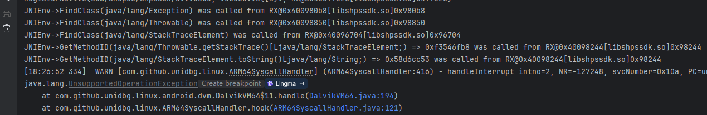

- 不是平常的jni环境，但是可以看到有一些Exception相关的类；
- 这里点进去报错的那一行，也就是下面这个位置，unidbg没有实现这个方法，我们仿照前面的直接返回0试试；

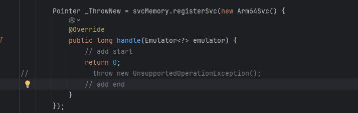

- 再次执行，看看是不是会正常；

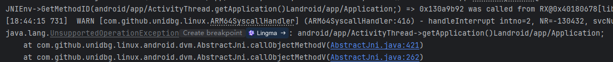

- 这次的报错就是jni的环境问题了，这个直接补；

```java
case "android/app/ActivityThread->getApplication()Landroid/app/Application;":{
    return vm.resolveClass("android/app/Application").newObject(signature);
}
```

- 继续执行；

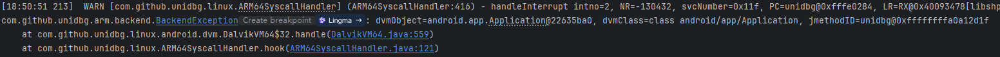

- 典型的jmethodID问题，不用想肯定是由于继承引起的，我们加上继承，以后context出这个问题都这么补就好了；

```java
case "android/app/ActivityThread->getApplication()Landroid/app/Application;":{
    DvmObject<?> context = vm.resolveClass("android/app/Application", vm.resolveClass("android/content/ContextWrapper", vm.resolveClass("android/content/Context"))).newObject(null);
    return context;
}
```

- 继续执行就正常了；

```plain
java.lang.UnsupportedOperationException: android/content/Context->getSharedPreferences(Ljava/lang/String;I)Landroid/content/SharedPreferences;
    at com.github.unidbg.linux.android.dvm.AbstractJni.callObjectMethodV(AbstractJni.java:421)
    at com.Samples.shopee.shopee.callObjectMethodV(shopee.java:171)
```

- 这个是apk的一些文件存储的位置，它有参数，打印看看；

```java
case "android/content/Context->getSharedPreferences(Ljava/lang/String;I)Landroid/content/SharedPreferences;": {
    StringObject name = vaList.getObjectArg(0);
    System.out.println("sana getSharedPreferences-->> " + name.toString());
    return vm.resolveClass("android/content/SharedPreferences").newObject(signature);
}
```

- 打印出来是SPHelper_sp_main，这部分环境就这么补就好，继续看下一个；

```plain
java.lang.UnsupportedOperationException: android/content/SharedPreferences->getString(Ljava/lang/String;Ljava/lang/String;)Ljava/lang/String;
    at com.github.unidbg.linux.android.dvm.AbstractJni.callObjectMethodV(AbstractJni.java:421)
    at com.Samples.shopee.shopee.callObjectMethodV(shopee.java:178)
```

- 环境都是连续性的，打印参数看看；

```java
case "android/content/SharedPreferences->getString(Ljava/lang/String;Ljava/lang/String;)Ljava/lang/String;": { 
    System.out.println("sana getString arg0-->> " + vaList.getObjectArg(0).toString());
    System.out.println("sana getString arg1-->> " + vaList.getObjectArg(1).toString());

}
```

- 这里打印的字符串是：

```plain
sana getString arg0-->> "E1YASQpPEEUQWR1CCUwVVVVw"
sana getString arg1-->> ""
```

- 结合前面的文件名，我们去对应路径找一下；

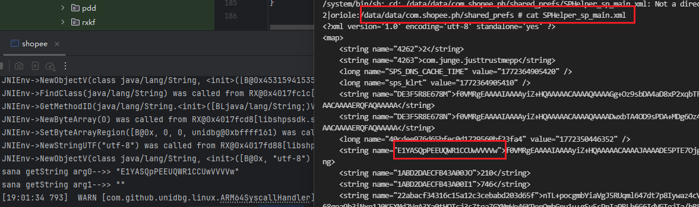

- 把对应的值返回回去就好了；

```java
case "android/content/SharedPreferences->getString(Ljava/lang/String;Ljava/lang/String;)Ljava/lang/String;": {
    System.out.println("sana getString arg0-->> " + vaList.getObjectArg(0).toString());
    System.out.println("sana getString arg1-->> " + vaList.getObjectArg(1).toString());
    return new StringObject(vm, "f0VMRgEAAAAIAAAAAGKYAQAAAAACAAAAJAAAADdhZmJiMzU1KmJjYTQqM2EyYio+NzE3KjUwZDY2M2Y2PzQxNQMAAAAIAAAAAAAEFAAAAAA=");
}
```

- 当然，这里读文件是有可能读多个的，做一个判断是最好的；

```java
case "android/content/SharedPreferences->getString(Ljava/lang/String;Ljava/lang/String;)Ljava/lang/String;": {
    System.out.println("sana getString arg0-->> " + vaList.getObjectArg(0).toString());
    System.out.println("sana getString arg1-->> " + vaList.getObjectArg(1).toString());
    String filename = dvmObject.getValue().toString();
    if ("SPHelper_sp_main".equals(filename)) {
        return new StringObject(vm, "f0VMRgEAAAAIAAAAAGKYAQAAAAACAAAAJAAAADdhZmJiMzU1KmJjYTQqM2EyYio+NzE3KjUwZDY2M2Y2PzQxNQMAAAAIAAAAAAAEFAAAAAA=");
    }
    return null;
}
```

- 继续执行；

```plain
java.lang.UnsupportedOperationException: android/content/pm/PackageInfo->firstInstallTime:J
    at com.github.unidbg.linux.android.dvm.AbstractJni.getLongField(AbstractJni.java:662)
    at com.github.unidbg.linux.android.dvm.AbstractJni.getLongField(AbstractJni.java:657)
```

- 根据语义，应该是返回第一次安装的时间；一般来说这个时间可能是用来参与计算的；

```java
case "android/content/pm/PackageInfo->firstInstallTime:J": {
    return 1732349660249L;
}
```

- 可以随自己心情给，不太离谱就好；继续执行；

```plain
java.lang.UnsupportedOperationException: android/content/pm/PackageInfo->lastUpdateTime:J
    at com.github.unidbg.linux.android.dvm.AbstractJni.getLongField(AbstractJni.java:662)
    at com.Samples.shopee.shopee.getLongField(shopee.java:198)
```

- 一样的道理；

```java
case "android/content/pm/PackageInfo->lastUpdateTime:J": {
    return 1732349661249L;
}
```

- 最好不要比上一个时间小，继续执行；

```plain
java.lang.UnsupportedOperationException: android/content/pm/PackageInfo->applicationInfo:Landroid/content/pm/ApplicationInfo;
    at com.github.unidbg.linux.android.dvm.AbstractJni.getObjectField(AbstractJni.java:171)
    at com.github.unidbg.linux.android.dvm.AbstractJni.getObjectField(AbstractJni.java:141)
```

- 直接补上；

```java
case "android/content/pm/PackageInfo->applicationInfo:Landroid/content/pm/ApplicationInfo;": {
    return vm.resolveClass("android/content/pm/ApplicationInfo").newObject(signature);
}
```

- 继续执行，这个也有对应的api，看自己吧；

```plain
java.lang.UnsupportedOperationException: android/content/pm/ApplicationInfo->flags:I
    at com.github.unidbg.linux.android.dvm.AbstractJni.getIntField(AbstractJni.java:652)
    at com.github.unidbg.linux.android.dvm.AbstractJni.getIntField(AbstractJni.java:644)
```

- 这个flags用于综合描述应用的安装属性、Manifest 声明特性及系统分配的状态；问问ai返回什么比较好；

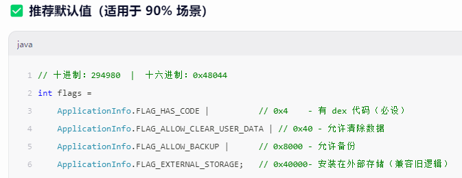

- 那我们这里返回一个0x40000吧；

```java
case "android/content/pm/ApplicationInfo->flags:I": {
    return 0x40000;
}
```

- 继续执行；

```plain
java.lang.UnsupportedOperationException: android/content/pm/ApplicationInfo->sourceDir:Ljava/lang/String;
    at com.github.unidbg.linux.android.dvm.AbstractJni.getObjectField(AbstractJni.java:171)
    at com.Samples.shopee.shopee.getObjectField(shopee.java:212)
```

- 这个大概是要返回一个apk的路径，可以去mt管理器取；

```java
case "android/content/pm/ApplicationInfo->sourceDir:Ljava/lang/String;": {
    return new StringObject(vm, "/data/app/com.shopee.ph-6AYcVt33bWXGT_JAdpxbeQ==/");
}
```

- 继续执行；

```plain
java.lang.UnsupportedOperationException: android/content/pm/ApplicationInfo->loadLabel(Landroid/content/pm/PackageManager;)Ljava/lang/CharSequence;
    at com.github.unidbg.linux.android.dvm.AbstractJni.callObjectMethodV(AbstractJni.java:421)
    at com.Samples.shopee.shopee.callObjectMethodV(shopee.java:188)
```

- 这个api是从 APK 的 `AndroidManifest.xml` 中加载**应用显示名称**（即用户看到的“应用名”），这种不认识的统统问ai，比查资料速度会更快；

```java
case "android/content/pm/ApplicationInfo->loadLabel(Landroid/content/pm/PackageManager;)Ljava/lang/CharSequence;":{
    return vm.resolveClass("Ljava/lang/CharSequence").newObject("Shopee");
}
```

- 继续执行；

```plain
java.lang.UnsupportedOperationException: Ljava/lang/CharSequence->toString()Ljava/lang/String;
    at com.github.unidbg.linux.android.dvm.AbstractJni.callObjectMethodV(AbstractJni.java:421)
    at com.Samples.shopee.shopee.callObjectMethodV(shopee.java:195)
```

- 这个没啥可说的；

```java
case "Ljava/lang/CharSequence->toString()Ljava/lang/String;": {
    CharSequence value = (CharSequence) dvmObject.getValue();
    return new StringObject(vm, value.toString());
}
```

- 继续；

```plain
java.lang.UnsupportedOperationException: android/content/pm/PackageManager->getInstallerPackageName(Ljava/lang/String;)Ljava/lang/String;
    at com.github.unidbg.linux.android.dvm.AbstractJni.callObjectMethodV(AbstractJni.java:421)
    at com.Samples.shopee.shopee.callObjectMethodV(shopee.java:195)
```

- 返回包名就好；

```java
case "android/content/pm/PackageManager->getInstallerPackageName(Ljava/lang/String;)Ljava/lang/String;": {
    return new StringObject(vm, "com.shopee.ph");
}
```

- 继续；

```plain
java.lang.UnsupportedOperationException: android/content/SharedPreferences->edit()Landroid/content/SharedPreferences$Editor;
    at com.github.unidbg.linux.android.dvm.AbstractJni.callObjectMethodV(AbstractJni.java:421)
    at com.Samples.shopee.shopee.callObjectMethodV(shopee.java:198)
```

- 应该是要编辑某个xml文件，返回一个对象；

```java
case "android/content/SharedPreferences->edit()Landroid/content/SharedPreferences$Editor;": {
    return vm.resolveClass("android/content/SharedPreferences$Editor").newObject(signature);
}
```

- 继续；

```plain
java.lang.UnsupportedOperationException: android/content/SharedPreferences$Editor->putString(Ljava/lang/String;Ljava/lang/String;)Landroid/content/SharedPreferences$Editor;
    at com.github.unidbg.linux.android.dvm.AbstractJni.callObjectMethodV(AbstractJni.java:421)
    at com.Samples.shopee.shopee.callObjectMethodV(shopee.java:201)
```

- 应该是往某个地方写东西，可以打印一下写了啥；同时返回之前那种对象，直接返回就好；

```java
case "android/content/SharedPreferences$Editor->putString(Ljava/lang/String;Ljava/lang/String;)Landroid/content/SharedPreferences$Editor;":{
    StringObject key = vaList.getObjectArg(0);
    StringObject value = vaList.getObjectArg(1);
    System.out.println("sana putString-->> " + key.toString() + " " + value.toString());
    return vm.resolveClass("android/content/SharedPreferences$Editor").newObject(signature);
}
/*
sana putString-->> "E1YASQpPEEUQWR1CCUwVVVVw" "f0VMRgEAAAAIAAAA1pdfnAAAAAACAAAAJAAAABUVFRUVFRUVCBUVFRUIERUVFQgdFRUVCBUVFRUVFRUVFRUVFQMAAAAIAAAAFFEVQQAAAAA="
*/
```

- 继续执行；

```plain
java.lang.UnsupportedOperationException: android/content/SharedPreferences$Editor->commit()Z
    at com.github.unidbg.linux.android.dvm.AbstractJni.callBooleanMethodV(AbstractJni.java:629)
    at com.github.unidbg.linux.android.dvm.AbstractJni.callBooleanMethodV(AbstractJni.java:607)
```

- 这种返回一个true给它；

```java
case "android/content/SharedPreferences$Editor->commit()Z":{
    return true;
}
```

- 继续；

```plain
java.lang.UnsupportedOperationException: com/shopee/shpssdk/wvvvuwwu->vuwuuuvv(ILjava/lang/Object;)Ljava/lang/Object;
    at com.github.unidbg.linux.android.dvm.AbstractJni.callStaticObjectMethodV(AbstractJni.java:508)
    at com.github.unidbg.linux.android.dvm.AbstractJni.callStaticObjectMethodV(AbstractJni.java:442)
```

- 这个是app自己的类，我们需要去看看了；

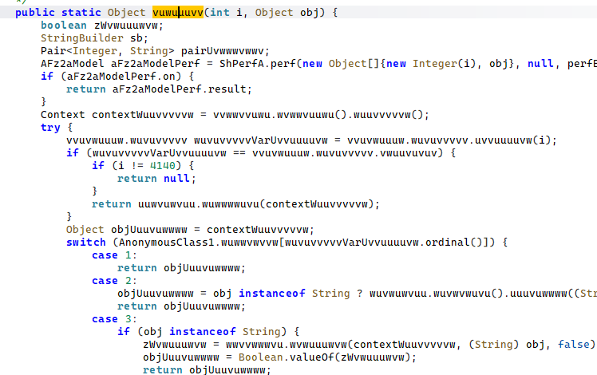

- 这个方法很长，有很多case，那我们自己补的时候也要注意好case；先打印一下参数1；

```java
case "com/shopee/shpssdk/wvvvuwwu->vuwuuuvv(ILjava/lang/Object;)Ljava/lang/Object;":{
    int int_data = vaList.getIntArg(0);
    System.out.println("shopee.shpssdk.wvvvuwwu-->" + int_data);
}
```

```plain
shopee.shpssdk.wvvvuwwu-->74
```

- 自行去hook一下这个函数，记得以f的方式启动；

```plain
[->] com_shopee_shpssdk_wvvvuwwu.vuwuuuvv is called! args are as follows:
    ->i= 74
    ->obj= 0
[<-] com_shopee_shpssdk_wvvvuwwu.vuwuuuvv ended! 
    retval= ReCX2BoJTnTH6BOu4w8HHw==|QnHlogIHBMERFgQZsV83NqcO28C+p9oA4wxmE2N48cSEvuqtb0j8pwiL6wLasRXZUpWBPysHocD1Y/Dl+sUih9BotoojhF92BGXqHEx6Eg==|YV2GRzdXRPaB3PNQ|08|1
```

- 实际上就是请求头的af-ac-enc-sz-token，它会参与计算；

```java
switch (int_data) {
    case 74: {
        return new StringObject(vm, "oTSflMz92sjaiteHWrTbCA==|ZcaOB3RDBDZ45yuQO417seuqaFkyOokc0bEPSbb4EEOEWgsDQ8mELI4+L7dozfSMKhz8XKeONFtbuVR8YZ6h+cQJr6Sy6A7R9n7jAkbl|hApTLtwZfU6Gp8wb|08|1"); // 参与计算了 只影响最长的
    }
}
```

- 继续执行，可以发现出值了；

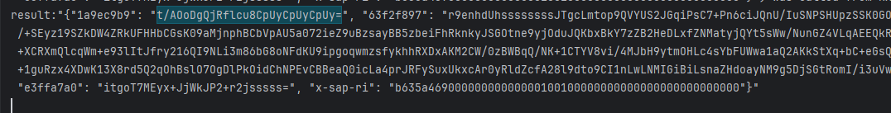

- 但是我们主要观察一下那个长的键的值，与抓包的是否有差距；unidbg跑出来668左右，抓包的1520，长度差的比较远，这是由于明文是一些指纹数据，我们这里补的比较简陋，能跑起来就可以，毕竟目标是分析算法；
- 在算法分析之前，还需要固定随机数，此时有一些东西还是在随机的；
- 第一个位置，RandomFileIO.java下的randBytes方法注释掉即可，他就会返回全0；但是后续我们不选择这种方式，在后面会说的，这里先把结果固定住再说；

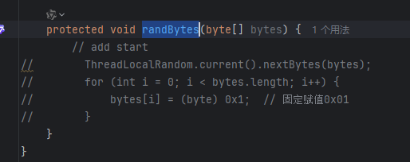

- 还有一个就是ARM64SyscallHandler.java下的clock_gettime方法，改成1749248022000L，图上的少了3个0；

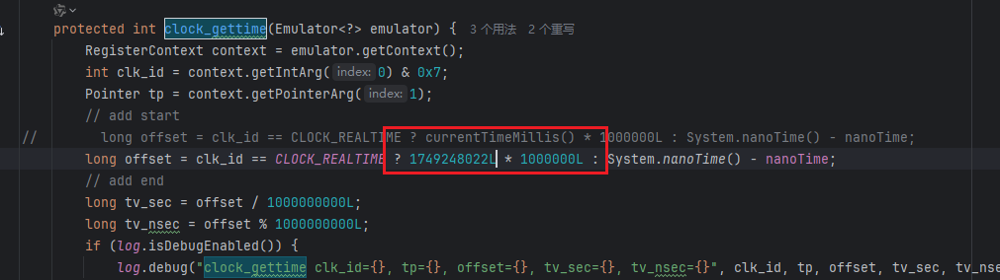

- 此时就完全固定住了；

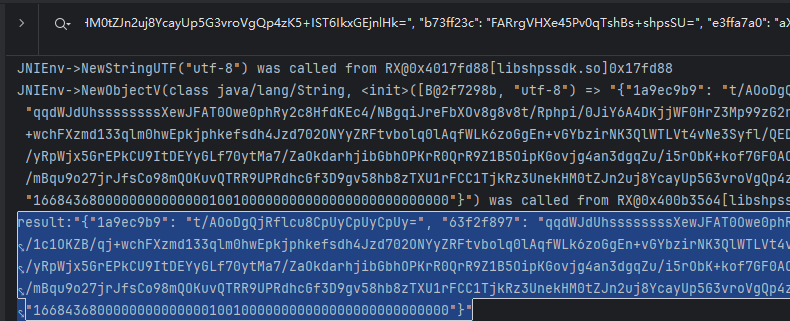

- 接下来就可以开始算法还原了，固定随机不熟练的多看看龙哥的文章，讲的非常详细；
- 大家可以在更多的 Unidbg 项目上测试这套固定结果的思路；
    - 检查 JNI 补环境里是否有随机干扰，比如时间戳、UUID；
    - 检查 clock_gettime 和 gettimeofday 这两个系统调用；
    - 检查 /dev/urandom 和 getrandom；
    - 检查 SimpleFileIO 和 ByteArrayFileIO 的文件属性时间戳；
    - 检查 PID；
- 应该说，绝大多数样本都可以被这套连招固定住；这里也是其中的两种；


## 4. 算法分析
- 提前写一下结果，更换了随机，后续还原基本都以这个为准；

```plain
"{"1a9ec9b9": "zlug+XF2Nwvjy/venQJClQYEmb4=", "4b3e0f91": "wdolDJ8h1G/cmM+DshBh+kPhsub=", "9bbcf962": "u7CrEgUssUTsskOpBIddRvJUPHrldqB6pnvwxK65WatKgtRCST2j9Lbr06ZZ2nD6thaQ6nUbm28Dby3l8iQBdyuIRHx27gRd+MNuDDeNRKY1PmR8UWfy8Lsqtu6lGCnxrjLKnBXxTYUqBzQQcvgAW84+hNdM+9pb5qOuH0f6A3VbVEATHjMJd12DkdMWVuipGTEC/+7G6QjwMNYG1nyFiq2BQ5IvCmOAmFCJgwW/T3gCqCx9Bj6fa+FyIDC9M4I/+JVoRXq4zXKuRhe9zK4BTzcGAti8LAVEgLRewGW9WFzzEVdEF2u5tfaz9c56BDyjCPlVNzlq7qWAjj3pCn0XyRe6hpFjyS0a+/a/EhR2oeISke2GR6O95etE7PC5OnpDBjeWcP7zsFB73tLb79D+pxR+VMAMn9aNzghOccDHWgDK/I0hsvK44rOpnOcxqKZMT8p61U/GDsgcKZdV0I4D/9+Kg+BAfzopFlPe/vACFZBE2p3b0BfYHO12r/TJ3FFiImZTaPT5jXEFGkuZbDTB1N4I3hQW+gNfG0cqE+wvnquyr4UKrWjPuZ1PGSn3S3ACrSETwa1SMgOOiLTIQmFOKhTA53fsOB43qzfq704hC9skymisuflkmLyrQ2o1sdVZImdA9wrqtmspe71EcK59WCJKjjQ=", "c7fff146": "PZ6J6kNwywn/Ba2aSBuBMsshsUT=", "x-sap-ri": "16684368000102030405061701090a0b0c0d0e0f101112131415"}"
```

### 4.1 x-sap-ri
- 先来看它的结果：

```plain
1668436800000000000000100100000000000000000000000000
```

- 它有52位，由于我们固定随机数时，返回的是0，这里就很显然是与它们脱不开干系的，这点嗅觉必须要有；但是中间也不完全是0，所以还需要看看中间是什么操作，我们把随机数固定成5看看结果如何；
- 具体位置：src/main/java/com/github/unidbg/linux/file/RandomFileIO.java

```java
@Override
public int read(Backend backend, Pointer buffer, int count) {
    int total = 0;
    byte[] buf = new byte[Math.min(0x1000, count)];
    buf = new byte[]{0x5,0x5,0x5,0x5};
    // buf = new byte[]{(byte) (num), (byte) 0x00, 0x00, (byte) (0xf0+num)};
    randBytes(buf);
    // add start 添加2行 用来打印输出
    num += 1;
    System.out.println("RandomFileIO read 固定随机: " + num + " " + toHex(buf));
    Pointer pointer = buffer;
    while (total < count) {
        int read = Math.min(buf.length, count - total);
        pointer.write(0, buf, 0, read);
        total += read;
        pointer = pointer.share(read);
    }
    return total;
}
```

- 这样我们方便看，先首先全部改成5 -> new byte[]{0x5,0x5,0x5,0x5}；

```plain
1668436805050505050505150105050505050505050505050505
```

- 16684368是前面8位，没有变化，说明与这里的随机无关，后面的00几乎都变成05了，说明肯定是随机相关的；中间部分依旧是：

```plain
16684368 05050505050505 1 5 01 05050505050505050505050505
16684368 00000000000000 1 0 01 00000000000000000000000000
```

- 看起来是固定的，可以多尝试随机几次不一样的值，它就是这样固定的，我们暂且得出结论：
    - 数据长度一共52位，前面8位暂时未知；
    - 后面44位为随机数；第15(下标14)位为 1，第17,18(下标16,17)位的值为 01；
- 再来看看前8位，16684368；我们证明了它和随机数无关；那它和时间戳有关吗？我们尝试修改我们固定的时间戳，看看其是否变化，改为1749248022000L -> 1749248011000L；

```plain
16684368 00000000000000100100000000000000000000000000
0b684368 05050505050505150105050505050505050505050505
```

- 我们修改了两个字节，这里变了两个字节，有意思的，再尝试改一下结尾，改成1749248011666L；

```plain
16684368 00000000000000100100000000000000000000000000
0b684368 05050505050505150105050505050505050505050505
```

- 结果居然和没改之前一样，那证明是10位的时间戳，如果做过sig3就肯定能反应过来了；

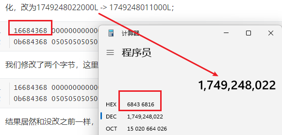

- 这个够明显了，10位时间戳转成16进制后换一下字节序就好，这个时间戳请牢记，后面会频繁的出现；
- 这里为何这么改随机？

```java
buf = new byte[]{(byte) (num), (byte) 0x00, 0x00, (byte) (0xf0+num)};
```

- 可以发现有num参与，这是由于随机数被多次调用，我们可以用这种方式来分辨它被用在了哪里，比如当前参数用了22次，那就是调用22次的那次；

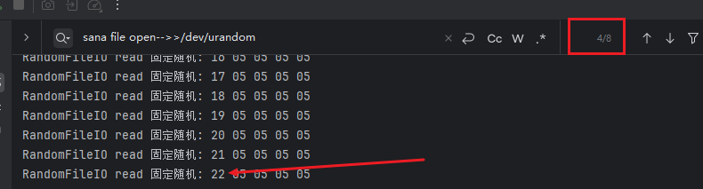

- 后续再测试是有可能使用这条语句赋值的；

```java
buf = new byte[]{(byte) (num), (byte) 0x00, 0x00, (byte) (0xf0+num)};
```

- 所以x-sap-ri的算法是：
    - 10位时间戳转16进制转小端序(8位) + 随机数穿插3位固定值(44位)；
- 类似于这种数字请多多往时间戳上想，成了最好不成也不亏；

### 4.2 第一个键
- 第一个键是1a9ec9b9，还记得吗，它是不变的，剩余的键会随着时间戳或者随机数变动而变动，这个不会；
- 在**4.1**部分说过，后续可能会使用这个随机数；

```plain
buf = new byte[]{(byte) (num), (byte) 0x00, 0x00, (byte) (0xf0+num)};
```

- 此时对应的结果其实是和最开始固定的有变化的，但是暂时不影响第一个键的分析；
- 它刚好是4字节的，我们可以在trace里搜一下，这里分析的trace是从0开始的随机，也就是上面这个buf，而不是全0需要注意；

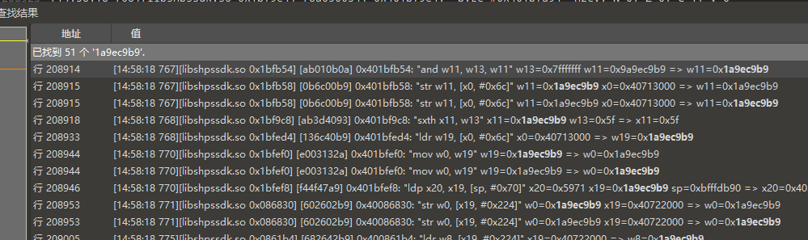

- 能搜出来51个，大多数是在内存读写，关于计算的不多，而且第一行就是计算，我们自然是看最早出现的那次；

```plain
0x401bfb54: "and w11, w13, w11" w13=0x7fffffff w11=0x9a9ec9b9 => w11=0x1a9ec9b9
```

- 在py里复写；

```python
key1 = 0x7fffffff & 0x9a9ec9b9
print(hex(key1))
```

- 继续找 0x7fffffff 和 0x9a9ec9b9 的来源，先找看起来比较显眼的吧；

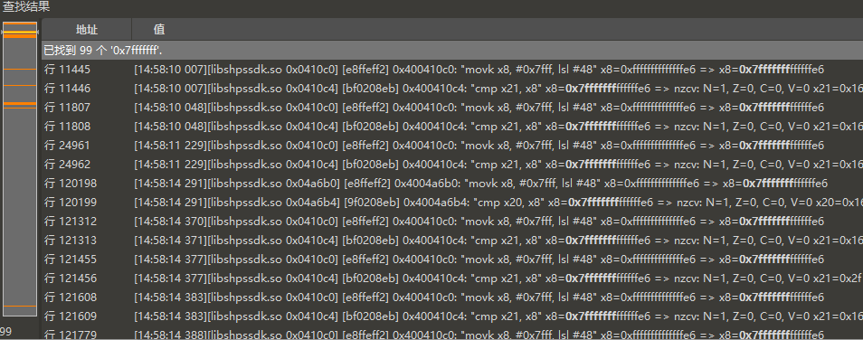

- 能搜到99个0x7fffffff，看看有没有运算类型的；

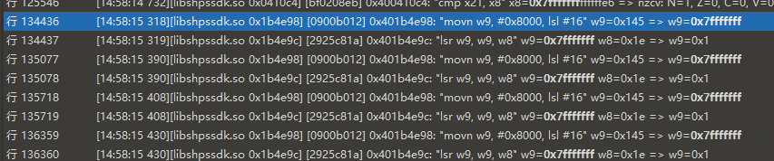

- 这个指令是说，左移16位然后取反；这个地址去ida看看；

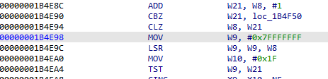

- 发现是硬编码，那就证明0x8000和16也是固定的，ida优化掉了；
- 再看0x9a9ec9b9 的来源。其实我分析的时候搜索的是不多的，我喜欢选中目标然后往上找；

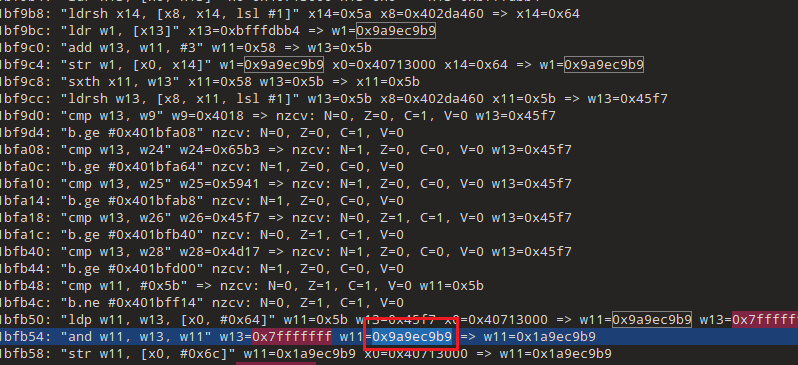

- 可以发现匹配的也会被标记上，如果隔得比较近这样效率反而更高，这两种方式是一个意思，适时使用就好；
- 从我们图上分析一下，它从某个位置被加载了，那是得继续找哪里计算的；继续往上找；

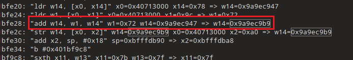

- 计算指令如下：

```plain
0x401bfe28: "add w14, w1, w14" w1=0x72 w14=0x9a9ec947 => w14=0x9a9ec9b9
```

- 0x72 + 0x9a9ec947 就是我们的结果，继续还原到算法；

```python
temp_0x9a9ec9b9 = 0x72 + 0x9a9ec947

temp_0x7fffffff = (~(0x8000 << 16)) & 0xFFFFFFFF # 这个在so里是硬编码0x7fffffff
key1 = temp_0x7fffffff & temp_0x9a9ec9b9
print(hex(key1))
```

- 这里就要找 0x72 和 0x9a9ec947 的来源了；先看这个长的，依旧是这种方法找；

```plain
0x401bfcb0: "mul w11, w11, w13" w11=0x334b w13=0x89a70875 => w11=0x9a9ec947
```

- 把它复现下来；

```python
temp_0x9a9ec947 = 0x334b * 0x89a70875 & 0xFFFFFFFF
temp_0x9a9ec9b9 = 0x72 + temp_0x9a9ec947

temp_0x7fffffff = (~(0x8000 << 16)) & 0xFFFFFFFF # 这个在so里是硬编码0x7fffffff
key1 = temp_0x7fffffff & temp_0x9a9ec9b9
print(hex(key1))
```

- 找0x72的来源发现不是很好找，先看0x89a70875吧；

```plain
0x401bfe28: "add w14, w1, w14" w1=0x61 w14=0x89a70814 => w14=0x89a70875
```

- 又是加法？复现一下；

```python
temp_0x89a70875 = 0x61 + 0x89a70814
temp_0x9a9ec947 = 0x334b * temp_0x89a70875 & 0xFFFFFFFF
temp_0x9a9ec9b9 = 0x72 + temp_0x9a9ec947

temp_0x7fffffff = (~(0x8000 << 16)) & 0xFFFFFFFF # 这个在so里是硬编码0x7fffffff
key1 = temp_0x7fffffff & temp_0x9a9ec9b9
print(hex(key1))
```

- 那0x89a70814这个值很有可能是一个乘法，我们去找一下；

```plain
0x401bfcb0: "mul w11, w11, w13" w11=0x334b w13=0x18cf7bc => w11=0x89a70814
```

- 复现一下；

```python
temp_0x89a70814 = 0x334b * 0x18cf7bc & 0xFFFFFFFF
temp_0x89a70875 = 0x61 + temp_0x89a70814
temp_0x9a9ec947 = 0x334b * temp_0x89a70875 & 0xFFFFFFFF
temp_0x9a9ec9b9 = 0x72 + temp_0x9a9ec947

temp_0x7fffffff = (~(0x8000 << 16)) & 0xFFFFFFFF # 这个在so里是硬编码0x7fffffff
key1 = temp_0x7fffffff & temp_0x9a9ec9b9
print(hex(key1))
```

- 这看起来很明显了，是一个循环，那处理的地址肯定是同一个，搜索一下0x401bfcb0；

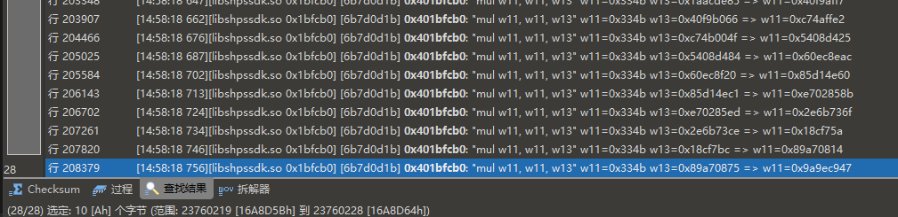

- 确实是这样，乘的都是同一个值：0x334b，后续看一下哪来的；
- 那加法相比也是同一个地址了，搜索一下0x401bfe28；

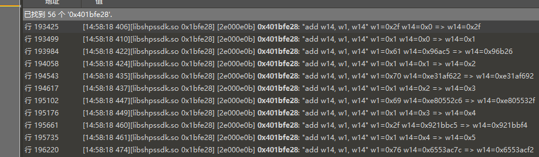

- 搜出来56处，其中有一个应该是计数的，除下来也是28次，那应该是一个循环了，那么加在前还是乘在前？
- 可以去看行数，乘法应该是在前的，并且乘法最开始是0；

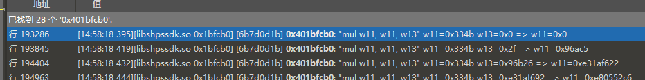

- 复现情况如下：

```python
url = ""
arr = bytearray(url.encode())
temp = 0
for i in arr:
    temp = i + (temp * 0x334b & 0xFFFFFFFF)

temp_0x7fffffff = (~(0x8000 << 16)) & 0xFFFFFFFF  # 这个在so里是硬编码0x7fffffff 可以直接固定
key1 = temp_0x7fffffff & temp
print(hex(key1))
```

- 这里如果理解不了的可以对照着看，先放乘法再放加法；

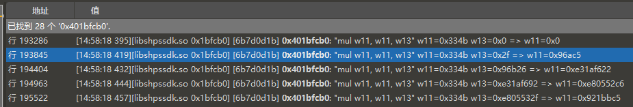

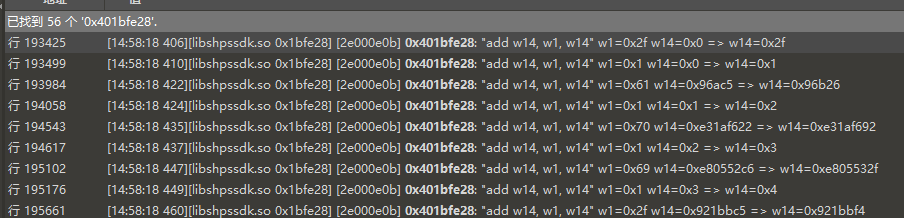

- 特征很明显了，我们写个小脚本把加法这一部分的w1收集一下；

```python
import re

with open('temp.txt', 'r', encoding='utf-8') as f:
    lines = f.readlines()

# 每隔一行提取w1值
w1_values = []
for i in range(0, len(lines), 2):
    match = re.search(r'w1=(0x[0-9a-f]+)', lines[i], re.I)
    if match:
        w1_values.append(match.group(1))

print(w1_values)
```

- 结果如下：

```plain
['0x2f', '0x61', '0x70', '0x69', '0x2f', '0x76', '0x34', '0x2f', '0x70', '0x61', '0x67', '0x65', '0x73', '0x2f', '0x62', '0x6f', '0x74', '0x74', '0x6f', '0x6d', '0x5f', '0x74', '0x61', '0x62', '0x5f', '0x62', '0x61', '0x72']
```

- 尝试去看看这段内容是什么；

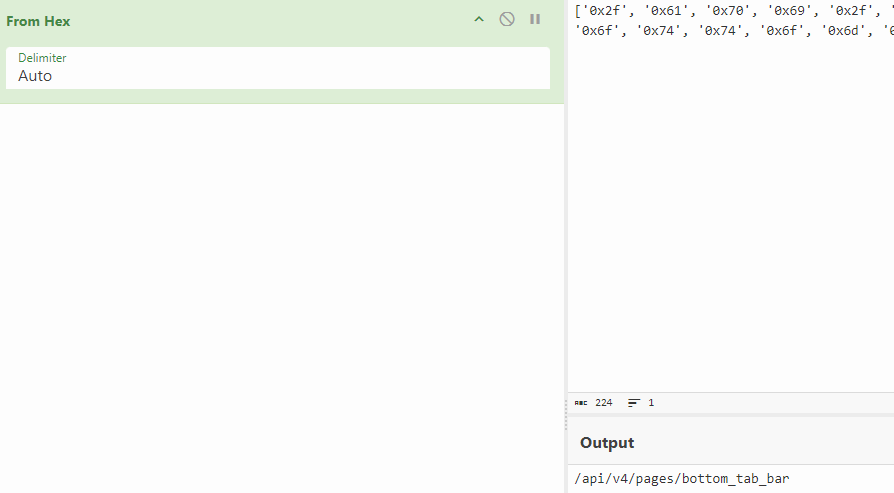

- 原来是传的链接，但是去掉了域名的那部分，那第一个键就解决了；

```python
url = "/api/v4/pages/bottom_tab_bar"
arr = bytearray(url.encode())
temp = 0
for i in arr:
    temp = i + (temp * 0x334b & 0xFFFFFFFF)

temp_0x7fffffff = (~(0x8000 << 16)) & 0xFFFFFFFF  # 这个在so里是硬编码0x7fffffff
key1 = temp_0x7fffffff & temp
print(hex(key1))
# 结果：0x1a9ec9b9
```

- 0x334b稍微可以看一下，实质上也应该是固定的；

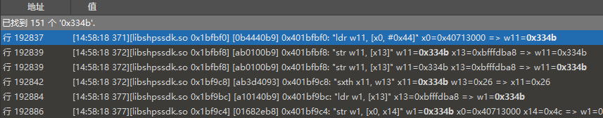

- 直接就是加载进来的，可能是固定的，这里当做固定的就好；

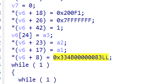

- 大致位置应该是这里，确实是固定的，接下来还原第一个键对应的第一个值；

### 4.3 第一个值
- 为何是这个顺序呢，可以借助memcpy的日志来看；

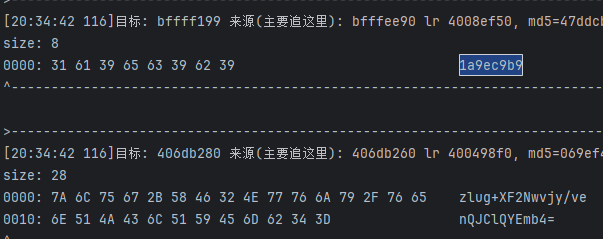

- 先是第一个键然后是第一个值，所以我们先看第一个值，因为有可能后续的结果是会依托于前面的结果的，所以我们按照顺序来；
- 所以我们来找这个值：zlug+XF2Nwvjy/venQJClQYEmb4= 是怎么来的；

```plain
0000: 7A 6C 75 67 2B 58 46 32 4E 77 76 6A 79 2F 76 65    zlug+XF2Nwvjy/ve
0010: 6E 51 4A 43 6C 51 59 45 6D 62 34 3D                nQJClQYEmb4=
```

- 首先追踪一下0x406db260这块地址吧；

```java
emulator.traceWrite(0x406db260, 0x406db260+ 0x1c);
```

- 看看日志有没有线索；

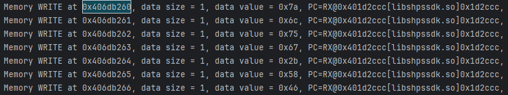

- 确实是我们的结果，去trace里看看0x1d2ccc这个地址吧，看起来都是这个地址生成的；

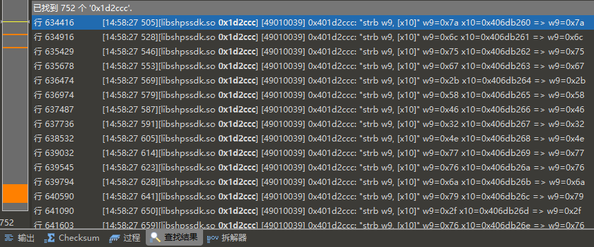

- 找到了752个结果，左边的标识看起来很微妙，看起来是有四次调用，而且第四次非常的长，让我想到了一个东西；

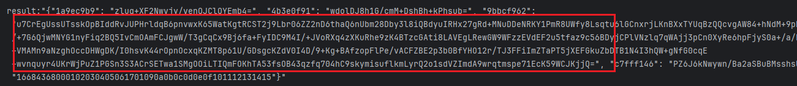

- 咱们得密文是不是也是有一个非常长的？我们看一下最后一个结果；

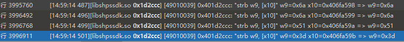

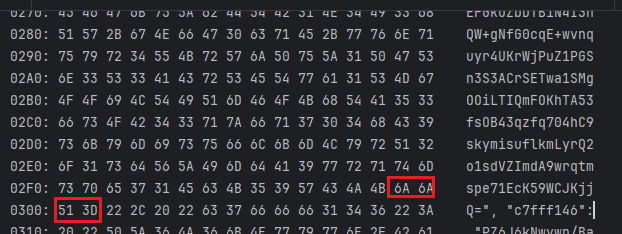

- 很显然，我们四个密文最后都在这里生成，它们之间用到了同一个东西，这里很明显应该是base64吧；
- 去尝试了一下标准的编码，结果如下：

```plain
ce 5b a0 f9 71 76 37 0b e3 cb fb de 9d 02 42 95 06 04 99 be
```

- 那我们怎么验证是不是标准的？用龙哥的SearchData插件扫一下，看看内存中是否存在；

```java
memory.addModuleListener(new SearchData("ce 5b a0 f9 71 76 37 0b e3 cb fb de 9d 02 42 95 06 04 99 be", "libshpssdk.so", 100));
```

- 并没有断下来，感觉不是标准的码表，去ida看看能不能找到类似码表的东西；
- 就去看这个0x1d2ccc地址吧；

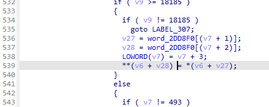

- 又是一个混淆非常严重的函数，看不出来什么东西，我们再回到trace里看最早出现的地方吧；

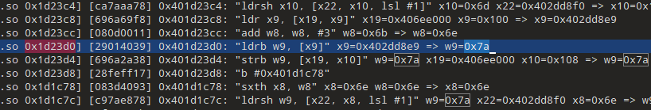

- 这是0x7a最早出现的地方，是一个加载指令，再往前就没有了，我认为这个0x402dd8e9很可能放着base64的码表，应该怎么确认呢？
- 我发现同一个结果比如目标中的6c；

```plain
0000: 7A 6C 75 67 2B 58 46 32 4E 77 76 6A 79 2F 76 65    zlug+XF2Nwvjy/ve
0010: 6E 51 4A 43 6C 51 59 45 6D 62 34 3D                nQJClQYEmb4=
```

- 它们在赋值的时候地址是同一个，感觉像是vm，去看看这个地址有没有类似码表的数据吧；不管怎样这个x9的地址看起来都是比较连续的，就算不推算我也会去hook看看的；

```java
emulator.attach().addBreakPoint(module.base + 0x1d23d0);
```

- 注意了，第一次的断点不是目标，在第二次；

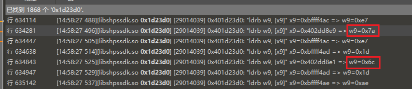

- 第二次断下来的时候去看这个地址；

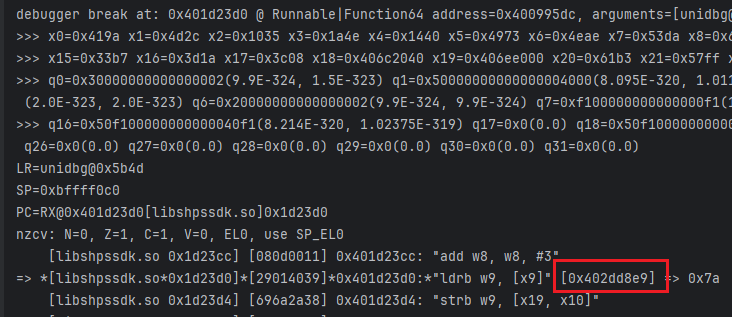

- 情况如下：

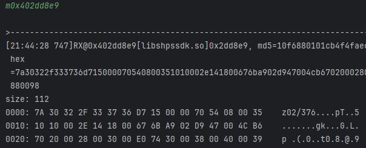

- 看不出来啥，那就再看一下小一点的地址，看第二次取值时会不会多一些，这一次是第五次断点；

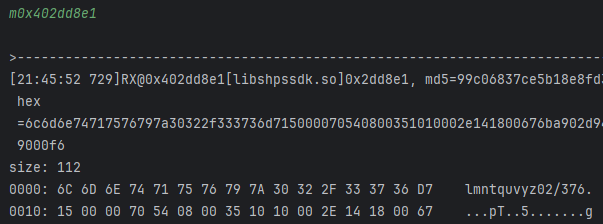

- 比先前多一些了，我们自己来往前移一些吧；

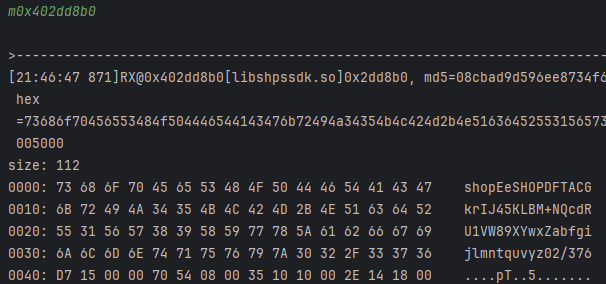

- 经过多次尝试，看起来确实是64位的码表，我们去测试一下；

```plain
shopEeSHOPDFTACGkrIJ45KLBM+NQcdRU1VW89XYwxZabfgijlmntquvyz02/376
```

- 这次解出来的结果是：

```plain
e7 1d ae 6a 62 fb 6e 8d f0 e3 cd c5 cd c4 ce c5 c9 c4 ca c5
```

- 这次成功的断下来了，使用shr或者st命令找；

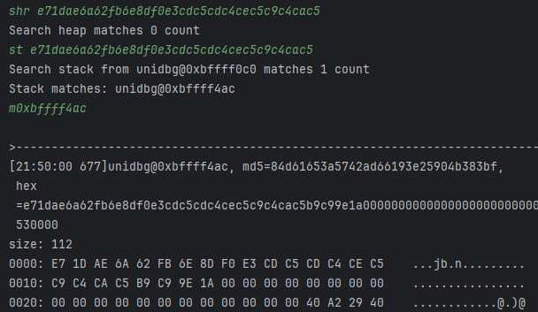

- 没有问题，确实是找到了，那么这一步就是一个改了码表的base64，并且后续的三个值应该都是这样的；
- 这个码表可以在当前函数找一下，位置在这里；

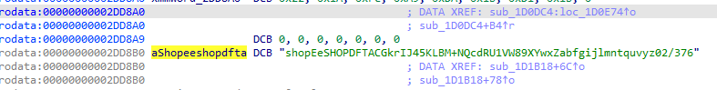

- 所以现在目标是：e71dae6a62fb6e8df0e3cdc5cdc4cec5c9c4cac5是怎么出来的；
- 还记得上面的地址吗？我们tracewrite一下；

```java
emulator.traceWrite(0xbffff4acL, 0xbffff4ac+ 20); // value1
```

- 看看日志；

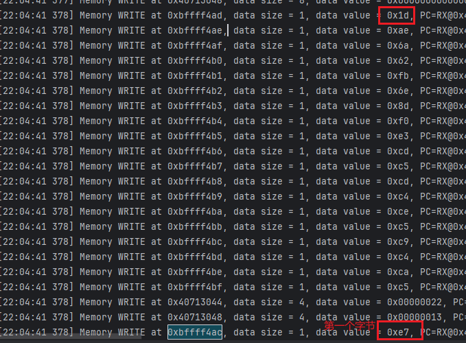

- 我们发现第一个字节是在最后运算的，然后才是顺序运算；
- 我们去对应的pc位置看看，搜索0x401c75bc；

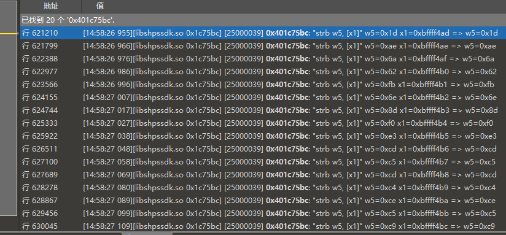

- 一共是20次，符合我们的目标长度；去找一下这些值在哪里运算的；


- 肯定是看这种计算的指令，收集这个地址，0x401c74e8；


- 确实符合前面说的，第一个字节是最后才算的，这里我们就可以观察一下，可以发现，除了第一次以外，每一次的w6的值都是上一次运算的结果，w5我们就再说，并且最后一个w5是第一次运算的w6，按照这个逻辑还原一下；

```python
data = list(bytes.fromhex("223fb3c4089995e37d132e0808090a0b0c0d0e0f"))

# 构建完整输入序列：前19步用 data[1:20]，第20步用 data[0]
inputs = data[1:] + [data[0]]
w = data[0]  # 初始 w6 值
results = []
for k in inputs:
    w ^= k
    results.append(w)

# 重组：将最后一步结果移至开头（循环左移效果）
reordered = [results[-1]] + results[:-1]
hex_str = ''.join(f'{b:02x}' for b in reordered)
print(hex_str)
```

- 得到的结果是正确的，上面说的最后一个w5是第一次运算的w6，这个可以去多trace几次，确实是这样；
- 所以这里我们需要找 223fb3c4089995e37d132e0808090a0b0c0d0e0f 这一部分是怎么来的；这时候就知道我们当时为什么要把随机改成递增的了，这里的08090a0b0c0d0e0f明显是随机数，可以改成05来trace一下；


- 上面说的两个观点都对得上，那么现在的问题就是：223fb3c4089995e37d132e08 这部分，12个字节是怎么来的？
- 把刚刚的代码稍微改造一下，把这两部分分开；这里的随机数注意取的是08-0f，这就是为什么不用全0，这样分不清是第几个；

```python
data = list(bytes.fromhex("223fb3c4089995e37d132e08") + bytes.fromhex("08090a0b0c0d0e0f"))

# 构建完整输入序列：前19步用 data[1:20]，第20步用 data[0]
inputs = data[1:] + [data[0]]
w = data[0]  # 初始 w6 值
results = []
for k in inputs:
    w ^= k
    results.append(w)

# 重组：将最后一步结果移至开头（循环左移效果）
reordered = [results[-1]] + results[:-1]
hex_str = ''.join(f'{b:02x}' for b in reordered)
print(hex_str)
```

- 我们接下来就去找这12字节的来源，我选择去日志看看，搜一下看看有没有头绪，结果搜到了；


- 这就是我们的目标，没搜到怎么办？可以去searchData搜一下；


- 也是同一块地址，去tracewrite一下；

```java
emulator.traceWrite(0xbfffdcf4L, 0xbfffdcf4+ 12);
```

- 这里注意了，直接看日志会打印非常多，导致前面的日志就被冲掉了，我们这里把searchData开着再搜；


- 去当前的PC看看，地址是0x401c926c；


- 都在这了，去找哪里运算的；


- 也是异或，把这个地址收集一下，0x401c8bc8；


- 计算都在这里了，同样的把它们复现一下；

```python
# w9 输入序列（十六进制字符串）
w9_hex = "2136b0c3089897e07916280f"
# w8 输入序列（十六进制字符串）
w8_hex = "030903070001020304050607"

w9_bytes = bytes.fromhex(w9_hex)
w8_bytes = bytes.fromhex(w8_hex)

prefix_bytes = bytes([a ^ b for a, b in zip(w9_bytes, w8_bytes)])
prefix_hex = prefix_bytes.hex()
print(prefix_hex)
```

- 好了，现在来看看这两组内容，先看w8_hex这一组，03090307是：
    - 03表示后续还有3个键，如果是get请求也是03；后续的三个表示算法编号；
    - 09表示剩下的那一个短值的算法编号，也就是第一个键后面的那个值；
    - 03表示post的短值的算法，get的话就没有；
    - 07表示最长的值使用的算法编号；
- 这个后续还有待考证，这里先放着；
- 0001020304050607很明显了，刚刚我们用到了08-0f的随机数，这里不就是00-07的嘛；所以w8_hex这部分算是已知；
- 所以我们现在要找w9_hex = "2136b0c3089897e07916280f"这部分了；
- 还是回到日志里，去找0x21最早出现的位置；


- 又是一个加载指令；

```plain
[29014039] 0x401c8fc4: "ldrb w9, [x9]" x9=0xbfffdd17 => w9=0x21
```

- 还记得前面找base64码表的时候吗？也是这样的情况，一个加载指令，我们是去看的对应的那个地址是什么内容；
- 这里就应该去看0xbfffdd17这块地址，这里是第五次出现的时候；

```java
emulator.attach().addBreakPoint(module.base + 0x1c8fc4);
```


- 这个时候来看；


- 这次什么也看不出来了，怎么办？
- 我决定去tracewrite看看0xbfffdd17是在哪里被写入的数据；

```java
emulator.traceWrite(0xbfffdd17L, 0xbfffdd17 + 0x10);
```

- 这时候断点先别停，找到我们的目标0x21的位置；


- 去搜PC位置，0x1c7dd0；


- 搜出来268个结果，仔细看一下，0x21确实在，在最后的位置，和我们前面读的那一块内容是一样的；那它的开始地址应该是0xbfffdd08；但是读268说实话有点尴尬的数字；
- 我隐约觉得这里应该是一个256才对，找找有没有什么证据；我的做法是去tracewrite一下0xbfffdd08这个地址；


- 单字节的写入有两次，一次是这里，一次就是前面的目标，而且这里写的还很有顺序，0x1c8724；


- 去看日志发现是一块256大小的内容，且排布是0-255，这个特征算是走上正轨了；
- 我们去从0xbfffdd08开始读，读256字节，它是这样一块内容；

```plain
0000: 59 1D 0D 3C 43 CF CA 78 55 E4 BD 88 2F 3B 19 21    Y..<C..xU.../;.!
0010: 40 5F 7E 9D 6D 8B FA 18 10 56 E3 6A F3 F2 41 32    @_~.m....V.j..A2
0020: 61 C5 AE CD FC 3D 05 A1 CB F7 8D 74 96 20 CE 22    a....=.....t. ."
0030: 04 8A B6 39 34 73 54 F1 38 7F 1A 07 50 62 A9 F0    ...94sT.8...Pb..
0040: 27 66 B5 4B 53 4A 1F 0E 97 4C 44 99 D8 EB 86 DD    'f.KSJ...LD.....
0050: 64 9B C4 DC 3E 8F 67 23 A2 5D C7 AC A5 24 63 85    d...>.g#.]...$c.
0060: FF 4E 77 35 B3 71 5C 65 AA EA 03 06 15 80 09 08    .Nw5.q\e........
0070: 83 A3 1B E1 13 6E E0 2B A0 45 B8 BA F9 DE 31 98    .....n.+.E....1.
0080: B4 57 F6 33 00 14 E5 E2 01 BF 7C DB C6 D7 90 7B    .W.3......|....{
0090: E6 8E FD 9C 0F DF 51 0C B0 1C 36 A8 17 87 9F C9    ......Q...6.....
00A0: 2D 89 C2 70 AB AF 29 1E 0B B2 82 AD D5 92 7D 26    -..p..).......}&
00B0: F5 93 16 B7 EC CC F4 C1 EE BC D0 C8 E7 48 79 47    .............HyG
00C0: 28 E9 2C 12 30 6F 9A D9 84 4D 3F 4F 2E B1 6B 2A    (.,.0o...M?O..k*
00D0: 60 42 68 E8 B9 FE 72 D1 D3 95 81 52 02 C0 D6 BB    `Bh...r....R....
00E0: 8C ED 11 76 D2 75 6C 49 7A 9E A4 FB BE 25 91 3A    ...v.ulIz....%.:
00F0: 69 0A A7 DA 37 C3 5E F8 58 EF A6 D4 94 5B 5A 46    i...7.^.X....[ZF
```

- 我们去排序一下也可以发现他是这样的顺序；


- 熟悉的可能知道了这是RC4算法的s盒，0-255则是初始的s盒，后面这个大概是打乱后的；
- 细心的朋友可以发现，trace里的日志和内存里的并不完全一样，前面我们看了0xbfffdd08这块地址在日志中的表现，它是0-255的数据顺序排列；搜的是写入的地址1：0x1c8724，我们既然发现对不上，那就是可能写入了多次，我们这样搜索一下：strb.*?0xbfffdd08，记得打开正则匹配；


- 看最左边，它有三次写入，第三次也许才是我们要的；它也是我们内存里S盒的开头，那应该来看0x21了，它在S盒的第0xf位；
- 这里还有一个重点，前面我们有一组268位的数据，它是在做什么？我们去看看，搜0x1c7dd0；


- 这不就是在做交换吗？前面说了RC4的S盒，这里是位于哪里？我们看一下标准实现；

```python
def rc4_encrypt_decrypt(data: bytes, key: bytes) -> bytes:
    S = list(range(256))
    j = 0
    key_length = len(key)
    for i in range(256):
        j = (j + S[i] + key[i % key_length]) % 256
        S[i], S[j] = S[j], S[i]
    # print([hex(i) for i in S])

    i = j = 0
    output = bytearray()
    for byte in data:
        i = (i + 1) % 256
        j = (j + S[i]) % 256
        S[i], S[j] = S[j], S[i]
        k = S[(S[i] + S[j]) % 256]
        output.append(byte ^ k)
    return bytes(output)


if __name__ == "__main__":
    plaintext = bytes.fromhex('303132333435363738393a3b')
    key = bytes.fromhex('0f0e0d0c0b0a0908')
    # 加密
    ciphertext = rc4_encrypt_decrypt(plaintext, key)
    print(f"密文: {ciphertext.hex()}")
```

- 对应的话，标准实现有两处交换，分别是打乱s盒以及加密的时候；这里我们是268位，除去s盒是256次交换，多出来了12次交换，那不就 应该是结果的交换吗；我们的目标2136b0c3089897e07916280f正是12字节的，所以这里我们知道了这12字节的运算中是带有交换的；
- 继续分析，先来看看目标数据是怎么算出来的，还记得0x21是在0xbfffdd17这一块取出来的，并不是直接运算的，也就是从0xbfffdd08偏移了0xf也就是15字节的，从s盒来看，正好是21；
- 再看第二个字节，0x36；

```plain
[29014039] 0x401c8fc4: "ldrb w9, [x9]" x9=0xbfffdda2 => w9=0x36
```

- 这里偏移的是0x9A也就是154字节，算下来确实也是0x36，后续也都是这样在S盒里取下标，对应标准算法；


- 这可不就是取下标吗，但是和标准的不一样的是，这里是没有异或的，我们现在能复现的情况如下：

```python
for m in range(12):
    # i = (i + 1) % 256
    # j = (j + S[i]) % 256
    # S[i] ,S[j] = S[j] ,S[i]
    k = S[(S[i] + S[j]) % 256]
    w9_hex.append(k)
print(''.join([f'{i:02x}' for i in w9_hex]))
```

- 这是从标准算法里摘下来的，还需要继续分析，看看前面几步和标准的有没有区别；
- 再上面是一个交换，前面我们刚说过，多的12次就在这里，而且这里没有明文，所以我们是固定的12次循环；

```python
for m in range(12):
    # i = (i + 1) % 256
    # j = (j + S[i]) % 256
    S[i] ,S[j] = S[j] ,S[i]
    k = S[(S[i] + S[j]) % 256]
    w9_hex.append(k)
print(''.join([f'{i:02x}' for i in w9_hex]))
```

- 对了，这里的S[i] + S[j]我们也还没有找到，看看能不能找到；回顾一下这条指令；

```plain
[29014039] 0x401c8fc4: "ldrb w9, [x9]" x9=0xbfffdd17 => w9=0x21
```

- 我们现在要看的是0xbfffdd17是怎么来的，按照刚刚的逻辑，我们需要找到0xbfffdd08 [0xf] 这种数值就算成功；


- 稍微往上找一下就好，确实是这样的，搜索这个地址；


- 12次下标都在这里了，我们来算一下0x9a是怎么来的，也就是第二个下标；


- 它是0xd + 0x8d的结果，按照源码来说，它们分别是S[i] ,S[j]，我们找一下它们有没有交换的过程，也是选中0xd 和 0x8d其一往上找，或者喜欢搜索的也可以，但是需要看仔细，这里我推荐我这种方法；
- 找到这个位置，大概600488行，可以看到很明显的交换；


- 上面我就不跟着推了，你可以算一下第一轮的结果，确实是0xf，别忘了 %256，复现如下：

```python
S_bytes = bytes.fromhex('59 1d 0d 3c 43 cf ca 78 55 e4 bd 88 2f 3b 19 21 40 5f 7e 9d 6d 8b fa 18 10 56 e3 6a f3 f2 41 32 61 c5 ae cd fc 3d 05 a1 cb f7 8d 74 96 20 ce 22 04 8a b6 39 34 73 54 f1 38 7f 1a 07 50 62 a9 f0 27 66 b5 4b 53 4a 1f 0e 97 4c 44 99 d8 eb 86 dd 64 9b c4 dc 3e 8f 67 23 a2 5d c7 ac a5 24 63 85 ff 4e 77 35 b3 71 5c 65 aa ea 03 06 15 80 09 08 83 a3 1b e1 13 6e e0 2b a0 45 b8 ba f9 de 31 98 b4 57 f6 33 00 14 e5 e2 01 bf 7c db c6 d7 90 7b e6 8e fd 9c 0f df 51 0c b0 1c 36 a8 17 87 9f c9 2d 89 c2 70 ab af 29 1e 0b b2 82 ad d5 92 7d 26 f5 93 16 b7 ec cc f4 c1 ee bc d0 c8 e7 48 79 47 28 e9 2c 12 30 6f 9a d9 84 4d 3f 4f 2e b1 6b 2a 60 42 68 e8 b9 fe 72 d1 d3 95 81 52 02 c0 d6 bb 8c ed 11 76 d2 75 6c 49 7a 9e a4 fb be 25 91 3a 69 0a a7 da 37 c3 5e f8 58 ef a6 d4 94 5b 5a 46')
S = list(S_bytes)
w9_hex = []
i = j = 0
for m in range(12):
    i = (i + 1) % 256
    j = (j + S[i]) % 256
    S[i] ,S[j] = S[j] ,S[i]
    k = S[(S[i] + S[j]) % 256]
    w9_hex.append(k)
print(''.join([f'{i:02x}' for i in w9_hex]))
```

- 结果如下：2136b0c3089897e07916280f；没问题，就是我们要找的东西；
- 这里就剩下了S盒还未知，这里先看看标准的S盒编排吧；

```python
S = list(range(256))
j = 0
key_length = len(key)
for i in range(256):
    j = (j + S[i] + key[i % key_length]) % 256
    S[i], S[j] = S[j], S[i]
print([hex(i) for i in S])
```

- 为什么这里这么确定有这种流程？前面是说过的，有256 + 12次编排，12次在上面，这里就是剩下的256次；
- 可以发现这里重点就是key，而且也就它未知了，我们看看第一次情况如何；

```plain
S = list(range(256))
j = 0
key_length = len(key)
for i in range(256):
    j = (0 + 0 + key[0]) % 256
    S[i], S[j] = j	, 0
```

- 能看明白吗？我们要找的是，第一次交换，一个是0，另一个就是key的第一部分了；


- 这是首次，那么key就是0xf，再看第二次；

```plain
S = list(range(256))
j = 0xf
key_length = len(key)
for i in range(256):
    j = (0xf + 1 + key[1]) % 256
    S[i], S[j] = j, 1
```

- 对应的情况在下图；


- 0x1e应该就是 S[j] 了，但是这里需要计算一下；由于S盒最开始是顺序的，所以在后面的S[j]实际上就等于 j ；这么算下来key的一部分是0xe；
- 后面我们就不算了，换一种方式来确定key的值；就以第二个值为例，我们演示的是手动计算的，值交换发生在0x1e 以及 0x1两者之间，这两者之间，i是递增的，也就是说比较好判断谁是 j，例如这里的0x1e是 j；
- 而 j 是通过加法得到的，那我们找一下，有没有这样的加法，记住了，当前位置选中0x1e，然后往上找，不要特别远；


- 它是这样的：

```plain
[4901090b] 0x401c8828: "add w9, w10, w9" w10=0xe w9=0x10 => w9=0x1e
```

- 也就是说，0xe和0x10这两者，是 j + S[i] + key[i % key_length] 这一部分，而顺序这里我们不能判断，那现在我们继续看，它俩谁还有加法，就能判断了；


- 很显然是0x10有加法，这个1还记得吗，就是S[i]，而这里的0xf就是 j，也就是第一轮被赋的值；
- 所以w10=0xe是key的部分，我们看它从哪里加载的；

```plain
[6a6a6ab8] 0x401c881c: "ldr w10, [x19, x10]" x19=0x40728000 x10=0x154 => w10=0xe
```

- 既然是循环，那地址是一致的，但是直接搜地址太多结果了，搜这条汇编的一部分，循环汇编也不会变嘛，搜索x19=0x40728000 x10=0x154；


- 一共是256个匹配项，符合要求，并且可以发现，从0xf - 0x8之后，又0xf - 0x8 取值，毫无疑问，key我们找到了；

```plain
0f0e0d0c0b0a0908 对应的位置 -> key[i % key_length] 一共是8个字节
```

- 很明显它是随机数，我们搜索另一份trace以确定这个理论；


- 确实是随机数，你看，如果拿这份trace分析就会出现问题，到时候算法还原的时候和前面用到的随机数对不上就会出现问题，而且这个问题还不好找；
- 这段算法复现如下，你也可以去看看key编排出来的S盒对不对，不对的话还需要继续分析，不过难度也不大：

```python
def value1():
    key = bytes.fromhex('0f0e0d0c0b0a0908')  # 随机数倒序
    S_box = list(range(256))
    j = 0
    key_length = len(key)
    for i in range(256):
        j = (j + S_box[i] + key[i % key_length]) % 256
        S_box[i], S_box[j] = S_box[j], S_box[i]
    S_bytes = bytes(S_box)
    S = list(S_bytes)
    w9_hex = []
    i = j = 0
    for m in range(12):
        i = (i + 1) % 256
        j = (j + S[i]) % 256
        S[i], S[j] = S[j], S[i]
        k = S[(S[i] + S[j]) % 256]
        w9_hex.append(k)
    w9_hex = ''.join([f'{i:02x}' for i in w9_hex])

    # w9_hex = "2136b0c3089897e07916280f"
    w8_hex = "03090307" + "0001020304050607"  # 算法编号 + 随机数
    w9_bytes = bytes.fromhex(w9_hex)
    w8_bytes = bytes.fromhex(w8_hex)

    prefix_bytes = bytes([a ^ b for a, b in zip(w9_bytes, w8_bytes)])
    prefix_hex = prefix_bytes.hex()
    print(prefix_hex)

    # prefix_hex = "223fb3c4089995e37d132e08"
    suffix_hex = "08090a0b0c0d0e0f"  # 随机数

    full_hex = prefix_hex + suffix_hex
    data = list(bytes.fromhex(full_hex))

    # 构建输入序列：前19步用 data[1:20]，第20步用 data[0]
    inputs = data[1:] + [data[0]]
    w = data[0]  # 初始值
    results = []

    for k in inputs:
        w ^= k
        results.append(w)

    # 将最后一步结果移到最前面
    reordered = [results[-1]] + results[:-1]
    hex_str = ''.join(f'{b:02x}' for b in reordered)
    print(hex_str)
    return hex_str
```

- 运行结果：e71dae6a62fb6e8df0e3cdc5cdc4cec5c9c4cac5；这正是我们最开始的没有经过base64的数据，我们加上base64看看，还是否有问题；

```python
def custom_base64(data, mode="encode"):
    CUSTOM_BASE64_TABLE = "shopEeSHOPDFTACGkrIJ45KLBM+NQcdRU1VW89XYwxZabfgijlmntquvyz02/376="
    BASE64_INDEX_MAP = {char: i for i, char in enumerate(CUSTOM_BASE64_TABLE)}
    if mode == "encode":
        if not isinstance(data, (bytes, bytearray)):
            raise ValueError("输入数据必须是字节类型以进行编码。")
        binary_str = ''.join(f'{byte:08b}' for byte in data)
        encoded = []
        for i in range(0, len(binary_str), 6):
            chunk = binary_str[i:i + 6]
            chunk = chunk.ljust(6, '0')
            index = int(chunk, 2)
            encoded.append(CUSTOM_BASE64_TABLE[index])
        while len(encoded) % 4 != 0:
            encoded.append('=')
        return ''.join(encoded)
    elif mode == "decode":
        if not isinstance(data, str):
            raise ValueError("输入数据必须是字符串类型以进行解码。")
        encoded = data.rstrip('=')
        binary_str = ''.join(f'{BASE64_INDEX_MAP[char]:06b}' for char in encoded)
        decoded = []
        for i in range(0, len(binary_str), 8):
            chunk = binary_str[i:i + 8]
            if len(chunk) == 8:  # 忽略不足 8 位的部分
                decoded.append(int(chunk, 2))
        return bytes(decoded)


def get_value1():
    key = bytes.fromhex('0f0e0d0c0b0a0908')  # 随机数倒序
    S_box = list(range(256))
    j = 0
    key_length = len(key)
    for i in range(256):
        j = (j + S_box[i] + key[i % key_length]) % 256
        S_box[i], S_box[j] = S_box[j], S_box[i]
    S_bytes = bytes(S_box)
    S = list(S_bytes)
    w9_hex = []
    i = j = 0
    for m in range(12):
        i = (i + 1) % 256
        j = (j + S[i]) % 256
        S[i], S[j] = S[j], S[i]
        k = S[(S[i] + S[j]) % 256]
        w9_hex.append(k)
    w9_hex = ''.join([f'{i:02x}' for i in w9_hex])
    # w9_hex = "2136b0c3089897e07916280f"
    w8_hex = "03090307" + "0001020304050607"  # 算法编号 + 随机数
    w9_bytes = bytes.fromhex(w9_hex)
    w8_bytes = bytes.fromhex(w8_hex)

    prefix_bytes = bytes([a ^ b for a, b in zip(w9_bytes, w8_bytes)])
    prefix_hex = prefix_bytes.hex()
    # prefix_hex = "223fb3c4089995e37d132e08"
    suffix_hex = "08090a0b0c0d0e0f"  # 随机数
    full_hex = prefix_hex + suffix_hex
    data = list(bytes.fromhex(full_hex))
    # 构建输入序列：前19步用 data[1:20]，第20步用 data[0]
    inputs = data[1:] + [data[0]]
    w = data[0]  # 初始值
    results = []

    for k in inputs:
        w ^= k
        results.append(w)

    # 将最后一步结果移到最前面
    reordered = [results[-1]] + results[:-1]
    hex_str = ''.join(f'{b:02x}' for b in reordered)
    print(hex_str)
    return hex_str


if __name__ == '__main__':
    hex_res = get_value1()
    print(custom_base64(bytes.fromhex(hex_res), "encode"))
```

- 结果匹配；


- 第一个值的算法就分析完毕了，整理一下思路，涉及到了魔改base64、以及RC4算法，但是只是用到了一部分，并没有设计加密的部分；再就是整个看下来第一个值貌似只与随机数有关；
- 中间有个03090307说的是代表算法编号，这里来分析一下；
    - 03表示后续还有3个键，如果是get请求也是03，可以固定，后续的三个表示算法编号；
    - 09表示剩下的那一个短值的算法编号，也就是第一个键后面的那个值；
    - 03表示post的短值的算法，get的话就没有；
    - 07表示最长的值使用的算法编号；


### 4.4 剩余三个键
- 之所以剩余三个键一起说，是因为它们是同一批算法，但是一共有9套，我们先来看这三个字节取值的位置吧，也就是证明为什么有9套；
- 在日志中搜索一下这一段03 09 03 07，记得这里最好不要tracewrite，否则日志可能会被冲掉；


- 可以发现，也是在随机数附近，我们tracewrite一下，第一个字节不管；

```java
emulator.traceWrite(0xbffff499L, 0xbffff499 + 3); // 03 09 03 07
```


- 还是去搜一下，0x40086bd4；


- 这里有很多匹配项，前三个就是我们的目的，来看第一个吧；


- 这里的追踪方式就需要多变一点，它在上方的指令加载的，再往上追就不点击0x9了，我们以0x30c为锚点，它肯定比0x9要特殊一点的，继续追；


- 它是从0x40722000这个地址偏移0x308加载进来的，现在的锚点就是0x308；


- 一样的道理，但现在直接从0x406d36c0这个地址加载了；再往上找发现没有了，那就需要搜索了；


- 可以发现，间隔了很长的距离才有匹配项，地址也还是这个地址，而且再往上也没有匹配项了，这里就只能来看这条加载指令了；

```plain
[896a68b8] 0x400852a0: "ldr w9, [x20, x8]" x20=0x406d36c0 x8=0x20 => w9=0x9
```

- 这里陷入僵局了，但是前面分析过好几次了，第一次出现的指令是ldr，我们是怎么做的？去看这块内存当前的内容；前面是base64的码表和rc4的S盒是这么做的；
- 在位置下断点，去看0x406d36c0的内容；


- 和当前位置的取值也是完全对得上的，偏移也是没问题的；


- 这里就可以看出来了，一共能取值的范围是1-9，所以有9套算法，至于算的时候取哪套，我并没有看出来；
- 但是有一个点是，第一个值我们是算出来了的，他可以反解，解开之后有对应的算法编号，也就是类03080307这种，但是并没有哪里有在校验这个03080307，它得到的结果是键的加密方式一定要匹配，这是可以校验的；所以我认为这里可以随机，我后续也这么认为，但是这里加一个TODO，后续可以找时间分析一下；
- 好了，后续的目标就是分析这9套算法，把他们都分析出来；
- 另外，为什么这里的09代表的是第二个键，也后续再分析，这里这么认为就好；
- 再提前说一下，后续如果需要验证其他的算法，可以在最开始生成的位置把X9的值改成自己想要的就好；

```java
debugger.addBreakPoint(module.base + 0x852a4, new BreakPointCallback() {
    int num = 0; // 决定 func 执行顺序
    RegisterContext context = emulator.getContext();
    @Override
    public boolean onHit(Emulator<?> emulator, long address) {
        num+=1;
        if(num==1){
            emulator.getBackend().reg_write(Arm64Const.UC_ARM64_REG_X9, 0x9);
        }
        return true;
    }
});
```


#### 4.4.1 算法9
- 之所以先分析第9套，是由于当前第二个键就是9号算法，它的键名是：4b3e0f91，我们的目的就是找出它的计算逻辑；
- 先来日志里搜索一下；


- tracewrite了一下发现没什么内容，这是由于日志太多了；你可以在某个时候停止程序；


- 去日志搜pc的地址，0x40074e38，结果能找到；


- 这里一共有32个结果，其实就是四个8字节键都在这里，而且是分四次的；


- 但是往上追没看到啥内容，直接在trace里搜结果4b3e0f91吧，找到第一次出现的位置；


- 搜索这个偏移：0x1c2574；


- 这个函数还是比较清爽的，而且看起来类似于某种哈希；并且它有常量在的；


- 尝试在google搜索一下这两个常数；


- 看起来是一个叫做Siphash的算法，先hook一下这个函数吧；

```java
emulator.attach().addBreakPoint(module.base + 0x1C2380); // 9号算法
```

- 查看入参返回值，这里一共有5个参数，这里只说关键的；


- 0x21是参数2，实际上就是长度；


- x3是返回值，可以在返回是去读，最后一个参数是0x4；


- 确实是这个键，参数是url+随机数的5字节，后续几个键都是这个入参，只是用的算法不一样；
- 我尝试过让ai生成Siphash的代码来加密，但是结果总是不尽人意，而且ai说是魔改的，主要是这个算法不熟悉也不清楚是不是魔改的，但是好在这几个键的生成都不是在vm里，汇编相对来说非常少，我决定扣汇编来还原，中间其实找到规律也很简单就想明白了；
- 首先还是搜索这个结果：4b3e0f91，去找整个函数的调用流程；因为整个函数应该是没有调用其他函数的；


- 这里是返回的地方，然后往上找调用的地方；


- 把开始到结束我们取下来，新建一个文件来还原，避免把原文件弄混乱了；


- 满打满算不过300行，加上中间看出来特征后，实际上七八十行就可以还原了；这个算法我写的会比较详细，后续如果再有这种扣汇编的算法，我应该就不会这么写了，也没必要；
- 做这种类型的还原我比较喜欢由下至上，由果溯因，这样比较容易看出特征；首先看看整体的汇编执行流，了解一下这个算法的整体先；


- 我做了一些基本的注释，整体的流程就是，取长度低2位（即长度模4），得到余数；将长度左移24位，计算对齐后的总长度，后续准备循环，也就是说这个函数是以4字节分组的，我们的数据是33字节，所以这里是多了一个字节的，后续在还原的时候需要注意这个点，而且这几个函数都没有填充，也就意味着它在对不同的长度做不同的操作时，我们也要匹配上，否则这个长度结果对得上换一个长度的又对不上了；
- 紧接着我们去看循环在哪，循环了是不是8次；


- 我把循环体分隔了一下，这里确实是8次循环，所以这一部分我们只需要还原一次就好；再往下看；


- 在循环结束后还有运算的，这一部分应该就是对剩下的明文做运算的地方，直直的一大段运算，看起来有循环又没有循环的，注意看我图上的注释，接下来开始算法还原；
- 首先我们从结果开始还原，这里是：

```plain
"eor w12, w10, w9" w10=0x751c73bd w9=0x3e227c2c => w12=0x4b3e0f91
```

- 一个异或，后续这种简单的指令我就不说什么含义了，还原一下；

```python
result = 0x751c73bd ^ 0x3e227c2c
print(hex(result))
if hex(result) == '0x4b3e0f91':
    print('True 结果匹配!')
else:
    print('False 结果不匹配!')
```

- 去把这两个值的计算来源都找到；

```plain
"eor w10, w11, w10, ror #19" w11=0x30d8a31b w10=0x85322e26 => w10=0x751c73bd
"eor w9, w8, w12, ror #25" w8=0x965a759a w12=0x6d50f013 => w9=0x3e227c2c
```

```python
temp_0x3e227c2c = 0x965a759a ^ ROR32(0x6d50f013, 25)
temp_0x751c73bd = 0x30d8a31b ^ ROR32(0x85322e26, 19)
```

- 这里的变量名我习惯使用temp + 当前值的形式，这样方便对比，实际上用什么都没问题，也可以直接使用寄存器来代指；另外，这里的ROR32函数如下，实际就是一个右移函数而已；

```python
def ROR32(val, shift):
    """32位右旋转"""
    return ((val >> shift) | (val << (32 - shift))) & 0xFFFFFFFF
```

- 当前这一步其实就是整个扣汇编的过程的一步，其余的大部分只需要重复这个步骤即可；逐渐的把那些值都写成运算的结果，写到这里需要注意；


- 从这个值出现的时候就需要注意，他不再是csel w13, w14, w13, eq这条指令下生成的东西，它在上面生成的，所以这条csel指令上生成的值都有可能是循环的结果之一，所以到这里我们需要谨慎还原；
- csel w13, w14, w13, eq是一个条件判断指令，这里实际上就还是给w13保留为0xff这个值，我们就以这个指令作为分水岭，看看当前下面还原出来的代码长什么样；

```python
    w13 = 0xff  # 这里对应于"csel w13, w14, w13, eq" 需要注意
    # w14 = 0xee
    temp_0x3c69b6f1 = temp_0x86ee54b + temp_0x33fad1a6 & 0xFFFFFFFF
    temp_0xe9a7da67 = temp_0x89fc7b9c + temp_0x5fab5ecb & 0xFFFFFFFF
    temp_0xe0c0d7fc = temp_0x3c69b6f1 ^ ROR32(temp_0x86ee54b, 19)
    temp_0xb6f13c96 = w13 ^ ROR32(temp_0x3c69b6f1, 0x10)
    temp_0x3c08bfc8 = temp_0xe9a7da67 ^ ROR32(temp_0x5fab5ecb, 25)
    temp_0xc8a7da68 = temp_0xe9a7da67 ^ 0x2100000f
    temp_0xa968b264 = temp_0xc8a7da68 + temp_0xe0c0d7fc & 0xFFFFFFFF
    temp_0xf2f9fc5e = temp_0xb6f13c96 + temp_0x3c08bfc8 & 0xFFFFFFFF
    temp_0xb1724df8 = temp_0xa968b264 ^ ROR32(temp_0xe0c0d7fc, 27)
    temp_0xb264a968 = ROR32(temp_0xa968b264, 0x10) & 0xFFFFFFFF
    # ·····省略
    temp_0x29098587 = ROR32(temp_0x85872909, 0x10)
    temp_0x6d50f013 = temp_0xaba674f5 ^ ROR32(temp_0xe6c6f684, 24)
    temp_0x965a759a = temp_0x29098587 + temp_0x6d50f013 & 0xFFFFFFFF
    temp_0x30d8a31b = temp_0x85322e26 + temp_0xaba674f5 & 0xFFFFFFFF
    temp_0x3e227c2c = temp_0x965a759a ^ ROR32(temp_0x6d50f013, 25)
    temp_0x751c73bd = temp_0x30d8a31b ^ ROR32(temp_0x85322e26, 19)

    result = temp_0x751c73bd ^ temp_0x3e227c2c
    print(hex(result))
    if hex(result) == '0x4b3e0f91':
        print('True 结果匹配!')
    else:
        print('False 结果不匹配!')
```

- 这里的值我将0x2100000f暂时搁置，后续我们找到了再把它写活，其实也很好找；
- 这里我们的目标是把这一部分还原出来；


- 这部分实际上也是同样的思路，只是当出现循环中计算出来的值后，就不要再还原了，循环中的数据我们另外去扣，此时这部分还原的结果如下：

```python
    temp_0x2e118cb = 0x2100000f ^ 0x23e118c4
    temp_0xd5498e57 = 0x29790bc7 + 0xabd08290 & 0xFFFFFFFF
    temp_0xd0bdea4c = 0xcddcd181 + temp_0x2e118cb & 0xFFFFFFFF
    temp_0xaf59dc42 = temp_0xd5498e57 ^ ROR32(0xabd08290, 27)
    temp_0x8e57d549 = ROR32(temp_0xd5498e57, 0x10)
    temp_0x31a5214e = temp_0xd0bdea4c ^ ROR32(temp_0x2e118cb, 24)
    temp_0x8017c68e = temp_0xaf59dc42 + temp_0xd0bdea4c & 0xFFFFFFFF
    temp_0xbffcf697 = temp_0x8e57d549 + temp_0x31a5214e & 0xFFFFFFFF
    temp_0xbb9f9365 = temp_0x8017c68e ^ ROR32(temp_0xaf59dc42, 19)
    temp_0xc68e8017 = ROR32(temp_0x8017c68e, 0x10)
    temp_0x6d6c518f = temp_0xbffcf697 ^ ROR32(temp_0x31a5214e, 25)
    temp_0x7b9c89fc = temp_0xbffcf697 + temp_0xbb9f9365 & 0xFFFFFFFF
    temp_0x33fad1a6 = temp_0xc68e8017 + temp_0x6d6c518f & 0xFFFFFFFF
    temp_0x86ee54b = temp_0x7b9c89fc ^ ROR32(temp_0xbb9f9365, 27)
    temp_0x89fc7b9c = ROR32(temp_0x7b9c89fc, 0x10) & 0xFFFFFFFF
    temp_0x5fab5ecb = temp_0x33fad1a6 ^ ROR32(temp_0x6d6c518f, 24)
    w13 = 0xff  # 这里对应于"csel w13, w14, w13, eq" 需要注意
```

- 可以发现哈，有5个值还是写死的，它们都是在循环中生成的，所以我们要分开说，到这里，循环到结束这部分就还原结束了，需要在还原的时候多多注意，有些时候这个明文是这样，换一个明文可能就不是这样了，需要考虑多种情况；
- 现在我们来看循环，我选择还原最后一个循环，因为值也可以对应一下；

```python
# "eor w10, w10, w17" w10=0x277407cc w17=0xe0d0c0b => w10=0x29790bc7 #循环结束
temp_0x29790bc7 = 0x277407cc ^ 0xe0d0c0b & 0xFFFFFFFF
```

- 这里的0xe0d0c0b很明显是最后一个明文，你可以去找上一个循环的这个寄存器，看看它是不是明文的一部分，剩下的就是一个意思，把这一块都还原出来之后，循环就长这样；

```python
for i in range(int((len(bytetmp)) / 4)):
    arg1 = (tmp3 + tmp4) & 0xFFFFFFFF
    arg2 = arg1 ^ ROR32(tmp3, 27)
    arg3 = ROR32(arg1, 16)
    tmp1 = tmp1 ^ int.from_bytes(byte_data[4 * i:4 * i + 4], byteorder='little')
    tmp2 = (tmp2 + tmp1) & 0xFFFFFFFF
    tmp5 = tmp2 ^ ROR32(tmp1, 24)
    tmp2 = (tmp2 + arg2) & 0xFFFFFFFF
    tmp8 = ROR32(tmp2, 16) & 0xFFFFFFFF
    tmp2 = tmp2 ^ ROR32(arg2, 19) & 0xFFFFFFFF
    arg4 = (arg3 + tmp5) & 0xFFFFFFFF
    tmp6 = arg4 ^ ROR32(tmp5, 25)
    tmp7 = (arg4 + tmp2) & 0xFFFFFFFF
    tmp9 = (tmp6 + tmp8) & 0xFFFFFFFF
    tmp10 = tmp7 ^ ROR32(tmp2, 27)
    tmp11 = ROR32(tmp7, 16)
    tmp12 = tmp9 ^ ROR32(tmp6, 24)
    tmp13 = (tmp10 + tmp9) & 0xFFFFFFFF
    tmp14 = (tmp11 + tmp12) & 0xFFFFFFFF
    tmp3 = tmp13 ^ ROR32(tmp10, 19) & 0xFFFFFFFF
    tmp2 = ROR32(tmp13, 16) & 0xFFFFFFFF
    tmp1 = tmp14 ^ ROR32(tmp12, 25) & 0xFFFFFFFF
    tmp4 = tmp14 ^ int.from_bytes(byte_data[4 * i:4 * i + 4], byteorder='little')
temp_0x29790bc7 = tmp4
temp_0xabd08290 = tmp3
temp_0xcddcd181 = tmp2
w8 = len(bytetmp) << 0x18
temp_0x23e118c4 = tmp1
```

- 还记得之前我们说的吗？还有五个值是写死的，是在循环里生成的 ，根据值去对比然后还原出来；
- 现在整体已经是还原出来了，还需要一些细节需要修改，主要是前面提到的，这个算法没有对明文进行填充，也就是说我们需要考虑4种情况，取模结果为0、1、2、3这四种情况；
- 当前情况是1，它的运算是这样的；

```plain
"orr w8, w8, w13" w8=0x21000000 w13=0xf => w8=0x2100000f
```

- 0xf就是最后剩下的那个字节，而0x21000000是长度左移18位的结果，所以这个情况比较明显，复现如下：

```python
if len(bytetmp) % 4 == 1:
    temp_0x2100000f = (temp_0x2100000f | int.from_bytes(byte_data[-1:], byteorder='big')) & 0xFFFFFFFF
```

- 我们可以去修改一下明文，分别把对应的情况看看，实际上复现如下：

```python
if len(byte_data) % 4 == 0:
    pass
if len(byte_data) % 4 == 1:
    temp_0x2100000f = (temp_0x2100000f | int.from_bytes(byte_data[-1:], byteorder='big')) & 0xFFFFFFFF
if len(byte_data) % 4 == 2:
    temp_0x2100000f = temp_0x2100000f | int.from_bytes(byte_data[-2:], byteorder='little')
if len(byte_data) % 4 == 3:
    temp_0x2100000f = temp_0x2100000f | int.from_bytes(byte_data[-3:], byteorder='little')
```

- 只有刚好满足分组的时候特殊一点，不做处理，直接参与后续的运算；到这里需要注意的点就结束了，整体算法如下：

```python
def ROR32(val, shift):
    """32位右旋转"""
    return ((val >> shift) | (val << (32 - shift))) & 0xFFFFFFFF


def func9(url, randomStr):
    tmp1 = 0x74656462
    tmp2 = 0x6c796765
    tmp3 = 0
    tmp4 = 0
    byte_data = url.encode() + bytes.fromhex(randomStr)
    for i in range(int((len(byte_data)) / 4)):
        arg1 = (tmp3 + tmp4) & 0xFFFFFFFF
        arg2 = arg1 ^ ROR32(tmp3, 27)
        arg3 = ROR32(arg1, 16)
        tmp1 = tmp1 ^ int.from_bytes(byte_data[4 * i:4 * i + 4], byteorder='little')
        tmp2 = (tmp2 + tmp1) & 0xFFFFFFFF
        tmp5 = tmp2 ^ ROR32(tmp1, 24)
        tmp2 = (tmp2 + arg2) & 0xFFFFFFFF
        tmp8 = ROR32(tmp2, 16) & 0xFFFFFFFF
        tmp2 = tmp2 ^ ROR32(arg2, 19) & 0xFFFFFFFF
        arg4 = (arg3 + tmp5) & 0xFFFFFFFF
        tmp6 = arg4 ^ ROR32(tmp5, 25)
        tmp7 = (arg4 + tmp2) & 0xFFFFFFFF
        tmp9 = (tmp6 + tmp8) & 0xFFFFFFFF
        tmp10 = tmp7 ^ ROR32(tmp2, 27)
        tmp11 = ROR32(tmp7, 16)
        tmp12 = tmp9 ^ ROR32(tmp6, 24)
        tmp13 = (tmp10 + tmp9) & 0xFFFFFFFF
        tmp14 = (tmp11 + tmp12) & 0xFFFFFFFF
        tmp3 = tmp13 ^ ROR32(tmp10, 19) & 0xFFFFFFFF
        tmp2 = ROR32(tmp13, 16) & 0xFFFFFFFF
        tmp1 = tmp14 ^ ROR32(tmp12, 25) & 0xFFFFFFFF
        tmp4 = tmp14 ^ int.from_bytes(byte_data[4 * i:4 * i + 4], byteorder='little')
    temp_0x29790bc7 = tmp4
    temp_0xabd08290 = tmp3
    temp_0xcddcd181 = tmp2
    temp_0x2100000f = len(byte_data) << 0x18
    temp_0x23e118c4 = tmp1
    # 对剩余明文做处理
    if len(byte_data) % 4 == 0:
        pass
    if len(byte_data) % 4 == 1:
        temp_0x2100000f = (temp_0x2100000f | int.from_bytes(byte_data[-1:], byteorder='big')) & 0xFFFFFFFF
    if len(byte_data) % 4 == 2:
        temp_0x2100000f = temp_0x2100000f | int.from_bytes(byte_data[-2:], byteorder='little')
    if len(byte_data) % 4 == 3:
        temp_0x2100000f = temp_0x2100000f | int.from_bytes(byte_data[-3:], byteorder='little')

    temp_0x2e118cb = temp_0x2100000f ^ temp_0x23e118c4 & 0xFFFFFFFF
    temp_0xd5498e57 = temp_0x29790bc7 + temp_0xabd08290 & 0xFFFFFFFF
    temp_0xd0bdea4c = temp_0xcddcd181 + temp_0x2e118cb & 0xFFFFFFFF
    temp_0xaf59dc42 = temp_0xd5498e57 ^ ROR32(temp_0xabd08290, 27)
    temp_0x8e57d549 = ROR32(temp_0xd5498e57, 0x10)
    temp_0x31a5214e = temp_0xd0bdea4c ^ ROR32(temp_0x2e118cb, 24)
    temp_0x8017c68e = temp_0xaf59dc42 + temp_0xd0bdea4c & 0xFFFFFFFF
    temp_0xbffcf697 = temp_0x8e57d549 + temp_0x31a5214e & 0xFFFFFFFF
    temp_0xbb9f9365 = temp_0x8017c68e ^ ROR32(temp_0xaf59dc42, 19)
    temp_0xc68e8017 = ROR32(temp_0x8017c68e, 0x10)
    temp_0x6d6c518f = temp_0xbffcf697 ^ ROR32(temp_0x31a5214e, 25)
    temp_0x7b9c89fc = temp_0xbffcf697 + temp_0xbb9f9365 & 0xFFFFFFFF
    temp_0x33fad1a6 = temp_0xc68e8017 + temp_0x6d6c518f & 0xFFFFFFFF
    temp_0x86ee54b = temp_0x7b9c89fc ^ ROR32(temp_0xbb9f9365, 27)
    temp_0x89fc7b9c = ROR32(temp_0x7b9c89fc, 0x10) & 0xFFFFFFFF
    temp_0x5fab5ecb = temp_0x33fad1a6 ^ ROR32(temp_0x6d6c518f, 24)
    w13 = 0xff  # 这里对应于"csel w13, w14, w13, eq" 需要注意
    # w14 = 0xee
    temp_0x3c69b6f1 = temp_0x86ee54b + temp_0x33fad1a6 & 0xFFFFFFFF
    temp_0xe9a7da67 = temp_0x89fc7b9c + temp_0x5fab5ecb & 0xFFFFFFFF
    temp_0xe0c0d7fc = temp_0x3c69b6f1 ^ ROR32(temp_0x86ee54b, 19)
    temp_0xb6f13c96 = w13 ^ ROR32(temp_0x3c69b6f1, 0x10)
    temp_0x3c08bfc8 = temp_0xe9a7da67 ^ ROR32(temp_0x5fab5ecb, 25)
    temp_0xc8a7da68 = temp_0xe9a7da67 ^ 0x2100000f
    temp_0xa968b264 = temp_0xc8a7da68 + temp_0xe0c0d7fc & 0xFFFFFFFF
    temp_0xf2f9fc5e = temp_0xb6f13c96 + temp_0x3c08bfc8 & 0xFFFFFFFF
    temp_0xb1724df8 = temp_0xa968b264 ^ ROR32(temp_0xe0c0d7fc, 27)
    temp_0xb264a968 = ROR32(temp_0xa968b264, 0x10) & 0xFFFFFFFF
    temp_0xfa463462 = temp_0xf2f9fc5e ^ ROR32(temp_0x3c08bfc8, 24)
    temp_0xacaaddca = temp_0xb264a968 + temp_0xfa463462 & 0xFFFFFFFF
    temp_0xa46c4a56 = temp_0xb1724df8 + temp_0xf2f9fc5e & 0xFFFFFFFF
    temp_0x8fb0ecb7 = temp_0xacaaddca ^ ROR32(temp_0xfa463462, 25)
    temp_0xedd35c78 = temp_0xa46c4a56 ^ ROR32(temp_0xb1724df8, 19)
    temp_0x4a56a46c = ROR32(temp_0xa46c4a56, 0x10) & 0xFFFFFFFF
    temp_0x9a7e3a42 = temp_0xacaaddca + temp_0xedd35c78 & 0xFFFFFFFF
    temp_0xda079123 = temp_0x4a56a46c + temp_0x8fb0ecb7 & 0xFFFFFFFF
    temp_0x2015b55f = temp_0x9a7e3a42 ^ ROR32(temp_0xedd35c78, 27)
    temp_0x3a429a7e = ROR32(temp_0x9a7e3a42, 0x10) & 0xFFFFFFFF
    temp_0x6aeb26ac = temp_0xda079123 ^ ROR32(temp_0x8fb0ecb7, 24)
    temp_0xa52dc12a = temp_0x3a429a7e + temp_0x6aeb26ac & 0xFFFFFFFF
    temp_0xfa1d4682 = temp_0x2015b55f + temp_0xda079123 & 0xFFFFFFFF
    temp_0xd0be971f = temp_0xa52dc12a ^ ROR32(temp_0x6aeb26ac, 25)
    temp_0x4cb6a280 = temp_0xfa1d4682 ^ ROR32(temp_0x2015b55f, 19)
    temp_0x4682fa1d = ROR32(temp_0xfa1d4682, 0x10)
    temp_0xf1e463aa = temp_0xa52dc12a + temp_0x4cb6a280 & 0xFFFFFFFF
    temp_0x1741913c = temp_0x4682fa1d + temp_0xd0be971f & 0xFFFFFFFF
    temp_0x673033a3 = temp_0xf1e463aa ^ ROR32(temp_0x4cb6a280, 27)
    temp_0x63aaf1e4 = ROR32(temp_0xf1e463aa, 0x10)
    temp_0xa9d68eec = temp_0x1741913c ^ ROR32(temp_0xd0be971f, 24) & 0xFFFFFFFF
    temp_0xd8180d0 = temp_0x63aaf1e4 + temp_0xa9d68eec & 0xFFFFFFFF
    temp_0x7e71c4df = temp_0x673033a3 + temp_0x1741913c & 0xFFFFFFFF
    temp_0xe6c6f684 = temp_0xd8180d0 ^ ROR32(temp_0xa9d68eec, 25)
    temp_0x7805a839 = temp_0x7e71c4df ^ ROR32(temp_0x673033a3, 19)
    temp_0xc4df7e71 = ROR32(temp_0x7e71c4df, 0x10)
    temp_0x85872909 = temp_0xd8180d0 + temp_0x7805a839 & 0xFFFFFFFF
    temp_0xaba674f5 = temp_0xc4df7e71 + temp_0xe6c6f684 & 0xFFFFFFFF
    temp_0x85322e26 = temp_0x85872909 ^ ROR32(temp_0x7805a839, 27)
    temp_0x29098587 = ROR32(temp_0x85872909, 0x10)
    temp_0x6d50f013 = temp_0xaba674f5 ^ ROR32(temp_0xe6c6f684, 24)
    temp_0x965a759a = temp_0x29098587 + temp_0x6d50f013 & 0xFFFFFFFF
    temp_0x30d8a31b = temp_0x85322e26 + temp_0xaba674f5 & 0xFFFFFFFF
    temp_0x3e227c2c = temp_0x965a759a ^ ROR32(temp_0x6d50f013, 25)
    temp_0x751c73bd = temp_0x30d8a31b ^ ROR32(temp_0x85322e26, 19)

    result = temp_0x751c73bd ^ temp_0x3e227c2c
    print(hex(result))
    if hex(result) == '0x4b3e0f91':
        print('True 结果匹配!')
    else:
        print('False 结果不匹配!')


if __name__ == '__main__':
    url = '/api/v4/pages/bottom_tab_bar'
    randomStr = '0b0c0d0e0f'
    func9(url, randomStr)
```

- 可以把四种情况都走一遍，结果都是对的上的，这里我只跑一次；


- 到这里，第9号算法还原结束，接下来还原剩余8套；

#### 4.4.2 算法3
- 一就是按顺序来还原，09之后即是03，按照前面的逻辑，去搜索键值：c7fff146；


- 一共62个匹配项，居然只有第一条是运算，不过本身我也倾向于最早出现的那次，去搜索当前偏移；


- 很显然又是目的地，hook这个函数0x1C0E80，虽然我们已经知道所有入参都是一样的，但是形式还是需要走一下的；


- 一共3个参数，剩下那个是0，后续传参可能也要用到；伪代码里没有常数，我们无法直观的感受这可能是一个什么算法，不过整体也才100多行，难度不大的；汇编算下来刚好100行附近，这个函数难的点在于填充的处理，我们先来看分组长度是多少；


- 通过哪里判断都无所谓，这个算法的分组长度是12，这也就意味着我们要处理0-11这12种情况，这是这个函数比较麻烦的一个点，其余的还原问题都不大的；
- 先看前面的trace流，有一个魔数在的；


- 这是一个名为lookup3的算法，也是不太熟悉，但是初始状态的计算方式与标准 lookup3 一致；我们继续观察trace，这里是有两次循环，因为分组是12字节，我们的明文只够分两次的；这里是叫做混合运算运算，也就是一些运算过程；


- 这就是一次循环，把它整体像之前的方法抠出来就好，没有难度的；
- 最后一次混合运算也就三十行左右，还原出来就好，麻烦的地方在于明文的填充；
- 我们以当前分支为例，算下来还剩9字节，第二轮主循环结束后，会去判断还剩下多少字节；


- 可以看到0x401c0fb8就是0xb对应这个分支是没有跳转的，分支路径如下：

```plain
9 ≥ 6 ✓ → 进入大于等于6字节的处理
9 ≥ 9 ✓ → 进入大于等于9字节的处理
9 < 11 ✗ → 走9-10字节的分支
```

- 后续的几条指令翻译一下：

```plain
[0x1c0f78] ldrh w11, [x8, #8]       # 从偏移8读取半字（2字节）
           w11 = 0xf                 # 实际只有1字节数据
[0x1c0f84] ldp w8, w12, [x8]        # 读取前8字节
           w8 = 0x7261625f           # "_bar"
           w12 = 0xe0d0c0b           # "\x0b\x0c\x0d\x0e"
[0x1c0f88] add w0, w0, w11, uxtb    # 只使用低8位
           w0 = 0x57ca970a + 0xf = 0x57ca9719

[0x1c0f8c] add w9, w12, w9          # w9 = 0xe0d0c0b + 0x6a0c04ea = 0x781910f5
```

- 在我的代码里是这样的：

```python
elif remaining_bytes == 9:
    # 9字节：前8字节 + 1字节
    w8 = words[idx] if idx < len(words) else 0      # w8 = 0x7261625f
    w12 = words[idx + 1] if idx + 1 < len(words) else 0  # w12 = 0x0e0d0c0b
    w11 = words[idx + 2] if idx + 2 < len(words) else 0  # w11 = 0x0000000f 这里共9个字节 全是明文
    w11 &= 0xFF  # 只取第9字节（低8位）              # w11 = 0x0f
    w0 = (w0 + w11) & 0xFFFFFFFF                    # w0 += 0x0f
    w9 = (w12 + w9) & 0xFFFFFFFF                    # w9 += w12
```

- 其他的分支可以根据伪代码来还原或者让ai帮你还原，我不想写了；多测试几个分支看看；


- 我本地测试12种情况均符合结果，但是这里不放代码了，太占篇幅了；

#### 4.4.3 算法7
- 接着来，这次我们看第7号算法，他应该是最后一个键，也是最长的那个键：9bbcf962；
- 同样的逻辑，去搜这个键，直接定位到运算为止吧，不截太多图了；


- 偏移是0x1c202c，去ida看看；


- 看看参数情况，函数是1C2018；


- 依旧还是老样子，其他的不看了，长度以及0；
- 重点肯定是在sub_1C1EFC函数的，进去看看；


- 这个代码量更少，汇编执行流更是只有60行，依旧是难点基本都在分组上，我们看看它是几字节分组的；


- 直接看汇编很显然有4次循环，我们的明文是33字节，那么这里的分组长度是8字节一组；
- 或者这里每次减8也可以证明；


- 到这里应该已经得心应手了，而且这个算法相比来说真的简单很多，先把基础的框架还原出来；


- 也就是这样的一个循环，这里我就不推荐去以值为变量了，这么几行直接写就好了；

```python
def key_func7(data):
    length = len(data)
    x8 = 0x2127599BF4325C37  # 定值
    x9 = 0x880355F21E6D1965  # 定值
    x10 = x9 * length & 0xFFFFFFFFFFFFFFFF
    for i in range(int(length / 8)):
        temp_x13 = int.from_bytes(data[8 * i: 8 * i + 8], byteorder='little')
        x13 = temp_x13 ^ (temp_x13 >> 23)
        x13 = x13 * x8 & 0xFFFFFFFFFFFFFFFF
        x10 = x10 ^ x13
        x10 = x10 ^ (x13 >> 47)
        x10 = x10 * x9 & 0xFFFFFFFFFFFFFFFF


if __name__ == '__main__':
    url = '/api/v4/pages/bottom_tab_bar'
    randomStr = '0b0c0d0e0f'
    data = url.encode() + bytes.fromhex(randomStr)
    print(key_func7(data))
```

- 剩下的就是剩余字节的处理以及最后结果的处理，因为函数结束后还有一步，在最开始的那张图可以看到；
- 最后的那部分运算也非常简单，麻烦的点还是在多余字节的处理上，这里又是有多种；所有情况都遵循相同的处理流程，只是数据组装方式不同；我以几种情况做说明，这里是小端序；

```python
# 1字节 (remaining = 1)
last_block = data[offset]
# 例如: 0x0f → 0x000000000000000f

# 2字节 (remaining = 2)
last_block = data[offset] | (data[offset+1] << 8)
# 例如: [0x0a, 0x0b] → 0x0000000000000b0a 字节0放低位，字节1放高8位

# 3字节 (remaining = 3)
last_block = data[offset] | (data[offset+1] << 8) | (data[offset+2] << 16)
# 例如: [0x0a, 0x0b, 0x0c] → 0x00000000000c0b0a
#       字节0→位0-7, 字节1→位8-15, 字节2→位16-23
```

- 其实是比较直观的，关于这里建议去trace一份新的，多在明文后面加一两个字节来测试；
- 这个函数不多，还原结果如下：

```python
def key_func7(data, length, seed=0):
    CONST1 = 0x880355F21E6D1965
    CONST2 = 0x2127599BF4325C37
    state = (CONST1 * length) & 0xFFFFFFFFFFFFFFFF
    state ^= seed

    # 处理8字节块
    offset = 0
    # 主循环计算
    for i in range(int(length / 8)):
        block = int.from_bytes(data[offset:offset + 8], 'little')
        block ^= block >> 23
        block = (block * CONST2) & 0xFFFFFFFFFFFFFFFF
        state ^= block
        state ^= block >> 47
        state = (state * CONST1) & 0xFFFFFFFFFFFFFFFF
        offset += 8

    # 处理剩余字节（1-7字节）
    remaining = length & 7
    if remaining > 0:
        # 按小端序组装剩余字节
        print("剩余字节：", remaining)
        last_block = int.from_bytes(data[offset:offset + remaining], 'little')

        # 混合运算
        last_block ^= last_block >> 23
        last_block = (last_block * CONST2) & 0xFFFFFFFFFFFFFFFF
        state ^= last_block
        state ^= last_block >> 47
        state = (state * CONST1) & 0xFFFFFFFFFFFFFFFF

    # 最终混合
    state ^= state >> 23
    state = (state * CONST2) & 0xFFFFFFFFFFFFFFFF
    hash64 = state ^ (state >> 47)
    # 结果运算
    high32 = (hash64 >> 32) & 0xFFFFFFFF
    low32 = hash64 & 0xFFFFFFFF
    result = (low32 - high32) & 0xFFFFFFFF
    return result


if __name__ == '__main__':
    url = '/api/v4/pages/bottom_tab_bar'
    randomStr = '0b0c0d0e0f'
    data = url.encode() + bytes.fromhex(randomStr)
    print(hex(key_func7(data, len(data), 0)))
```

- 运行结果也非常符合；


- 到这里已经还原了3个算法，后续就需要改03090307这组数据了；

#### 4.4.4 算法1
- 接下来我准备按顺序来，首先需要将算法编号改成03010207；

```java
emulator.attach().addBreakPoint(module.base + 0x852a4, new BreakPointCallback() {
    int num = 0; // 决定 fun 执行顺序
    RegisterContext context = emulator.getContext();
    @Override
    public boolean onHit(Emulator<?> emulator, long address) {
        num+=1;
        if(num==1){
            emulator.getBackend().reg_write(Arm64Const.UC_ARM64_REG_X9, 0x1);
        }
        if(num==2){
            emulator.getBackend().reg_write(Arm64Const.UC_ARM64_REG_X9, 0x2);
        }
        return true;
    }
});
```

- 前面我是说过为什么改这里的，这里不再提了；改了两组，那就还剩两个键不变；

```plain
result:"{"1a9ec9b9": "21KYBuimMyJz0bJTlTvHnTpAj/j=", "3b4b2118": "wdolDJ8h1G/cmM+DshBh+kPhsub=", "9bbcf962": "u7CrEgUssUTs····cK59WCJKjjQ=", "a8cb0e10": "PZ6J6kNwywn/Ba2aSBuBMsshsUT=", "x-sap-ri": "16684368000102030405061701090a0b0c0d0e0f101112131415"}"
```

- 这里3b4b2118、a8cb0e10这两个键是发生变化的，3b4b2118对应的是01算法，a8cb0e10对应的是02算法；


- 现在来还原3b4b2118这个键的算法；
- 这里搁置一下，先还原值，键的算法太多了，后续再说；


### 4.5 第二个值 chacha20
- 第二个值就是除了post以外剩下的那个短值，在这里它是：

```plain
wdolDJ8h1G/cmM+DshBh+kPhsub=
```

- 还记得在分析base64的时候吗？我们回过头看一下之前的片段；


- 这里说了，四个值都是经过base64的，这个值自然也不例外，我们先解一下；

```plain
a1 e0 b1 29 39 01 84 ff 1d c9 96 8a 00 16 01 69 02 41 03 6b
hexdump：
00000000  a1 e0 b1 29 39 01 84 ff 1d c9 96 8a 00 16 01 69  |¡à±)9..ÿ.É.....i|
00000010  02 41 03 6b                                      |.A.k|
```

- 我们的目标就是找它，首先在做之前我们先观察一下这个密文；最后那一部分穿插着00 01 02 03；


- 可以看出来是第7次随机的结果，我们之所以要分析它是第几次，主要是由于我们不知道后面还有没有结果用到了同款随机，而不是不管它是什么随机我们都直接随机，这是不对的；这里第7次随机后紧接着加密的就是我们目标的值；
- 我们搜索一下前半部分，a1 e0 b1 29 39；


- 说明它们是分开生成的，那我们先看后半部分吧，毕竟都有随机数；直接搜索4b 41或者16 69都没有，但是我们在第一部分前面发现了一个有点点像的数据；


- 不知道还有没有印象，它是时间戳的前十位；


- 我们的目标是：00 16 01 69 02 41 03 6b，看起来有点类似，也许是有时间戳参与运算；
- 搜不到内容的话只能去SearchData搜内存了，这是比较好用的方法；

```java
memory.addModuleListener(new SearchData("00 16 01 69 02 41 03 6b", "libshpssdk.so", 1000));
```


- 那就去tracewrite一下0xbffff478这块地址；这时候SearchData先不停；


- 去看0x4008a618这个位置；


- 看起来还不错，值都在这里，我们往上追一下0x6b吧；


- 又是追到这里就没有了，上文出现了多次这种状况，我们之前是去下断点看当前位置是什么，这里字节比较少，我们先搜索这条加载指令对应的绝对地址0x4008a7e4吧；


- 这里就是加载它们的位置，可以发现我们的四字节目标存在0xbfffe8b0-0xbfffe8b3这四个字节里，我们去tracewrite一下吧；这里按照之前的思路也行，去下断点，然后到对应位置去看这块内容，但是也还需要去tracewrite这个地址的；因为一眼看不出来内容；

```java
emulator.traceWrite(0xbfffe8b0L, 0xbfffe8b0L + 4);
```


- 原来是四字节写入的，怪不得搜不到，去搜这个地址0x4008a07c；稍微追一下就可以看到异或运算；


```plain
[2801084a] 0x40089cd8: "eor w8, w9, w8" w9=0x3020100 w8=0x68436816 => w8=0x6b416916
```

- 0x3020100是那部分随机数，0x68436816则是时间戳，刚刚有说过，所以这部分我们就找到了，就是一个异或运算；
- 那我们还需要找出前面部分：a1 e0 b1 29 39 01 84 ff 1d c9 96 8a，这里还有12个字节；


- 按理说可以去tracewrite这个地址，但是日志有几千个，没法看，刚刚的后半部分是四字节运算的，我选择去log里四字节搜索看看有没有线索；


- 是因为这里有四字节的，搜不出来也没关系嘛；


- 正着搜搜不出来没关系，反着来一遍，而且我一般都推荐反着搜；


- 搜到了，第一次还是运算，我们去看看发现按照之前的方式往上追追不到对应的加法参与者的来源；
- 比如0x61707865这个数值，追到最开始是这样的：


- 是一个加载指令，没有运算，而0xc841683c则可以追到；


- 我们尝试tracewrite一下这个地址0xbfffe674，先看4字节吧；

```java
emulator.traceWrite(0xbfffe674L, 0xbfffe674L + 4);
```


- 确实是有数据的，前面还能看到一部分，那我们搜索一下这部分；


- 发现有多次匹配，看上去像是某些常量，去搜索一下；


- 实际上是chacha20或者saalsa20，它们俩共同拥有这个常量，所以这里我们并不能确定到底是哪一个；
- 但至少我们知道了这个算法可能是一个流加密，这里暂时看chacha20，因为它俩实际上是差不多的，chacha20是更安全的版本，后续如果有问题再更换回来就是了；
- 在分析这种算法的时候一定要注意，因为是比较冷门的，这里给一粉标准的py代码对照着分析；

```python
import struct


def rotl(v, n):
    """对32位无符号整数 v 进行循环左移 n 位。"""
    return ((v << n) & 0xffffffff) | (v >> (32 - n))


def quarter_round(x, a, b, c, d):
    """
    ChaCha20 的四分轮函数，对状态数组 x 的 a, b, c, d 四个位置进行操作。
    """
    x[a] = (x[a] + x[b]) & 0xffffffff
    x[d] = rotl(x[d] ^ x[a], 16)
    x[c] = (x[c] + x[d]) & 0xffffffff
    x[b] = rotl(x[b] ^ x[c], 12)
    x[a] = (x[a] + x[b]) & 0xffffffff
    x[d] = rotl(x[d] ^ x[a], 8)
    x[c] = (x[c] + x[d]) & 0xffffffff
    x[b] = rotl(x[b] ^ x[c], 7)


def chacha20_block(key, counter, nonce):
    # ChaCha20 常量 "expand 32-byte k"
    constants = [0x61707865, 0x3320646e, 0x79622d32, 0x6b206574]
    key_words = list(struct.unpack("<8I", key))
    nonce_words = list(struct.unpack("<3I", nonce))

    # 构造初始状态，共16个32位整数
    state = [0] * 16
    state[0:4] = constants
    state[4:12] = key_words
    state[12] = counter & 0xffffffff
    state[13:16] = nonce_words

    working_state = state.copy()

    # 进行 20 轮运算（10 次双轮，每次包括列轮和对角线轮）
    for _ in range(10):
        # 列轮
        quarter_round(working_state, 0, 4, 8, 12)
        quarter_round(working_state, 1, 5, 9, 13)
        quarter_round(working_state, 2, 6, 10, 14)
        quarter_round(working_state, 3, 7, 11, 15)
        # 对角线轮
        quarter_round(working_state, 0, 5, 10, 15)
        quarter_round(working_state, 1, 6, 11, 12)
        quarter_round(working_state, 2, 7, 8, 13)
        quarter_round(working_state, 3, 4, 9, 14)

    # 最终将原始状态与运算结果相加
    for i in range(16):
        working_state[i] = (working_state[i] + state[i]) & 0xffffffff

    # 将 16 个 32 位整数以小端序打包成 64 字节
    return struct.pack("<16L", *working_state)


def chacha20_encrypt(key, nonce, counter, plaintext):
    ciphertext = bytearray()
    # 每个块 64 字节，若明文长度不足 64 字节，则只使用部分 keystream
    block_count = (len(plaintext) + 63) // 64
    for i in range(block_count):
        keystream = chacha20_block(key, counter + i, nonce)
        block = plaintext[i * 64:(i + 1) * 64]
        # 异或运算
        for j in range(len(block)):
            ciphertext.append(block[j] ^ keystream[j])
    return bytes(ciphertext)


# 示例：加密和解密测试
if __name__ == '__main__':
    # 示例密钥（32字节）和 nonce（12字节）
    key = bytes.fromhex('000102030405060708090a0b0c0d0e0f101112131415161718191a1b1c1d1e1f')
    nonce = bytes.fromhex('202122232425262728292a2b')
    counter = 0  # 一直都是
    plaintext = bytes.fromhex('30313233343536373839')
    print("明文:", plaintext.hex())

    # 加密
    ciphertext = chacha20_encrypt(key, nonce, counter, plaintext)
    print("密文 (hex):", ciphertext.hex())

    # 解密：对密文再次使用同样的 keystream 异或即可还原明文
    decrypted = chacha20_encrypt(key, nonce, counter, ciphertext)
    print("解密后明文:", decrypted.hex())
```

- 先对比一下标准的，看看加密结果是否对得上；


- 另外，对于这个算法如果不了解则需要自行去学习一下，不过有源码也无所谓，主要大致知道有哪些点需要注意就好了，比如这里有nonce、counter等因素就好；
- 第一步怎么看呢？我决定去搜索一下剩余的；两个4字节的值，但是正着反着都没搜出来；而且源码中结尾是add，并没有看到异或，带着这个疑问继续分析吧；
- 还记得前面吗？我们tracewrite了bfffe980这个地址，但是结果2000+条压根没法看，所以我们直接去搜的，但是这里直接搜又没有头绪了，所以需要tracewrite或者SearchData；


- 现在换成这个地址tracewrite，看看情况如何；


- 没办法继续追了，那就看tracewrite吧；

```java
emulator.traceWrite(0xbfffe980L, 0xbfffe980L + 12);
```

- 前面说了结果非常多，所以这里选择搜索结果来定位；


- 去日志里搜这个地址：0x401c5844，上图没有截上；


- 看起来是单字节运算出来的，这也符合流加密的特点；那我们去找0x8a的来源，这里可以搜索也可以往上找；


- 收集这个地址，0x401c5b04；


- 这个位置就看到了异或运算，结合源码分析；

```python
# 异或运算
for j in range(len(block)):
    ciphertext.append(block[j] ^ keystream[j])
```

- 这里的w8、w9有一个是明文，有一个是密钥流；从日志里看起来第一部分运算是12次，明文应该就是12字节吧，这里我们应该如何判断？一般来说，key不会出现连续的0，w8只能是明文，但是这里不以这个理论为绝对，我们找一些方面来佐证这个理论；
- 我们来看这部分源码；

```python
def chacha20_block(key, counter, nonce):
    # ChaCha20 常量 "expand 32-byte k"
    constants = [0x61707865, 0x3320646e, 0x79622d32, 0x6b206574]
    key_words = list(struct.unpack("<8I", key))
    nonce_words = list(struct.unpack("<3I", nonce))
    # 构造初始状态，共16个32位整数
    state = [0] * 16
    state[0:4] = constants
    state[4:12] = key_words
    state[12] = counter & 0xffffffff
    state[13:16] = nonce_words
    working_state = state.copy()
    # 进行 20 轮运算（10 次双轮，每次包括列轮和对角线轮）
    for _ in range(10):
        # 列轮
        quarter_round(working_state, 0, 4, 8, 12)
        quarter_round(working_state, 1, 5, 9, 13)
        quarter_round(working_state, 2, 6, 10, 14)
        quarter_round(working_state, 3, 7, 11, 15)
        # 对角线轮
        quarter_round(working_state, 0, 5, 10, 15)
        quarter_round(working_state, 1, 6, 11, 12)
        quarter_round(working_state, 2, 7, 8, 13)
        quarter_round(working_state, 3, 4, 9, 14)
    # 最终将原始状态与运算结果相加
    for i in range(16):
        working_state[i] = (working_state[i] + state[i]) & 0xffffffff
    # 将 16 个 32 位整数以小端序打包成 64 字节
    return struct.pack("<16L", *working_state)
```

- 它是秘钥扩展相关的内容，我们以它为锚点分析；原始状态会与运算结果相加，这给了我们可乘之机，搜索一下与常量相关的加法，以这种方法搜索：add.*?0x61707865，记得启用正则匹配；


- 我们发现有多次调用，且地址为同一处，那我们搜索这个地址：0x401c6d34；


- 这里有非常多次的加法，我们算一下秘钥扩展是多少次加法；

```python
def quarter_round(x, a, b, c, d):
    """
    ChaCha20 的四分轮函数，对状态数组 x 的 a, b, c, d 四个位置进行操作。
    """
    x[a] = (x[a] + x[b]) & 0xffffffff
    x[d] = rotl(x[d] ^ x[a], 16)
    x[c] = (x[c] + x[d]) & 0xffffffff
    x[b] = rotl(x[b] ^ x[c], 12)
    x[a] = (x[a] + x[b]) & 0xffffffff
    x[d] = rotl(x[d] ^ x[a], 8)
    x[c] = (x[c] + x[d]) & 0xffffffff
    x[b] = rotl(x[b] ^ x[c], 7)
    
# 进行 20 轮运算（10 次双轮，每次包括列轮和对角线轮）
for _ in range(10):
    # 列轮
    quarter_round(working_state, 0, 4, 8, 12)
    quarter_round(working_state, 1, 5, 9, 13)
    quarter_round(working_state, 2, 6, 10, 14)
    quarter_round(working_state, 3, 7, 11, 15)
    # 对角线轮
    quarter_round(working_state, 0, 5, 10, 15)
    quarter_round(working_state, 1, 6, 11, 12)
    quarter_round(working_state, 2, 7, 8, 13)
    quarter_round(working_state, 3, 4, 9, 14)

# 最终将原始状态与运算结果相加
for i in range(16):
    working_state[i] = (working_state[i] + state[i]) & 0xffffffff
```

- quarter_round每次4个加法，一轮8次这里是32次加法，再循环10轮也就是320次加法，我们去这个位置看看；


- 到这里是320次 ，而且看着也很符合，所以后面的16次大概率是这一部分；

```python
# 最终将原始状态与运算结果相加
for i in range(16):
    working_state[i] = (working_state[i] + state[i]) & 0xffffffff
```

- 我们摘出来这一部分，由于state存着的就是原始信息，那我们就可以推出来这些内容到底是什么，先说key；

```plain
[2801080b] 0x401c6d34: "add w8, w9, w8" w9=0x61707865 w8=0xc841683c => w8=0x29b1e0a1
[2801080b] 0x401c6d34: "add w8, w9, w8" w9=0x3320646e w8=0xcc659cca => w8=0xff860138
[2801080b] 0x401c6d34: "add w8, w9, w8" w9=0x79622d32 w8=0x2987449e => w8=0xa2e971d0
[2801080b] 0x401c6d34: "add w8, w9, w8" w9=0x6b206574 w8=0xb3aa0815 => w8=0x1eca6d89
[2801080b] 0x401c6d34: "add w8, w9, w8" w9=0x9d578cd7 w8=0x97413bf6 => w8=0x3498c8cd
[2801080b] 0x401c6d34: "add w8, w9, w8" w9=0x56de6e84 w8=0x8d754e82 => w8=0xe453bd06
[2801080b] 0x401c6d34: "add w8, w9, w8" w9=0x93054fc9 w8=0x2e16bc01 => w8=0xc11c0bca
[2801080b] 0x401c6d34: "add w8, w9, w8" w9=0x98ec16ef w8=0xf711dd51 => w8=0x8ffdf440
[2801080b] 0x401c6d34: "add w8, w9, w8" w9=0x4591194c w8=0xb582aeaf => w8=0xfb13c7fb
[2801080b] 0x401c6d34: "add w8, w9, w8" w9=0x315a3117 w8=0x7d3d4e1a => w8=0xae977f31
[2801080b] 0x401c6d34: "add w8, w9, w8" w9=0x563234ee w8=0xf89db6c7 => w8=0x4ecfebb5
[2801080b] 0x401c6d34: "add w8, w9, w8" w9=0x23050e59 w8=0x7d323d7f => w8=0xa0374bd8
[2801080b] 0x401c6d34: "add w8, w9, w8" w9=0x0 w8=0x41577c05 => w8=0x41577c05
[2801080b] 0x401c6d34: "add w8, w9, w8" w9=0x7c678c4f w8=0xe70bde72 => w8=0x63736ac1
[2801080b] 0x401c6d34: "add w8, w9, w8" w9=0x4a56b834 w8=0x26c6e919 => w8=0x711da14d
[2801080b] 0x401c6d34: "add w8, w9, w8" w9=0x68436816 w8=0xad8723e8 => w8=0x15ca8bfe
```

```python
# ChaCha20 常量 "expand 32-byte k"
constants = [0x61707865, 0x3320646e, 0x79622d32, 0x6b206574]
key_words = list(struct.unpack("<8I", key))
nonce_words = list(struct.unpack("<3I", nonce))

# 构造初始状态，共16个32位整数
state = [0] * 16
state[0:4] = constants
state[4:12] = key_words
state[12] = counter & 0xffffffff
state[13:16] = nonce_words
```

- 很显然，前面四次加法是那四个常量：0x61707865, 0x3320646e, 0x79622d32, 0x6b206574；
- state[4:12] = key_words这里有8个key，也就是下面这些内容，它们是原始key；

```plain
0x9d578cd7 0x56de6e84 0x93054fc9 0x98ec16ef 0x4591194c 0x315a3117 0x563234ee 0x23050e59
```

- 这里应该是小端序还是大端序呢？

```python
constants = [0x61707865, 0x3320646e, 0x79622d32, 0x6b206574]
key_words = list(struct.unpack("<8I", key))
nonce_words = list(struct.unpack("<3I", nonce))
```

- 很显然这里是小端序运算的，或者说这里是被转过一次的，所以我们要倒着读才是原始的；

```plain
d78c579d846ede56c94f0593ef16ec984c19914517315a31ee343256590e0523
```

- 这就是我们的key，根据组成部分，key后面则是counter，再就是三个四字节的随机；

```plain
counter：0x0
nonce  ：0x7c678c4f 0x4a56b834 0x68436816
nonce换算：4f8c677c34b8564a16684368
```

- 那么，w8这部分就是明文，如下：

```plain
0000000001000200cdb87f28
```

- 现在可以进行测试了；

```python
if __name__ == '__main__':
    key = bytes.fromhex('d78c579d846ede56c94f0593ef16ec984c19914517315a31ee343256590e0523')
    nonce = bytes.fromhex('4f8c677c34b8564a16684368')
    counter = 0  # 一直都是
    plaintext = bytes.fromhex('0000000001000200cdb87f28')
    print("明文:", plaintext.hex())
    ciphertext = chacha20_encrypt(key, nonce, counter, plaintext)
    print("密文 (hex):", ciphertext.hex())
```

- 结果如下：

```plain
明文: 0000000001000200cdb87f28
密文 (hex): a1e0b129390184ff1dc9968a
```

- 可以发现就是目标结果，所以现在得到了这些信息：
- 第二个值 =  chacha20 + 时间戳 ^ 随机数；
- 但是chacha20的明文、key、nonce我们均未知，所以还需要解决这部分；另外，我们参考的位置是最好的，就是运算的key和原始部分相加的位置，还可以通过quarter_round这个 函数推导，会稍微麻烦一点点，但是也可以得到结果，感兴趣可以去推算一下；
- 先来看明文吧，00000000 01000200 cdb87f28，看起来并没有太多信息，去idea搜一下看看；


- 后半部分倒是搜到了，前面的都没有，看看它怎么来的吧；

```java
emulator.traceWrite(0xbfffe8b4L, 0xbfffe8b4L + 4);
```


- 去搜这个地址，0x4008a07c；


- 往前面追一下看看有没有运算过程吧；


- 有运算，去当前偏移0x1dd7d8看看；


- 在这样一个函数里，有印象的实际上它是键的4号算法，一个标准的xxhash；它的明文是？我们可以去hook一下这个函数，不过要看好这是第几次调用；


- 这个值在前面我们也见到了，traceWrite那张图上它就在，我们去执行一下看看；

```python
import xxhash

data = "5pC5QlE9zKWoSRBygkXKQn1X6TZ1OR49"
hash = xxhash.xxh32()
hash.update(data)
print(int(hash.hexdigest(), 16).to_bytes(4, 'little').hex())
```

- 结果是：


- 是对得上的，这里还需要看xxhash的明文；


- 去这个偏移看，会到这个函数来；


- 这个函数按交叉引用会非常多，我们去trace里搜索一下调用；


- 最后一个有一些情况的：


- 这不就是那串数据吗？搜索0x087b9c，也就是当前调用处；


- 原来是硬编码，那它的结果也是固定的；所以明文的一部分是固定的，

```plain
00000000 01000200 cdb87f28
```

- 再来看01000200这部分吧，我们去idea搜一下看看；我们在5pC5QlE9zKWoSRBy前方发现了符合条件的内容；


- 看起来前面的部分都在这里，我们先看01000200这部分；尝试去tracewrite一下bfffe8b8这个地址，这里会出现很多结果，可以在执行一会后暂停，避免日志被冲掉；


- 日志如下：

```plain
[21:37:10 849] Memory WRITE at 0xbfffe8bc, data size = 2, data value = 0x0002, PC=RX@0x40089800[libshpssdk.so]0x89800, LR=RX@0x40089cb4[libshpssdk.so]0x89cb4
[21:37:10 849] Memory WRITE at 0xbfffe8b8, data size = 2, data value = 0x0001, PC=RX@0x400894a4[libshpssdk.so]0x894a4, LR=RX@0x400898cc[libshpssdk.so]0x898cc
```

- 去日志搜0x400894a4这个地址，就一个匹配项；


- 这里需要根据偏移来追了，找到写入的地方；


- 继续更换目标，再找0xf8这个偏移，看谁写入了；


- 追到这里就可以发现，是硬编码，直接赋值的1；另一个0200也是这种情况，位置如下：


- 对应汇编是这样的：


- 其实位置是相近的，剩下的00000000在unidbg是全0，真机则是固定的另外的值，在还原后可以解密测试；
- 到这里明文就确定好了，接下来还需要确定key和nonce，先看nonce吧，相对短一点；

```plain
4f8c677c34b8564a 16684368
```

- 我把它分成两部分，后边的那一部分很明显了，是时间戳；


- 再看前面这部分，还是去idea搜索；


- 不多说了，直接看tracewrite的结果；


- 去搜一下0x401c13f0这个地址；


- 有运算，去偏移0x1c13ec看看；


- 有很多常量，可以去搜一下；


- 应该是一个MurmurHash3算法，这个暂时不知道是不是固定的，可以先测试，看看明文是什么，在这个函数0x1C114C下断点；


- 是url + 随机数，这里的随机是第七次；


- 去看看结果是不是标准的吧；


- 这是我找的一个在线的，结果后面还跟了一些，其实也在trace日志里有；


- python也是有对应的库的，直接用就好了，对应的nonce还原如下：

```python
import mmh3

url = "/api/v4/pages/bottom_tab_bar"
rand = '00010203' # 第7次随机
timestamp = 1749248022
time = timestamp.to_bytes(4, byteorder='little').hex()
data_bytes = url.encode() + bytes.fromhex(rand)  # 字节数据
hash_128 = mmh3.hash128(data_bytes)
res = (hash_128 & 0xffffffffffffffff).to_bytes(8, byteorder='little').hex()
nonce = res + time

print(res)
print(nonce)
# out：
# 4f8c677c34b8564a
# 4f8c677c34b8564a16684368
```

- 这样，nonce也知道了，主要是MurmurHash3加密了url+随机数，后续再拼接了时间戳；
- 那就还剩下key不知道，它是：

```plain
d78c579d846ede56c94f0593ef16ec984c19914517315a31ee343256590e0523
```

- 它是64位的，看起来像是一个sha256的结果，我们来找它的生成吧，依旧是先去idea搜素；


- tracewrite这个地址bfffe790；

```java
emulator.traceWrite(0xbfffe790L, 0xbfffe790L + 0x20);
```


- 去日志搜这个地址：0x401c41e0；


- 找到运算部分了，去这个偏移看看；


- 是一个非常长的函数，它是sub_1C3468，hook看看参数返回值吧，它一共有6个参数，捡重点说吧；


- 剩下的参数x2=0x20，x3=0x0，x4=0x1b；返回值是：


- 是这个函数无疑了，它有1000行左右；


- 是有常量的，搜出来正是sha256；


- 但它并不是一个标准的算法，所以这里需要扣算法；


- 它是自上而下的，所以可以扣伪代码；但是这里需要细心，我没有办法写下这个过程；主要注意的就是一些高低位的处理，这里可以把一些取了高低位的变量声明为列表，第一个元素装高位，第二个装低位，用到的时候再取索引就好；其他的都是类似的处理；比如下面这种方式，要自己打断点确认下面的a4用的是高位还是低位，去trace日志里搜谁在和那个常数相加，以此确定是取哪一个索引；后续遇到这种都这么处理；


- 还有当这种高低位涉及右移时，需要改成索引0右移或者索引1左移；

```python
def right_rotate(value, bits):
    return ((value >> bits) | (value << (32 - bits))) & 0xffffffff
```

- 不仅如此，这个函数还有填充相关的内容，不同的规则对应着不同的x4=0x1b里的x4的值；这里也不说了，能还原出当前的就行；


- 扣下来修整后结果对得上，这就是chacha20的key，也是由url+随机数后魔改sha256的结果；
- 到这里我们第二个值的东西就分析完了，现在做一个总结：
    - 前半部分为chacha20加密的结果，明文是url+第7次随机00010203，其中key是url+rand进行自定义sha256得到，nonce是url+rand进行MurmurHash3加密后再拼接了小端序的时间戳得到；
    - 后半部分为随机数小端 异或 时间戳小端 且交替拼接；
    - 将两部分拼接后做自定义base64即可得到结果；
- 到这里第二个值就结束了，没说chacha20的明文是因为它是固定的，但是前四字节和真机有些不同；在真正加密的时候记得使用真机的值，unidbg的值是不对的，但是算法分析瑕不掩瑜；

### 4.6 第三个值(post)
- 看第三个值，它与post有关，它是：

```plain
PZ6J6kNwywn/Ba2aSBuBMsshsUT=
hexdump：
00000000  26 af d3 fd 06 e8 e2 8c fc 62 be eb 19 8d 98 64  |&¯Óý.èâ.üb¾ë...d|
00000010  00 01 02 03                                      |....|
```

- 一般来说不应该直接说这个有多少算法，但是不提前说不方便写，所以这里提前说了，它一共有3个分支；

```plain
0 salsa20  次 customSha256  deadbeef
1 rc6   次 customSha256  deadbeef
2 chacha20 次 customSha256  deadbeef
```

- 不同的分支主算法是有区别的，我们当前的trace走的应该是分支2，也就是chacha20这套算法；
- 但是我们需要先知道怎么定位到这里有分支的，后面再来说算法；

#### 4.6.1 分支判断
- 找分支判断也需要找生成位置来判断，首先看这个结果；

```plain
00000000  26 af d3 fd 06 e8 e2 8c fc 62 be eb 19 8d 98 64  |&¯Óý.èâ.üb¾ë...d|
00000010  00 01 02 03                                      |....|
```

- 后面四个字节明显是随机，但是要看清楚是第一次随机；


- 看起来是第8次，也就是最后一次；所以我们要找的是前面这16字节；

```plain
00000000  26 af d3 fd 06 e8 e2 8c fc 62 be eb 19 8d 98 64  |&¯Óý.èâ.üb¾ë...d|
```

- 先在内存里搜一下看看在哪个地址吧；

```java
memory.addModuleListener(new SearchData("26afd3fd06e8e28cfc62beeb198d9864", "libshpssdk.so", 1000));
```


- 咱们监控一下这个地址；


- 没问题，去这个地址看看，0x401c5844；


- 如果还有印象的话，应该还记得这里是之前的chacha20的位置；就在最开始的12个字节，是value2的内容；


- 还是一样的道理，去追到异或的位置；


- 然后搜整个地址，0x401c5b04；


- 去这个偏移看看，此时我们在sub_1C4A68函数；这里我们为了判断分支细节，可以去下个断点，看看从哪里调用过来的；这里为什么知道要判断分支？是因为多trace了几次，不同的随机数有些时候是没走这个函数的；所以才知道有其他的分支；
- 别忘了这里是第二次调用；


- 怎么判断哪个函数是在做分支判断呢？我这里以全0的随机和全2的随机来演示；先在两份文件中搜索0x08eb74；依次是01、02的图；


- 02的没走，那再看上一层，0x08d4d8；


- 再往上层就都走了，那是不是证明在0x08d4d8这个地方开始改变了方向；我们跳到这个位置去看看；


- 我把整个函数复制下来吧；

```c
void __fastcall sub_8D098(__int64 a1, __int64 a2, __int64 a3)
{
  char *v4; // x0
  _QWORD *v5; // x19
  __int16 v6; // w8
  int v7; // w9
  __int64 v8; // x10
  __int64 v9; // x9
  int v10; // w8
  __int16 v11; // w9
  bool v12; // zf

  v4 = malloc(0xF0uLL);
  *(v4 + 40) = 0u;
  *v4 = a1;
  *(v4 + 5) = a3;
  v5 = v4;
  v6 = 0;
  *(v4 + 29) = 0LL;
  *(v4 + 88) = 0u;
  *(v4 + 12) = a2;
  *(v4 + 104) = 0u;
  *(v4 + 8) = 0u;
  *(v4 + 24) = 0u;
  *(v4 + 56) = 0u;
  *(v4 + 72) = 0u;
  *(v4 + 120) = 0u;
  *(v4 + 136) = 0u;
  *(v4 + 152) = 0u;
  *(v4 + 168) = 0u;
  *(v4 + 184) = 0u;
  *(v4 + 200) = 0u;
  *(v4 + 216) = 0u;
  *(v4 + 26) = 16;
  while ( 1 )
  {
    while ( 1 )
    {
      while ( 1 )
      {
        while ( 1 )
        {
          v7 = word_2BCF2E[v6];
          if ( v7 >= 11682 )
            break;
          if ( v7 >= 5518 )
          {
            if ( v7 >= 7074 )
            {
              if ( v7 >= 8756 )
              {
                if ( v7 >= 11204 )
                {
                  if ( v6 != 25 )
                    goto LABEL_100;
                  v5[7] = v5[6];
                  v6 = 28;
                }
                else
                {
                  if ( v7 != 8756 )
                    goto LABEL_100;
                  v6 = word_2BCF2E[(v6 + 1)];
                }
              }
              else if ( v7 >= 7972 )
              {
                if ( v6 != 58 )
                  goto LABEL_100;
                v5[17] = v5[16];
                v6 = 61;
              }
              else
              {
                if ( v6 != 19 )
                  goto LABEL_100;
                v5[4] = v5[3];
                v6 = 22;
              }
            }
            else if ( v7 >= 6170 )
            {
              if ( v7 >= 6809 )
              {
                if ( v6 != 88 )
                  goto LABEL_100;
                v5[24] = v5[5] + 20LL;
                v6 = 91;
              }
              else
              {
                if ( v6 != 22 )
                  goto LABEL_100;
                v5[6] = v5[5] + 20LL;
                v6 = 25;
              }
            }
            else if ( v7 >= 5985 )
            {
              if ( v6 != 106 )
                goto LABEL_100;
              (v5[29])(*v5, v5[12], v5[23], *(v5 + 26), v5[25]);
              v6 = 113;
            }
            else
            {
              if ( v6 != 52 )
                goto LABEL_100;
              v5[15] = v5[14];
              v6 = 55;
            }
          }
          else if ( v7 >= 4213 )
          {
            if ( v7 >= 4815 )
            {
              v12 = v7 == 4987;
              if ( v7 >= 4987 )
              {
LABEL_69:
                if ( !v12 )
                  goto LABEL_100;
                v8 = word_2BCF2E[(v6 + 2)];
                v9 = **(v5 + word_2BCF2E[(v6 + 1)]);
LABEL_72:
                v6 += 3;
                *(v5 + v8) = v9;
              }
              else
              {
                v12 = v6 == 9;
                v6 = 10;
                if ( !v12 )
                  goto LABEL_100;
              }
            }
            else if ( v7 >= 4756 )
            {
              v12 = v6 == 0;
              v6 = 1;
              if ( !v12 )
                goto LABEL_100;
            }
            else
            {
              if ( v6 != 91 )
                goto LABEL_100;
              v5[25] = v5[24];
              v6 = 94;
            }
          }
          else if ( v7 >= 2207 )
          {
            if ( v7 >= 3982 )
            {
              if ( v6 != 34 )
                goto LABEL_100;
              v5[10] = v5[9] + 16LL;
              v6 = 37;
            }
            else
            {
              if ( v6 != 6 )
                goto LABEL_100;
              *(v5 + 4) = *v5[1];
              v6 = 9;
            }
          }
          else
          {
            if ( v6 != 67 )
              goto LABEL_100;
            v5[20] = v5[19] + 24LL;
            v6 = 70;
          }
        }
        if ( v7 < 21441 )
          break;
        if ( v7 >= 24440 )
        {
          if ( v7 >= 26158 )
          {
            v12 = v7 == 27368;
            if ( v7 >= 27368 )
              goto LABEL_69;
            if ( v6 != 82 )
              goto LABEL_100;
            v5[22] = *v5 + 32LL;
            v6 = 85;
          }
          else if ( v7 >= 24705 )
          {
            if ( v6 != 40 )
              goto LABEL_100;
            (v5[11])(*v5, v5[12], v5[4], *(v5 + 26), v5[7]);
            v6 = 47;
          }
          else
          {
            if ( v6 != 10 )
              goto LABEL_100;
            v10 = *(v5 + 4);
            if ( v10 < 1 )
            {
              if ( v10 )
                v6 = 115;
              else
                v6 = 16;
            }
            else
            {
              if ( v10 == 2 )
                v11 = 82;
              else
                v11 = 115;
              if ( v10 == 1 )
                v6 = 49;
              else
                v6 = v11;
            }
          }
        }
        else if ( v7 >= 23734 )
        {
          if ( v7 >= 24127 )
          {
            if ( v6 != 85 )
              goto LABEL_100;
            v5[23] = v5[22];
            v6 = 88;
          }
          else
          {
            if ( v6 != 73 )
              goto LABEL_100;
            (v5[21])(*v5, v5[12], v5[15], *(v5 + 26), v5[17]);
            v6 = 80;
          }
        }
        else if ( v7 >= 21746 )
        {
          if ( v6 != 100 )
            goto LABEL_100;
          v5[28] = v5[27] + 32LL;
          v6 = 103;
        }
        else
        {
          v12 = v6 == 1;
          v6 = 2;
          if ( !v12 )
            goto LABEL_100;
        }
      }
      if ( v7 < 14753 )
        break;
      if ( v7 >= 19194 )
      {
        if ( v7 >= 21138 )
        {
          if ( v6 != 49 )
            goto LABEL_100;
          v5[14] = *v5 + 32LL;
          v6 = 52;
        }
        else
        {
          if ( v6 != 55 )
            goto LABEL_100;
          v5[16] = v5[5] + 20LL;
          v6 = 58;
        }
      }
      else if ( v7 >= 15208 )
      {
        if ( v6 != 16 )
          goto LABEL_100;
        v5[3] = *v5 + 32LL;
        v6 = 19;
      }
      else
      {
        if ( v6 != 3 )
          goto LABEL_100;
        v5[1] = *v5 + 28LL;
        v6 = 6;
      }
    }
    if ( v7 >= 11692 )
      break;
    v12 = v6 == 2;
    v6 = 3;
    if ( !v12 )
      goto LABEL_100;
  }
  if ( v7 < 12464 )
  {
    if ( v7 != 11692 )
      goto LABEL_100;
    v8 = word_2BCF2E[(v6 + 2)];
    v9 = *(v5 + word_2BCF2E[(v6 + 1)]);
    goto LABEL_72;
  }
  if ( v6 != 115 )
LABEL_100:
    abort();
  free(v5);
}
```

- 我们前面函数调用落在类似这样的位置；

```c
(v5[21])(*v5, v5[12], v5[15], *(v5 + 26), v5[17]);
```

- 这个函数里共有3个这种数据，所以猜测有3套算法，判断的位置大概是在这里；


- 分为0 1 2三个分支，这种混淆我也只能是猜了；它是在v5 + 4的位置，这里是地址0x08D330，去搜一下看看吧；


- 0-f的随机是0x2，也就是分支2，走的是chacha20这个算法；
- 全02的随机走的是分支1；


- 在这两份不同的trace中搜索chacha20的魔数，调用次数也是差很多的，足以证明是有不同分支的；
- 按照前面的说法，我们需要找这个0x1是怎么生成的；但是我们还是分析最开始的那一份trace，也就是0-f的随机；
- 此时需要寻找的值是：


- 我不把每一步都写下来了，稍微追一下能找到这个位置：


- 这两句运算是：

```plain
[0b09c91a] 0x4008c3f8: "udiv w11, w8, w9" w8=0x8d8 w9=0x3 => w11=0x2f2
[68a1091b] 0x4008c3fc: "msub w8, w11, w9, w8" w11=0x2f2 w9=0x3 w8=0x8d8 => w8=0x2
```

- udiv执行无符号除法，msub是乘减指令；所以这里要找0x8d8和这两个0x3，关于0x3的话，稍微跟一下可以知道：


- 是硬编码的，所以找0x8d8就好了；


- 它是一个加法，我们搜索这个地址；


- 一共是32个结果，但是看起来有一半是index，因为是递增的；实际上是一个累加的操作，给它复现一下，起始是0；

```python
addends = [0x51, 0xc5, 0xb3, 0xec, 0x69, 0x4d, 0xbf, 0xab,
               0x4d, 0xa8, 0xe5, 0x13, 0xdc, 0x51, 0xc9, 0x20]

sum = 0
for i in range(16):
    sum += addends[i]

print(f"最终总和:", hex(sum))
```

- 结果就是8d8，再把之前的两条指令结合一下；

```python
addends = [0x51, 0xc5, 0xb3, 0xec, 0x69, 0x4d, 0xbf, 0xab,
               0x4d, 0xa8, 0xe5, 0x13, 0xdc, 0x51, 0xc9, 0x20]

sum = 0

for i in range(16):
    sum += addends[i]

print(f"最终总和:", hex())

temp1 = int(int(hex(sum),16) / 0x3)
temp2 = sum - (temp1 * 0x3)
print(hex(temp2))
```

- 现在的目的就是找addends这个数组的来源了；我们以第一个0x51为例；


- 找到这个位置就再也找不到了，去idea搜索一下这组数据；


- 有日志，那就再看看这个地址的读写；


- 看起来是8字节的，去搜索这个地址：0x401c1798；


- 确实是这里生成的，大概率又是一种函数；去0x1c1794这个偏移看看；


- 这个函数是sub_1C13F8，看起来是有常量的；


- 但是没有搜出来什么东西，这个看起来只能根据汇编还原了；看了一下也是100+行汇编而已；可以看看入参情况；

```java
emulator.attach().addBreakPoint(module.base + 0x1C13F8);
```

- 重要入参其实就是一个：

```plain
mx0 0x18

>-----------------------------------------------------------------------------<
[14:15:30 945]x0=unidbg@0xbffff0f0, md5=05505870da91d388064bfd223611fb02, hex=4f8c677c34b8564a5672210971ffb4090001020316684368
size: 24
0000: 4F 8C 67 7C 34 B8 56 4A 56 72 21 09 71 FF B4 09    O.g|4.VJVr!.q...
0010: 00 01 02 03 16 68 43 68                            .....hCh
^-----------------------------------------------------------------------------^
```

- 返回值确实是我们目标结果；


- 所以这里需要知道这个算法是什么、明文是什么，才能得到结果；一个一个来吧，先把算法弄出来；
- 这里看起来也比较好扣，我不写过程了；但是在过程中需要注意分组，此前我们还原的时候需要注意多个分组，这里不用，至于为什么后面会知道，因为明文始终是24个字节，前面是哈希，后面是随机数和时间戳，所以这里可以直接扣；
- 但是扣的时候需要注意哪些值是我们应该传进来的，还有明文的长度等等，要做到细心；这里代码量不大，我就把完整的代码放出来；这个很好扣，基本上从头扣到尾就好；

```python
def mask64(val):
    return val & 0xFFFFFFFFFFFFFFFF


def ror(val, shift):
    shift = shift % 64
    return mask64((val >> shift) | (val << (64 - shift)))


def deadbeef_enc(data, rand, timestamp):
    data_bytes = bytes.fromhex(data)
    # 前8字节为第一个数（小端）
    data_1 = int.from_bytes(data_bytes[:8], 'little')
    # 后8字节为第二个数（小端）
    data_2 = int.from_bytes(data_bytes[8:], 'little')

    x_b3e = data_1 + 0xdeadbeefdeadbeef & 0xffffffffffffffff  # 0x4a56b8347c678c4f 明文之一
    x_145 = data_2 + 0xdeadbeefdeadbeef & 0xffffffffffffffff  # 0x09b4ff7109217256 明文之一
    x_c55 = ror(x_b3e, 0xe)
    x_d9a_1 = x_c55 + x_145 & 0xffffffffffffffff
    x_cf3 = ror(x_145, 0xc)
    x_d9a = x_d9a_1 ^ 0x0  # x8=0x0来源存疑 也有可能是固定的
    x_a8d_1 = x_d9a + x_cf3 & 0xffffffffffffffff
    x_89c = ror(x_d9a, 0x22)
    x_a8d = x_a8d_1 ^ 0x0  # x9=0x0来源存疑 也有可能是固定的
    x_329 = x_89c + x_a8d & 0xffffffffffffffff
    x_d54 = ror(x_a8d, 0x17)
    x_eb3 = x_329 ^ x_d9a
    x_c07 = x_d54 + x_eb3 & 0xffffffffffffffff
    x_95b = ror(x_eb3, 0xa)
    x_68a = x_c07 ^ x_a8d
    x_fe5 = x_95b + x_68a & 0xffffffffffffffff
    x_519 = ror(x_68a, 0x10)
    x_ccc = x_fe5 ^ x_329
    x_1e5 = x_519 + x_ccc & 0xffffffffffffffff
    x_def = ror(x_ccc, 0x1a)
    x_de2 = x_1e5 ^ x_c07
    x_bd1 = x_def + x_de2 & 0xffffffffffffffff
    x_e8f = ror(x_de2, 0x1b)
    x_434 = x_bd1 ^ x_fe5
    x_2c3 = x_e8f + x_434 & 0xffffffffffffffff
    x_90d = ror(x_434, 2)
    x_326 = x_2c3 ^ x_1e5
    x_c33 = x_90d + x_326 & 0xffffffffffffffff
    x_780 = ror(x_326, 0x1e)
    x_7e2 = x_c33 ^ x_bd1
    x_f62 = x_780 + x_7e2 & 0xffffffffffffffff
    x_c5e = ror(x_7e2, 0x3b)
    x_da1 = x_f62 ^ x_2c3
    x_9ff = x_c5e + x_da1 & 0xffffffffffffffff
    x_fdc = ror(x_da1, 0x1c)
    x_5cc = x_9ff ^ x_c33
    x_5a8 = x_fdc + x_5cc & 0xffffffffffffffff
    x_89_aca = x_5a8 ^ x_f62
    x_a15_3aca = x_89_aca + (0x18 << 56) & 0xffffffffffffffff  # 0x18是明文长度 但是这里固定就好

    last_data = (timestamp << 32) | int(int.from_bytes(bytes.fromhex(rand), 'little').to_bytes(4, 'big').hex(), 16)
    x_6cc = last_data + x_5cc & 0xffffffffffffffff
    x_c06 = x_a15_3aca ^ x_6cc  # "b #0x401c1714"
    x_d8f = ror(x_6cc, 0x31)
    x_995 = x_c06 + x_d8f & 0xffffffffffffffff
    x_06a = x_995 ^ x_9ff
    x_0a3 = ror(x_995, 0xc)  # 这个位置左右就是剩下的那部分的处理 但是这里不用判断分组 直接继续扣
    x_10d = x_0a3 + x_06a & 0xffffffffffffffff
    x_4a5 = x_10d ^ x_5a8
    x_1a4 = ror(x_10d, 0x26)
    x_649 = x_1a4 + x_4a5 & 0xffffffffffffffff
    x_bc6 = x_649 ^ x_d8f
    x_016 = ror(x_649, 0xd)
    x_bdc = x_016 + x_bc6 & 0xffffffffffffffff
    x_b7f = x_bdc ^ x_0a3
    x_a72 = ror(x_bdc, 0x24)
    x_5f1 = x_a72 + x_b7f & 0xffffffffffffffff
    x_455 = x_5f1 ^ x_1a4
    x_3e1 = ror(x_5f1, 0x37)
    x_836 = x_3e1 + x_455 & 0xffffffffffffffff
    x_820 = x_836 ^ x_016
    x_469 = ror(x_836, 0x11)
    xc89 = x_469 + x_820 & 0xffffffffffffffff
    x_6fb = xc89 ^ x_a72 & 0xffffffffffffffff
    x_85f = ror(xc89, 0xa)
    x_f5a = x_85f + x_6fb & 0xffffffffffffffff
    x_cbb = x_f5a ^ x_3e1 & 0xffffffffffffffff
    x_be6 = ror(x_f5a, 0x20)
    x_8a1 = x_be6 + x_cbb & 0xffffffffffffffff
    x_cc8 = x_8a1 ^ x_469 & 0xffffffffffffffff
    x_ddb = ror(x_8a1, 0x27)
    x_aa3 = x_ddb + x_cc8 & 0xffffffffffffffff
    x_2fc = x_aa3 ^ x_85f
    x_551 = ror(x_aa3, 1)
    x_84d = x_551 + x_2fc & 0xffffffffffffffff
    # print(hex(x_84d))
    # print(hex(x_551))
    # 转换为小端字节数组，顺序为先 x_551 后 x_84d
    addends = []
    for i in range(8):
        addends.append((x_551 >> (8 * i)) & 0xFF)
    for i in range(8):
        addends.append((x_84d >> (8 * i)) & 0xFF)
    # 以十六进制列表形式打印
    result_list = [hex(b) for b in addends]
    return result_list


if __name__ == '__main__':
    data = '4f8c677c34b8564a5672210971ffb409'
    rand = "00010203"  # 第8次随机
    timestamp = 1749248022
    deadbeef_enc(data, rand, timestamp)
```

- 结果如下：

```plain
0x20c951dc13e5a84d
0xabbf4d69ecb3c551
```

- 这就是我们的结果，并且这里我测试过其他的，是没问题的；


- 把之前的代码更新一下；

```python
import deadbeef


def init_num(res_list):
    sum = 0
    for i in range(len(res_list)):
        sum += int(res_list[i], 16)

    temp1 = int(int(hex(sum), 16) / 0x3)
    temp2 = sum - (temp1 * 0x3)
    print(f"算法分支:", hex(temp2))


if __name__ == '__main__':
    data = '4f8c677c34b8564a5672210971ffb409'
    rand = "00010203"  # 第8次随机
    timestamp = 1749248022

    res_list = deadbeef.deadbeef_enc(data, rand, timestamp)
    init_num(res_list)
```

- 所以现在的目的就变成了4f8c677c34b8564a5672210971ffb409这部分的来源了；
- 相必与url有关吧，searchData搜一下这个数据，或者直接idea搜一下；


- 直接搜吧，速度更快；tracewrite这个地址；


- 去日志里搜这个地址，0x401c13f0；


- 直接找到计算过程了，去这个偏移看了下，发现正好是之前的MurmurHash3函数里，它是标准的，很好；我们看看入参吧，这里很有可能有多次调用，记得把握好时机；

```plain
mx0 0x20

>-----------------------------------------------------------------------------<
[17:19:16 966]x0=RW@0x406e11c0, md5=0493e2623d1c688f91afe6cd065bb165, hex=2f6170692f76342f70616765732f626f74746f6d5f7461625f62617200010203
size: 32
0000: 2F 61 70 69 2F 76 34 2F 70 61 67 65 73 2F 62 6F    /api/v4/pages/bo
0010: 74 74 6F 6D 5F 74 61 62 5F 62 61 72 00 01 02 03    ttom_tab_bar....
^-----------------------------------------------------------------------------^
```

- 果然是url，我们复现一下；

```python
import deadbeef
import mmh3


def mmh3_enc(url, rand):
    data_bytes = url.encode() + bytes.fromhex(rand)  # 字节数据
    hash_128 = mmh3.hash128(data_bytes)
    high_hash = (hash_128 >> 64).to_bytes(8, byteorder='little').hex()
    low_hash = (hash_128 & 0xffffffffffffffff).to_bytes(8, byteorder='little').hex()
    return low_hash + high_hash


def init_num(res_list):
    sum = 0
    for i in range(len(res_list)):
        sum += int(res_list[i], 16)
    temp1 = int(int(hex(sum), 16) / 0x3)
    temp2 = sum - (temp1 * 0x3)
    print(f"算法分支:", hex(temp2))


if __name__ == '__main__':
    url = "/api/v4/pages/bottom_tab_bar"
    rand = "00010203"  # 第8次随机
    timestamp = 1749248022 # 时间戳
    hash_data = mmh3_enc(url, rand)
    # data = '4f8c677c34b8564a5672210971ffb409'
    res_list = deadbeef.deadbeef_enc(hash_data, rand, timestamp)
    init_num(res_list)	
```

- 整体就是这样，结果是0x2，符合我们当前分支，我测试其他分支也是对得上的；到这里初始化分支的算法就分析完了，接下来开始还原各自分支的算法，但是我后续遇到前面说过的算法我就不写这么细致了；

#### 4.6.2 分支1 rc6
- 分支一主要是rc6算法，由于前面已经说过了chacha20，所以这里不着重说；
- 这里的算法需要把随机改成全02，这样才会走01号算法；

```java
buf = new byte[]{(byte) (0x2), (byte) 0x00, 0x00, (byte) (0xf0+num)};
```

- 这里的值是：

```plain
XzozrrbYvMwA0iaLJgsuKjOosUO=
```

- 转成hexdump形式：

```plain
00000000  9b 90 b9 45 1b 27 dd 9a 0d ea fa d7 4e e0 36 5b  |..¹E.'Ý..êú×Nà6[|
00000010  02 02 02 02                                      |....|
```

- 后续都是随机，这个随机虽然看不出来是第几次，但是结合前面的分析应该知道它是第8次；
- 所以我们要找前面16个字节的来源，直接在idea里搜一下，有这样的日志；

```plain
>-----------------------------------------------------------------------------<
[14:03:36 783]目标: bffff414 来源(主要追这里): bfffee89 lr 4008e3c4, md5=16f1fd46a321881804f1c30f67fb8f85, hex=9b90b9451b27dd9a0deafad74ee0365b
size: 16
0000: 9B 90 B9 45 1B 27 DD 9A 0D EA FA D7 4E E0 36 5B    ...E.'......N.6[
^-----------------------------------------------------------------------------^
```

- 去tracewrite一下bfffee89这个地址，这里日志会被冲掉，可以运行后看准时机停下来；


- 去日志搜这个地址：0x401ca99c；


- 然后就可以继续找来源了，稍微往上跟一下0x9b，会跟到这里；


- 这里的w0实际上就是前4个字节，0x45b9909b；我们搜索一下后四个字节，看看是否能搜到，如果可以就证明它是四字节运算的；
- 搜索0x9add271b;


- 确实是有的，那证明确实是4字节运算的，我们还是看第一部分，0x45b9909b；


- 它是加法运算得来的，进去之后发现是在vm里，那这里如何确定它是什么算法？
- 我的想法是：在这种没有办法看伪代码的时候，我们能依靠的分析方式大概是循环次数、常量、比较有特征的左移右移位数，比如一个算法的add运算是有迹可循的，假设当前算法每一次运算完成add的次数是100次，而整体trace日志对于这个地址的add是200次，那是不是说明有两次运算？大概就这意思，这里的方法我只有一个，找add双方的来源，并且逐渐往上找，找到不是运算得到的结果则就可能是一个常量，我们就可以去搜常量；


- 按照我的方式，找到了这两个位置的数据不是来自于计算，而是赋值，所以搜索一下0x9e3779b9、0xb7e15163；


- 问问ai，我们得知了是rc5或者rc6，具体的还需要判断；另外，如果单独搜0x9e3779b9则会搜出来tea系列，因为它用到了这个常数，据说是什么黄金数；
- 它到底是rc5还是rc6？我们只需要看有没有乘法就好，rc6有，但是rc5没有，如果一些中间变量涉及到了这样的乘法就是rc6；

```python
# 核心特征：乘法 + 数据相关旋转
t = rol((B * (2 * B + 1)) & MASK, LOGW)
u = rol((D * (2 * D + 1)) & MASK, LOGW)
```

- 我们随机去找一些中间变量，看看有没有涉及乘法的运算；


- 很显然，它应该是一个rc6算法，完美符合特征；
- 先把它当标准算法来看，前面的chacha20是标准的，先看一下源码吧；

```python
import struct


# 循环左移和右移
def rotl(x, y):
    return ((x << (y & 31)) & 0xFFFFFFFF) | (x >> (32 - (y & 31)))

def rotr(x, y):
    return ((x >> (y & 31)) | (x << (32 - (y & 31)))) & 0xFFFFFFFF

# 常量定义
WORD_SIZE = 32  # w = 32 bits
BLOCK_SIZE = 128  # 分组大小 = 128 位 = 4 * 32 位
KEY_BYTES = 32  # 密钥长度 = 32 字节
R = 20  # 轮数

# 魔数 P 和 Q
P32 = 0xB7E15163
Q32 = 0x9E3779B9

class RC6:
    def __init__(self, key: bytes):
        self.w = WORD_SIZE
        self.r = R
        self.b = len(key)
        self.mod = 2 ** self.w
        self.key = key
        self.S = []
        self._key_expansion()

    def _key_expansion(self):
        """RC6 密钥扩展"""
        # 密钥转为 c 个字
        c = max(1, self.b // 4)
        L = [0] * c
        for i in range(self.b):
            L[i // 4] |= self.key[i] << (8 * (i % 4))

        # 初始化 S 表
        t = 2 * self.r + 4
        self.S = [0] * t
        self.S[0] = P32
        for i in range(1, t):
            self.S[i] = (self.S[i - 1] + Q32) & 0xFFFFFFFF # 看这里3.20

        # 混合 S 和 L
        i = j = 0
        A = B = 0
        n = 3 * max(t, c)
        for _ in range(n):
            A = self.S[i] = rotl((self.S[i] + A + B) & 0xFFFFFFFF, 3)
            B = L[j] = rotl((L[j] + A + B) & 0xFFFFFFFF, (A + B)) #秘钥看这里
            i = (i + 1) % t
            j = (j + 1) % c

    def encrypt_block(self, plaintext: bytes) -> bytes:
        """加密 128 位块"""
        A, B, C, D = struct.unpack('<4L', plaintext)

        B = (B + self.S[0]) & 0xFFFFFFFF	#这里找明文 总之就是abcd
        D = (D + self.S[1]) & 0xFFFFFFFF

        for i in range(1, self.r + 1):
            t = rotl((B * (2 * B + 1)) & 0xFFFFFFFF, 5)
            u = rotl((D * (2 * D + 1)) & 0xFFFFFFFF, 5)
            t_mod = t & 0x1F  # 低 5 位
            u_mod = u & 0x1F
            A = (rotl((A ^ t), u_mod) + self.S[2 * i]) & 0xFFFFFFFF	#这里找明文
            C = (rotl((C ^ u), t_mod) + self.S[2 * i + 1]) & 0xFFFFFFFF

            # 循环变量互换
            A, B, C, D = B, C, D, A

        A = (A + self.S[2 * self.r + 2]) & 0xFFFFFFFF
        C = (C + self.S[2 * self.r + 3]) & 0xFFFFFFFF

        return struct.pack('<4L', A, B, C, D)

    def decrypt_block(self, ciphertext: bytes) -> bytes:
        """解密 128 位块"""
        A, B, C, D = struct.unpack('<4L', ciphertext)

        C = (C - self.S[2 * self.r + 3]) & 0xFFFFFFFF
        A = (A - self.S[2 * self.r + 2]) & 0xFFFFFFFF

        for i in range(self.r, 0, -1):
            # 反向循环变量互换
            A, B, C, D = D, A, B, C

            t = rotl((B * (2 * B + 1)) & 0xFFFFFFFF, 5)
            u = rotl((D * (2 * D + 1)) & 0xFFFFFFFF, 5)
            t_mod = t & 0x1F
            u_mod = u & 0x1F

            C = rotr((C - self.S[2 * i + 1]) & 0xFFFFFFFF, t_mod) ^ u
            A = rotr((A - self.S[2 * i]) & 0xFFFFFFFF, u_mod) ^ t

        D = (D - self.S[1]) & 0xFFFFFFFF
        B = (B - self.S[0]) & 0xFFFFFFFF

        return struct.pack('<4L', A, B, C, D)


if __name__ == '__main__':
    key = '35704335516c45397a4b576f53524279a3bde24bbb7c9d201668436809090909'
    rc6 = RC6(bytes.fromhex(key))
    # 明文（128 位 = 16 字节）
    plaintext = bytes.fromhex('3C004C00 44004800 40003c00 40000000 '.replace(' ',''))
    print(f"原始明文: {plaintext}")
    # 加密
    ciphertext = rc6.encrypt_block(plaintext)
    print(f"密文 (hex): {ciphertext.hex()}")
```

- 后续根据这个算法来还原，首先它需要的是key以及明文，我们找这两个内容就好；
- 先来看key吧，它是32字节的，分析源码后，我打算以这个位置作为锚点来分析秘钥；

```python
    def _key_expansion(self):
        """RC6 密钥扩展"""
        # 密钥转为 c 个字
        c = max(1, self.b // 4)
        L = [0] * c
        for i in range(self.b):
            L[i // 4] |= self.key[i] << (8 * (i % 4))

        # 初始化 S 表
        t = 2 * self.r + 4
        self.S = [0] * t
        self.S[0] = P32
        for i in range(1, t):
            self.S[i] = (self.S[i - 1] + Q32) & 0xFFFFFFFF

        # 混合 S 和 L
        i = j = 0
        A = B = 0
        n = 3 * max(t, c)
        for _ in range(n):
            A = self.S[i] = rotl((self.S[i] + A + B) & 0xFFFFFFFF, 3)
            B = L[j] = rotl((L[j] + A + B) & 0xFFFFFFFF, (A + B))
            i = (i + 1) % t
            j = (j + 1) % c
```

- 就是秘钥扩展这一块，这个函数只与key有关，我决定以这两行为锚点；

```python
A = self.S[i] = rotl((self.S[i] + A + B) & 0xFFFFFFFF, 3)
B = L[j] = rotl((L[j] + A + B) & 0xFFFFFFFF, (A + B))
```

- 在进行分析之前需要对这个算法有一定的了解，直接开始吧，由于前面初始化S表的时候做了这样的操作：self.S[0] = P32；所以在第一次进入这个循环运算时，self.S[i]是0xB7E15163，是已知的；并且此时A B均为0；所以：

```python
A = self.S[i] = rotl((self.S[i] + A + B) & 0xFFFFFFFF, 3)
```

- 这个A是可以算出来的，我们搜一下0xB7E15163循环左移的指令，lsl(.*?)0xB7E15163，记得开启正则匹配；


- 很显然是最后一条，最后的结果是：0xbf0a8b18，所以它是A，然后再看第二行；B还是0，A已知，所以去找0xbf0a8b18相关的加法；但是这里没找到匹配结果，不知道你有没有发现问题？我们搜的是lsl，这是逻辑左移，而arm汇编是没有循环左移指令的，它需要多条指令协作以实现这个功能；
- 比如：

```plain
lsl w1, w0, #3      ; w1 = value << 3
lsr w2, w0, #29     ; w2 = value >> 29   (注意：32-3=29)
orr w0, w1, w2      ; w0 = w1 | w2   (结果就是循环左移3位)
```

- 在日志搜索0xB7E15163；


- 是不是和上面的示例一模一样？所以这里搜和0xbf0a8b1d相关的加法；
- 搜索 add.*?0xbf0a8b1d；


- 有四个匹配结果，这里再看看锚点；

```python
B = L[j] = rotl((L[j] + A + B) & 0xFFFFFFFF, (A + B))
```

- 0xbf0a8b1d在这里就是A，B还是0，所以第二个匹配项应该就是L[j]，也就是秘钥的组成部分；

```plain
[4901090b] 0x401cbeb0: "add w9, w10, w9" w10=0xbf0a8b1d w9=0x18dc016d => w9=0xd7e68c8a
```

- 那么0x18dc016d就应该是秘钥的前四字节的小端序，因为这里它还没有被更新；

```plain
6d01dc18
```

- 再继续往下看，我们要找出秘钥的所有字节；

```python
A = self.S[i] = rotl((self.S[i] + A + B) & 0xFFFFFFFF, 3)
B = L[j] = rotl((L[j] + A + B) & 0xFFFFFFFF, (A + B))
```

- 再来看第二部分，同样的分析思路，经过第一次运算，此时A B分别为：

```plain
A = 0xbf0a8b1d  B = 0x5afcd191
```

- 我们先把第一步的A算出来，0xbf0a8b1d + 0x5afcd191 & 0xffffffff = 0x1A075CAE；去日志搜这个值；


- 确实有，所以此时A就是0x1A075CAE，找它的加法；


- 这里的结果是0x702027ca，然后继续去找lsl、lsr、orr这一套，把最新的A算出来；


- 0x81013e53就是新的A，再看看第二行的 A + B：0x81013e53 + 0x5afcd191 = 0xDBFE0FE4；看有没有与0xDBFE0FE4相加的内容；


- 所以这里的：0xdc87447c就是key的第二个四字节；

```plain
7c4487dc
```

- 此时新的A B为：0x81013e53、0x8855460b；这个0x8855460b是要再算的，我这里不写了；
- 后续依旧是这种手法，先算A + B，0x81013e53 + 0x8855460b = 0x956845E；

```plain
[4901090b] 0x401cbeb0: "add w9, w10, w9" w10=0x956845e w9=0xf45044d5 => w9=0xfda6c933
```

- 再找左移那几步，算出新的A；

```plain
[6a010a2a] 0x401cc89c: "orr w10, w11, w10" w11=0x7 w10=0xed364998 => w10=0xed36499f
```

- 0xed36499f就是新的A，再算A + B，0xed36499f + 0x8855460b = 0x758B8FAA；找与它相关的加法；

```plain
[4901090b] 0x401cbeb0: "add w9, w10, w9" w10=0x758b8faa w9=0x7147c2d1 => w9=0xe6d3527b
```

- 这里的0x7147c2d1就应该是第三个四字节key；

```plain
d1c24771
```

- 后面就是以此类推，总体的结果就是：

```plain
6d01dc187c4487dcd1c24771ccc8647b 08d43d66ece8d3048342725c79047eba
```

- 我并没有完全这样，我是分析几个之后去日志里搜；


- 这两张图可以看出哪些信息？第一，key并不是一个途径生成的，而是由两个地方的结果拼接起来的；这里没有第二了，只能看出来这一个信息，那我们分别看一下这两部分的原始组成；

```plain
>-----------------------------------------------------------------------------<
[14:45:02 336]目标: bffff430 来源(主要追这里): bfffe790 lr 401c0830, md5=90288c3ac34b8f4cfc88eb84262e3b43, hex=03d740e119c0cb9b9c625a71c950a7d46d01dc187c4487dcd1c24771ccc8647b
size: 32
0000: 03 D7 40 E1 19 C0 CB 9B 9C 62 5A 71 C9 50 A7 D4    ..@......bZq.P..
0010: 6D 01 DC 18 7C 44 87 DC D1 C2 47 71 CC C8 64 7B    m...|D....Gq..d{
^-----------------------------------------------------------------------------^

>-----------------------------------------------------------------------------<
[14:45:02 373]目标: bfffeeb0 来源(主要追这里): 406e2124 lr 4008e634, md5=e021798f97689d394b55ee6cbb31cc07, hex=08d43d66ece8d3048342725c79047eba
size: 16
0000: 08 D4 3D 66 EC E8 D3 04 83 42 72 5C 79 04 7E BA    ..=f.....Br\y.~.
^-----------------------------------------------------------------------------^
```

- 至于这里的来源我们先按下不表，把主线任务完成了再说；
- key我们已经知道了，接下来就只剩下明文；这里如果对key有疑虑的话可以去把秘钥扩展的结果在trace里进行搜索，看看是不是都有，如果都有说明问题不大；
- 明文的锚点我选在encrypt_block这个加密函数，理由是这里用到了明文；

```python
def encrypt_block(self, plaintext: bytes) -> bytes:
    """加密 128 位块"""
    A, B, C, D = struct.unpack('<4L', plaintext)

    B = (B + self.S[0]) & 0xFFFFFFFF #这里找明文 总之就是abcd
    D = (D + self.S[1]) & 0xFFFFFFFF

    for i in range(1, self.r + 1):
        t = rotl((B * (2 * B + 1)) & 0xFFFFFFFF, 5)
        u = rotl((D * (2 * D + 1)) & 0xFFFFFFFF, 5)
        t_mod = t & 0x1F  # 低 5 位
        u_mod = u & 0x1F
        A = (rotl((A ^ t), u_mod) + self.S[2 * i]) & 0xFFFFFFFF
        C = (rotl((C ^ u), t_mod) + self.S[2 * i + 1]) & 0xFFFFFFFF

        # 循环变量互换
        A, B, C, D = B, C, D, A

    A = (A + self.S[2 * self.r + 2]) & 0xFFFFFFFF
    C = (C + self.S[2 * self.r + 3]) & 0xFFFFFFFF

    return struct.pack('<4L', A, B, C, D)
```

- A, B, C, D是4个4字节的块，我们得到了这四个东西最开始的结果，那就是明文；
- 先看B，它排在最开始；

```python
B = (B + self.S[0]) & 0xFFFFFFFF
```

- self.S[0]我们已知，因为key知道了，编排出来的结果也是知道的，这里需要我们在本地同步调试；
- self.S[0]是0xc82680d2，所以去搜与它相关的add；


- 有三次匹配，哪一次是？笨办法是三个分别去测试，但是肯定不用这个；我们观察源码，发现B在算出来后，后面有被用到；


- 很显然，乘法是rc6独有的特征，这里我们可以把前面三次的结果都去搜索，看看哪一个有乘法，如果正好是 * 2那就更说明问题了；我不去搜剩下的了，我只说结果；


- 很显然，第三个匹配才是我们的目标；

```plain
[6000000b] 0x401cb270: "add w0, w3, w0" w3=0xc82680d2 w0=0xa1ac04a1 => w0=0x69d28573
```

- 所以B是：0xa1ac04a1；
- D是一个思路，因为本身就在一起；


- 所以D是：0x0；
- A、C在这个位置分析；

```python
for i in range(1, self.r + 1):
    t = rotl((B * (2 * B + 1)) & 0xFFFFFFFF, 5)
    u = rotl((D * (2 * D + 1)) & 0xFFFFFFFF, 5)
    t_mod = t & 0x1F  # 低 5 位
    u_mod = u & 0x1F
    A = (rotl((A ^ t), u_mod) + self.S[2 * i]) & 0xFFFFFFFF      #分析这里
    C = (rotl((C ^ u), t_mod) + self.S[2 * i + 1]) & 0xFFFFFFFF
```

- 相对来说，B、D在前面我们可以知道结果，可以在本地调试的时候写成固定值用以测试，所以t、u等等这几个值都是可以算出来一个结果的，谁在和 t 异或，那谁就是A；


- 所以A是：0xdc9bcddb；C是：


- C是：0x1ec，按照ABCD的顺序排列一下，明文就是：

```plain
A (0xdc9bcddb) -> db cd 9b dc
B (0xa1ac04a1) -> a1 04 ac a1
C (0x000001ec) -> ec 01 00 00
D (0x00000000) -> 00 00 00 00

dbcd9bdca104aca1ec01000000000000
```

- 至此明文、key都找到了，测试一下结果是否正确；


- 结果对得上，说明是一个标准算法；接下来就要看明文和key怎么来的了；
- 我想先看key，它是最先分析的；

```plain
6d01dc187c4487dcd1c24771ccc8647b 08d43d66ece8d3048342725c79047eba
```

- 并且它是两段拼接的，先看第一段：6d01dc187c4487dcd1c24771ccc8647b；
- 这是第一次的日志；

```plain
>-----------------------------------------------------------------------------<
[14:45:02 336]目标: bffff430 来源(主要追这里): bfffe790 lr 401c0830, md5=90288c3ac34b8f4cfc88eb84262e3b43, hex=03d740e119c0cb9b9c625a71c950a7d46d01dc187c4487dcd1c24771ccc8647b
size: 32
0000: 03 D7 40 E1 19 C0 CB 9B 9C 62 5A 71 C9 50 A7 D4    ..@......bZq.P..
0010: 6D 01 DC 18 7C 44 87 DC D1 C2 47 71 CC C8 64 7B    m...|D....Gq..d{
^-----------------------------------------------------------------------------^
```

- tracewrite这个地址：bfffe790，会跟到这个函数；


- 我写了注释，是前面那个自定义的sha256，看看参数吧，需要注意，这里调用就一次；


- 参数依旧是这个，所以它就是之前的sha256的结果，然后这里的随机应该是第8次；结果只取了后面的32位，也就是16字节，也就是：

```plain
6d01dc187c4487dcd1c24771ccc8647b
```

- 再来看后面的那部分，它的出处：

```plain
>-----------------------------------------------------------------------------<
[14:45:02 373]目标: bfffeeb0 来源(主要追这里): 406e2124 lr 4008e634, md5=e021798f97689d394b55ee6cbb31cc07, hex=08d43d66ece8d3048342725c79047eba
size: 16
0000: 08 D4 3D 66 EC E8 D3 04 83 42 72 5C 79 04 7E BA    ..=f.....Br\y.~.
^-----------------------------------------------------------------------------^
```

- 追这个地址：406e2124，无果，位置是libc，但是附近有其他线索；


- 换这个地址tracewrite；

```plain
[18:16:50 386] Memory WRITE at 0x406e20f8, data size = 8, data value = 0x04d3e8ec663dd408, PC=RX@0x401c1798[libshpssdk.so]0x1c1798, LR=RX@0x401c17e8[libshpssdk.so]0x1c17e8
[18:16:50 386] Memory WRITE at 0x406e2100, data size = 8, data value = 0xba7e04795c724283, PC=RX@0x401c179c[libshpssdk.so]0x1c179c, LR=RX@0x401c17e8[libshpssdk.so]0x1c17e8
```

- 去0x1c1798这个偏移看看；


- 它在这个函数，前面我们也扣出来了，这里也不说了；参数是之前的init一样的，mmh3之后的url+随机数；


- 前32位是sha256的后32位，后32位是mmh3之后的url+随机数再deadbeef的结果；这里由于和前面的分析一样，所以我不写了；
- 接下来看明文的来源；

```plain
A (0xdc9bcddb) -> db cd 9b dc
B (0xa1ac04a1) -> a1 04 ac a1
C (0x000001ec) -> ec 01 00 00
D (0x00000000) -> 00 00 00 00

dbcd9bdca104aca1ec01000000000000
```

- 看起来像是4部分，先搜一下前面的部分吧；

```plain
>-----------------------------------------------------------------------------<
[20:59:01 394]目标: 406e2110 来源(主要追这里): bffff400 lr 4008c678, md5=f9bd20d71ac8e205fc63afa2e1dddcca, hex=dbcd9bdca104aca1
size: 8
0000: DB CD 9B DC A1 04 AC A1                            ........
^-----------------------------------------------------------------------------^
```

- tracewrite这个地址，都是熟练的操作了；


- 去搜0x4008c178这个地址；


- 去找运算位置；


- 这时候可以搜偏移了，0x0707f0；


- 它在xxhash里，是一个标准的，前面说过了，参数的话就是请求体，因为这个参数与post有关嘛；

```python
import xxhash

data = '{"shopid":1414312381,"itemid":29669138810,"catid":100012,"keyword":"","item_card":3,"offset":0,"upstream":"dd","upstream_sequence":[{"itemId":29669138810,"shopId":1414312381,"upstream":"dd"}],"view_session_id":"GEZpdKbH8al3kRz2f4vqJlIkOHfzuNZlWjb+Wfn2oW4=-1741790904362","user_behaviour":{},"rsku_info":{"itemid":29669138810,"shopid":1414312381},"phone_model":"22041216C","network":"cellular","os_version":"android 33","brand":"Xiaomi","advertising_id":"a146e330-eb81-4de5-ac16-40fb4e504a83"}'
hash = xxhash.xxh64()
hash.update(data)
hash_result = int(hash.hexdigest(), 16).to_bytes(8, 'little').hex()

print(hash_result)
# output：dbcd9bdca104aca1
```

- 然后就还剩下：ec010000 00000000，这两部分在日志也能搜到；

```plain
>-----------------------------------------------------------------------------<
[23:08:03 986]目标: 406e2118 来源(主要追这里): bffff408 lr 4008c864, md5=b6b943a74b6a4c0a2cb4e3c3302b0de1, hex=ec010000
size: 4
0000: EC 01 00 00                                        ....
^-----------------------------------------------------------------------------^

>-----------------------------------------------------------------------------<
[23:08:03 986]目标: 406e211c 来源(主要追这里): bffff40c lr 4008cf18, md5=f1d3ff8443297732862df21dc4e57262, hex=00000000
size: 4
0000: 00 00 00 00                                        ....
^-----------------------------------------------------------------------------^
```

- 这两个我不追了，实际上一个是body的长度一个是固定的；


- 明文的组成就是这样，到这里rc6整体的算法分析完毕；


- 接下来分析其他的分支；


### 4.7 第四个值(long)
#### 4.7.1 分支判断
```plain
0 chacha20 customSha256  deadbeef
1 rc6 customSha256
2 customGet0x40 自定义算法
3 salsa20 customSha256
```

- 第四个值是最长的那个，如下：

```plain
Sxr8tgwpsUOssUOo8fhamy0yNPbFJXEhCXukRFDHp1T6cLvCKBriuVYm7vhS7HDQ5rjlO+YySWtqInpjdU3esIVLG5paCzql3m5CLv941mg1AILEvZEeYb30uP5OXYBArDRHwCwGKEQhe4T2ZnkBCaaifcmBUnYV0nljh8OkCR+MKdmcu6W6b6U2YIv8J1NqK/T8r1/EOsonlzf+viC8wyz+DnOfu+vrsOPtx2I4A7l2OdNBsg/xcc0IOYDy5YXHFVwIe19OXmieBp/W0tpzyhPkDuIt4oR4DN8ceO0UCHM0add1ARGzC67pNBIF+wkjkE1FrYMtE5ows1ACxZH5IZAfDe/V/KXlOnokY4HJ0li56CBmJl3z7iESC71P+44uyiBL9bMxKF6brPDERxH0Se5t/ZJHhVyVNuixsqM/KhL/SFtvh0fff+1+Yeto9IH/xacR/U93zKX8klUegLg2tiblPuKUj1943EQphxl/9jzw5B1GdDKx6+i9ldH2XeI7raKzaB3/QmmRLcFFOpJBqK3zB5ESzB2J6lC98ReEc65XbNc/FNbwNbyppv/vwAC47zUYyY/zPtHE7wyMkzwKrSnBY3ZtlqpxIRiagQUWAQc6i/QNKrFORebFWHr9WPE/AbZN3p12ZdpnnAaAa55yfzN+E/wKGu68fdCA44Ae8/L4qPxFrlkgD25MAib=

解base64之后：
00000000  1a 94 64 d2 ea 03 02 02 00 02 02 02 92 d0 6b cb  |..dÒê........ÐkË|
00000010  8e b8 6c 9b 0b 4e 61 01 3a 6d 90 7c b2 87 0e 13  |.¸l..Na.:m.|²...|
00000020  3f 75 7d ce 59 84 6f da 29 f2 fb 70 46 f8 72 9c  |?u}ÎY.oÚ)òûpFør.|
00000030  55 1c 31 21 a9 f8 1a 3d 35 4b 30 f0 7a 0f 45 01  |U.1!©ø.=5K0ðz.E.|
00000040  28 97 3d 50 eb 3b 9d 71 f7 25 4e 5f 79 54 87 2b  |(.=Pë;.q÷%N_yT.+|
00000050  a1 35 25 c4 de a1 05 9e cf 7a d8 95 48 9a 76 0d  |¡5%ÄÞ¡..ÏzØ.H.v.|
00000060  44 a7 c7 a0 ea 0f 58 47 01 15 43 3b ab 34 18 3a  |D§Ç ê.XG..C;«4.:|
00000070  ba ef b5 dc 98 83 39 e2 eb 3c 70 06 42 10 39 f6  |ºïµÜ..9âë<p.B.9ö|
00000080  99 59 ec 9d db f8 ff b3 f8 3b 9d 2d e4 4e 16 f5  |.Yì.Ûøÿ³ø;.-äN.õ|
00000090  5b c3 24 46 1f 04 20 00 b3 c7 9b 5a de f3 a4 a3  |[Ã$F.. .³Ç.ZÞó¤£|
000000a0  8e 5a 2b 32 2d d9 ad d1 00 82 74 a7 b4 94 37 ec  |.Z+2-Ù.Ñ..t§´.7ì|
000000b0  7b 21 e6 d8 02 ef 29 75 de 92 22 72 b8 56 79 87  |{!æØ.ï)uÞ."r¸Vy.|
000000c0  2e 2a 12 16 19 48 9b 2b c5 60 3f 23 eb 40 f9 e0  |.*...H.+Å`?#ë@ùà|
000000d0  12 50 2b 64 b4 50 27 d4 29 b9 1d 14 8e a0 38 76  |.P+d´P'Ô)¹... 8v|
000000e0  7a ad e7 a1 35 f3 f9 3b ff 83 6d 84 8b 6a 84 30  |z.ç¡5óù;ÿ.m..j.0|
000000f0  40 48 4b 46 76 74 11 50 a8 02 13 4e a6 a1 d5 4a  |@HKFvt.P¨..N¦¡ÕJ|
00000100  a3 6d 28 5f 22 f1 69 b1 23 30 90 9d 41 d3 eb 1b  |£m(_"ñi±#0..AÓë.|
00000110  d5 fc e6 32 4f 1f 79 fa f1 06 3b e8 49 69 45 36  |Õüæ2O.yúñ.;èIiE6|
00000120  e2 f6 17 96 c6 69 58 bf ec 44 92 84 7e 91 fa 18  |âö..ÆiX¿ìD..~.ú.|
00000130  55 74 f2 a4 c7 06 2e 22 6f 6b e9 03 56 7c 58 15  |Utò¤Ç.."oké.V|X.|
00000140  fc 18 bd 37 07 ab 6d b5 a8 5a 9c 5d 02 95 21 fc  |ü.½7.«mµ¨Z.]..!ü|
00000150  a6 b7 5f f2 09 7d e5 69 a4 43 18 05 b9 7b bb d2  |¦·_ò.}åi¤C..¹{»Ò|
00000160  fb 31 27 65 a0 c2 19 54 f4 47 03 06 9c 7c 97 0e  |û1'e Â.TôG...|..|
00000170  68 55 88 4f 78 a5 a9 fd ab e5 c5 e1 fb 98 54 be  |hU.Ox¥©ý«åÅáû.T¾|
00000180  46 b5 b9 ad 8f 7c 73 2c 9f 5d d2 cb 20 34 d8 d5  |Fµ¹..|s,.]ÒË 4ØÕ|
00000190  6f 79 61 51 06 e5 8e d3 ff 13 a5 91 f1 44 77 f5  |oyaQ.å.Óÿ.¥.ñDwõ|
000001a0  66 b1 b7 7c 2d bb 28 6e ce 03 0f 7f 37 a0 d3 94  |f±·|-»(nÎ...7 Ó.|
000001b0  fb 98 27 e2 7f 39 27 41 c4 fa 8e 19 43 9a 16 44  |û.'â.9'AÄú..C..D|
000001c0  6c d8 9f da b4 c7 50 e9 49 fb eb b9 c8 23 35 c7  |lØ.Ú´ÇPéIûë¹È#5Ç|
000001d0  7f bf c7 1b 59 12 c8 7c 5b 0b 8c 74 65 8c 91 3c  |.¿Ç.Y.È|[..te..<|
000001e0  36 ca 9b f4 38 7b a9 e0 f3 cc da cd ad 55 78 b7  |6Ê.ô8{©àóÌÚÍ.Ux·|
000001f0  96 da 13 ca 16 3f 6f e4 b5 e3 8d 51 43 45 93 c5  |.Ú.Ê.?oäµã.QCE.Å|
00000200  d4 d4 9a 4b 47 14 2e 2b b5 59 36 fb              |ÔÔ.KG..+µY6û|
```

- 它也是有分支的，这里先不说，我们来观察这个十六进制的结果，看起来是有随机数的；


- 所以前面可能是一部分，后面的是另一部分，可以找找在结果最开始出现的位置前面有没有什么线索；


- 我确实找到了一些数据，看起来和结果是有一些相似之处的，我们可以发现前面的那一位是对得上的，但是后面完全不一样了，如果你对异或比较熟悉，那我们的随机数是02，前面的0和任何东西异或都会是原值，而2则不一样，所以这里是不是和随机数做了异或？我是这么认为的，可以测试一下；


- 可以发现，正是与随机数做了异或，但是这里需要注意，前面的12个字节没在这里；这里的随机数应该是第几次？看起来应该是第8次，这里加个TODO，后续再看看；
- 这里我们把结果分成了两部分，前面12字节以及后续的所有，先来看看前12字节；

```plain
1a 94 64 d2 ea 03 02 02 00 02 02 02
```

- 去搜一下内存，1a 94 64 d2 ea 03 02 02 00 02 02 02；


- 前四个字节是有的，后面的有点像但不完全像，但是很符合异或啊，尝试一下；并且后面的92 D0 69 C9 8C BA 6E 99不就是异或前的结果吗，这里也印证了异或的说法；

```plain
前：EA 03 02 02 00 02 02 02
后：e8 01 00 00 02 00 00 00
```

- 所以整体的组成是：
- 前4字节 + 8字节 + 一些字节的数据组成，并且除了前4字节，后续的都和随机数做了异或；
- 所以这里就能分成三部分来说，这里先说e8 01 00 00 02 00 00 00这一部分，因为分支就在这里产生；
- EA 01 00 00是什么？我觉得它很像长度，但是经过我测试它不仅仅是长度；

```plain
00随机 E8 01 00 00
02随机 E8 01 00 00
04随机 E8 01 00 00
06随机 EE 01 00 00
```

- 可以发现，无论怎么随机，值都是1e8，而1e8转成十进制是488，正好就有两块这个大小的数据，一个是未知的，一个就是异或前的密文；


- 并且如果你是分析全0的算法，你会发现前面的逻辑是都能验证的，所以这一部分是一个长度，现在就剩前4字节和第3个4字节了；
- 而这第3个四字节就是分支，这里是02 00 00 00，这是02随机时的值，正好也可以测试一下这一部分在不同情况下的值；

```plain
00随机 00 00 00 00
02随机 02 00 00 00
04随机 00 00 00 00
06随机 02 00 00 00
09随机 01 00 00 00
```

- 说一下前面和这里的测试应该怎么做？首先把随机改成对应的值，然后把结果解一下；取4-12这8个字节，因为它都是和随机数异或了的，所以再和随机异或一下就能得到原始的数据；
- 这里其实不用去找来源也可以看出一些端倪，06-09的随机只差了1，而它们本身差距是3，所以证明到4之后就重新来了，应该是随机的第一个字节 % 4的结果；
- 这里的来源虽然是猜的，但是要找出来其实也不算太难；

```plain
>-----------------------------------------------------------------------------<
[17:50:14 794]目标: 406fd804 来源(主要追这里): bfffef0c lr 4009fdb4, md5=3ae7e64f3f0af4b0b4854246fe3bd28d, hex=e8010000
size: 4
0000: E8 01 00 00                                        ....
^-----------------------------------------------------------------------------^

>-----------------------------------------------------------------------------<
[17:50:14 794]目标: 406fd808 来源(主要追这里): bfffeed4 lr 4009fdb4, md5=4352d88a78aa39750bf70cd6f27bcaa5, hex=01000000
size: 4
0000: 01 00 00 00                                        ....
^-----------------------------------------------------------------------------^
```

- 长度和目标四字节都在这，以bfffeed4为锚点去追，很容易找到的；往上追就可以知道是随机数的第一个字节 % 4的结果，也就是分支，这里是第7次随机，这种怎么验证？你可以将随机放开，然后再去找，这样就可以明显的看到是第几次随机；

#### 4.7.2 分支3 salsa20
- 前面说了分支大概是怎么判断的了，这里分析分支3，那么把随机改成03吧；异或之后原值：

```plain
03 00 00 00
```

- 也就是分支3了，此时的十六进制是：

```plain
00000000  41 0d 11 47 eb 02 03 03 00 03 03 03 e6 f4 0d 95  |A..Gë.......æô..|
00000010  49 ef e4 84 2a 8e 49 2d 4d b8 64 a6 0d 04 01 8c  |Iïä.*.I-M¸d¦....|
00000020  23 ce ce 93 3e 26 fc df dd f0 22 3e eb 2c a0 be  |#ÎÎ.>&üßÝð">ë, ¾|
·····
000001d0  cc 1a 99 b0 44 06 27 7a fa a6 ea 99 42 b4 09 09  |Ì..°D.'zú¦ê.B´..|
000001e0  25 d9 76 91 1a 38 f6 14 b3 18 be c1 46 a3 c7 f6  |%Ùv..8ö.³.¾ÁF£Çö|
000001f0  1a e4 56 16                                      |.äV.|
```

- 前面12字节我们摘出来，其实就剩下前4个字节没说了，明文的话其实也可以猜，毕竟长度在这里，对应488长度的那块未知的数据应该就是明文；那就从e6 f4 0d 95开始分析；
- 尝试在内存搜这个数据，这里建议写全所有数据；


- tracewrite这个地址：0x406fd60c，看16字节就好；


- 去搜0x4009dc3c这个地址，注意trace日志要与随机数匹配上；


- 结果在这里，前12字节不看，这里去找0xe6来源吧，手法都是一样的，我不写重复性的内容了；


- 是异或出来的，搜索这个地址：0x4009f748；


- 第一个随机可以看出来w9是时间戳吧？结果看起来也和第一个4字节数据有点类似，这个我们稍后再说；


- 观察可以发现，异或的就是随机数的第一个字节，也就是用来判断分支的那一个，而与它异或的e5、f7等就是第二个488大小的数据，所以我们找它的来源；

```plain
>-----------------------------------------------------------------------------<
[18:56:17 573]目标: 406fd60c 来源(主要追这里): 406fd800 lr 4009fdb4, md5=0638dd63c925a3a4f29769c943a789e0, hex=e5f70e964ae···
size: 488
0000: E5 F7 0E 96 4A EC E7 87 29 8D 4A 2E 4E BB 67 A5    ....J...).J.N.g.
0010: 0E 07 02 8F 20 CD CD 90 3D 25 FF DC DE F3 21 3D    .... ...=%....!=
···
01C0: A0 6D 70 61 CF 19 9A B3 47 05 24 79 F9 A5 E9 9A    .mpa....G.$y....
01D0: 41 B7 0A 0A 26 DA 75 92 19 3B F5 17 B0 1B BD C2    A...&.u..;......
01E0: 45 A0 C4 F5 19 E7 55 15                            E.....U.
^-----------------------------------------------------------------------------^
```

- tracewrite这个地址：406fd800，还是看16字节就好了；


- 搜索0x401cfbfc看看；


- 找到了448个结果，并且由左侧的图示可以看出应该是分了7次调用；
- 这里就以0xe5为例，去找它的生成位置；


- 这里就是了，而且每一块是64次，这也是一个重要线索；
- 生成位置有了，那它具体是个什么算法呢？
- 先看w9这一列吧，看起来应该是有见过的；


- 它是我们前面提到的两个488大小的其中一个，另一个我们说了是密文未异或随机数的时候，这个就大概率是明文，我们暂时先这么推测，看看w8这部分是什么吧；
- 就看第一个字节，0xa5；根据前面的经验往上追，会到这个位置；


- 可以发现它是把一个四字节的数据拆开了，取了a5，那我们去找这个四字节的来源；


- 0x61707865这个数据如果还熟悉的话可以知道这是什么算法，或者去搜索一下；


- 这里候选的还有chacha20，它们的魔数是一样的，这里是salsa20，分析到后面就知道它们的区别了；
- 先看一个标准的实现吧，后续再和chacha20一样的分析就好了；

```python
import struct


def rotl(x, n):
    """将32位无符号整数 x 循环左移 n 位"""
    return ((x << n) & 0xffffffff) | (x >> (32 - n))


def quarterround(a, b, c, d):
    """Salsa20 的 quarter round 变换"""
    b ^= rotl((a + d) & 0xffffffff, 7)
    c ^= rotl((b + a) & 0xffffffff, 9)
    d ^= rotl((c + b) & 0xffffffff, 13)
    a ^= rotl((d + c) & 0xffffffff, 18)
    return a, b, c, d


def rowround(y):
    """对 16 个 32 位字（排列为 4x4 矩阵）进行 row round 变换"""
    z = y.copy()
    z[0], z[1], z[2], z[3] = quarterround(y[0], y[1], y[2], y[3])
    z[5], z[6], z[7], z[4] = quarterround(y[5], y[6], y[7], y[4])
    z[10], z[11], z[8], z[9] = quarterround(y[10], y[11], y[8], y[9])
    z[15], z[12], z[13], z[14] = quarterround(y[15], y[12], y[13], y[14])
    return z


def columnround(x):
    """对 16 个 32 位字（排列为 4x4 矩阵）进行 column round 变换"""
    y = x.copy()
    y[0], y[4], y[8], y[12] = quarterround(x[0], x[4], x[8], x[12])
    y[5], y[9], y[13], y[1] = quarterround(x[5], x[9], x[13], x[1])
    y[10], y[14], y[2], y[6] = quarterround(x[10], x[14], x[2], x[6])
    y[15], y[3], y[7], y[11] = quarterround(x[15], x[3], x[7], x[11])
    return y


def doubleround(x):
    """Salsa20 的 doubleround 变换（先 column round 后 row round）"""
    return rowround(columnround(x))


def littleendian(b):
    """将4字节转为 32 位无符号整数（小端序）"""
    return struct.unpack('<I', b)[0]


def littleendian_inv(w):
    """将 32 位无符号整数转换为 4 字节的小端表示"""
    return struct.pack('<I', w)


def salsa20_block(key, nonce, block_counter):
    constants = b"expand 32-byte k"  # 16 字节常量
    if len(key) != 32:
        raise ValueError("Key 必须为 32 字节")
    if len(nonce) != 8:
        raise ValueError("Nonce 必须为 8 字节")

    # Salsa20 状态为 16 个 32 位字
    state = [0] * 16
    state[0] = littleendian(constants[0:4])
    state[1] = littleendian(key[0:4])
    state[2] = littleendian(key[4:8])
    state[3] = littleendian(key[8:12])
    state[4] = littleendian(key[12:16])
    state[5] = littleendian(constants[4:8])
    state[6] = littleendian(nonce[0:4])
    state[7] = littleendian(nonce[4:8])
    # 使用 64 位块计数器拆分为两个 32 位整数
    state[8] = block_counter & 0xffffffff
    state[9] = (block_counter >> 32) & 0xffffffff
    state[10] = littleendian(constants[8:12])
    state[11] = littleendian(key[16:20])
    state[12] = littleendian(key[20:24])
    state[13] = littleendian(key[24:28])
    state[14] = littleendian(key[28:32])
    state[15] = littleendian(constants[12:16])

    working_state = state.copy()
    # 进行 20 轮变换（10 个 doubleround）
    for _ in range(10):
        working_state = doubleround(working_state)
    # 将原始状态与变换后的状态相加得到最终状态
    result_state = [(working_state[i] + state[i]) & 0xffffffff for i in range(16)]
    block = b"".join(littleendian_inv(w) for w in result_state)
    return block


def salsa20_encrypt(key, nonce, plaintext):
    ciphertext = bytearray()
    block_counter = 0
    for i in range(0, len(plaintext), 64):
        keystream = salsa20_block(key, nonce, block_counter)
        block_counter += 1
        chunk = plaintext[i:i + 64]
        # 异或运算
        ciphertext.extend(bytes(a ^ b for a, b in zip(chunk, keystream)))
    return bytes(ciphertext)


# 示例
if __name__ == "__main__":
    # 定义 32 字节的密钥和 8 字节的 nonce
    key = b'gkXKQn1X6TZ1OR49' + bytes.fromhex('bafd9ab40cd0cfcf69b1d6955c9c3181')  # 32 字节
    nonce = bytes.fromhex('e4e1390603030303')  # 8 字节
    plaintext = bytes.fromhex('400000003c004c0040003c0044004800')
    ciphertext = salsa20_encrypt(key, nonce, plaintext)
    print("密文 (hex):", ciphertext.hex())
```

- 那左边的那串40开头的数据就一定是明文了，右边的就是密钥流；简单介绍一下这个算法：
- 算法每次处理一个64字节的输入块，这个块由四个部分组成：
    - **常量** (Constants)：4个32位（4字节）的特定数值，用于区分不同的密钥长度（16字节或32字节）；
    - **密钥** (Key)：256位（32字节）或128位（16字节）的加密密钥；
    - **随机数** (Nonce)：64位（8字节）的一个数值，必须保证在同一个密钥下，每个加密会话使用的随机数是唯一的；
    - **计数器** (Counter)：64位（8字节）的块计数器，用于生成密钥流的不同部分；
- 这里可以发现是64字节为一块，前面也说了正好每一块是64次，正好契合；
- 我们需要找到key、nonce、conter这几个东西，明文已经知道了嘛，就后续再去找来源；
- 先找key，这里依旧是看秘钥扩展的部分；

```python
def salsa20_block(key, nonce, block_counter):
    constants = b"expand 32-byte k"  # 16 字节常量
    if len(key) != 32:
        raise ValueError("Key 必须为 32 字节")
    if len(nonce) != 8:
        raise ValueError("Nonce 必须为 8 字节")

    # Salsa20 状态为 16 个 32 位字
    state = [0] * 16
    state[0] = littleendian(constants[0:4])
    state[1] = littleendian(key[0:4])
    state[2] = littleendian(key[4:8])
    state[3] = littleendian(key[8:12])
    state[4] = littleendian(key[12:16])
    state[5] = littleendian(constants[4:8])
    state[6] = littleendian(nonce[0:4])
    state[7] = littleendian(nonce[4:8])
    # 使用 64 位块计数器拆分为两个 32 位整数
    state[8] = block_counter & 0xffffffff
    state[9] = (block_counter >> 32) & 0xffffffff
    state[10] = littleendian(constants[8:12])
    state[11] = littleendian(key[16:20])
    state[12] = littleendian(key[20:24])
    state[13] = littleendian(key[24:28])
    state[14] = littleendian(key[28:32])
    state[15] = littleendian(constants[12:16])

    working_state = state.copy()
    # 进行 20 轮变换（10 个 doubleround）
    for _ in range(10):
        working_state = doubleround(working_state)
    # 将原始状态与变换后的状态相加得到最终状态
    result_state = [(working_state[i] + state[i]) & 0xffffffff for i in range(16)]
    block = b"".join(littleendian_inv(w) for w in result_state)
    return block
```

- 这里与chacha20有一些区别，key、nonce在存储时都不是连续的，都有间隔，所以分析的时候需要注意一点；
- 咱们根据chacha20的分析方法来，原理是一致的，只是略有不同；首先锚点还是这里；

```python
# 将原始状态与变换后的状态相加得到最终状态
result_state = [(working_state[i] + state[i]) & 0xffffffff for i in range(16)]
```

- constants也就是那四个常量是分开的，间隔需要把握好，我们依旧去找与0x61707865相关的加法；


- 搜出来26个结果，前两次我认为不是，因为本身前面还有chacha20，而且隔得也确实有点远；最主要是地址不是同一个；
- 我们搜索一下这个地址，看看有多少结果；


- 结果很多，我选中的这一行正好是321行，还记得chacha20是多少次add吗？320次，所以这里就应该是开始的位置；

```plain
state[0] = littleendian(constants[0:4])
state[1] = littleendian(key[0:4])
state[2] = littleendian(key[4:8])
state[3] = littleendian(key[8:12])
state[4] = littleendian(key[12:16])
```

- 根据源码，有一部分key就在这个add后面，我们收集一下看看；

```plain
"add w8, w9, w8" w9=0x4b586b67 w8=0x3c53810f => w8=0x87abec76
"add w8, w9, w8" w9=0x58316e51 w8=0xd6451f18 => w8=0x2e768d69
"add w8, w9, w8" w9=0x315a5436 w8=0x73d566d4 => w8=0xa52fbb0a
"add w8, w9, w8" w9=0x3934524f w8=0x55e9b4eb => w8=0x8f1e073a
```

- key的前12字节就是w9这几个数据，其实就是这一串数据；


- 也就是676b584b516e315836545a314f523439，在前面我们已经确定过了，它是固定的，写在so里的字符串，再往后推；

```python
state[5] = littleendian(constants[4:8])
state[6] = littleendian(nonce[0:4])
state[7] = littleendian(nonce[4:8])
# 使用 64 位块计数器拆分为两个 32 位整数
state[8] = block_counter & 0xffffffff
state[9] = (block_counter >> 32) & 0xffffffff
```

- 往后数就是nonce和block_counter，按顺序收集一下；

```plain
"add w8, w9, w8" w9=0x3320646e w8=0x5ddd68b2 => w8=0x90fdcd20
"add w8, w9, w8" w9=0x639e1e4 w8=0xd6a1432d => w8=0xdcdb2511
"add w8, w9, w8" w9=0x3030303 w8=0x39fff0f3 => w8=0x3d02f3f6
"add w8, w9, w8" w9=0x0 w8=0xbd9b2fe8 => w8=0xbd9b2fe8
"add w8, w9, w8" w9=0x0 w8=0x5385e290 => w8=0x5385e290
```

- 0x3320646e就是第二个常数，对得上的，

```plain
nonce：e4e1390603030303
block_counter：0 0
```

- nonce在idea里也搜得到，接下来是最后的那部分key；

```python
state[10] = littleendian(constants[8:12])
state[11] = littleendian(key[16:20])
state[12] = littleendian(key[20:24])
state[13] = littleendian(key[24:28])
state[14] = littleendian(key[28:32])
state[15] = littleendian(constants[12:16])
```

- key就是这部分；

```plain
"add w8, w9, w8" w9=0xb49afdba w8=0xf32630bc => w8=0xa7c12e76
"add w8, w9, w8" w9=0xcfcfd00c w8=0xda1fe0dd => w8=0xa9efb0e9
"add w8, w9, w8" w9=0x95d6b169 w8=0xbc821627 => w8=0x5258c790
"add w8, w9, w8" w9=0x81319c5c w8=0xfdf811b4 => w8=0x7f29ae10
```

- 收集一下；

```plain
bafd9ab40cd0cfcf69b1d6955c9c3181
```

- 把两部分的key加起来就是：

```plain
676b584b516e315836545a314f523439bafd9ab40cd0cfcf69b1d6955c9c3181
```

- nonce也找到了，可以测试一下，把那部分488长度的明文拿到这里来加密一下；


- 结果完全一样，证明我们的分析没有问题；后续弄清楚明文、key、nonce的来源就算分析完这个算法了；
- 接下来先看key的组成吧，刚刚我们知道了前半部分是一个固定的值，来看后续的内容吧；也就是这一部分：

```plain
bafd9ab40cd0cfcf69b1d6955c9c3181
```


- 也能搜到，并且它前面就是url+随机数，我很难不往前面分析过多次的某个hash想，我感觉是那个自定义的sha256算法；
- 我们测试一下；

```python
url = "/api/v4/pages/bottom_tab_bar"
rand = '03030303'
key_32 = custom_sha256.getKey(url, rand)
print(key_32)
```


- 猜对了，确实是sha256结果的前32位，这是分析这么久累积的经验，是一种奖赏，我们就不必再去找key的生成了；
- 接下来看nonce吧，e4e1390603030303，看起来是四字节的内容拼接随机数，这里的随机数是看起来是第8次；
- 前面还剩4字节的内容，我猜是mmh3的结果，测试一下吧；


- 果然是这个结果，这里也不用再分析了，就剩下明文了；它其实是一系列的指纹信息，这里我暂定为固定值，加个TODO；
- 把整个算法还原出来吧，得到最后的base64结果；这里还有四字节没说，就是base64之前还需要在salsa20的结果前加上12字节，还剩下4字节没说，也就是最前面4字节；
- 它实际上除了前四字节以外的salsa20的结果以及长度、分支判断这几部分加起来做xxhash之后再与时间戳异或之后的结果；
- 最后结果完全对得上；


- 重要的代码如下：

```python
if __name__ == "__main__":
    url = "/api/v4/pages/bottom_tab_bar"
    rand = '03030303'
    timestamp = 1749248022
    plaintext = bytes.fromhex('4000000····0000803f01000000')
    timestamp_hex = timestamp.to_bytes(4, 'little').hex()
    fun = '0' + str(int(rand[:2], 16) % 4) + '000000'  # 0 号算法
    length = len(plaintext)
    bytes_4_12 = int(len(plaintext)).to_bytes(4, byteorder='little').hex() + fun
    key_32 = custom_sha256.getKey(url, rand)
    nonce_hex = get_nonce(url, rand)
    key = b'gkXKQn1X6TZ1OR49' + bytes.fromhex(key_32[:32])  # gkXKQn1X6TZ1OR49固定值
    nonce = bytes.fromhex(nonce_hex + rand)
    ciphertext = salsa20_encrypt(key, nonce, plaintext)
    base64_data = bytes.fromhex(bytes_4_12 + ciphertext.hex())
    hash_obj = xxhash.xxh32(base64_data)
    hash_hex = hash_obj.hexdigest()
    bytes4 = (int(hash_hex, 16) ^ timestamp).to_bytes(4, 'little')
    xorRes = xor_hex_string(bytes4.hex() + base64_data.hex(), int(rand, 16))
    value4 = custom_base64(bytes.fromhex(xorRes), mode="encode")
    print(value4)
```

- 总体的流程涉及到custom_sha256、salsa20、xxhash、mmh3这几个算法，比较需要注意的是base64之前需要确认明文组成都是对的，而不是直接编码salsa20的结果；
- 还有三个分支，并且都不算特别简单，这里我不想写了；


## 5. 总结
- 对于算法分析来说：把unidbg跑通后，memcpy的日志需要格外关注，它往往有很好的效果；在分析某个值的时候，可以在日志中搜索，如果有地址就去tracewrite，如果没有就可以searchdata搜内存，然后再找地址tracewrite并且跟到关键的位置；而搜索也是有门道的，一般是反着来，反着找不到也可以尝试其他方式，多多尝试总是没错的；关键的地方就在于定位到目标数据的运算位置而不是赋值或写入内存的位置，找到运算往往成功了三分之一；如果遇到最开始出现的位置是加载指令，也可以尝试在当前位置下断点然后去看那片地址里是什么，有时候也会有效果；
- 而有些时候，可以直接在trace里搜索来定位，单字节、2字节、4字节、8字节都可以搜，正着、反着都可以搜；
- 如果找不到好的位置去明确该算法，或者说在vm里，则需要根据一些特征来判断是什么算法，可以是常数、明显特征、循环等等，最后的方式就是根据汇编还原算法；
- 在根据汇编还原时，需要注意填充、循环、各种判断等等，细心一些；
- by：2026-03-22；

