# 阿里云验证码 V2 滑块（上）：四次请求链、Signature HMAC 与 DeviceConfig 多重 AES

> 来源: 微信公众号：無色逆向（[原文](https://mp.weixin.qq.com/s/t2cuWZ73_mZrdmdaM2ovDg)）
> 作者: 無色逆向
> 原始发布时间: 2025-12-05
> 归档日期: 2026-09-26
> 分类: web-reverse
>
> 阿里 `acw_sc__v2` 无感校验在 IP 质量差时升级为阿里云验证码 V2 滑块。一轮四次请求：`captcha-pro-open` 初始化（参数多取自 queryPage 触发响应的 `requestInfo`；`DeviceData` 为标准 AES 可写死，`SignatureNonce` 为 `de` 方法随机类 UUID，`Signature` = 参数与固定串拼接后 URL 编码 → 以固定字符串为密钥 HMAC → base64）→ `device.captcha-open` 的 Log2 / Log3（`Data` 为 feiling.js 环境检测结果经多重 AES，每段换 key、iv 固定）→ 再次请求初始化域名提交 `CaptchaVerifyParam`，`VerifyCode` 为 `T001` 即通过 → 业务请求带 `u_asig = CertifyId`、`u_atoken = requestInfo.token`。首包响应 `DeviceConfig` 用固定 key/iv AES 解密得时间戳、feiling 版本和 IP 等，按 `#` 分割取首段 base64 解码即 `Data` 的 AES key；在 AliyunCaptcha.js 的 `decrypt:` 入口断点或插桩可看到全部 key/iv。AliyunCaptcha.js 的 `?t=` 一小时内不变，feiling.js 动态更新。

## 收录说明

原文标题「阿里V2滑动验证码算法分析-上篇」，2025-12-05 08:06（UTC+8）发布，公众号标注原创，是上下篇的上篇，下篇见 [aliyun-captcha-v2-slider-part2-dynamic-keys.md](./aliyun-captcha-v2-slider-part2-dynamic-keys.md)。归档时用公开文章 URL 纯 HTTP 拉取（桌面 Chrome UA，无需登录、未遇验证页），`#js_content` 转 Markdown。33 张图已下载到 `web-reverse/aliyun-captcha-v2-slider-part1-request-chain/`。原文小标题是普通段落，归档时把「声明 / 前言 / 目标网站 / 抓包分析 / SignatureNonce / Signature / Data」提为二级标题，「第一次请求」和 `J[` 三处赋值（GatherCost / Type / Data）提为三级标题，正文文字未改。文末没有推广内容，无删节。

作者把目标站点地址写成 base64、把验证码子域打了星号，归档照原样保留。作者没写 HMAC 用的哈希算法，也没公开 `DeviceConfig` 解密用的固定 key/iv。截图里的 `AccessKeyId`、`SceneId` 和 `Signature` 密钥串是验证码前端公开下发或写在前端 JS 里的值，`DeviceConfig` 明文里的 IP 已被作者打码。动态 key 与第四次请求的 `CaptchaVerifyParam` 在下篇。

相关地图：

| 主题 | 文档 |
|------|------|
| 本文下篇：FeiLin / sg 动态 key 与 CaptchaVerifyParam | [aliyun-captcha-v2-slider-part2-dynamic-keys.md](./aliyun-captcha-v2-slider-part2-dynamic-keys.md) |
| 阿里云验证码 V2（callback-proof 状态机）命中特征与链路 | [aliyun-captcha-v2.md](./products/aliyun-captcha-v2.md) |
| 阿里云验证码总览 | [aliyun-captcha.md](./products/aliyun-captcha.md) |
| 阿里云验证码 V3 登录滑块（同族 Signature / DeviceData / Log2） | [aliyun-captcha-v3-login-slider.md](./aliyun-captcha-v3-login-slider.md) |
| 飞林 FeiLin 设备指纹与反 Hook | [51job-anti-detection-analysis.md](../anti-detection/51job-anti-detection-analysis.md) |
| 安全产品命中索引 | [products.md](./products.md) |

## 声明

本文章中所有内容仅供学习交流使用，不用于其他任何目的，严禁用于商业用途和非法用途，否则由此产生的一切后果均与作者无关！若有侵权，请联系公众号【無色逆向】删除。

## 前言

前不久刚研究过阿里的无感验证 acw_sc\_\_v2 的算法

[某里新版acw_sc\_\_v2算法分析](https://mp.weixin.qq.com/s?__biz=Mzg5MjYyNTgxMQ==&mid=2247483964&idx=1&sn=b1cf4477c34f9016b173313f82c8e277&scene=21#wechat_redirect)

在ip质量较好的情况下可以直接通过校验

但也有可能触发二次校验

也就是滑动验证码

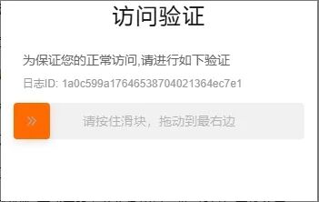

## 目标网站

aHR0cHM6Ly9odW5hbi56Y3lnb3YuY24vbHViYW4vYW5ub3VuY2VtZW50L2xpc3Q=

## 抓包分析

快速点几下翻页即可触发验证

### 第一次请求

4e77\*\*\*.captcha-pro-open.aliyuncs.com

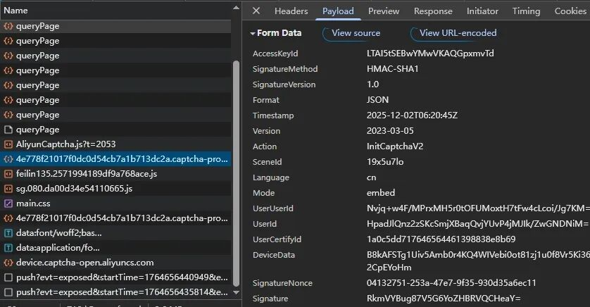

载荷中的参数大部分都是请求 queryPage 接口触发验证的响应中获取的

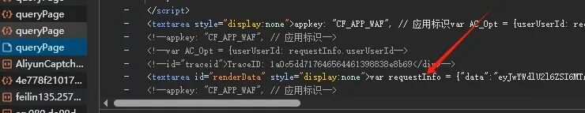

可以从 requestInfo 中提取出来，基本都是固定参数

DeviceData 是设备信息的加密数据

可以搜索关键词定位到加密位置

是个标准的 aes 加密，也可以固定写死

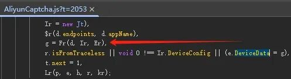

SignatureNonce 是个随机生成的类似uuid

Signature 是数据加密来的后文会分析

响应内容

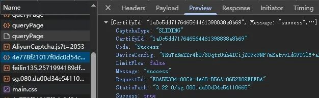

重点在 DeviceConfig

第二次和第三次请求接口地址一样

device.captcha-open.aliyuncs.com

一次是Log2一次是Log3

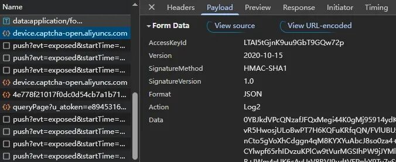

Data参数包含设备信息等进行加密

第四次请求和第一次接口一样

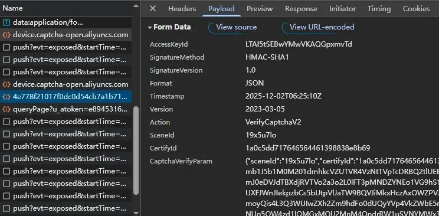

CaptchaVerifyParam 参数包含设备信息和轨迹等进行加密

响应内容中VerifyCode为 T001即表示最终验证通过

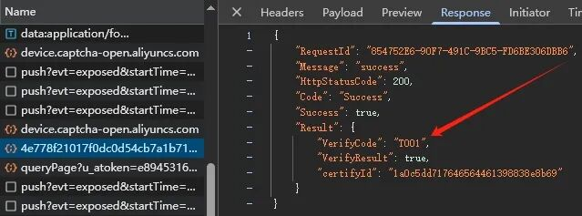

通过之后将 CertifyId 带入请求中即可获取目标数据

u_asig 即 CertifyId

u_atoken 是 requestInfo 中的 token 值

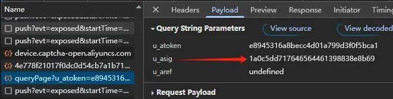

## SignatureNonce

下个xhr断点到触发验证

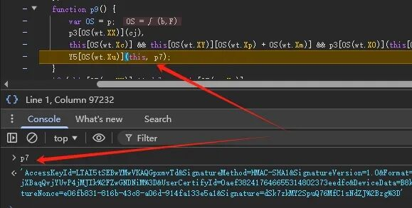

断点位置 p7 参数已全部生成

向上跟栈，进入 AliyunCaptcha.js文件中

跟的步数比较多，耐心点边看边跟着

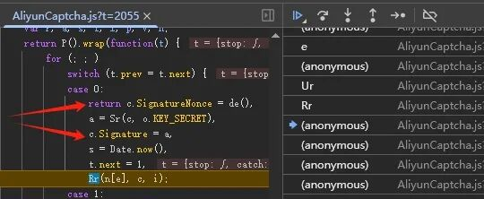

定位到加密位置，很明显暴露出其加密方法

再打上断点跟到这来

这里要说明一下，这个js也是动态的，有个后缀 ?t=

它的值定义方法还是在触发验证的响应中可以找到

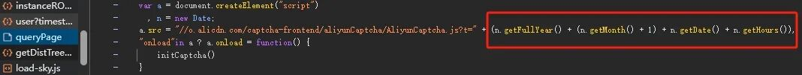

时间计算，一小时内的值是不变的

所以打上断点后只要在当前一小时内或者不重开浏览器还是可以一直调试的

否则历史断点就会没了

想一劳永逸就替换 js 文件吧

SignatureNonce 指向了 de 方法

就是随机生成的，算法直接抠下来就行

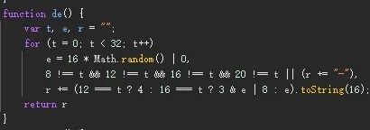

## Signature

再看 Signature 调用了 Sr 方法

两个参数，一个固定字符串作为加密密钥和一个已知所有参数的对象

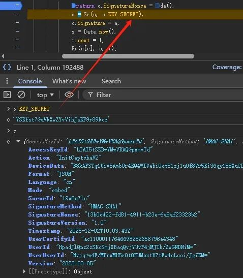

进入 Sr，代码混淆+嵌套控制流

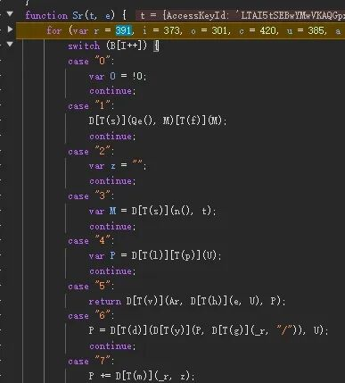

分析下来，实际算法就是个 hmac+base64 编码

将参数和一些字符串拼接进行 url 编码，再进行 hmac 加密

加密后的结果再经过 base64 编码后就是 Signature 了

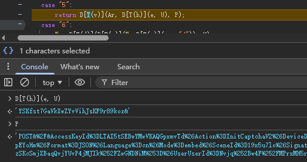

这样第一次请求完事了

接着是第二、三次请求中的Data加密分析

## Data

xhr断点打开继续跳

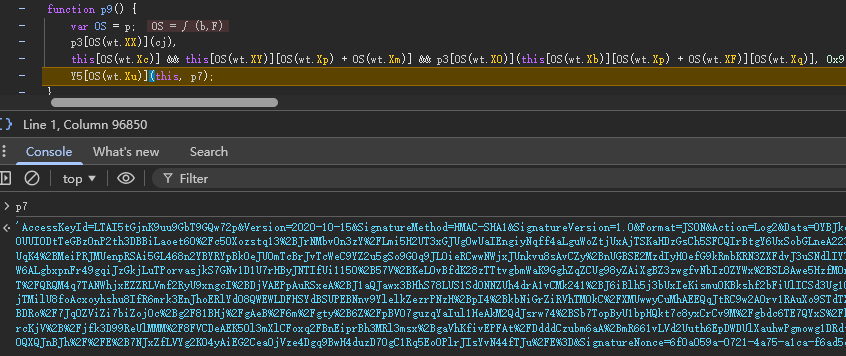

此时已生成Data和其它参数

往上跟栈，这里不太好跟，都是混淆的代码

拉到最前面位置

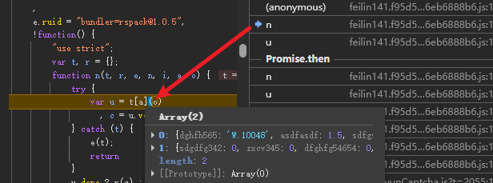

在 feiling.js 文件中定位到一个异步迭代函数的位置

参数是一个数组，里面都是大量的环境检测后的结果

在走两个栈进入一个 s 函数，并且在这里Data生成了

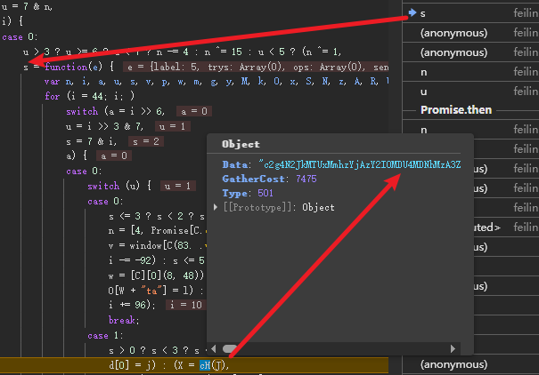

s 函数又是个嵌套控制流+大量三元运算

从头开始分析找 Data 的生成位置太费劲了

这里我们看到 Data 在参数 J 里面

那么我们直接在 s 函数里面找关键字 J[

可以搜到三处位置，那么这三处就是 J 对象里参数赋值位置

需要注意的是 feiling 这个文件也是动态更新的

你调试的时候可能和我这代码不一样

但是逻辑和分析的方式大致是不变的

### GatherCost

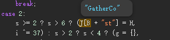

### Type

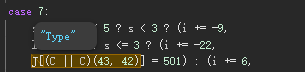

### Data

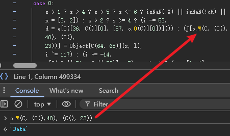

既然 Data 位置找到了，那么下个断点跟过去

这里我跟的 feling 文件就更新了，代码也变了

现在不是 J 而是 R 了

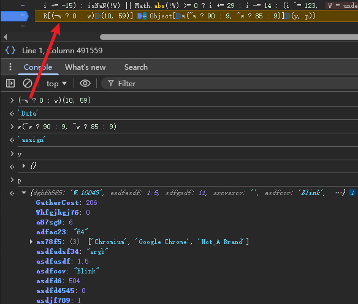

这里只是创建了一个浅拷贝对象，最终要将这些环境加入加密

继续往下走几个循环

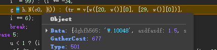

到这会进入一个异步promise

异步执行完后就会生成我们所有要的加密Data

这块调试就要靠耐心了，调到如下位置

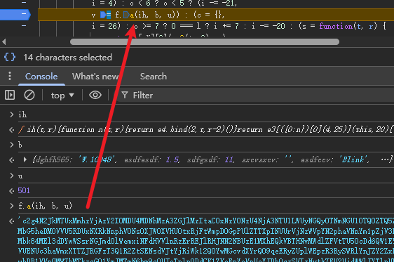

继续调试就会再进入一个控制流

加密逻辑全在这个控制流里面了

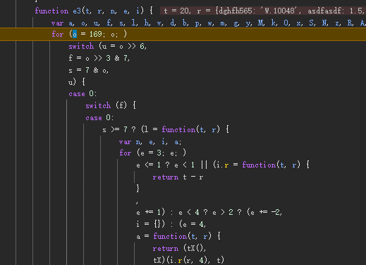

算法就是多重aes加密

每次都变换不同key，iv是固定的

比如

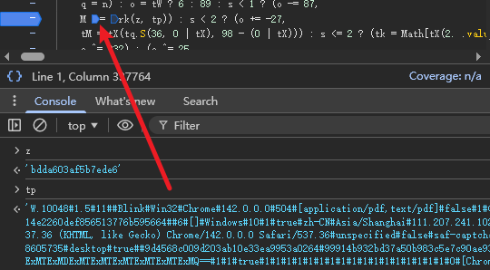

将环境参数进行了拼接

而用到的 key 是哪来的呢

还记得第一次请求响应中的 DeviceConfig 吗

我们需要将它进行aes解密

用的是固定的 key 和 iv

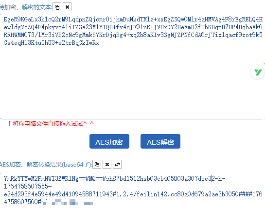

解密完可以看到里面包含了时间戳、feling文件版本和ip等信息

前面的环境对象也会用到里面的一些参数，所以很重要

用井号分割取第一段进行base64解码

证实了这次aes加密的密钥就是这么来的

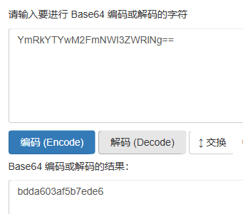

而它固定的key和iv找起来可以用技巧

如果你已经在调试Data加密过程的那么一定会走到如下图位置

否则直接全局搜索关键字 decrypt:

定位到 AliyunCaptcha.js 文件中

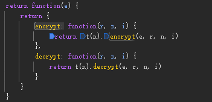

已知算法中会大量调用aes加解密

而这里正是其入口位置

那么我们直接在这下个断点或者插桩

就能看到所有的要加解密的数据和其key、iv

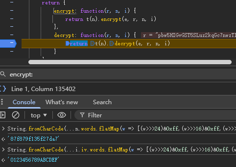

key、iv 是 WordArray 类型

需要再进行一下转换就是明文的了

```
String.fromCharCode(...n.words.flatMap(w => [(w>>>24)&0xff,(w>>>16)&0xff,(w>>>8)&0xff,w&0xff]).slice(0, n.sigBytes))
```

解密结果

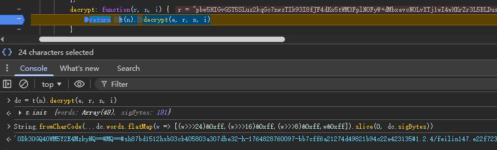

解密后继续调试会进行赋值

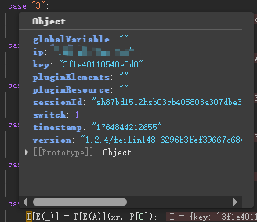

剩余最后一次请求以及一些动态key的生成

我们下篇再继续分析
