# 阿里云验证码 V2 滑块（下）：FeiLin / sg 动态 key 与 CaptchaVerifyParam（deviceToken / data）

> 来源: 微信公众号：無色逆向（[原文](https://mp.weixin.qq.com/s/JvKEU0yb49voNoNL9Ig8iw)）
> 作者: 無色逆向
> 原始发布时间: 2025-12-09
> 归档日期: 2026-09-26
> 分类: web-reverse
>
> 接上篇，讲两个动态 key 和第四次请求。FeiLin 动态 key 进 Log2 `Data` 的环境对象：算法是解密后 `DeviceConfig` 的 `SessionId` 与两个参数两次异或后 base64，这两个参数每个 feilin 文件不同、从大数组解密取出；作者实际用正则补环境，从 `t7`（搜 `ENDPOINTS` 可定位）暴露 key。两个参数写死也能过，但成功率变低。sg 动态 key 用在 `CaptchaVerifyParam`：sg 3.20 后作者以 `void 0` 为锚点暴露，不同大版本匹配方式不同，也可手动收集约百来个版本的 key。`deviceToken` = 环境对象拼接 AES（也用 FeiLin key）→ 组数组（含 `daye,raolewoba!` 字符串）拼接后 MD5 → 再组数组拼接 → base64。`data` = sg 里轨迹（x / y / 时间）经控制流转换、TextEncoder，附加「轨迹 vmp 运算值」与「CertifyId + sg key 的 vmp 运算值」，转数组压缩，再与固定密钥走一遍 vmp 运算。混淆 JS 里定位加密可 hook `JSON.stringify`、`TextEncoder`、`btoa` / `atob` 打堆栈。

## 收录说明

原文标题「阿里V2滑动验证码算法分析-下篇」，2025-12-09 08:26（UTC+8）发布，公众号标注原创，上篇见 [aliyun-captcha-v2-slider-part1-request-chain.md](./aliyun-captcha-v2-slider-part1-request-chain.md)。归档时用公开文章 URL 纯 HTTP 拉取（桌面 Chrome UA，无需登录、未遇验证页），`#js_content` 转 Markdown。16 张图已下载到 `web-reverse/aliyun-captcha-v2-slider-part2-dynamic-keys/`。原文小标题是普通段落，归档时把「声明 / 前言 / feilin文件动态key / sg文件动态key / CaptchaVerifyParam / 结果验证」提为二级标题。原文「以vold 0作为关键点」按上下文是 JS 的 `void 0`，已改正。其余文字未改，文中 feilin / feiling / feling 混写照原文保留。文末没有推广内容，无删节。

作者没公开压缩算法名、vmp 运算细节、固定密钥和 `t7` 的正则匹配代码。截图里的 `sceneId`、`appName` 与 `deviceData.v78d98s` 值是作者当次调试的样本。

相关地图：

| 主题 | 文档 |
|------|------|
| 本文上篇：四次请求链、Signature 与 DeviceConfig 多重 AES | [aliyun-captcha-v2-slider-part1-request-chain.md](./aliyun-captcha-v2-slider-part1-request-chain.md) |
| 阿里云验证码 V2（callback-proof 状态机，sg / FeiLin 当轮绑定） | [aliyun-captcha-v2.md](./products/aliyun-captcha-v2.md) |
| 阿里云验证码总览 | [aliyun-captcha.md](./products/aliyun-captcha.md) |
| 阿里云验证码 V3 登录滑块（deviceToken AES+MD5 同族） | [aliyun-captcha-v3-login-slider.md](./aliyun-captcha-v3-login-slider.md) |
| 飞林 FeiLin 设备指纹与反 Hook | [51job-anti-detection-analysis.md](../anti-detection/51job-anti-detection-analysis.md) |
| 补环境浏览器对象面 | [browser-env-objects.md](./browser-env-objects.md) |

## 声明

本文章中所有内容仅供学习交流使用，不用于其他任何目的，严禁用于商业用途和非法用途，否则由此产生的一切后果均与作者无关！若有侵权，请联系公众号【無色逆向】删除。

## 前言

前文再续，书接上回

上篇文章中将四次请求的前三次分析完了

接下来将分析最后一次请求以及动态key的生成逻辑

## feilin文件动态key

上篇说到 Data 参数是由收集的环境对象加密而来

环境对象中有个参数是动态的由 feilin 文件中生成

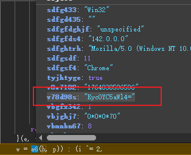

一般用以下两种方法获取

1、写ast代码提取

2、写正则补环境暴露出来

我自己用的是第二种方式

但是呢，我也把算法还原出来了

其实就是取解密后的 DeviceConfig 里的 SessionId

和两个参数进行两次异或操作后转base64

而与之异或的参数也是动态的

在每个feilin文件中的值不一样

都是从大数组解密取出来的

奇怪的是我把它异或的两个参数也写死竟然也还能校验成功

但是成功率感觉比动态获取的会下降一些，难绷，不知道校验了个啥

简单说下我这动态获取的逻辑

需要找到这个t7，不同版本不一样，搜ENDPOINTS匹配到也行

从t7里可以将动态key暴露出来

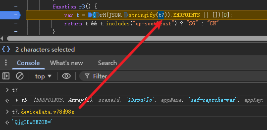

## sg文件动态key

sg文件生成的 key 在第四次请求的参数 CaptchaVerifyParam 中会用到

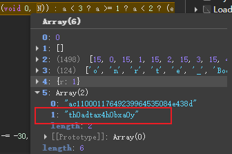

在sg3.20版本后我是以 `void 0` 作为关键点来暴露key

不一定要用我的方法，可能还要更容易的方法自己去找

不同大版本匹配的方法不同

这个比feilin文件key还要难匹配来搞自动获取

有大毅力者可以去手动收集每个版本对应的key

一般就是百来个，收集完应该能用个把月等再更新

## CaptchaVerifyParam

CaptchaVerifyParam 对象中有两个加密参数需要分析

deviceToken 和 data

deviceToken比较简单，也用了aes加密

那么和上篇一样在 encrypt 处断点看信息

打好断点后滑动验证码

跳几次看到一大串环境加密内容如下图格式就对了

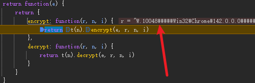

然后往前看堆栈

很明显又是一个大环境对象进行拼接加密和 Data 的加密类似

注意里面也用了feilin的key

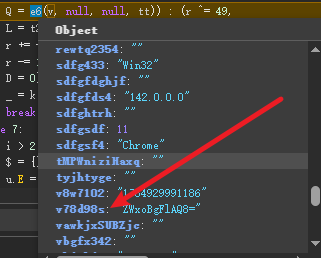

加密完成后继续往下走

这里会组一个数组，包含刚才加密的环境

还会看到著名的梗来源

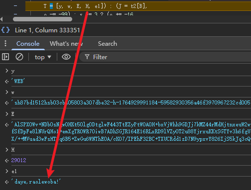

再之后将数组拼接成字符串后用md5再加密一遍

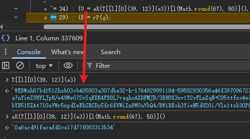

然后再组数组再拼接一次

最后base64编码一下就是最终的 deviceToken 了

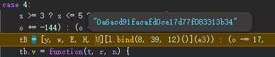

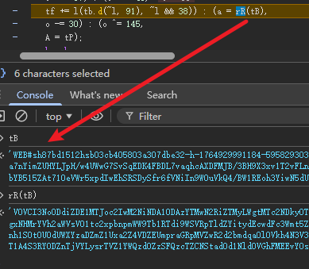

data 主要是对轨迹信息进行加密

那么需要先找到对轨迹收集的位置

可以对鼠标事件加个监听

当 js 文件有混淆且你并想花时间解混淆无法用关键字搜索时

那就需要灵活运用 hook 功能了

可以对常用一些方法进行监听

比如对象序列化 JSON.stringify

编码转换 TextEncoder、btoa、atob等

输出堆栈信息来定位加密的可能位置

轨迹的加密是在sg文件中处理的

可以看到现在是正常的轨迹数据带x、y坐标和时间轴

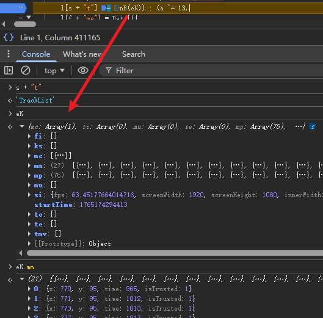

又经过一个控制流处理转换后

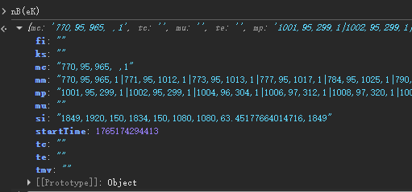

再用TextEncoder转换

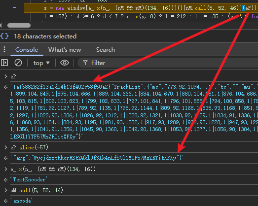

这里发现除了轨迹外还多了两个参数

前面一个是对轨迹走一个vmp运算

后面一个是用 CertifyId 和 sg 的动态 key 走一个 vmp 运算

转换成数组后再进行压缩算法

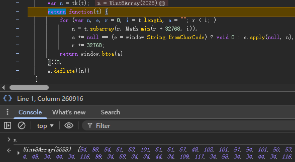

压缩完后和一个固定密钥再走一个vmp运算

你要想知道vmp运算是咋样的，就是这样的，大量运算出栈入栈

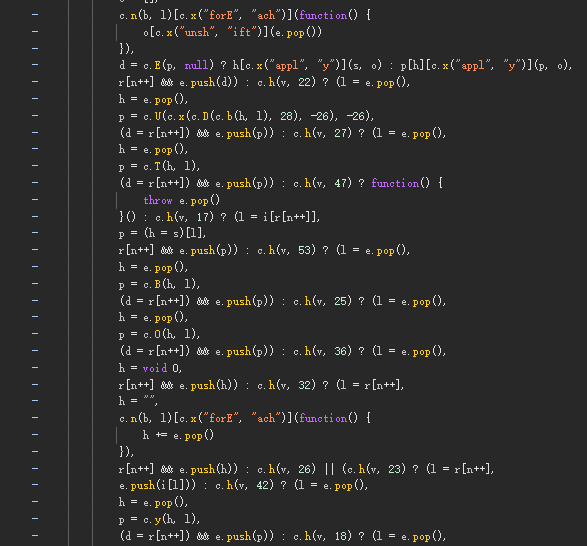

得到最终的data

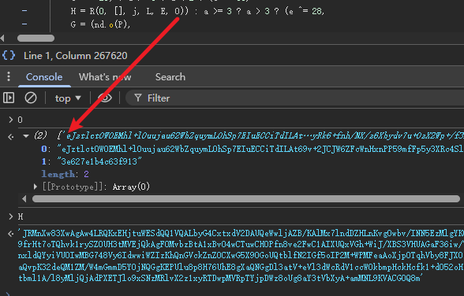

## 结果验证

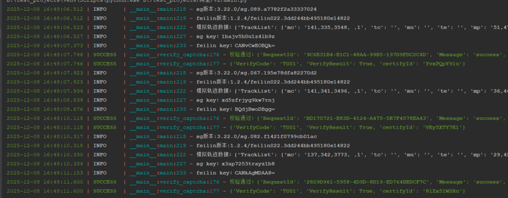
