# 阿里云验证码 V3 登录滑块：InitCaptchaV3 / Log2 / VerifyCaptchaV3 参数链

> 来源: 微信公众号：搞窜窜学逆向（[原文](https://mp.weixin.qq.com/s/XtZHmacv8Nr2jcBafZ4GXw)）
> 作者: 小张学逆向
> 原始发布时间: 2026-09-23
> 归档日期: 2026-09-26
> 分类: web-reverse
>
> 阿里云验证码 V3 登录滑块一轮五个包：InitCaptchaV3、UploadLog、Log2、Log3、VerifyCaptchaV3；实测 UploadLog 与 Log3 可不发。InitCaptchaV3 三个动态参数：`DeviceData` 为固定 key/iv 的 AES，`SignatureNonce` 为类 UUID 随机值，`Signature` 为请求体 `&` 拼接（前面另拼两个字段）后 HmacSHA1；响应密文同样 AES 解密，内含动态 FeiLin 脚本地址。Log2 的 `data` 是 `#` 拼接字段的 AES，其中指纹段由 `window.FEILIN.initFeiLin(Br, r)` 动态脚本生成，作者用补环境出值。VerifyCaptchaV3 的 `CaptchaVerifyParam`：`deviceToken` 为补环境值 AES（内含一步 MD5），`data` 为轨迹压缩转 Base64 后再加密、btoa，扣代码出值。

## 收录说明

原文标题「逆向分析：阿里v3 登录滑块」，2026-09-23 21:36（UTC+8）发布，公众号标注原创，摘要「阿里v3登录滑块逆向分析」。归档时用公开文章 URL 纯 HTTP 拉取（桌面 Chrome UA，无需登录、未遇验证页），`#js_content` 转 Markdown。原文以截图为主，45 张图已从 mmbiz CDN 下载到 `web-reverse/aliyun-captcha-v3-login-slider/`，不再依赖外链。正文文字按原样保留，包括作者的分节编号（两处「3.」）和口语表述。

作者没有公开 AES key/iv、`Signature` 前面拼接的两个字段、轨迹压缩与最终加密的扣码细节，也没给补环境代码；截图里的 `AccessKeyId` 是验证码前端公开下发的客户端标识。复现时把本文当定位路线，不是可直接投产的参数实现。

相关地图：

| 主题 | 文档 |
|------|------|
| 阿里云验证码 V3（direct-verify / CHECK_BOX）命中特征与 Action 链 | [aliyun-captcha-v3.md](./products/aliyun-captcha-v3.md) |
| 阿里云验证码 V2 | [aliyun-captcha-v2.md](./products/aliyun-captcha-v2.md) |
| 安全产品命中索引 | [products.md](./products.md) |
| 飞林 FeiLin 设备指纹与反 Hook | [51job-anti-detection-analysis.md](../anti-detection/51job-anti-detection-analysis.md) |
| 补环境浏览器对象面 | [browser-env-objects.md](./browser-env-objects.md) |

目标：阿里v3登录滑块

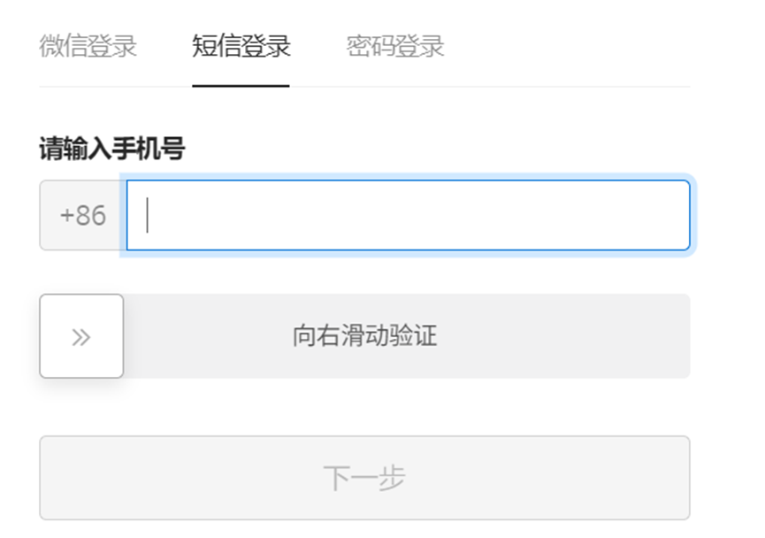

1. 先看过程，一共五个包

一个加载初始化提交包、upload 加载log包提交、Log2包、Log3包、验证包。

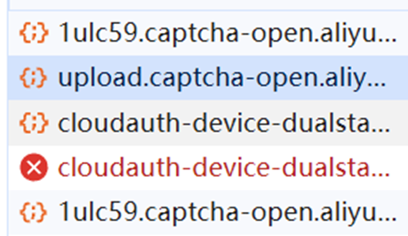

其中的Log3和upload可以不用提交，Log3验证方法如下，而upload直接屏蔽请求就行，发现验证包还是能正确发送请求。

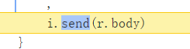

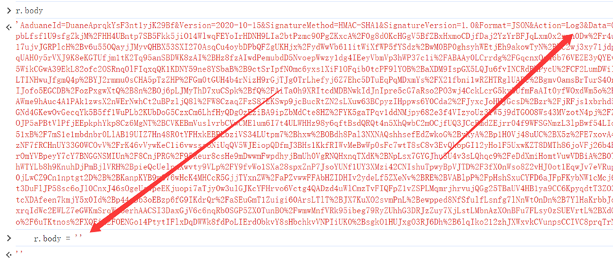

所以我们只只需要加载初始化提交包、Log2包、验证包这三个。

2. 初始化提交包，三个动态参数

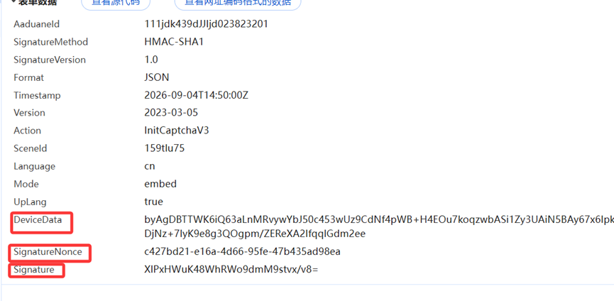

DeviceData，直接搜索断点

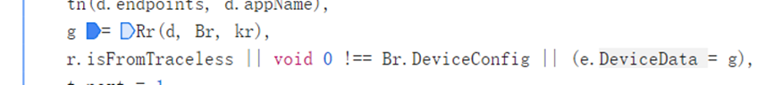

记录一下传入参数，跟进去分析，发现c的值有点像base4或者是aes

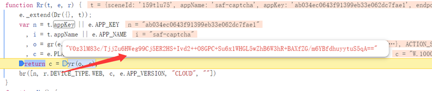

Base64解密不对，那就有可能是aes，然继续跟进去

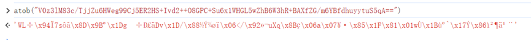

跟到这里，发现aes加密很明显了

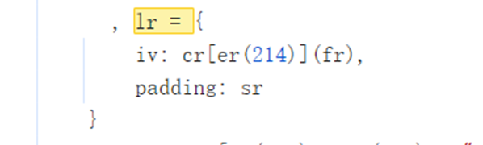

Iv是固定的

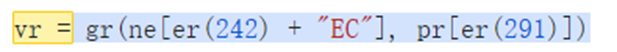

Br跟yr是一样的跟的时候就能发现，这里就不多说了

Key也是固定值

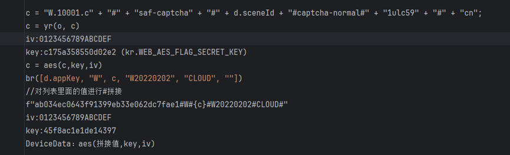

SignatureNonce：直接搜索断点

发现就是一个随机类似uuid的值

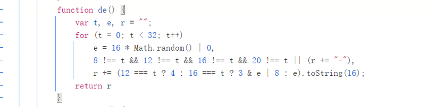

然后下面就是Signature值，直接断住

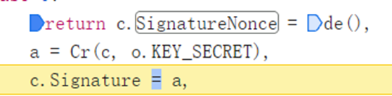

跟进去，直接断住最后两步。

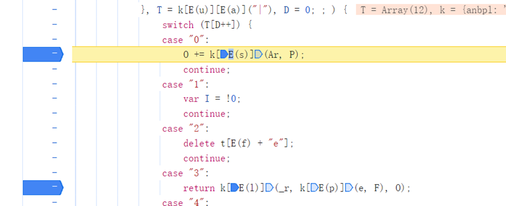

P值就是请求体&拼接起来

然后进入case3

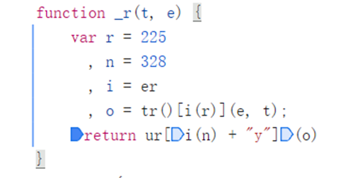

进入这个函数，然后再跟进去k[E(s)]这个函数，发现是HmacSHA1加密，在加密前还拼接了两个字段，我就不说了，可以自己跟栈发现。

三个参数都能正常生成值后，发现也能请求到正常的数据

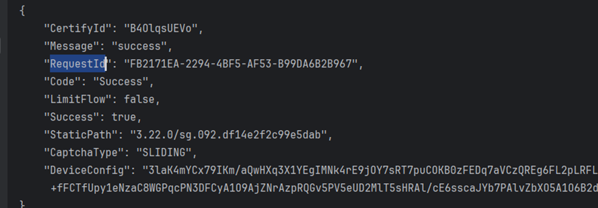

返回数据有个加密值，发现不是base64，那可能是aes解密吗，因为我们之前就是aes加密，在decrypt这断点。

诶，你猜怎么着，真断住了

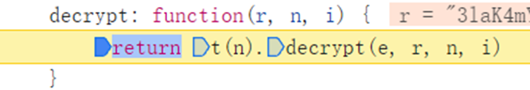

Key和iv就自己转了。继续往上跟栈，到这

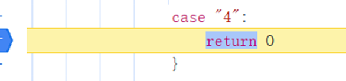

将解密的值转为了这样的字典，我们也将解密值转一下得到

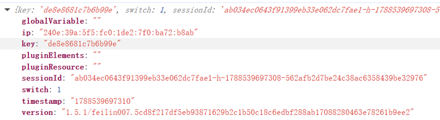

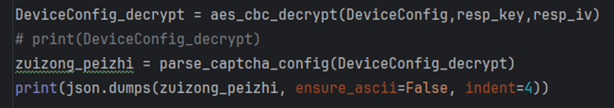

得到最终的返回的信息值

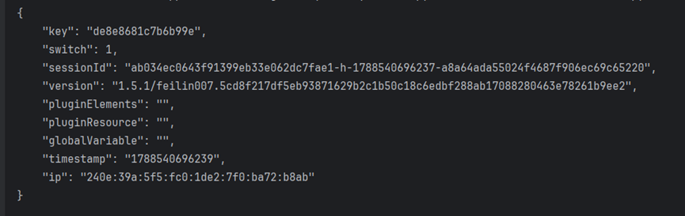

3. Log2包，3个参数，这里只说data，其它两个同上，找到key就行

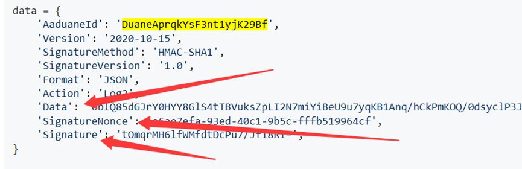

Data会不会是也是aes解密，我们直接插桩hook

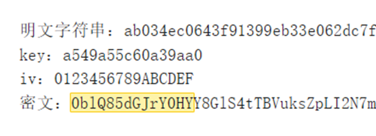

根据日志发现，data确实是aes加密

然后解密发现

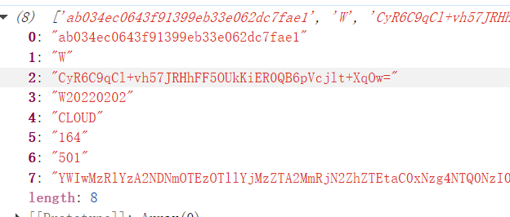

由这几个函数#拼接而成，2的值插了桩很容易看到生成值，看7，它可以先base4解码，这几个值的来源都可以通过插桩日志看到来源，我们主要看1

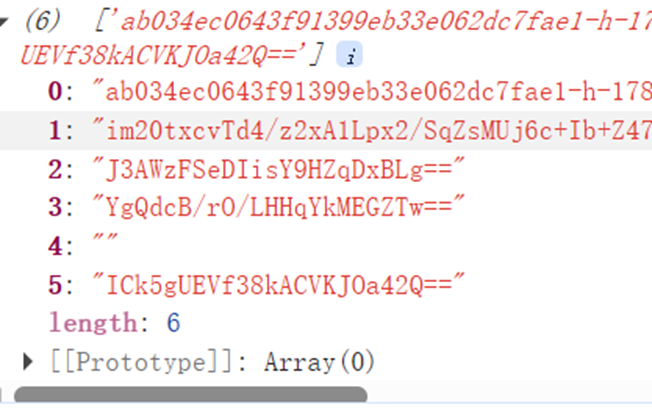

它是由指纹拼接且加密而来，我们要找到在上面地方拼接的，原字符串是#拼接，我们就直接hook拼接的值。成功断住，我们现在找值怎么来的就行了。

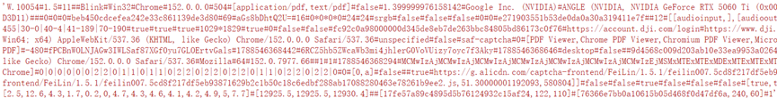

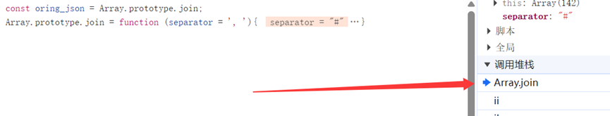

值最后是通过返回的js文件加密来的，这个js文件是动态的，链接是我们初始返回值解密得来的

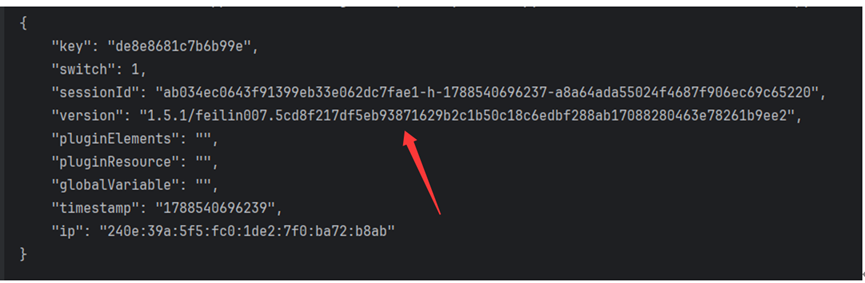

文件通过window.FEILIN.initFeiLin(Br, r)加载传递参数，然后返回指纹值

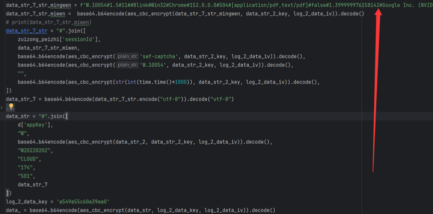

我是通过补环境实现的，检测点比较多，所以多补了一点

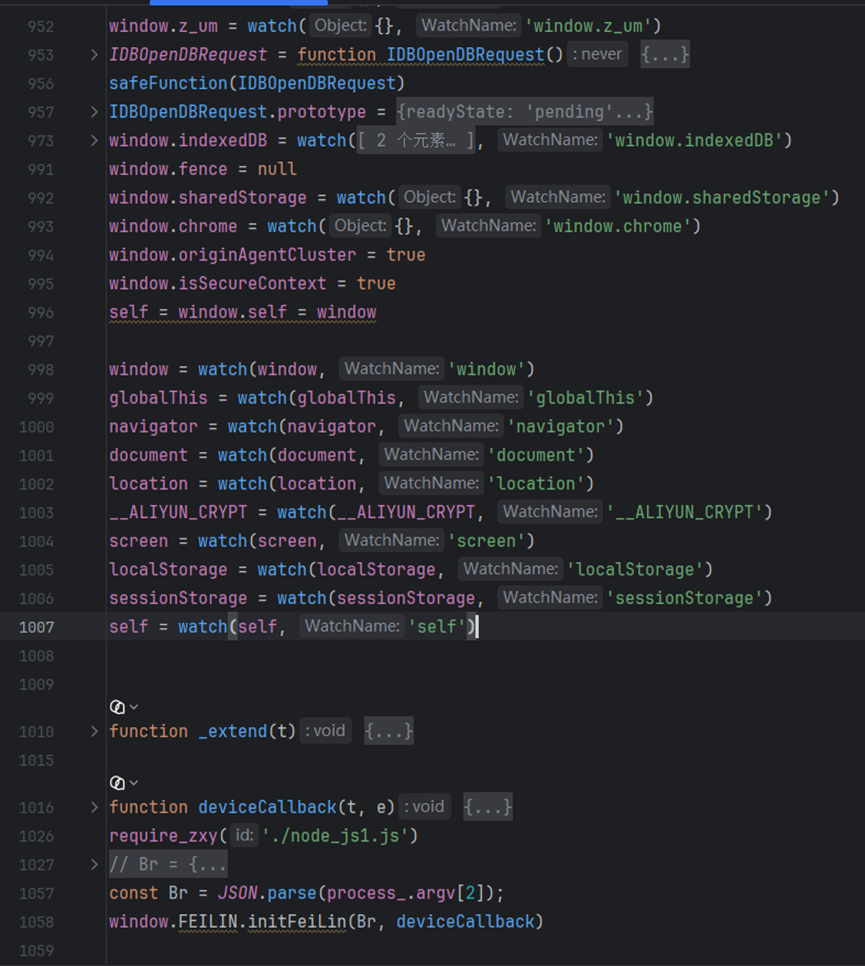

最终也是请求成功了

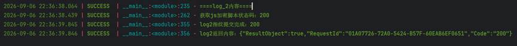

3．提交验证

请求参数SignatureNonce和之前的一样、Signature还是去找密钥、CertifyId是第一次请求返回的值。我们主要看CaptchaVerifyParam这个参数加密过程

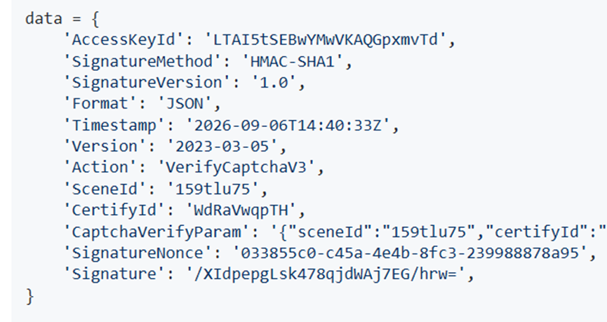

CaptchaVerifyParam的deviceToken参数就是对之前补环境出的一些值进行一个aes加密，然后里面还要一个MD5加密，可以直接hook，看明文。

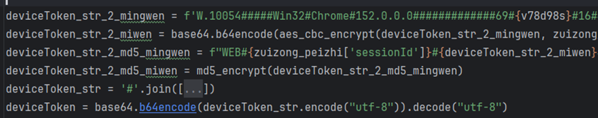

CaptchaVerifyParam的data,它既不是aes也不是base64，但是一般加密结果都会进行一步btoa，我们直接搜索断点

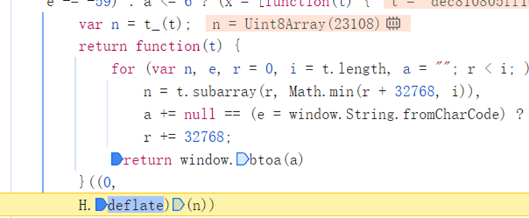

这里断住了

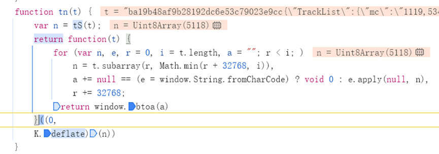

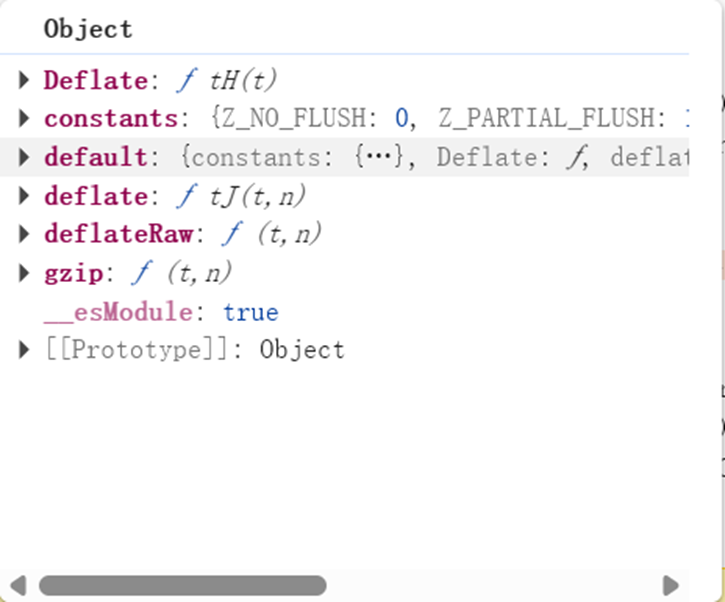

T主要就是一个轨迹，经过一个压缩算法转base64，然后继续下一步，看看进行了什么步骤,

跟到这里发现，传入的H就是我们压缩转换后的值，然后经过加密生成了我们最终的data值，直接扣代码

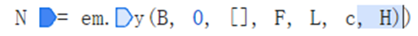

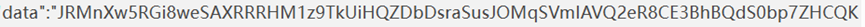

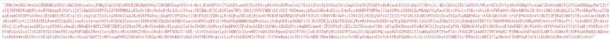

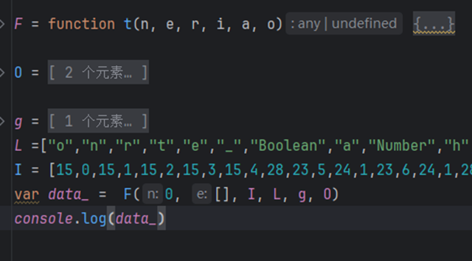

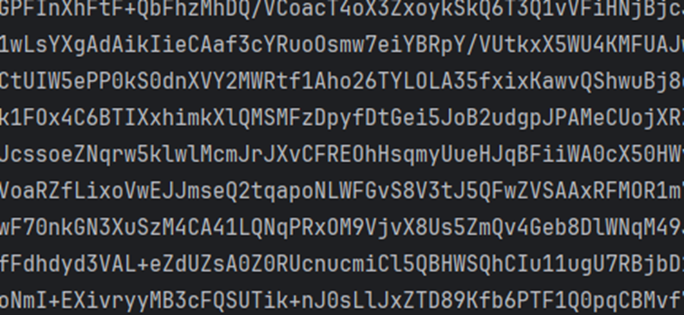

代码一扣直接出值。最后也是请求成功了

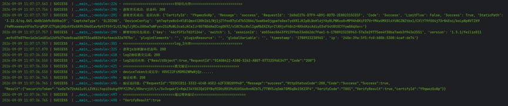

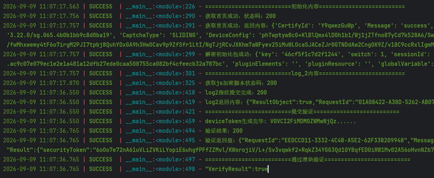
