# 亚马逊 AWS WAF aws-waf-token 纯算：checksum CRC32、Present AES-GCM 与 solution SHA256 PoW

> 来源: 微信公众号：無色逆向（[原文](https://mp.weixin.qq.com/s/Ik7LgaFIpJR_KCWinc5y3w)）
> 作者: 無色逆向
> 原始发布时间: 2026-01-21
> 归档日期: 2026-09-26
> 分类: web-reverse
>
> 某航司官网登录受 AWS WAF 保护：删掉 `aws-waf-token` Cookie 再登录返回 403，带有效 token、输错口令返回 401，据此判断 token 是否生效。token 由 `verify` 接口返回，请求体有 `challenge`（首次取自 `challenge.compact.js`，也可从 `inputs` 接口拿）和需要逆向的 `checksum` / `Present` / `solution`。全部逻辑都在 `challenge.compact.js`（多个大数组 ob 混淆）：异步采集环境指纹后，`encode` 即 CRC32 得 `checksum`，并与环境串拼接；`Present` = `base64(iv) + "::" + AES-GCM(checksum+环境)`，key 固定、iv 随机；`solution` 先把 `inputs` 与 `checksum` 相加，再做 SHA256 工作量证明，找使哈希前 8 个二进制位全为 0 的值。作者用 Python 纯算跑通，错误口令登录拿到 401。

## 收录说明

原文标题「某航司亚马逊aws-waf-token算法逆向分析」，2026-01-21 18:07（UTC+8）发布，公众号标注原创。归档时用公开短链纯 HTTP 拉取（桌面 Chrome UA，无需登录、未遇验证页），`#js_content` 转 Markdown。25 张图已下载到 `web-reverse/aws-waf-token-challenge-purecalc/`。原文小标题是普通段落，归档时提为 Markdown 标题（前言 / AWS WAF令牌简介 / 逆向目标 / 抓包分析 / 逆向分析 / 结果验证为二级；checksum / Present / solution 为三级），正文文字未改。转换脚本原先会丢掉「令牌特性」下面那组二级列表（公众号把子列表直接挂在列表下），已修脚本补回 5 条。原文开头的小节就叫「前言」，内容是免责声明。文末「END」之后三行是作者求关注、说私信被屏蔽的互动语，本库此前收录的無色逆向文章没有删节先例，照原文保留。

作者没公开 AES-GCM 的固定 key 和纯算代码；目标站点地址是作者写的 base64。结果截图里的 `inputs`、`checksum`、`Present`、token 是作者样本值，登录请求用的是随意输入的错误账号密码。

相关地图：

| 主题 | 文档 |
|------|------|
| 安全产品命中索引 | [products.md](./products.md) |
| 纯算 vs 预言机成本账 | [purecalc-vs-oracle-cost.md](./purecalc-vs-oracle-cost.md) |
| 补环境浏览器对象面 | [browser-env-objects.md](./browser-env-objects.md) |
| 同作者：WASM 解密一句话交给 AI 还原 | [wasm-decrypt-ai-one-prompt-recovery.md](./wasm-decrypt-ai-one-prompt-recovery.md) |

## 前言

本文章中所有内容仅供学习交流使用，不用于其他任何目的，严禁用于商业用途和非法用途，否则由此产生的一切后果均与作者无关！若有侵权，请联系公众号【無色逆向】删除。

## AWS WAF令牌简介

AWS WAF（Amazon Web Services Web Application Firewall）是 亚马逊云提供的一种 Web 应用层防火墙服务，主要用来保护 Web 应用和 API 不被常见的网络攻击影响。

AWS WAF 令牌是 AWS WAF 智能威胁缓解所提供的增强保护中不可或缺的一部分。令牌（有时也称为指纹）是有关单个客户端会话的信息集合，客户端存储这些信息并在发送的每个 web 请求中提供。AWS WAF 使用令牌识别恶意客户端会话并将其与合法会话区分开来，即使两者都来自一个 IP 地址。使用令牌给合法用户带来的成本可以忽略不计，但对于僵尸网络来说，大规模使用令牌的成本却很高。

每个令牌都具有以下特性

- 令牌存储在名为 aws-waf-token 的 Cookie 中。
- 令牌已加密。
- 该令牌使用包含以下信息的粘性粒度标识符对客户端会话进行指纹识别：
  - 客户端最近一次成功响应静默质询的时间戳。
  - 最终用户最近一次成功响应验证码的时间戳。仅当您在保护中使用验证码时，才会出现这种情况。
  - 有关客户端和客户端行为的其他信息，可帮助将合法客户端与不想要的流量区分开来。这些信息包括可用于检测自动活动的各种客户端标识符和客户端信号。收集的信息不是唯一的，无法映射到个体上。
  - 所有令牌都包含来自客户端浏览器查询的数据，例如自动化和浏览器设置不一致的迹象。此信息由 Challenge 操作运行的脚本和客户端应用程序软件开发工具包检索。脚本会主动询问浏览器并将结果放入令牌中。
  - 此外，在实施客户端应用程序集成软件开发工具包时，令牌包括被动收集的有关最终用户与应用程序页面交互的信息。交互包括鼠标移动、按键以及与页面上存在的任何 HTML 表单的交互。这些信息有助于 AWS WAF 检测客户端中的人机交互程度，以质询看似不是人类的用户。有关客户端集成的更多信息，请参阅 AWS WAF 中的客户端应用程序集成。

## 逆向目标

目标网站：

aHR0cHM6Ly93d3cucnlhbmFpci5jb20vY24vemg=

逆向目标：

还原 token 算法进行协议登录

## 抓包分析

点击页面右上角登录按钮后会弹出登录框

在这期间 token 也已经生成了

在控制台里可以看到

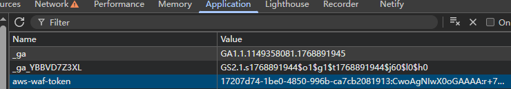

试着随便输入账号密码登录

登录接口会返回响应内容提示账号密码有问题

且响应状态码为 401

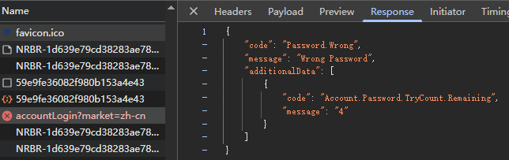

接着我们从控制台将 aws-waf-token 这个 cookie 删除掉再登录试试

这时候登录接口会返回403

说明在我们进行登录的时候这个 token 是必不可少的

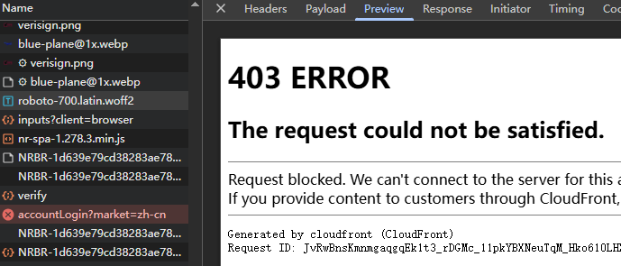

token 实际是从 verify 接口返回的

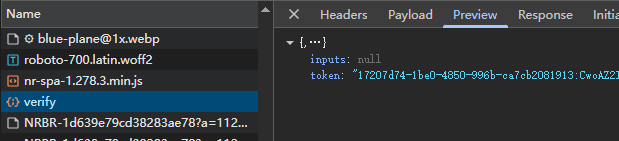

看请求体

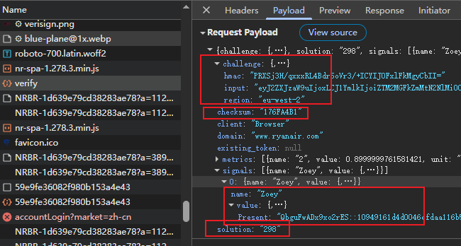

challenge：首次是从 challenge.compact.js 中获取

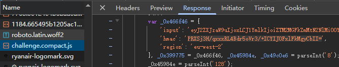

实际也可以从 inputs 接口来获取

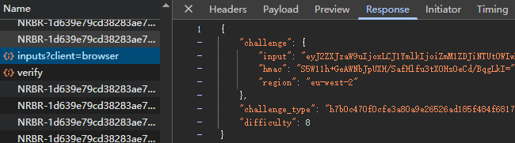

checksum、Present、solution都是加密的就需要逆向来获取了

## 逆向分析

### checksum

全局搜索可以看到相关位置都是在 challenge.compact.js 文件中

实际所有的加密逻辑都是在这个 js 中实现的

所以要补环境的话直接拿这个 js 下来就行

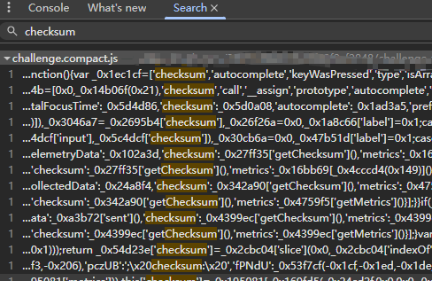

搜出来的位置太多了啊有19处咋办

要么靠经验要么笨办法在可能的位置都打上断点一个个看

分析后可知实际位置如图

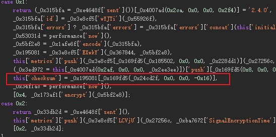

虽然是混淆的文件，但是也能看到很多明文的重要信息

多个大数组 ob 混淆，本来我是想补个环境玩玩得了，所以我尝试进行了反混淆，先还原了最外面的一层，看完还原后的代码，我觉得算法应该也不会很花时间的样子，于是我就不想继续还原剩余的了，直接搞算法了

回到主题，先在第一行打上断点过去

异步方法获取了一些环境信息，想来应该就是加密这些指纹了

老登们都能一眼看出来取的什么值

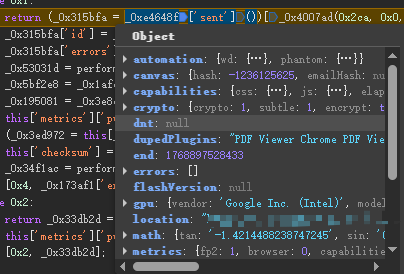

接着往下走这里经过了一个 encode 方法

返回了 checksum 和环境进行了一个拼接

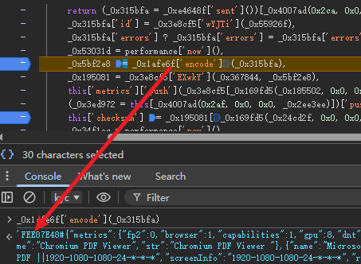

进入 encode 方法

分析下来实际就是个 crc32

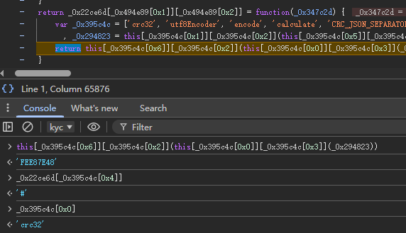

找个网站试试确认无误

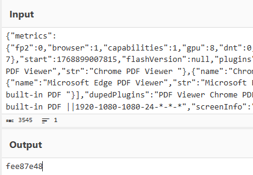

### Present

还是在上面的代码位置

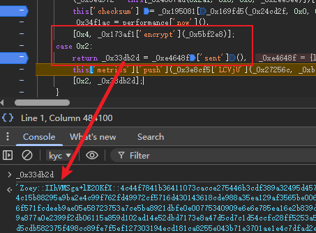

这里又是一处异步调用使用 encrypt 方法

传入 checksum 和环境拼接的字符串作为参数

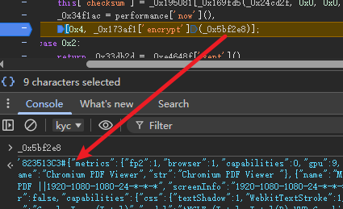

进入 encrypt 方法

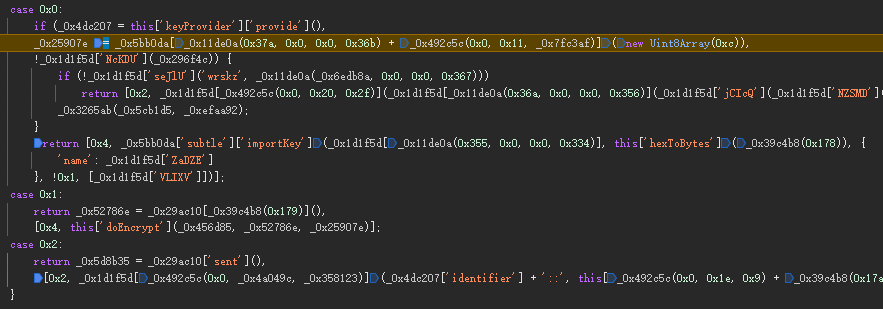

分析下来是个 aes-gcm 加密

key 是固定的，iv 是随机的

最后进行拼接

就是 base64(iv) + "::" + aes-gcm(环境)

### solution

还是全局搜索定位到如图位置

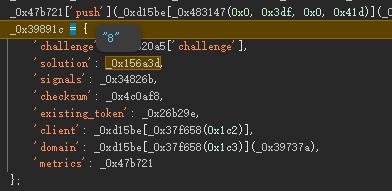

已经生成了，那么往上找找

又是一个异步调用生成的

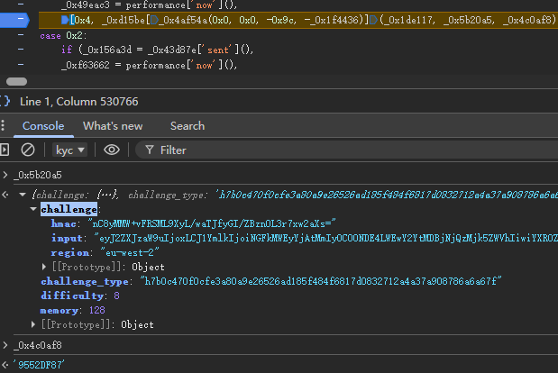

调用 _0x1de117 方法有两个已知参数

challenge 和 checksum

进入 _0x1de117 方法到方法底部

这里连续的异步容易绕晕，一定多打断点慢慢跟

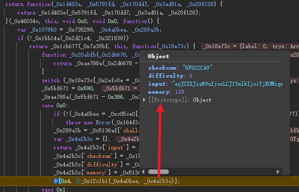

已知的参数，再进入 _0x12c1b1 方法

即可找到关键加密位置

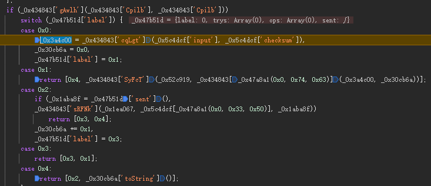

第一步：将 inputs 和 checksum 进行相加

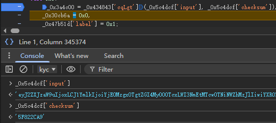

第二步：sha256 的工作量证明算法，通过不断尝试不同的 solution 值，直到找到一个使 SHA256 哈希结果的前8位二进制都为0的值

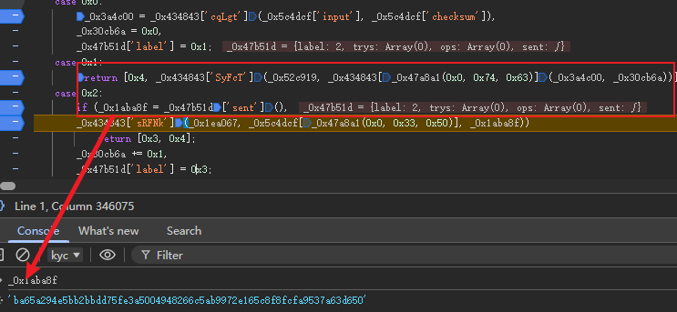

最终结果 solution

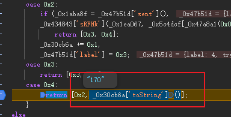

## 结果验证

python 纯算实现

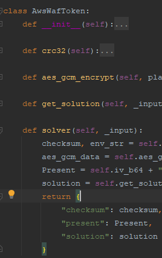

随便输入错误账号密码接口提示账号密码错误且

返回状态码401就说明 token 正确了

有账号的不要频繁登录，有风控滴

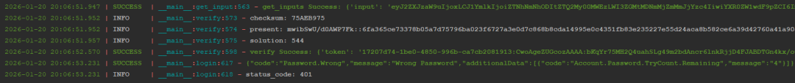

END

兄弟们可以点个关注

还有啥想看的可以评论区留言或者私信我

有些兄弟的私信触发了官方的规则被屏蔽了我这没看到啊
