# hCaptcha 无感验证补环境：hsw.js / WASM 出 n 值的入口定位与环境检测点

> 来源: 微信公众号：無色逆向（[原文](https://mp.weixin.qq.com/s/Ts4CGskbT6CgRIJkc2efDg)）
> 作者: 無色逆向
> 原始发布时间: 2026-01-14
> 归档日期: 2026-09-26
> 分类: web-reverse
>
> 以 Steam 注册页为 demo。链路：`hcaptcha.html`（`v1/` 后是版本号，约一周一更）→ `checksiteconfig`（`siteKey` 各站唯一，响应里的 `c.req` 是 JWT）→ `hsw.js` → 最终校验接口，请求体和响应体都是 ArrayBuffer；改 `hcaptcha.html` 两处（序列化位置、头部 CSP 只留 worker）可以让它走明文 JSON。载荷有 `v` / `sitekey` / `host` / `hl` / `pdc` / `pem` / `c` / `motionData` / `n`，响应 `generated_pass_UUID` 以 `P1` 开头即通过。`n` 的入口：xhr 断点 → 沿 Promise 链反跟 `l ← s ← e.proof` → `Promise.all` 迭代里的 `xr` → `n(i.req, o)` 进入 `hsw.js`，先解码 JWT，再由 `aG` 加载 WASM。插桩点有两处大数组：`kc.Ob` → `fm`（WASM 导出）里 `Mv` 的数组，和首参为数字串的检测函数写入的环境数组，都用来对照本地与浏览器差异。检测点：RTCPeerConnection、RTCRtpSender / RTCRtpReceiver、OfflineAudioContext、WebGL2RenderingContext、函数描述符（`"prototype" in AudioBuffer.prototype.getChannelData`，要用箭头函数）、Math 精度差异、字体与 canvas 指纹、Worker / SharedWorker。作者补了三千多行；环境不过会返回验证码图片链接。

## 收录说明

原文标题「hCaptcha无感逆向分析-补环境」，2026-01-14 17:27（UTC+8）发布，公众号标注原创。归档时用公开短链纯 HTTP 拉取（桌面 Chrome UA，无需登录、未遇验证页），`#js_content` 转 Markdown。54 张图已下载到 `web-reverse/hcaptcha-invisible-hsw-env-patch/`。原文小标题是普通段落，归档时提为 Markdown 标题（声明 / 前言 / hCaptcha简介 / 目标网站 / 抓包分析 / 逆向分析 / 插桩分析点 / 补环境 / 结果验证为二级；四个接口和九个检测点为三级），正文文字未改。

作者没公开补环境代码。截图里的 JWT、`generated_pass_UUID`、`sitekey` 是作者调试 Steam 注册页时的样本值，JWT 是 hCaptcha 下发的短时挑战数据。

相关地图：

| 主题 | 文档 |
|------|------|
| 腾讯滑块 TDC 补环境（同样检测 RTCPeerConnection / canvas） | [tencent-tdc-slider-vmp-part1-env-patch.md](./tencent-tdc-slider-vmp-part1-env-patch.md) |
| 补环境浏览器对象面 | [browser-env-objects.md](./browser-env-objects.md) |
| iv8：Python 调 V8 的浏览器环境 | [iv8-python-v8-browser-env.md](./iv8-python-v8-browser-env.md) |
| KhBox 补环境笔记合集 | [koohai-reverse-notes-compilation.md](./koohai-reverse-notes-compilation.md) |
| 安全产品命中索引 | [products.md](./products.md) |

## 声明

本文章中所有内容仅供学习交流使用，不用于其他任何目的，严禁用于商业用途和非法用途，否则由此产生的一切后果均与作者无关！若有侵权，请联系公众号【無色逆向】删除。

## 前言

补环境难度还得看国外的盾，千八百个环境检测，想补出来得把屁股坐烂，我补了三千多行的代码

还有特别多的异步调用绕晕你

本文主要阐述逆向分析的过程以及补环境中的一些检测点

## hCaptcha简介

hCaptcha 是一种现代、隐私优先的人机验证（CAPTCHA）服务，旨在帮助网站和应用程序区分真实用户与自动化机器人（如爬虫、垃圾邮件发送器或恶意脚本），从而有效防止滥用、欺诈和数据抓取等安全威胁。自2018年推出以来，hCaptcha 已成为全球众多企业、政府机构及开发者的首选验证解决方案，尤其因其对用户隐私的高度重视而广受认可。

官网：https://www.hcaptcha.com

开发者文档：https://docs.hcaptcha.com

## 目标网站

https://store.steampowered.com/join

## 抓包分析

本次分析的 demo 网站为 steam 账号注册页面

打不开的话需要用梯子或者cdn加速工具

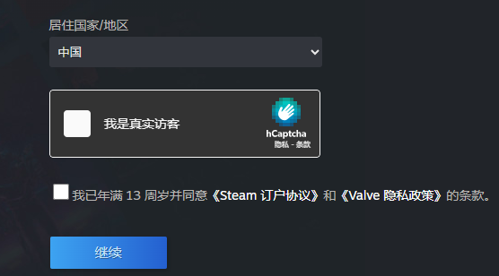

正常勾选验证后，如果本地环境干净的话可以直接无感验证通过

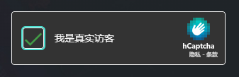

未通过则会弹出验证码

验证码有非常多的类型，不是拖拽就是点击

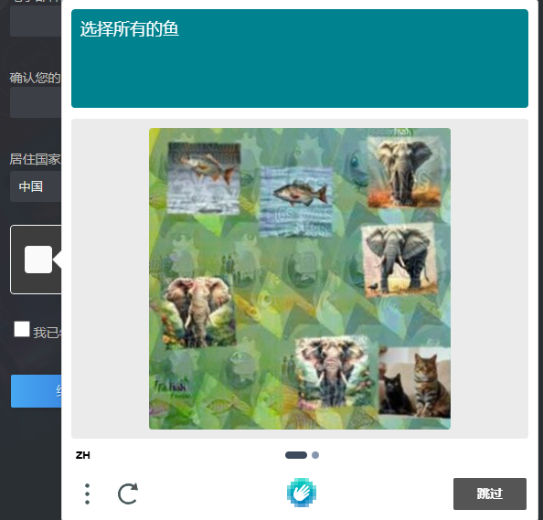

打开控制台抓包分析

### hcaptcha.html

地址v1后面跟着的是版本号，大概一周更新一次

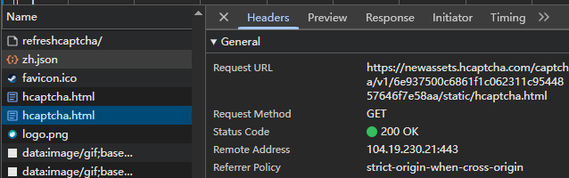

### checksiteconfig

siteKey不同网站唯一

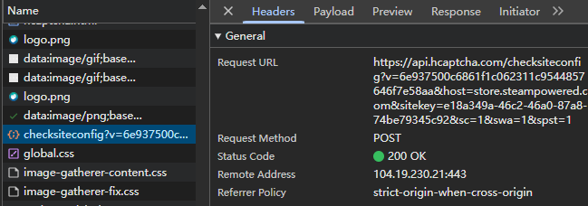

响应内容中有个jwt格式数据

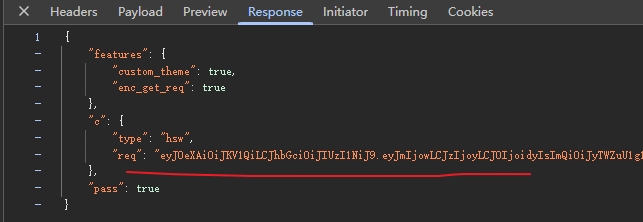

解码后

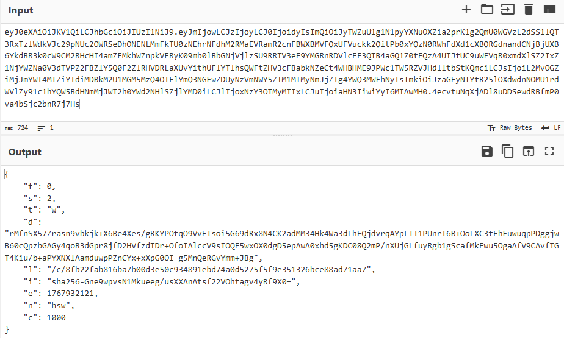

### hsw.js 核心加密文件

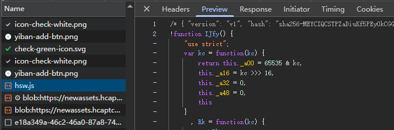

### 最后的验证接口

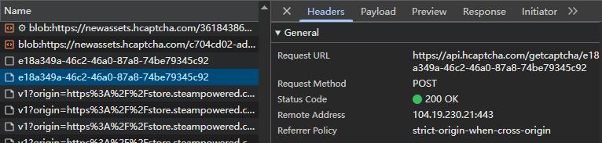

可以看到请求体是一堆乱码的

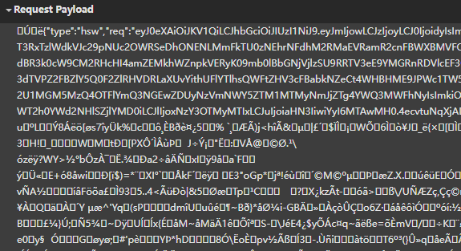

响应体也是乱码

都是buffer格式的

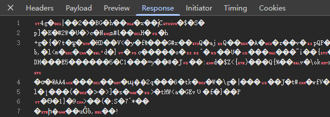

其实可以手动修改它的代码，让它用标准json格式

在hcaptcha.html找到如图位置代码

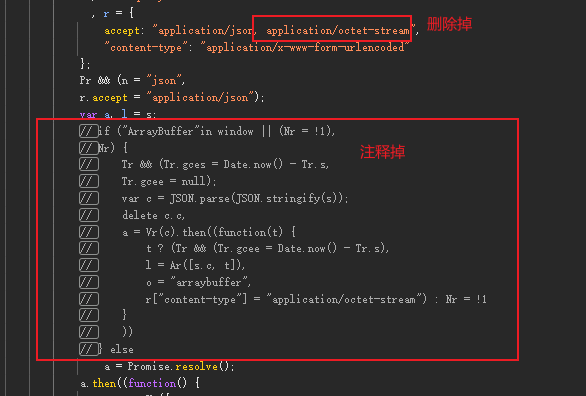

还有一处位置要改

在html头部位置，这是内容安全策略，防止篡改

只保留work属性就行

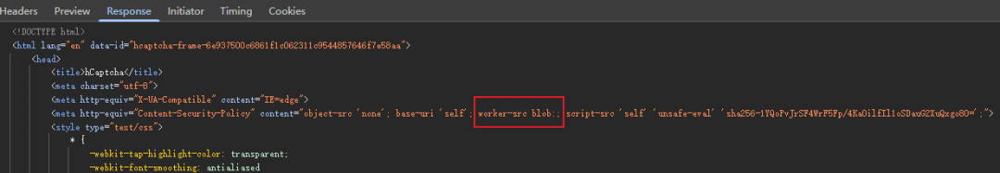

再刷新页面重新验证，就是正常显示的内容了

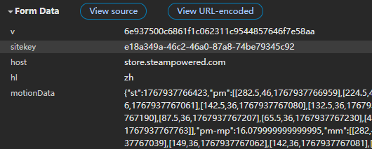

- v：hcaptcha 版本号
- sitekey：网站唯一 key
- host：网站域名
- hl：语言
- pdc、pem：包含时间相关参数
- c：checksiteconfig 接口中的参数
- motionData：包含时间戳、轨迹等环境信息
- n: hsw.js 文件核心加密结果

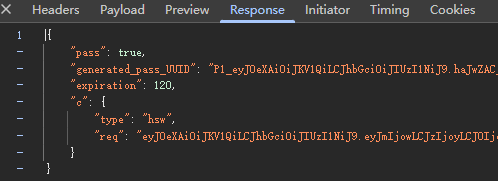

响应中的 generated_pass_UUID 的值为P1开头的则表示验证通过

## 逆向分析

主要分析如何找到 n 值的加密入口位置

先打上全局 xhr 断点

接着勾选验证码进行验证后跳转到了 hcaptcha.html 文件的位置

可以看到要发送的参数就是 ArrayBuffer 格式的

我这没改文件，改完就会显示明文的了

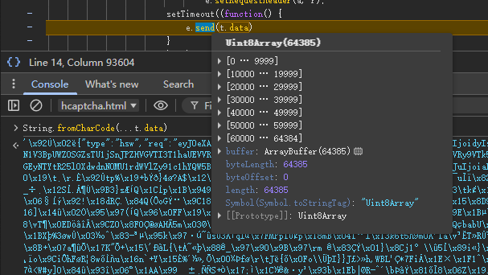

往上翻代码，发现咱们是在一个Promise里面

那我们在 Promise 之前打个断点去看看

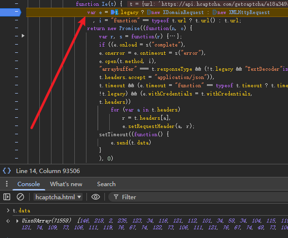

t.data也有值了，那就再往上跟栈

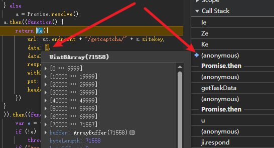

跟几个栈之后找到 data 新的位置 l

l 的结果是前面Promise链式调用传过来的

那么继续跟Promise

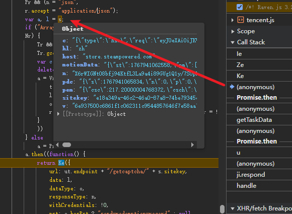

l 是 s 赋值过来的

s 是明文的参数了

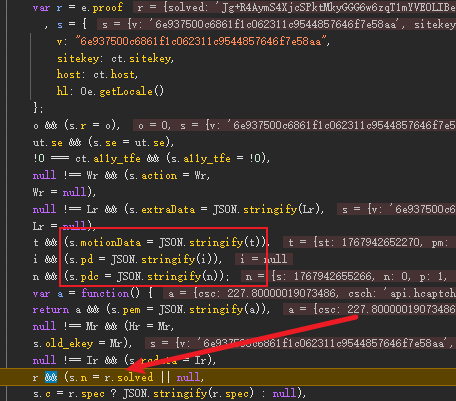

这里可以看到所有参数添加进了 s 里面

我们主要还是找 n 的来源

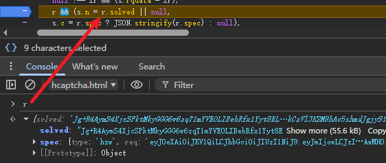

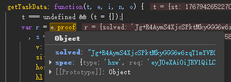

n = r.solved

r = e.proof

再继续往上跟栈找 e

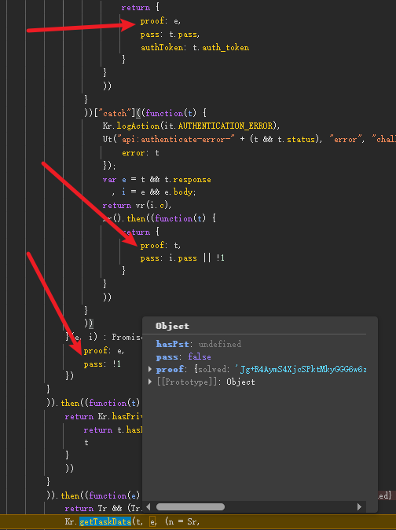

可以看到又是 Promise异步来的

proof有多处显示

不确定的话全部都打上断点看看进哪个

但实际还不是这入口还要继续往上找 t

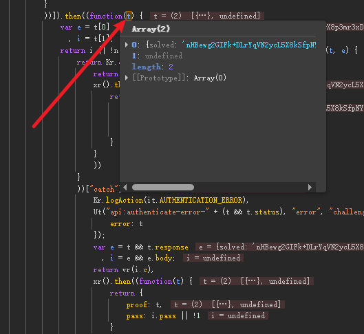

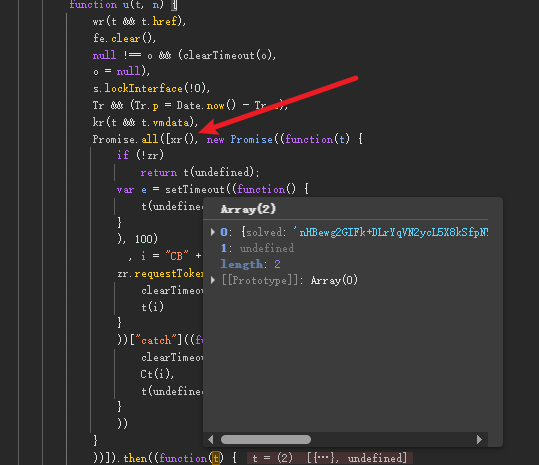

这里可以看到调用了 Promise.all 方法

迭代中有个 xr 方法

xr 也是个异步

可以直接调用看看结果

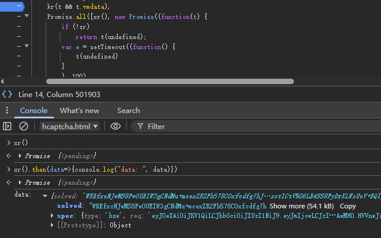

xr 执行完后输出我们所需要的结果

那就再进 xr 里面继续分析

xr里面只有如下图位置的solved有值，打上断点过去

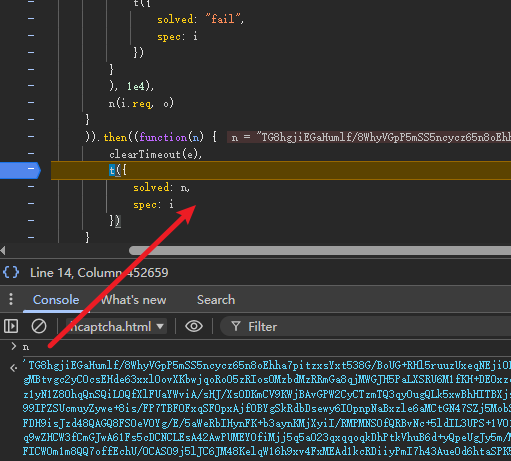

n 值也有了是上面异步 return 的值

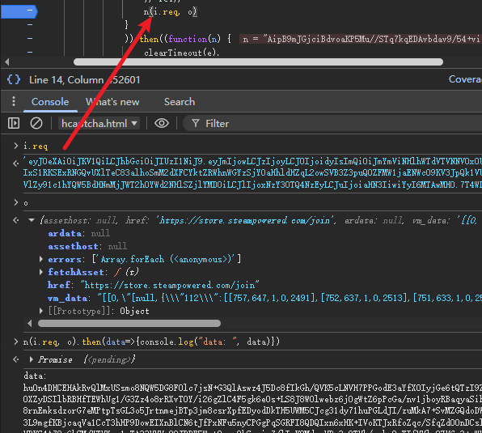

执行 n(i.req, o) 方法返回了我们所需要的结果

传入了两个参数我们现在也都知道是什么

进入 n(i.req, o) 方法

终于是进入了 hsw.js 文件中了

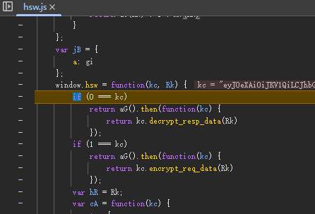

首先他会将传进来的 jwt 数据进行解码

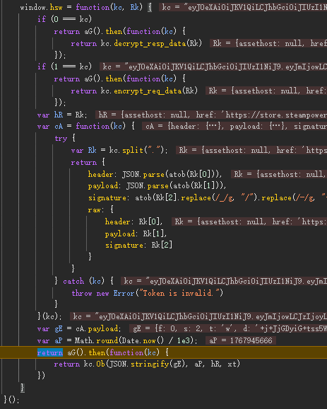

最后又 return 了一个异步

aG 方法实际是加载了一个 wasm

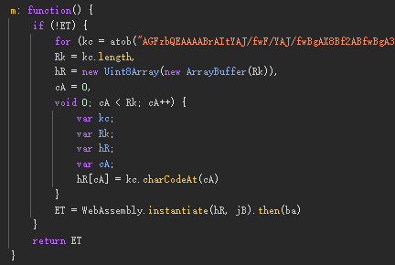

手动调用也是正常返回结果

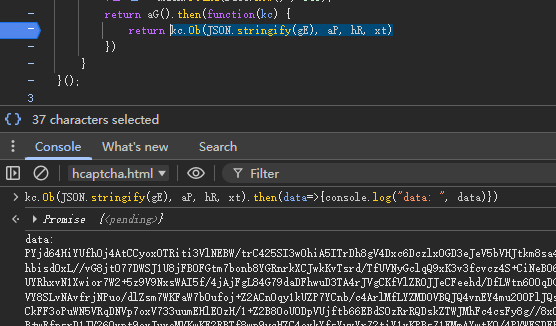

那么到此，加密入口的流程就分析完了

各位可以开始把 hsw.js 文件拿下来补环境了

## 插桩分析点

因为有用到wasm，会一直和js交互去存取参数

所以我们需要找到交互中检测了哪些环境

再回到加密入口位置

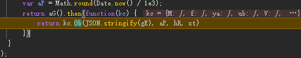

往下走进入kc.Ob方法里

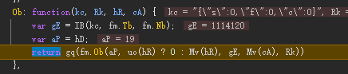

fm里面都是wasm里的方法

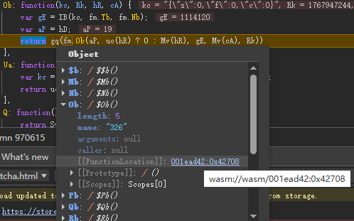

先进入Mv方法里

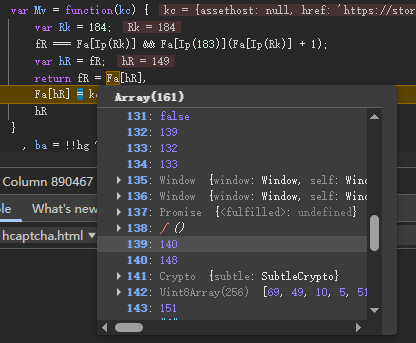

有一个大数组

补环境的时候也要在这对照一下看和浏览器上是否一致

可以在这打上日志

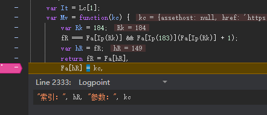

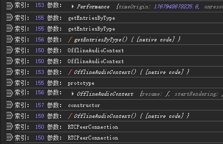

日志最后也能看到出值

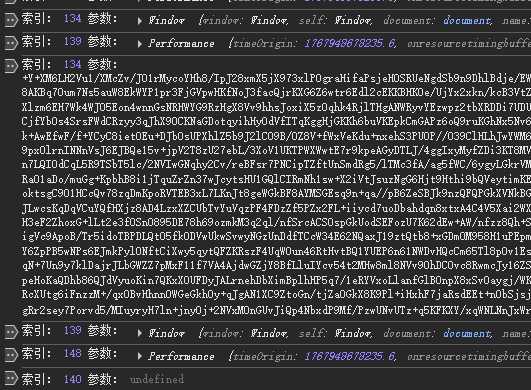

对照着这里的日志也能分析自己补的有没有差别

在补环境的过程中，经常能看到如下第一个参数是串数字的方法调用

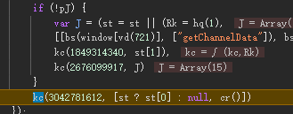

进入方法最后位置

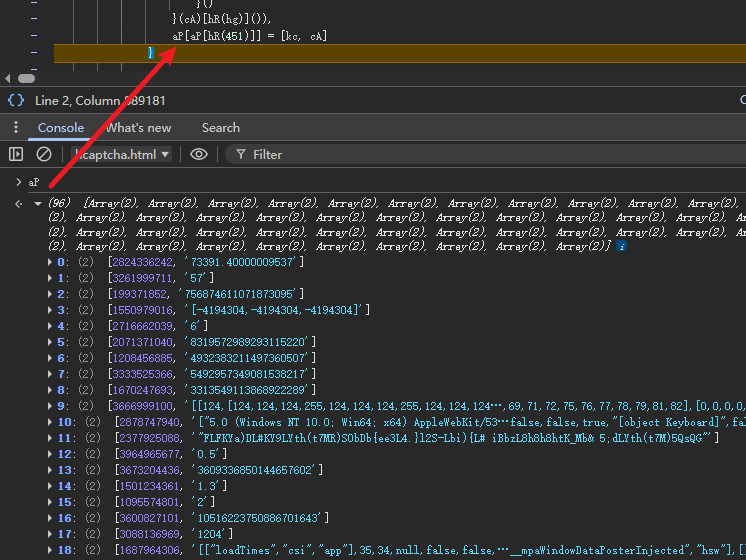

可以看到检验的环境都存入了一个大数组

所以这里也是一个很重要的点

补的也要和这块对照是否一致

## 补环境

接着说一些环境检测点

### 1、RTCPeerConnection

WebRTC 的核心接口，用于在浏览器之间建立点对点（P2P）连接，实现实时音视频或数据传输

这个在上篇腾讯滑块里也有检测，所以算是比较熟悉了

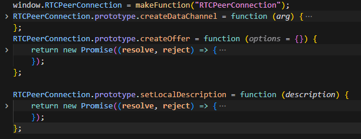

### 2、RTCRtpSender、RTCRtpReceiver

处理音视频流的发送和接收

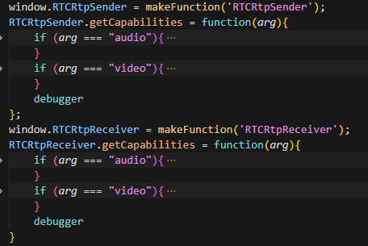

### 3、OfflineAudioContext

需要模拟音频数据处理

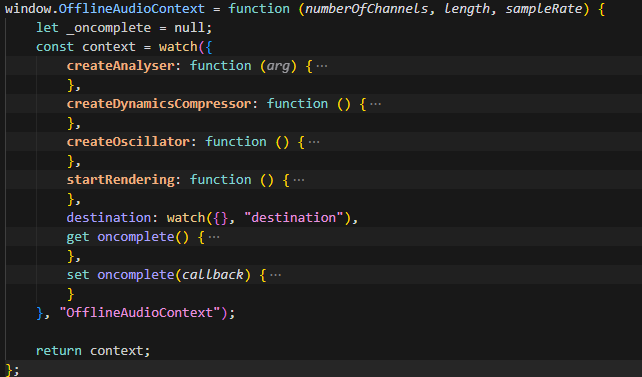

### 4、WebGL2RenderingContext

参数比较多，从浏览器直接copy下来吧

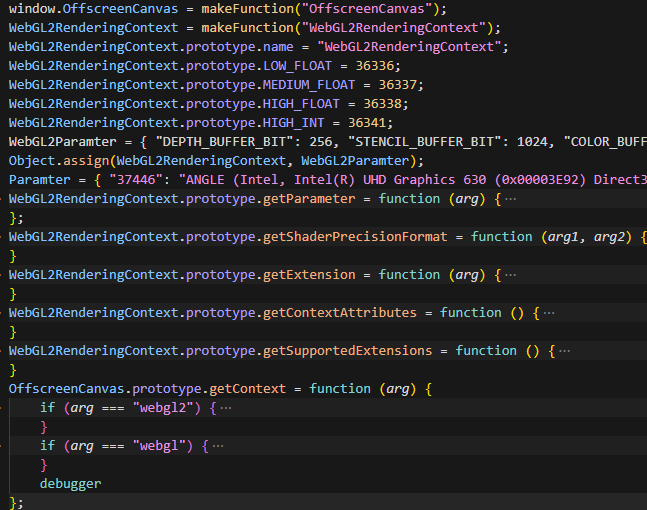

### 5、一堆描述符检测

注意要用箭头符号创建函数这样函数就没有prototype属性

检测代码

```
"prototype" in AudioBuffer.prototype.getChannelData
```

在浏览器中

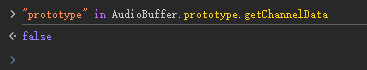

本地nodejs测试

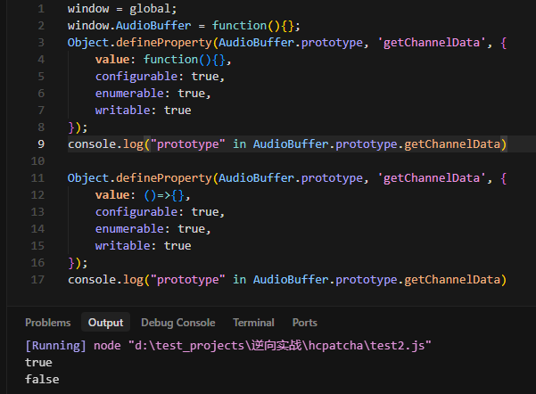

### 6、Math精度差异

不同的引擎的底层数学库差异

浏览器中

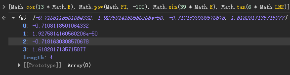

nodejs中

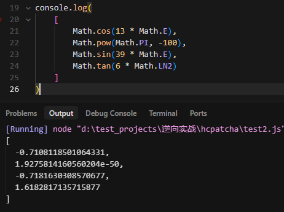

### 7、字体指纹

写个方法直接从浏览器里面导出就行

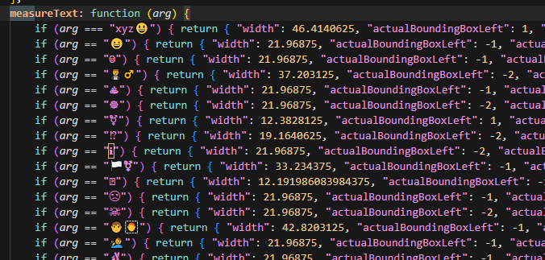

### 8、canvas指纹


### 9、Worker、SharedWorker


## 结果验证


环境不行会给验证码图片链接


