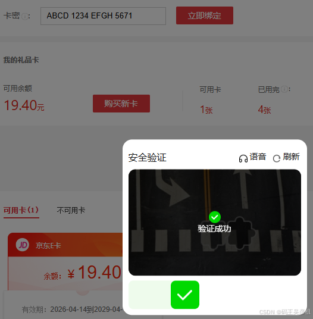
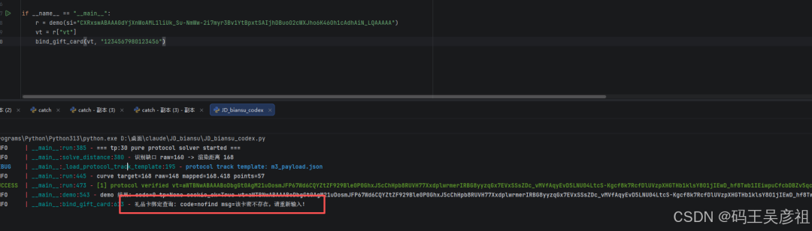
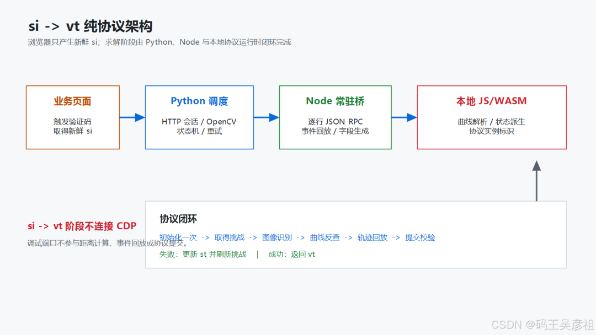
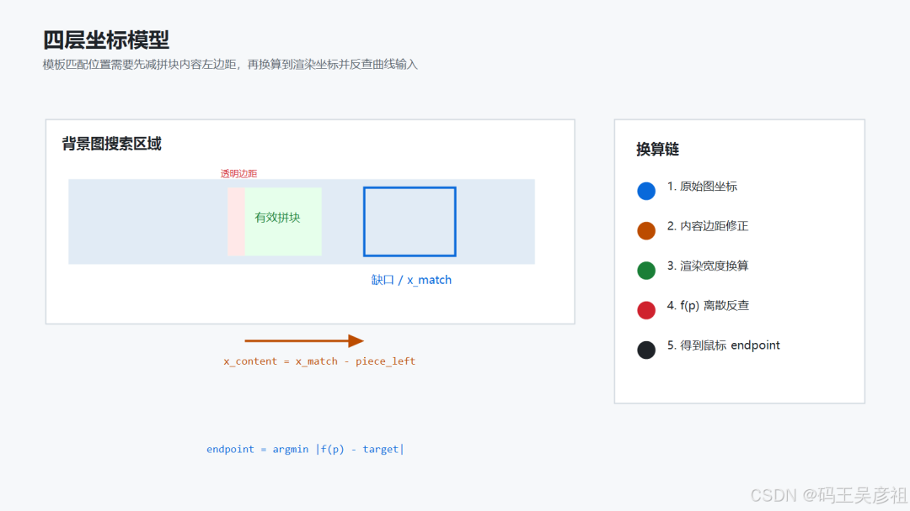

# 京东 JCAP tp:30 变速曲线滑块：si → vt 纯协议参数链与曲线反查

> 来源: 微信公众号：GH2N（[原文](https://mp.weixin.qq.com/s/quMCKKw8M7mAqWo--6iFHw)）
> 作者: 叶小伦
> 原始发布时间: 2026-08-26
> 归档日期: 2026-09-26
> 分类: web-reverse
>
> 京东 JCAP 业务侧 tp:30「拖箭头驱动拼块」变速曲线滑块的纯协议链：业务组件下发 `si` → `fp` 初始化（`fp` 写回 `devcInfo.capfp`、给初始 `st`）→ 挑战 `tp/b1/b2/n1` → 拼块透明边距修正与尺寸换算得 `render_target` → 在同版本曲线运行时逐点枚举求离散反函数 `endpoint = argmin|f(p) − render_target|` → 模板轨迹缩放并完整回放 `down/move/up` 取 `ii` → `sensorInfo/ct`、`payload/tk/cs` → check 成功返回 `vt`。`n1` 不提交却决定曲线映射，`se = f([si, st])` 必须用最新 `st`，`tk` 对紧凑 JSON 与 URI 编码层级逐字节敏感；参数函数仍调用同版本运行时，不手写混淆算法。

## 收录说明

原文标题「某东变速曲线滑块详解」，副题「从 si 到 vt：tp:30 滑块纯协议实现、参数逆向与曲线映射详解」，2026-08-26 14:54（UTC+8）发布，公众号标注原创。截图带 CSDN 水印，作者应同时发在 CSDN。归档时用公开文章 URL 纯 HTTP 拉取（桌面 Chrome UA，无需登录、未遇验证页），`#js_content` 转 Markdown。4 张图已下载到 `web-reverse/jd-jcap-tp30-curve-slider/`。正文按原结构保留，原文的副题 H1 也保留。第八节汇总表 `endpoint` 行原文被表格竖线截断成「取 \`argmin」，按 3.6 节公式补全。

作者声明域名、接口路径、令牌、固定常量和可重放字段已脱敏，代码只说明数据流，不能直接调用线上服务。截图里的 `si` / `vt` / 卡号是作者的样本值。文中「20 个新鲜 `si` 20/20 通过、平均 2.75 次有效挑战」是作者自测数据。

相关地图：

| 主题 | 文档 |
|------|------|
| 京东 JCAP 滑块专项（tp=30 / tp=26） | [jd-jcap-slider.md](./products/jd-jcap-slider.md) |
| 京东 JCAP 图形验证码（fp / refresh / check / ct / tk / cs / vt） | [jd-jcap-captcha.md](./products/jd-jcap-captcha.md) |
| 安全产品命中索引 | [products.md](./products.md) |
| 京东 h5st 运行时案例 | [jd-h5st-runtime-case.md](./jd-h5st-runtime-case.md) |
| 纯算 vs 预言机成本账 | [purecalc-vs-oracle-cost.md](./purecalc-vs-oracle-cost.md) |

# 从 `si` 到 `vt`：tp:30 滑块纯协议实现、参数逆向与曲线映射详解

> 本文记录一次经过授权的协议兼容性研究。为避免泄露本机登录态，文中的域名、接口路径、令牌、固定常量和可直接重放字段均已脱敏；代码片段用于说明数据流与算法结构，不能直接调用线上服务。

## 摘要

目标结果：页面输入满足长度要求的卡号后，业务 SDK 初始化验证码并下发 `si`，完成初始化、出图、识别、曲线映射、轨迹回放、协议字段生成和结果校验





## 一、完整协议链过程：

`si -> vt` 不是一次请求，而是一条连续的参数链：

```
业务页下发 si
  -> fp 初始化：得到 fp、capfp、初始 st
  -> 取得挑战：得到 tp、st、b1、b2、n1
  -> 图片识别：得到 render_target
  -> 曲线反查：得到鼠标输入 endpoint
  -> 轨迹回放：得到 track_list、ii
  -> 参数生成：得到 payload、sensorInfo、tk、ct、cs
  -> check 校验：成功响应返回 vt
  -> 失败可恢复时：使用最新 st 生成 se，刷新下一挑战
```

这条链有两个基本规则：

1. 当前响应里的 `st`、图片和曲线状态必须成组使用，不能混入上一挑战的数据；
2. 加密字段的逆向重点是确认**明文输入、输入顺序、编码方式和调用时机**，最终字段仍由同版本参数算法生成。



---

## 二、按照协议顺序解决每一个困难参数

真正耗时的地方不是发出 HTTP 请求，而是多个参数彼此依赖，错误又不会直接指出是哪一层出了问题。最难的四个交叉点是：

1. `n1` 不直接提交，却改变拼块位移与鼠标位移的关系；
2. `st` 会在无图过渡响应中变化，`se` 又依赖最新 `st`；
3. `ii` 不是可以随便填入 payload 的静态值，它依赖完整事件序列；
4. `tk/ct` 对明文顺序和字节编码敏感，字段看起来一致不代表输入字节一致。

因此下面每一步都不只给结论，还说明困难表现、定位办法和最终验证依据。

### 3.1 `si`：先分清“会话标识”和“验证码答案”

`si` 由业务验证码组件初始化时下发，是整条挑战链的会话标识。它会出现在初始化、刷新和校验阶段，但不包含缺口位置、轨迹或 `vt`。

**难点在哪里**

只看单次抓包时，`si` 几乎出现在每个请求里，很容易把它理解成一个可长期复用的固定 token。实际表现却是：报文字段完全相同，旧 `si` 仍会在初始化或刷新阶段失效。

**如何确认作用范围**

把请求按“同一次验证码弹窗”分组，记录每组 `si`、首个响应时间、最后一次有效响应和最终结果：

```
同一次挑战链：si 始终不变
刷新图片：si 不变，st 改变
重新初始化验证码：si 改变
超过有效期：原 si 无法继续推进状态
```

再做一个重要对照：只替换 `si` 而保留上一挑战的 `st/tk/ct`，后续校验不成立。这说明这些参数不是独立 token，而是绑定在同一 `si` 的状态链中。

**最终结论**

纯协议入口接收页面已经产生的新鲜 `si`。后续所有状态和校验字段都必须围绕这个 `si` 重新生成，不能跨 `si` 复用。

### 3.2 `fp/devcInfo/st`：初始化响应会反向修改后续输入

初始化阶段输入 `si`、设备信息和交互摘要，响应返回指纹结果与初始状态。需要保留的关系为：

```
fp.fp        -> 写回 devcInfo.capfp
fp.st        -> 没有挑战 st 时作为初始 current_st
challenge.st -> 当前挑战存在时优先使用
```

**难点在哪里**

`fp` 表面上只是初始化响应，但它的 `fp` 值还会被写回设备信息。若只保存响应、不更新 `devcInfo.capfp`，后续 `sensorInfo/ct` 使用的仍是初始化前设备态。服务端只返回普通校验失败，不会提示“设备信息版本不一致”。

第二个难点是同一初始化链中可能同时出现 `fp.st` 和 `challenge.st`。二者长度、格式相似，但使用时机不同。

**如何逆出写回关系**

在指纹请求完成前后分别快照 `devcInfo`，只比较发生变化的字段：

```
before.capfp = ""
fp_response.fp = VALUE_A
after.capfp  = VALUE_A
```

然后包装 `sensorInfo` 与 `ct` 的生成函数，检查其入参中的 `devcInfo.capfp`。可以看到后续函数读取的是写回后的值。

对 `st` 则按响应时间排序：初始化状态先出现，挑战状态后出现；校验调用栈读取的是当前挑战对象中的 `st`。由此得到优先级：

```
current_st = challenge.get("st") or fp_result.get("st") or ""
device_info["capfp"] = fp_result.get("fp") or device_info.get("capfp", "")
```

**最终结论**

`fp` 不只是一个要提交或保存的字符串，它会推进设备状态；`st` 也不是全局固定值，而是随当前挑战切换的状态游标。

### 3.3 `tp/b1/b2/n1`：最难点是 `n1` 不提交却改变距离

完整挑战包含类型 `tp`、状态 `st`、背景图 `b1`、拼块图 `b2`，以及随图片进入解析逻辑的 `n1`。

**为什么这个点会卡很久**

CV 可以准确找到背景缺口，但把这个位置直接作为轨迹末点时仍然持续失败。与此同时：

- `b1/b2` 尺寸与登录滑块接近；
- payload 结构也高度相似；
- 浏览器真实鼠标末点与 CV 缺口位置之间没有固定差值；
- `n1` 是高熵数据，不能从字节中直接观察出偏移量；
- `n1` 又不作为独立字段出现在最终校验表单中。

这会产生一个很强的误导：既然 `n1` 不提交，好像它和校验无关。实际上它在客户端图片解析和曲线初始化阶段已经参与计算，最终影响的是轨迹输入与拼块位置之间的映射。

**如何确认 `n1` 的真实作用**

从挑战响应的 `img` 对象开始追踪数据流，而不是从最终表单倒推。记录 `img` 进入解析函数后的调用链：

```
{tp, b1, b2, n1}
  -> parse(challenge)
  -> initialize curve state
  -> transform(mouse_position)
  -> mapped piece position
```

然后做三组对照：

1. 当前图片与当前 `n1` 配对，曲线映射稳定；
2. 保持 `b1/b2`，替换其他挑战的 `n1`，映射关系变化或解析状态不成立；
3. 新挑战仍复用上一挑战的曲线映射，预测末点与真实映射出现明显偏差。

还可以把浏览器真实拖动末点与 CV 位置配对记录：不同挑战的差值明显变化，排除了“全局固定偏移”假设。

**为什么没有继续手工解密 `n1`**

目标不是得到 `n1` 的可读明文，而是得到当前挑战的函数关系 `f(p)`。只要同版本解析函数能够消费 `tp/b1/b2/n1` 并返回 `transform(p)`，就能直接反查正确鼠标输入。这样绕开了手工翻译高熵数据和混淆解密逻辑，同时保留了当前挑战的真实映射。

**最终结论**

`n1` 属于“本地参与计算、间接影响提交”的参数。它不需要单独加入校验表单，但每张新图都必须重新参与曲线解析。

进入下一阶段前先验证挑战完整性：

```
is_complete = (
    response.get("tp") == EXPECTED_TYPE
    and has_image(response, "b1")
    and has_image(response, "b2")
)
```

### 3.4 `se`：难点不是算法名字，而是找到最新 `[si, st]`

`se` 是刷新请求中的非透明字段。最终确认的输入为：

```
se = getRefreshToken([String(si), String(current_st)])
```

**难点在哪里**

压缩混淆后的函数名没有语义，按名字搜索不到 `se` 的生成点；而且无图响应也可能返回新 `st`。如果只在有图时更新 `st`，下一次生成的 `se` 就使用了旧状态。

常见现象是第一步刷新有响应，第二步开始状态失效，看起来像加密算法偶发错误，实际是 `st` 更新时机错误。

**如何从最终字段定位生成函数**

先在请求即将发送时保存最终 `se`，再沿调用栈包装候选函数，记录入参与返回值：

```
function traceCall(owner, name, sink) {
  const original = owner[name];
  owner[name] = function (...args) {
    const result = original.apply(this, args);
    sink({ name, args, result, stack: new Error().stack });
    return result;
  };
}
```

判定生成点的标准不是“输出长度看起来相似”，而是同一次请求中包装器返回值与最终 `se` 逐字节一致。

**如何确认输入与顺序**

| 实验 | 保持不变 | 唯一变化 | 结果 |
|---|---|---|---|
| A | `si` | 修改 `st` 一个字符 | `se` 改变 |
| B | `st` | 修改 `si` 一个字符 | `se` 改变 |
| C | 两个值 | `[si,st]` 改为 `[st,si]` | 后续状态不成立 |
| D | `si` | 使用响应返回的新 `st` | 可以继续刷新 |
| E | `si` | 继续使用过渡前旧 `st` | 状态链中断 |

**最终突破**

刷新响应处理顺序必须是“先接受新状态，再判断有没有图”：

```
response = refresh(si, current_st, se)
current_st = response.get("st") or current_st
if has_complete_images(response):
    challenge = response
else:
    continue  # 状态过渡，不消耗有效挑战次数
```

这也解释了为什么单纯增加重试次数无效：如果每次都使用旧 `st`，重试只是在重复错误状态。

### 3.5 `b1/b2 -> render_target`：三个坐标空间必须拆开

模板匹配返回的是小图外框在背景中的位置，而拼块有效内容可能从 `b2` 的第若干列才开始。还要区分原图宽度和页面渲染宽度。

**难点在哪里**

CV 叠加图看起来已经对齐，但提交距离仍有系统性偏差。这是因为“模板左上角”“拼块内容左边缘”和“渲染目标”被当成了同一个 x。

**如何定位偏差来自哪里**

先从 alpha 通道建立 mask；没有 alpha 时再使用灰度阈值。扫描 mask 得到有效内容包围盒：

```
left, top, right, bottom = bounding_box(piece_mask)
compact_piece = piece[top:bottom + 1, left:right + 1]
matched_x = template_match(background, compact_piece)
```

将每次计算拆成可观测的三个量：

```
x_match            模板匹配位置
piece_content_left 拼块有效内容左边距
x_content          x_match - piece_content_left
```

最后再做尺寸换算：

```
render_target = round(x_content / source_width * render_width)
```

**验证方法**

把 `render_target` 与页面中拼块的真实渲染位置配对，而不是只看 OpenCV 置信度。多组真值残差进入约 1 像素量级后，才能确认坐标修正成立。

**最终结论**

`render_target` 是拼块目标位置，不是轨迹末点。它还要进入下一步曲线反查。

### 3.6 `endpoint`：把曲线函数当作黑盒求离散反函数

当前挑战解析完成后，曲线函数给出：

```
mouse input p -> mapped piece position f(p)
```

**难点在哪里**

登录滑块常可以近似使用 `endpoint = render_target`，tp:30 却存在挑战相关映射。尝试拟合固定比例、固定偏移或统一公式，都无法覆盖不同 `n1` 的样本。

**解决方法**

输入范围只有有限个整数位置，因此不需要逆出一条漂亮的解析公式。对当前挑战逐点调用原曲线函数：

```
positions = range(track_range + 1)
mapping = [curve_transform(p) for p in positions]
endpoint = min(
    positions,
    key=lambda p: abs(mapping[p] - render_target),
)
```

也就是：

```
endpoint = argmin |f(p) - render_target|
```

**容易忽略的状态问题**

枚举映射本身可能改变曲线对象的内部事件状态。正式回放前需要重新以当前 `tp/b1/b2/n1` 初始化曲线解析状态，保证探测阶段不会污染轨迹阶段。

**验证方法**

轨迹回放结束后再次读取 `mapped_endpoint`：

```
residual = |mapped_endpoint - render_target|
```

只有残差处于阈值内才继续生成校验字段。这一步把“距离看起来合理”变成了可量化条件。

### 3.7 `track_list/ii`：`ii` 来自事件过程，不只是轨迹文本

轨迹使用 `[x, y, delay]` 三元组，x 表示相对按下点的横向位移，y 表示纵向变化，delay 表示相邻事件时间。

**难点在哪里**

payload 中能看到 `list` 和 `ii`，很容易认为 `ii` 只是对轨迹列表做一次静态散列。实际对照发现，同一轨迹文本若没有经过完整事件调用链，得到的实例状态并不等价。

**如何确认 `ii` 的生成时机**

在 `mousedown` 前、若干 `mousemove` 中间和 `mouseup` 后分别读取实例标识，观察其可用性与变化；再把成功请求中的 `ii` 与事件结束后的返回值对齐。最终确认 `ii` 必须在当前挑战的完整事件序列之后读取。

```
curve.parse(current challenge)
  -> mousedown
  -> mousemove x N
  -> mouseup
  -> getInstanceId() => ii
```

**轨迹如何适配当前距离**

从已验证模板中选择一条，将 x 同比缩放到 `endpoint`，y 和时间只做受控变化：

```
ratio = endpoint / template_end
x'i   = round(xi * ratio)
y'i   = round(yi * y_scale) + bounded_drift
dt'i  = max(1, round(dti * time_scale) + time_jitter)
```

首点固定为按下状态，末点 x 强制等于 `endpoint`。`track_list`、`ii`、当前曲线实例和当前 `st` 必须作为一组使用。

### 3.8 `sensorInfo/ct/payload/tk/cs`：最难的是明文字节完全一致

最终校验字段表面上只有若干短字符串，但 `tk` 的明文输入包含完整 payload 与交互摘要。字段结构正确、轨迹也正确时，仍可能因为一个编码层级不同而失败。

**先定位每个生成点**

和 `se` 一样，从最终请求字段反向包装候选函数，要求返回值逐字节等于请求中的对应字段。确认得到：

```
sensorInfo = getSensorInfo(devcInfo, readyState)
ct = getContextToken([si, sensorInfo])
payload = {
  ht, wt, bw, sw, mw,
  list: track_list,
  ii,
  challenge_fields
}
tk = getCheckToken([
  si,
  challenge_st,
  encodeURI(JSON.stringify(payload)),
  JSON.stringify(touchMessage)
])
```

`cs` 则通过多组成功请求对照其输入和最终值，确认它在当前分支没有额外动态明文输入。

**为什么 `tk` 特别难**

下面任意一项变化都会改变最终输入字节：

- `challenge_st` 使用了刷新前的旧值；
- payload 使用普通带空格 JSON，而原调用使用紧凑 JSON；
- Unicode 转义形式不同；
- 键插入顺序变化；
- `touchMessage` 传对象而不是其 JSON 字符串；
- payload 已编码一次后又被重复 URI 编码；
- `ii` 来自上一条轨迹。

**如何验证字节一致性**

不要只打印解析后的对象，而要在加密函数入口同时保存：

```
typeof(argument)
argument.length
UTF-8 byte length
SHA256(argument bytes)
前后固定长度切片
```

浏览器样本和纯协议样本的这些摘要完全一致后，再比较 `tk/ct` 输出。这样可以把问题明确分成“明文组装错误”和“生成函数调用错误”。

**最终结论**

`ct` 绑定 `si + sensorInfo`；`tk` 绑定当前 `si/st/payload/touchMessage`。两者必须使用同一挑战的设备态、状态、轨迹和事件实例。

### 3.9 `check -> vt`：从响应类型决定结束还是刷新

校验阶段提交最终字段。只有成功码和非空 `vt` 同时成立，才算完成：

```
result = check(fields)
if result.get("code") == 0 and result.get("vt"):
    return result["vt"]
```

**最后一个容易混淆的难点**

校验失败、状态过渡、图片不完整和 `si` 过期不是同一种失败。如果统一重试，会在不可恢复状态上浪费时间，或把过渡响应错误计入有效挑战次数。

处理原则是：

```
if session_expired(result):
    stop()
elif result_contains_new_st(result):
    current_st = result["st"]
elif behavior_rejected(result):
    refresh_with(si, current_st)
```

可恢复失败时，`si`、设备态和最新 `st` 保持连续；新的图片、曲线映射、轨迹、`ii/tk/ct` 则必须全部重新生成。

至此，最难的参数依赖已经闭环：

```
si
 -> fp/capfp/st
 -> se([si, st])
 -> tp/b1/b2/n1
 -> render_target
 -> endpoint
 -> track_list/ii
 -> sensorInfo/ct
 -> payload/tk/cs
 -> vt
```

---

## 四、图片坐标：为什么必须减去拼块透明边距

tp:30 的拼块图不是一个从 x=0 开始就有内容的紧凑矩形。它可能包含透明或空白边缘。如果模板匹配直接返回整个小图的左上角，得到的是“图层位置”，不是“有效拼块内容的位置”。

处理步骤如下：

1. 根据 alpha 或灰度阈值找到拼块有效内容的包围盒；
2. 裁剪拼块与对应高度区间；
3. 在背景图上做模板匹配；
4. 将匹配位置减去拼块内容在原小图中的左边距；
5. 从原始图宽换算到渲染宽。

核心公式：

```
x_content = x_match - piece_content_left
x_render  = round(x_content / source_width * render_width)
```

对应的安全示例代码：

```
def locate_piece(background_gray, piece_rgba):
    mask = alpha_or_threshold(piece_rgba)
    left, top, right, bottom = bounding_box(mask)
    compact_piece = to_gray(piece_rgba[top:bottom + 1, left:right + 1])
    search_band = background_gray[top:bottom + 1, :]
    matched_x = template_match(search_band, compact_piece)
    return matched_x - left
```

这个修正曾用多组浏览器 `translate3d` 真值交叉验证，残差稳定在约 1 像素量级。早期沿用普通滑块“拼块无左边距”的假设，批测会出现明显系统性失败。



---

## 五、曲线映射：CV 目标并不等于鼠标末点

这是 tp:30 与登录滑块最关键的差异之一。

协议运行时内部存在一个变换函数：给它鼠标输入位移 `p`，它返回拼块的实际映射位置 `f(p)`。因此已知 CV 目标 `target` 后，需要求：

```
endpoint = argmin |f(p) - target|,  p in [0, range]
```

由于输入范围很小，直接枚举比拟合公式更稳：

```
positions = range(0, track_range + 1)
mapping = runtime_map_every_position(positions)
endpoint = min(positions, key=lambda p: abs(mapping[p] - target))
```

这一步相当于对运行时曲线做离散反函数。它解决了早期一直纠结的“随机初始偏移”问题：不必猜偏移值，也不必手工解出中间高熵字段，只要让原运行时完成解析和变换，再反查应当提交的鼠标末点即可。

为什么要在每次新挑战后重新建映射？因为曲线解析依赖当前图片元数据与会话上下文，不能把上一张图的映射表直接复用。

---

## 六、轨迹怎么计算：保留形状，缩放终点，扰动时序

### 6.1 不用单一数学曲线冒充所有人

纯直线、固定贝塞尔曲线、固定速度曲线都有一个共同问题：重复样本之间过于相似。当前实现采用已验证轨迹模板，先把 x 方向缩放到本次 `endpoint`，再对时间、y 方向和少量内部点做轻微扰动。

设模板末点为 `X0`，当前末点为 `D`，则基本缩放为：

```
ratio = D / X0
x'i   = round(xi * ratio)
y'i   = round(yi * sy) + drift_i
dt'i  = max(1, round(dti * st) + jitter_i)
```

其中：

- `sy` 是小范围 y 方向比例；
- `st` 是小范围时间比例；
- `drift_i` 是缓慢变化的纵向漂移；
- `jitter_i` 只作用于内部点；
- 首点固定为按下位置；
- 末点 x 强制设为 `D`，避免随机扰动破坏最终对齐。

脱敏后的实现如下：

```
def adapt_track(points, endpoint, rng):
    ratio = endpoint / points[-1].x
    time_scale = rng.uniform(TIME_LOW, TIME_HIGH)
    y_scale = rng.uniform(Y_LOW, Y_HIGH)
    drift = 0
    out = []
    for i, point in enumerate(points):
        x = round(point.x * ratio)
        y = round(point.y * y_scale)
        dt = max(1, round(point.dt * time_scale))
        if 0 < i < len(points) - 1:
            x += small_x_jitter(rng)
            drift = bounded_random_walk(drift, rng)
            y += drift
            dt += small_time_jitter(rng)
        out.append([x, y, max(1, dt)])
    out[0] = [0, points[0].y, 0]
    out[-1][0] = endpoint
    return out
```

### 6.2 “生成轨迹”还不够，必须在原曲线环境中回放

轨迹列表不是最终协议数据的全部。曲线实例会在 `mousedown/mousemove/mouseup` 过程中维护事件状态并生成实例标识，因此必须按每个点的时间间隔触发完整事件序列：

```
curve.setEvent(mouseEvent("mousedown", originX, originY));
for (const [x, y, delay] of points.slice(1)) {
  await sleep(clamp(delay));
  curve.setEvent(mouseEvent("mousemove", originX + x, originY + y));
}
curve.setEvent(mouseEvent("mouseup", originX + lastX, originY + lastY));
```

注意：这里的事件是在本地协议运行时中回放，不是控制浏览器鼠标。

---

## 七、怎样提高整体准确率

整体准确率由“单次挑战质量”和“同一会话内可恢复次数”共同决定。实现中直接落实以下条件。

### 7.1 保持会话与运行时连续

- 一个 `si` 只做一次初始化；
- 同一 HTTP 会话、指纹状态和曲线实例贯穿当前 `si` 的完整求解；
- 每次刷新都使用最新 `st`；
- 当前挑战的图片、`st`、曲线实例和轨迹实例必须成组使用。

### 7.2 状态过渡与有效挑战分开计数

无图响应只推进状态，不消耗有效挑战预算。拿到完整背景和拼块后，才执行 CV、曲线反查和校验提交。这样有限的重试预算不会浪费在协议过渡上。

### 7.3 对距离建立可量化验收

每次提交前记录并检查：

```
raw_x              原始图匹配位置
piece_left         拼块有效内容左边距
render_target      换算后的渲染目标
input_endpoint     曲线反查得到的鼠标末点
mapped_endpoint    回放后曲线输出
residual           |mapped_endpoint - render_target|
```

`residual` 超过允许误差时不提交，重新检查图片解析或曲线实例。这样可以在本地截断确定会失败的样本。

### 7.4 轨迹保持模板结构并做受控变化

- 从多条已验证模板中随机选择；
- x 方向按目标末点同比缩放；
- y 方向只做小比例缩放和有界漂移；
- 时间间隔做小范围比例变化与内部点扰动；
- 首点固定为按下状态，末点 x 强制等于 `endpoint`；
- 扰动后的轨迹必须先在本地曲线实例中完整回放。

随机化必须受约束。完全随机的点列会破坏加减速结构，而固定模板又会让不同挑战高度重复。

### 7.5 按失败类型决定下一步

```
if session_expired(result):
    return result                 # si 已失效，继续刷新没有意义
if is_state_transition(result):
    current_st = result.get("st") or current_st
    continue                      # 不占有效挑战次数
if is_behavior_reject(result):
    challenge = refresh_current_session()
    continue                      # 换图并换轨迹模板
```

不要把会话过期、状态过渡、图片不完整和行为拒绝统一处理。分类后才能把重试用在可恢复失败上。

### 7.6 给整体成功率足够的有效尝试预算

单次挑战并非必过，因此接口默认保留有限的多次有效挑战。预算上限同时受 `si` 有效期约束：每次尝试前检查总耗时，接近会话过期窗口时应直接结束，避免返回一个已经失效的结果。

当前正式验证使用 20 个独立新鲜 `si`，结果为 `20/20`；平均执行 2.75 次有效挑战，最多 8 次。这说明整体成功依赖正确的状态恢复和重试策略，不能把单次挑战当作 100%。

---

## 八、所有参数逆向点汇总

完成整条流程后，可以把参数按“来源、直接输入、生成位置、使用时机”汇总如下。

| 参数 | 来源或直接输入 | 生成/维护位置 | 关键逆向结论 |
|---|---|---|---|
| `si` | 业务组件初始化响应 | 页面下发，求解入口接收 | 短时会话标识，不能由求解器凭空构造 |
| `cookie/session` | 有效业务会话 | 同一 HTTP 会话保持 | 决定能否获得目标题型和完整拼块图 |
| `devcInfo` | 设备与环境字段 | 指纹初始化阶段维护 | `fp` 后要写回新的指纹字段并贯穿整个会话 |
| `fp` | `devcInfo + runtime state` | 同版本指纹参数函数 | 每个 `si` 初始化一次，不能在每次重试中重建 |
| `st` | 初始化、挑战或过渡响应 | 按响应顺序持续更新 | 下一次 `se/tk` 的输入；收到新值必须立即覆盖 |
| `se` | 有序数组 `[si, st]` | 同版本刷新参数函数 | 通过请求值对齐、函数包装和单变量差分确认输入顺序 |
| `b1/b2` | 挑战响应 | 图片解码与模板匹配 | b2 的透明边距必须参与真实距离修正 |
| `render_target` | CV 位置、内容左边距、尺寸比例 | 图像坐标换算 | `x_match - piece_left` 后再从原图宽换算到渲染宽 |
| `endpoint` | 当前挑战的曲线映射与 `render_target` | 曲线离散反查 | 取 `argmin \|f(p) - render_target\|` |
| `track_list` | 已验证模板与 `endpoint` | 轨迹模板缩放与受控变化 | x 同比缩放，y/时间受控扰动，末点强制精确对齐 |
| `ii` | 完整 `down/move/up` 事件序列 | 当前曲线实例 | 必须完成本地回放后，从同一实例读取 |
| `touchMessage` | 当前交互摘要 | 当前校验上下文 | 必须与当前校验阶段匹配，不能沿用无关缓存 |
| `sensorInfo` | `devcInfo + readyState` | 同版本传感器函数 | 作为 `ct` 输入之一，依赖当前设备态 |
| `payload` | 尺寸、轨迹、`ii`、挑战字段 | 按原字节规则序列化 | JSON 与 URI 编码必须由同一运行时完成，避免字节差异 |
| `tk` | `[si, st, encodeURI(payload), touchMessage]` | 同版本校验参数函数 | 输入顺序、当前 `st` 和编码层级都必须一致 |
| `ct` | `[si, sensorInfo]` | 同版本上下文参数函数 | 与当前设备和传感器状态绑定 |
| `vt` | 成功校验响应 | 作为协议流程最终输出 | 只有 `code == 0` 且字段非空才视为成功 |

逆向这些参数时使用同一套证据标准：

1. 在请求发送边界取得最终字段；
2. 包装候选内部函数并记录入参、返回值和调用栈；
3. 确认返回值与请求字段逐字节一致；
4. 对每个候选输入做单变量差分；
5. 用下一步响应验证输入顺序和状态时机；
6. 最终仍调用同版本运行时，而不是重新手写混淆算法。

---

## 九、它和登录滑块有什么区别

两者共享大部分底层引擎，但不能直接把登录滑块脚本改一个类型码就用。

| 维度 | 登录滑块 | tp:30 业务滑块 |
|---|---|---|
| `si` 来源 | 登录页上下文 | 业务组件初始化 |
| UI 动作 | 拖动拼块完成缺口 | 拖动箭头驱动拼块 |
| 挑战刷新 | 通常围绕初始化/校验 | 存在独立刷新状态链 |
| 鼠标位移与拼块位移 | 通常接近直接对应 | 需要运行时曲线映射 |
| 拼块初始位置 | 常可按零偏移理解 | 存在内容边距和挑战相关映射 |
| 图片识别 | 背景与拼块模板匹配 | 算法可复用，但坐标修正不同 |
| 协议生成 | 同源 jcap 参数算法 | 算法同源，但分支、状态输入和字段上下文不同 |
| 业务后续 | 登录提交还可能有另一层业务加密 | 验证码阶段得到 `vt` 后交给业务接口 |

最容易误判的地方是：“图片尺寸一样、校验字段同构，所以距离也一样。”实际上，CV 层相似不代表交互层相同。tp:30 的正确链路是：

```
图片缺口 -> 内容边距修正 -> 渲染坐标 -> 曲线离散反查 -> 鼠标末点
```

登录滑块在很多情况下可以近似省略中间的曲线反查，而 tp:30 不能。

---

## 十、结论

从协议流程看，`si -> vt` 的核心不是搭建某种特定工程架构，而是把每个阶段的参数依赖和状态时机还原准确：

1. `si` 固定本次挑战链；
2. `fp` 更新设备态并给出初始 `st`；
3. `[si, st]` 生成 `se`，刷新响应持续推进 `st`；
4. `b1/b2/n1/tp` 共同决定图片目标和曲线关系；
5. CV 目标经过透明边距修正、尺寸换算和曲线反查后得到 `endpoint`；
6. 当前轨迹事件生成 `ii`，并与 `payload` 成组使用；
7. `tk/ct` 的输入顺序、当前状态和字节编码必须与原调用链一致；
8. `check` 成功响应最终返回 `vt`。

与登录滑块相比，两者底层参数算法大部分同源，但 `si` 来源、刷新状态链、交互方式和鼠标位移到拼块位置的映射不同。tp:30 不能直接套用登录滑块的“CV 位置即轨迹末点”假设，必须完成当前挑战的曲线反查。
