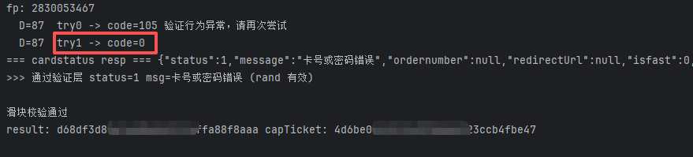

# 拼图打乱重排型滑块纯协议：loc 重排、length+9 与错误码分流

> 来源: 微信公众号：让bug飞一会儿（[原文](https://mp.weixin.qq.com/s/87CALi3iH5f54t7pZR7xVw)）
> 作者: nolhc
> 原始发布时间: 2026-09-05
> 归档日期: 2026-09-26
> 分类: web-reverse
>
> 某充值中心查询页的拼图滑块走 4 段 JSONP GET（captchasInit → key → info → validate）加 1 个业务 POST，全程不用浏览器拖动。背景被切成 13px 竖条并按 `loc`（40 个 tile 编号）打乱，必须先重排成 260×120 显示画布再做缺口检测；`length = 显示坐标缺口 + 9`；轨迹 `op` 与 `validData` 为 AES-128-CBC/PKCS7，key=iv 从 capTicket 固定位置抽取。真实 `op` 是页面绝对坐标、无 mouseup、约 110ms 节流、取整；错误码 -1 换位置、105 同位置换轨迹、111/112 换题；凹槽检测与模板匹配按分差择一；拟人轨迹交给 slider-track-gen skill 再做适配层转换。

## 收录说明

原文标题「「拼图式滑块」验证码的纯协议逆向」，摘要「从失败到 code:0 —— 六个坑与一次策略转变的完整复盘」，2026-09-05 01:00（UTC+8）发布，公众号标注原创。归档时用公开文章 URL 纯 HTTP 拉取（桌面 Chrome UA，无需登录、未遇验证页），`#js_content` 转 Markdown。2 张图已下载到 `web-reverse/shuffled-jigsaw-slider-protocol/`。正文按原样保留，原文的 PART 标记是普通段落。原文里的 `pay.**` / `captcha.**` 是作者对域名的打码，已转义成字面星号，避免被渲染成粗体。

作者声明不提供完整代码、敏感数据已脱敏，目标站点和验证码厂商未点名。`slider-track-gen` 是作者自建的 skill，文中未公开。

相关地图：

| 主题 | 文档 |
|------|------|
| 安全产品命中索引（验证码分流） | [products.md](./products.md) |
| 抓包对齐偏差（空值 / 编码 / 冻结头） | [capture-alignment-traps.md](./capture-alignment-traps.md) |
| 请求面切开与失败翻译 | [request-plane-failure-translation.md](./request-plane-failure-translation.md) |
| fail-closed 完成门 | [fail-closed-completion-gate.md](./fail-closed-completion-gate.md) |
| 京东 tp:30 曲线滑块（透明边距 / 轨迹模板缩放） | [jd-jcap-tp30-curve-slider.md](./jd-jcap-tp30-curve-slider.md) |

从失败到 code:0 —— 六个坑与一次策略转变的完整复盘

声明：本文仅限学习交流，不提供完整代码，所有敏感数据已脱敏。严禁商用或非法使用，后果自负。未经许可不得转载或篡改传播，侵权请联系公众号删除！

PART 00 · 背景与目标

某充值中心「查询」页需通过滑块拼图验证码，秒级自动查询的安全研究。自定约束：不用任何浏览器模拟拖动；全走 HTTP 协议直接交互；最终拿到能被业务接口接受的凭证。

PART 01 · 总体链路

共 4 段 HTTP（JSONP GET）+ 1 个业务 POST。以为只是「缺口滑块」，实际是**拼图打乱重排型**——全篇最核心的坑。

[1] init GET pay.\*\*?op=xxxcaptchasInit → 票据A(capTicket)\
[2] key GET captcha.\*\*/xxxCaptcha/key → 题目ID(capKey)\
[3] info GET /xxxCaptcha/info/{capKey} → loc(40乱序) + 素材图\
[4] validate GET /xxxCaptcha/validate → code:0 + result(32hex)\
[5] 业务提交 POST op=cardstatus 带 result → 放行

PART 02 · 入口逻辑

页面先调 captchasInit 拿 capTicket 并写入隐藏域；业务提交前取验证凭证写入 rand 隐藏域。最终表单两个关键字段：**capTicket + rand**，其中 rand 即验证通过后服务端返回的 result。

PART 03 · 前端 JS

验证码库 29KB、内置完整 CryptoJS。取题返回的素材图 321×120：左 0..260 为背景，右 260..321 为拼图块；**loc 是 40 个 tile 编号**，先记住它。

key : GET /xxxCaptcha/key {appId,xcapTicket:A} → capKey\
info : GET /xxxCaptcha/info/{capKey} → {loc,img}\
mouseup: op=Enc(轨迹) ; xxvalidData=Enc({length:D,time})\
GET /xxxCaptcha/validate?xxcapKey&xxvalidData&op&fp&label

加密：AES-128-CBC + PKCS7，key=iv=16 字节，由 xxcapTicket 固定位置抽取派生。到这里链路理论上已通，但**每个字都在骗你**。

PART 04 · 坑 1

## 缺口检测全面失败：它根本不是普通滑块

照搬普通拼图滑块：拼图块对背景模板匹配 → 位置乱跳、真拖过去也被拒。把图渲染成 ASCII 逐行看才发现：背景被切成 13px 竖条并**按 loc 打乱重排**，还留着一个凹槽。也就是说——**服务端坐标基准是打乱后的画面，不是原图**。解法：按 loc 重排成 260×120 显示画布再检测，匹配分从 ~0.33 升到 ~0.58，出现唯一峰值。

看到 loc/order 字段，先怀疑「显示层 ≠ 素材原图」。

PART 05 · 坑 2/3

## length 坐标系 & 合成事件两道坎

坑 2：length 偏差 1px 都可能被拒，靠真实样本反推才确认：**length = 显示坐标缺口 + 9**（+9 来自前端 D=e+9，轨迹终点再 +1）。

坑 3：用 dispatchEvent 伪造拖动，轨迹和 length 都对仍被拒——合成事件 isTrusted=false，轨迹又太机械。与其演得像真人，不如**让浏览器只当采样器**：hook 它自己发出的 validate，解密密文看真实轨迹。

PART 06 · 坑 4

## 真实 op 轨迹：四条全猜错

// 真实 op（脱敏）—— 无 mouseup！\
[ [485,568,1,0], // mousedown，页面绝对坐标\
[500,568,3,114], // mousemove 间隔 ~110ms\
[532,568,3,347], ... [630,568,3,1010] ]

**① 坐标从 0 开始** → 实际从页面坐标 485 起（记录的是 clientX）

**② 结尾有 mouseup** → 实际没有（处理器先 removeAll 再取，type2 进不来）

**③ 间隔 25~50ms** → 实际 100~125ms（前端节流）

**④ 保留 1 位小数** → 实际直接取整

validData 解出 {length:152, time:1779}，1779 ≈ 轨迹末时间戳 1010 + 看图反应时间。按真实结构重写后，纯协议第一次真的通过。

PART 07 · 坑 5/6

## 多态错误码 & 缺口二义性

坑 5：受控实验分离错误码语义——**-1 是位置不对（换位置）；105 是轨迹不像人（同位置换条轨迹重试）；111/112 是频控/过期（换题）**。105→105→0 很常见，等于真人"再滑一次"。

坑 6：凹槽检测和模板匹配会轮流出错（重复纹理假峰 / 低对比漂移）。启发式：模板 top1 分差 >0.06 用模板，否则凹槽；两个候选都试。

PART 08 · 配合 slider-track-gen skill

## 轨迹交给 skill，我只管适配

轨迹是验证码风控最敏感的部分，我没有手写，对于重复的流程自己做成Skill，所以就交给的 **slider-track-gen skill**：按距离/风格（smooth / overshoot / segmented / cautious）批量生成拟人轨迹，速度模型、微回退、停顿都内置。

难点在于**适配层**——skill 输出「相对位移 + 密集时间戳」，本站要「绝对坐标 + ~110ms 节流点」。做了一组转换：

相对x → 页面绝对坐标(x0+x) 距离传 D+1（length=位移-1）\
密集点 → 按 100~125ms 节流抽稀\
overshoot 回退段 → 截断保严格递增\
总时长 → 拉伸到 1300~1900ms 再提交

接入后轨迹与内置曲线随机轮换，避免单一指纹；skill 缺失时自动回退内置轨迹，不影响主流程。四种风格各 300 次本地校验通过，真实提交多次拿到 code:0。

拟人轨迹是"可沉淀的能力"：写成一个 skill，下一个测试站直接复用。

PART 09 · 稳定性 & 一图流

① 内置曲线 + skill 轨迹随机轮换，避免单一指纹；② 同题 3 次内不中即换；③ fp 按 murmurhash3 同算法复现；④ 「-1 换位置、105 换轨迹」分开重试。

① xxcaptchasInit → xcapTicket A ② key → xcapKey ③ info → loc+img\
④ 本地按 loc 重排→显示画布→缺口检测 ⑤ length=缺口+9\
⑥ 构造 op + 加密 ⑦ xvalidate → code:0 result\
（105 换轨迹；-1 换位置；111/112 换题） ⑧ 业务提交通过

写在最后

本文仅用于安全研究与技术学习复盘。请勿用于未授权的抓取或绕过风控牟利。
