# 腾讯滑块 TDC vmp（上）：cap_union 三接口与 collect 补环境检测点

> 来源: 微信公众号：無色逆向（[原文](https://mp.weixin.qq.com/s/pAoOxIU_DNgCllUTKhLf9Q)）
> 作者: 無色逆向
> 原始发布时间: 2025-12-23
> 归档日期: 2026-09-26
> 分类: web-reverse
>
> 腾讯云验证码官网 demo 的滑块链：`cap_union_prehandle`（参数可写死，`ua` 只是 User-Agent 的 base64；返回 `sess` / `prefix` / `md5` / `tdc_path` / `img_url` / `sprite_url`）→ 动态 `tdc.js`（其中有个动态参数要提取，即 `eks`）→ `cap_union_new_verify`（`collect` / `tlg` / `eks` / `sess` / `ans` / `pow_answer` / `pow_calc_time`；`errorCode` 为 0 返回 ticket，50 表示滑块距离不对）。`collect` 来自 `getTdcData`：先 `window.TDC.setData`，再 `window.TDC.getData(!0)`，进入约三百行的 jsvmp `tdc.js`。补环境重点：`RTCPeerConnection` 原型（`createDataChannel` / `createOffer` / `setLocalDescription`，后两者要返回 Promise）、`matchMedia` 多条件查询、`getElementById`，以及 `createElement` 连带的插入 / 删除 / 克隆 / 属性操作和 canvas 的 WebGL 信息、绘图取图。补完出值约 900 字符，浏览器约 1700，差在还没加轨迹（轨迹不校验）。作者说明 `collect` 是否强校验由客户侧配置决定，官网 demo 和实测多个站点都不校验。

## 收录说明

原文标题「腾讯滑块验证码vmp逆向分析-补环境篇」，2025-12-23 10:17（UTC+8）发布，公众号标注原创，是补环境篇 / 算法篇两篇的上篇，下篇见 [tencent-tdc-slider-vmp-part2-tea-collect-pow.md](./tencent-tdc-slider-vmp-part2-tea-collect-pow.md)。归档时用公开短链纯 HTTP 拉取（桌面 Chrome UA，无需登录、未遇验证页），`#js_content` 转 Markdown。18 张图已下载到 `web-reverse/tencent-tdc-slider-vmp-part1-env-patch/`。原文小标题是普通段落，归档时提为 Markdown 标题（声明 / 前言 / 目标网站 / 抓包分析 / 加密入口定位 / 补环境为二级；三个接口名和四个补环境对象为三级），正文文字未改。

作者没公开补环境代码；目标站点地址是作者写的 base64，照原样保留。截图里的请求参数、`sess`、`collect` 是作者调试官网 demo 时的样本值。

相关地图：

| 主题 | 文档 |
|------|------|
| 本文下篇：`__TENCENT_CHAOS_VM` 插桩还原 TEA collect 与 pow | [tencent-tdc-slider-vmp-part2-tea-collect-pow.md](./tencent-tdc-slider-vmp-part2-tea-collect-pow.md) |
| 腾讯 TDC 滑块半纯算（XTEA / 动态 key 频率提取） | [tencent-tdc-slider-xtea-purecalc.md](./tencent-tdc-slider-xtea-purecalc.md) |
| 腾讯 TCaptcha / TDC 链路（prehandle / collect / eks / ans / PoW） | [tencent-captcha.md](./products/tencent-captcha.md) |
| hCaptcha 无感补环境（同样检测 RTCPeerConnection） | [hcaptcha-invisible-hsw-env-patch.md](./hcaptcha-invisible-hsw-env-patch.md) |
| 补环境浏览器对象面 | [browser-env-objects.md](./browser-env-objects.md) |

## 声明

本文章中所有内容仅供学习交流使用，不用于其他任何目的，严禁用于商业用途和非法用途，否则由此产生的一切后果均与作者无关！若有侵权，请联系公众号【無色逆向】删除。

## 前言

源于某个群里有小伙伴说腾讯验证码的环境不好补，那咱不得来练练手， 花费了半天时间补环境，2.5（ikun警告！）天搞定算法，补环境主要难在DOM上，要补不少的标签

还有一点要说明的是，本文章只针对 collect 参数进行主要分析，但此参数并非必要，是由客户侧配置是否强制校验。简单来说就是在请求时这个参数校不校验看网站自己的配置，我实际测试多个网站，很多都不校验它，本篇网站分析的demo案例为官网，它也是不校验的，可能你会觉得既然我这案例网站都不校验，那怎么证明我的结果是对的呢，问的好，这就涉及到下一篇算法篇要说的了，通过逆推算 collect 还原加密前的明文，以此来证明你的算法是正确的。你又会问到既然都不校验我搞它干哈，这当然是咱们用来学习的啊，又不是为了学完来搞破坏的对吧

## 目标网站

aHR0cHM6Ly9jbG91ZC50ZW5jZW50LmNvbS9wcm9kdWN0L2NhcHRjaGE=

## 抓包分析

本次分析以官网demo为案例

打开浏览器控制台

网页定位到在线体验位置找到滑动图片验证点击立即体验

弹出滑块窗体

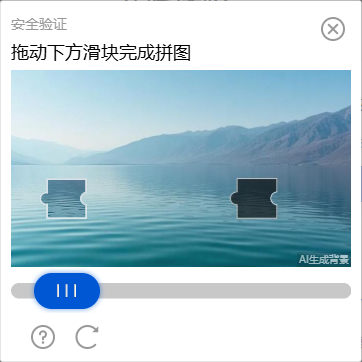

控制台查看网络请求信息

### cap_union_prehandle 接口：获取验证码相关信息

请求载荷

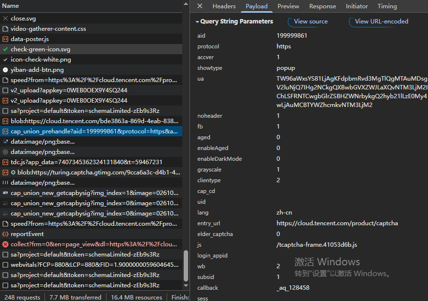

所有参数都可以固定写死

ua 看着像加密了，其实就是 User-Agent 经过了 base64 编码而已

响应内容

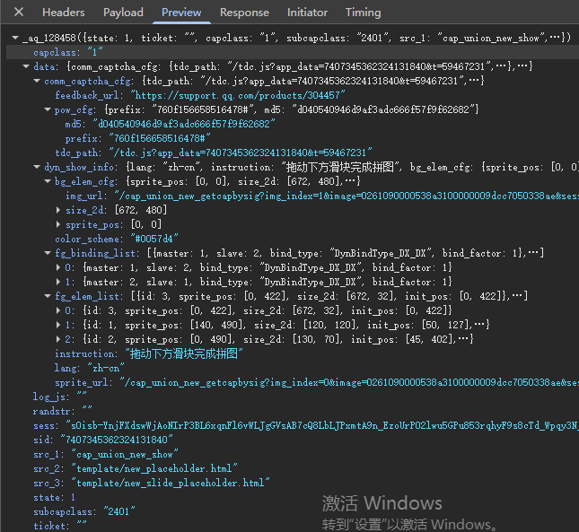

- sess、prefix、md5：在请求最终校验接口时需要用到
- tdc_path：js 加密地址
- img_url：验证码背景图地址
- sprite_url：验证码滑块图地址

### tdc.js 接口：核心加密逻辑代码

由上一个接口返回的 tdc_path 即 tdc 接口的动态链接地址

代码是动态的且里面有个动态参数需要提取出来

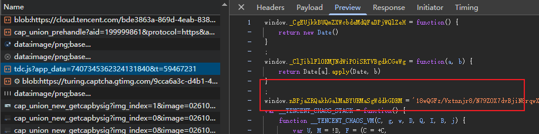

### cap_union_new_verify 接口：最终校验

请求载荷

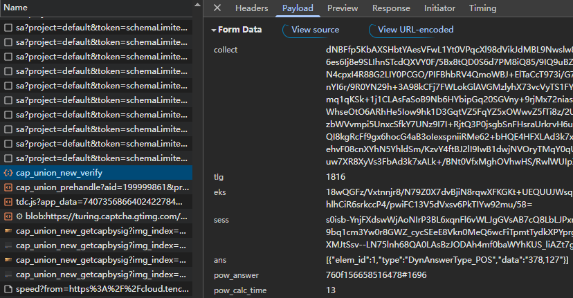

- collect：关键加密参数
- tlg：collect 长度
- eks：tdc.js 中提取
- sess：验证码信息接口返回的
- ans：前面固定，后面 data 是滑块缺口的 x、y 轴坐标
- pow_answer：井号前部分是验证码信息接口返回的后部分需要过算法计算
- pow_calc_time：同样需算法计算和 pow_answer 一块的

响应内容

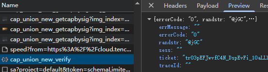

errorCode 为 0 则表示校验通过并返回 ticket 票据

50 表示滑块距离不对

## 加密入口定位

搜索关键词 collect: 定位到如图位置

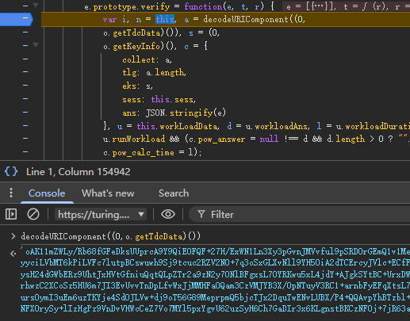

下好断点，正确滑动验证码后跳转至断点位置

可知 collect 是由 o.getTdcData 方法而来

进入 getTdcData 方法去

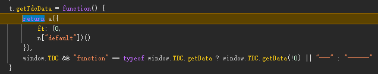

先执行 a 方法传入一个固定参数

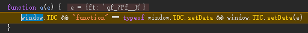

主要执行的是 window.TDC.setData方法

再回过头来

a 方法执行完后接着执行 window.TDC.getData(!0) 方法

返回的结果就是 collect

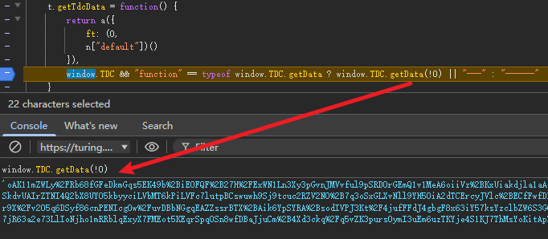

继续进入 getData 里去

跳转到了 tdc.js 文件中，定位到 function U 里面

开头也说过了这是动态的 js 文件

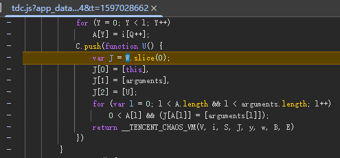

代码不多才三百来行，jsvmp的混淆

不过咱们是补环境，不用管代码是啥样式的

将代码拿到本地准备开始补环境了

## 补环境

缺啥补啥

普通的属性就不说了，上代理都能查出来，捡几个重点

### window.RTCPeerConnection

RTCPeerConnection 是 WebRTC（Web Real-Time Communications）API 中的核心对象，用于在两个浏览器或设备之间建立点对点（P2P）实时通信通道，支持音频、视频和数据流的直接传输，无需中介服务器参与，从而实现高效、私密的实时通信

这里会校验几个原型链

RTCPeerConnection.prototype.createDataChannel

RTCPeerConnection.prototype.createOffer

RTCPeerConnection.prototype.setLocalDescription

其中后两者需要构建返回一个Promise对象

### window.matchMedia

matchMedia 是一个 Web API，用于检测用户的设备是否匹配特定的 CSS 媒体查询条件，并可以监听这些条件的变化

会查询多个条件获取对象属性

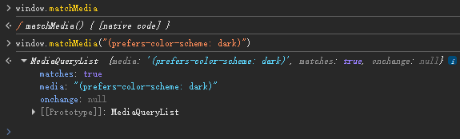

### document.getElementById

用于根据元素的 id 属性获取对应的 HTML 元素节点

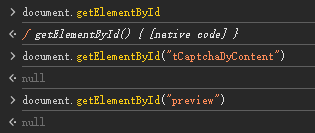

### document.createElement

用于动态创建 HTML 元素的方法，它在内存中创建一个新的指定标签名的元素节点，但不会自动添加到文档中，需配合 appendChild() 等方法添加

这块是检测的重点，也是补环境中的难点

不仅仅是能创建标签就完事了，还要补全操作标签的一系列动作

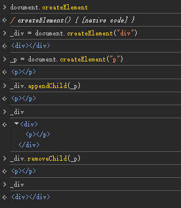

创建标签、插入标签、删除标签、克隆标签、设置属性、删除属性等

除普通标签外还有 canvas 标签也是重点

比如获取 webgl 信息的相关操作

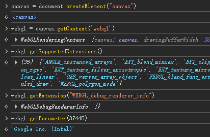

画图获取图片操作

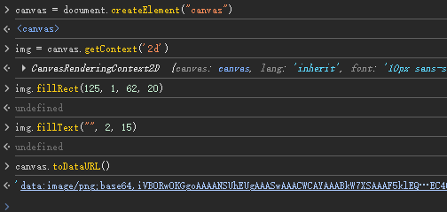

其它也没啥难补的了

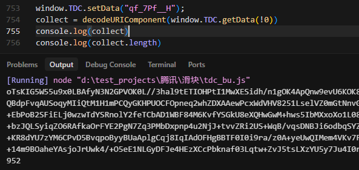

可以看到补完最终出值的长度在九百左右，而浏览器上是一千七百左右

明显少不少，这其实主要是因为我们还没有把轨迹加进去

不加也没关系，轨迹没有校验

在下一篇算法篇里我也会说明如何加入轨迹
