# 腾讯滑块 TDC vmp（下）：__TENCENT_CHAOS_VM 插桩还原魔改 TEA collect 与 pow 工作量证明

> 来源: 微信公众号：無色逆向（[原文](https://mp.weixin.qq.com/s/vGUza2i9rFSJVdANaMpccQ)）
> 作者: 無色逆向
> 原始发布时间: 2025-12-24
> 归档日期: 2026-09-26
> 分类: web-reverse
>
> `tdc.js` 的核心是 `__TENCENT_CHAOS_STACK` 里的 `__TENCENT_CHAOS_VM` 栈式虚拟机（`Q` 指令指针、`U` 指令数组、`W` 指令函数表、`c` 栈，没有其它混淆）。在 `.apply` / `.call` 与运算指令处插桩（加法日志必须加条件，否则日志爆栈）后可见：环境字符串每次按索引取 4 个字符 `charCodeAt`，每两组经运算得到 4 位数组再 `fromCharCode` 成乱码串，全部乱码串拼接后 base64 即 `collect`。频繁出现的常量 2654435769 指向 TEA 家族，实测魔改点是 `>> 5` 改成 `>>> 5`；作者给的 Python 里 key 取 `key[sum & 3]` / `key[(sum >> 11) & 3]`，这是 XTEA 的轮结构。4 个 key 随每份 `tdc.js` 变化，作者把日志片段交给 DeepSeek 深度思考模型找出，再在固定 `tdc.js` 下用正向 / 逆向算法互验真实 `collect`。`pow_answer` = prehandle 返回的前缀 + 工作量答案，`pow_calc_time` 是耗时：从 0 递增，`md5(nonce + ans)` 等于目标 md5 即停，30 秒超时。轨迹不校验，但可在 `setData` 前加入，坐标转换后同样切割计算。

## 收录说明

原文标题「腾讯滑块验证码vmp逆向分析-算法篇」，2025-12-24 09:48（UTC+8）发布，公众号标注原创，上篇见 [tencent-tdc-slider-vmp-part1-env-patch.md](./tencent-tdc-slider-vmp-part1-env-patch.md)。归档时用公开短链纯 HTTP 拉取（桌面 Chrome UA，无需登录、未遇验证页），`#js_content` 转 Markdown。34 张图已下载到 `web-reverse/tencent-tdc-slider-vmp-part2-tea-collect-pow/`。原文小标题是普通段落，归档时提为 Markdown 标题（声明 / 前言 / VMP结构剖析 / collect 插桩分析 / pow参数分析 / 轨迹 / 结果验证为二级；参数 / 指令循环 / 虚拟机启动入口为三级），正文文字未改。

正文里指向上篇和「小红薯X-S算法分析」的两处链接保留原文的公众号长链接；小红薯一文本库未收录。TEA 代码块里 `0x100000000if n >= 0x80000000else n` 一类缺空格的写法是原文页面本身如此（公众号代码高亮丢了空格），未改。前言里作者的「有单子的可以私下找我」照原文保留。作者没公开 key 的自动提取方法，截图里的 key、`collect` 明文与密文是作者样本值。

相关地图：

| 主题 | 文档 |
|------|------|
| 本文上篇：cap_union 三接口与补环境检测点 | [tencent-tdc-slider-vmp-part1-env-patch.md](./tencent-tdc-slider-vmp-part1-env-patch.md) |
| 腾讯 TDC 滑块半纯算（jsvmp 插桩判定 XTEA / 加法频率取动态 key） | [tencent-tdc-slider-xtea-purecalc.md](./tencent-tdc-slider-xtea-purecalc.md) |
| 腾讯 TCaptcha / TDC 链路（prehandle / collect / eks / ans / PoW） | [tencent-captcha.md](./products/tencent-captcha.md) |
| 魔改哈希与 TEA 家族密码笔记 | [xfq-crypto-notes-compilation.md](../signature-algorithms/xfq-crypto-notes-compilation.md) |
| 小红书 x-s 命中特征（作者提到其 TEA 改了常量） | [xiaohongshu-xs.md](./products/xiaohongshu-xs.md) |

## 声明

本文章中所有内容仅供学习交流使用，不用于其他任何目的，严禁用于商业用途和非法用途，否则由此产生的一切后果均与作者无关！若有侵权，请联系公众号【無色逆向】删除。

## 前言

在上篇补环境篇中简单分析了如何定位到加密入口位置以及补环境的一些难点部分

[腾讯滑块验证码vmp逆向分析-补环境篇](https://mp.weixin.qq.com/s?__biz=Mzg5MjYyNTgxMQ==&mid=2247484407&idx=1&sn=d17bd5edc46b5e973103e3ded2c81c47&scene=21#wechat_redirect)

接下来我们就需要深入代码部分，去还原完整的算法逻辑

再多一嘴，还原算法只是为了学习大厂的加密思维，即使还原了算法也不是说明你就能为所欲为了，真正的防御都还在风控侧，还有更多的打击机制。维护网络环境人人有责，有单子的可以私下找我

## VMP结构剖析

还是 tdc.js 这个文件

开头定义了两个获取时间的辅助函数和一串加密字符串

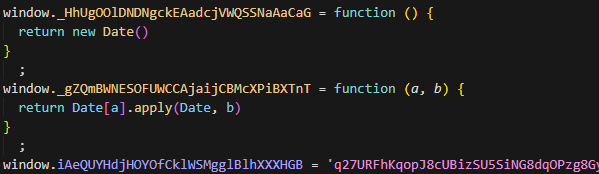

接着是一个核心，名为 \_\_TENCENT_CHAOS_STACK 的函数

其内部定义了一个 \_\_TENCENT_CHAOS_VM 的虚拟机函数

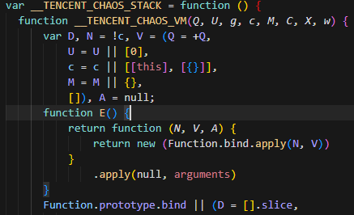

### 参数

- Q：指令指针，指向当前要执行的指令索引
- U：指令数组（在调用时传入，包含大量数字，这些数字是操作码或操作数）
- g：全局作用域 (this 或 window)
- c：虚拟机栈，用于存放操作数和中间结果
- M, C, X, w：用于存储上下文、常量或其他VM状态的变量

### 指令循环

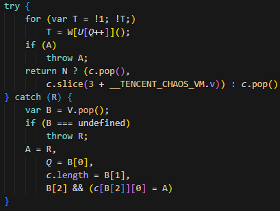

- W：一个包含大量函数（指令集）的数组。每个函数代表一个虚拟机操作（如加法、赋值、函数调用、条件跳转、对象访问等）
- U[Q++]：获取当前指令指针 Q 指向的指令码（一个数字）
- W[...]()：使用该指令码作为索引，从 W 数组中取出对应的函数并执行
- Q++：指令指针递增，指向下一条指令循环直到某个指令返回真值 T，表示当前代码块执行完毕

### 虚拟机启动入口

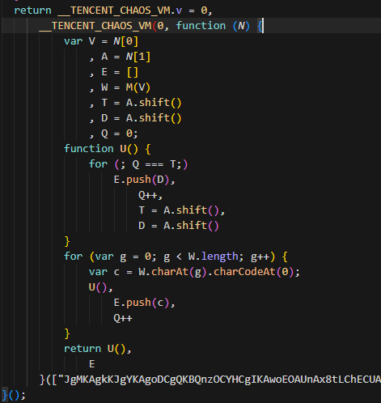

\_\_TENCENT_CHAOS_VM.v = 0：初始指令指针

W = M(V)：调用解码函数，得到原始的指令序列

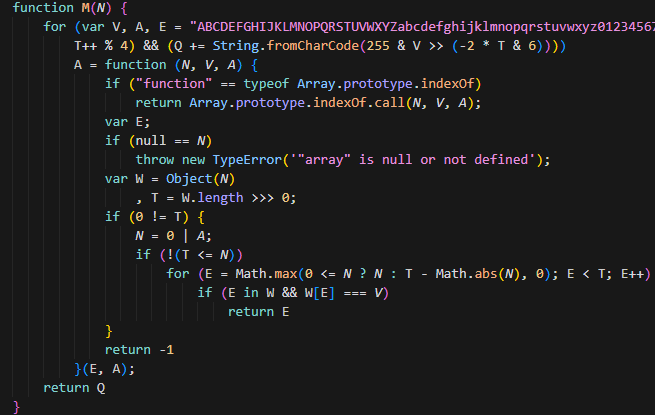

很标准的一个栈式虚拟机，没有其它混淆，非常适合用来学习

## collect 插桩分析

奈何本人反编译能力差点火候，只能用插桩搞了

老规矩，先找 .apply 或 .call

还是很好找的

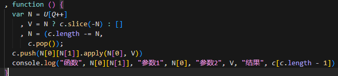

可以看到最后的日志输出也有咱要的值

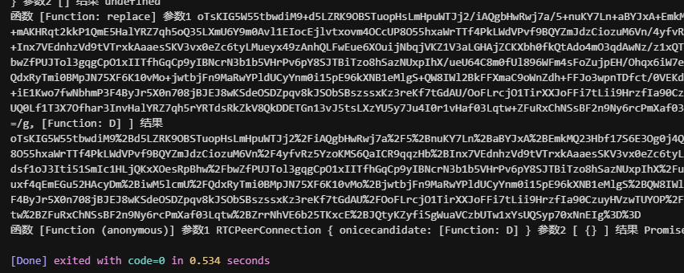

往上看，可以很明显找到一组环境对象

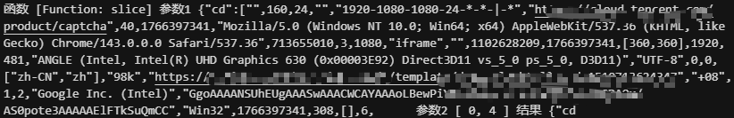

也能看出来它每次会从中按索引位取4个字符出来

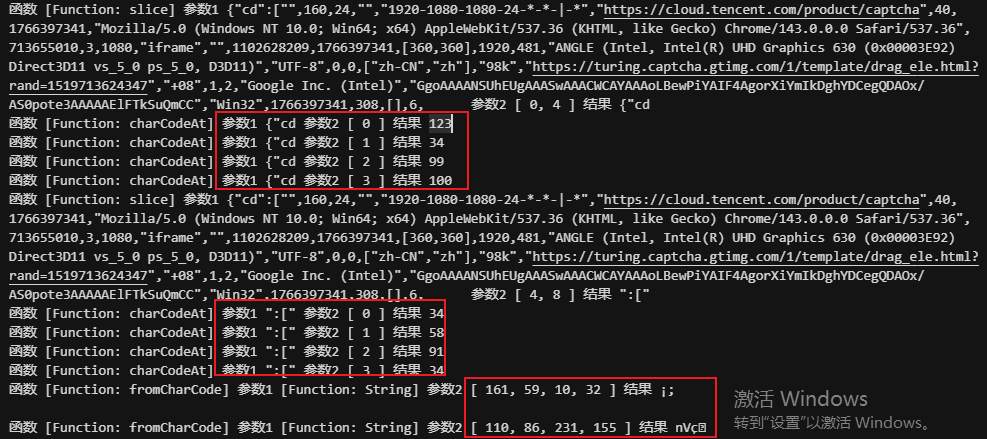

取4个字符分别用 charCodeAt 方法获取其 Unicode 编码值

然后每取完两组环境会看到用 fromCharCode 方法对一个4位数组转为乱码字符串

输出的信息太少了，不清楚4位数组哪来的

那么继续加日志点，找运算位置加

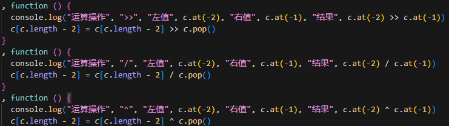

还有好几个其它的运算函数自己加吧

有一点一定要注意，加号运算的日志节点一定要设置条件输出，日志量太大了容易栈溢出或崩溃。。。

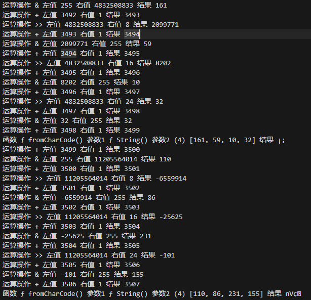

现在可以看到更多的信息了

也很明显可以看出这四位数组的计算方法

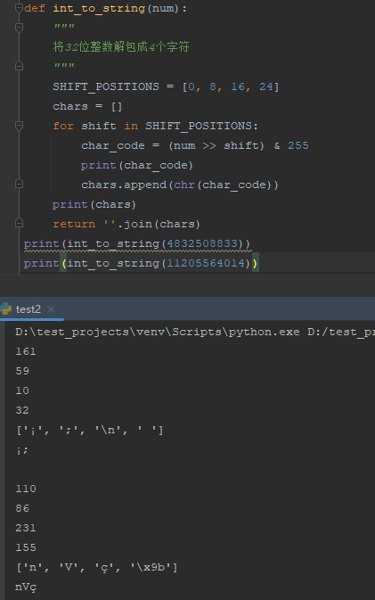

接着就需要找到这个4832508833和11205564014是咋来的

可这中间有一千多行的运算日志，无从下手啊

那就先找规律

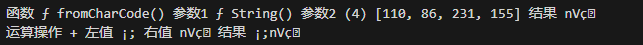

每两组环境计算出的乱码字符串最后会进行相加

且都是每隔两组会有大量运算出现

可以猜测是一个循环，会走同一个算法

仔细再分析运算的日志，可以发现一个常量值2654435769频繁的出现

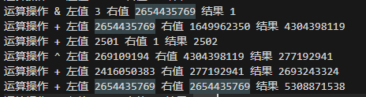

为什么我一眼就觉得熟悉的

因为我在之前的文章[小红薯X-S算法分析](https://mp.weixin.qq.com/s?__biz=Mzg5MjYyNTgxMQ==&mid=2247484172&idx=1&sn=146b40b165b3fd006eeec72e921df270&scene=21#wechat_redirect)

有说过它用了tea这个加密算法，其加密核心中就有一个常量值为2654435769

只是在小红薯的算法中它将这个常量值给改了

那么知道用到的加密算法后

就可以先写代码来尝试还原看看

实际分析日志下来也是发现有被魔改的地方

标准js算法中的 >> 5 被改为 >>> 5

```
  def tea_encrypt(v0, v1):
    key = [k0, k1, k2, k3]
    sum_val = 0
    delta = 2654435769

    def to_int32(n):
        n = int(n) & 0xFFFFFFFF
        return n - 0x100000000if n >= 0x80000000else n

    for i in range(32):
        v1_i32 = to_int32(v1)
        temp = to_int32(to_int32(v1_i32 << 4) ^ ((v1 & 0xFFFFFFFF) >> 5)) + v1_i32
        v0 += to_int32(temp) ^ to_int32(to_int32(sum_val) + key[to_int32(sum_val) & 3])

        sum_val += delta

        v0_i32 = to_int32(v0)
        temp = to_int32(to_int32(v0_i32 << 4) ^ ((v0 & 0xFFFFFFFF) >> 5)) + v0_i32
        v1 += to_int32(temp) ^ to_int32(to_int32(sum_val) + key[(to_int32(sum_val) >> 11) & 3])

    return [v0, v1]
```

传入两个明文返回两个加密的密文

两个结果密文我们知道是4832508833和11205564014

明文也好找其实就是将那四个字符串进行了简单运算

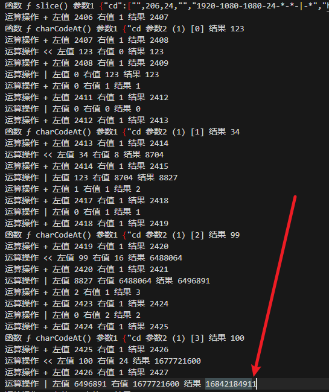

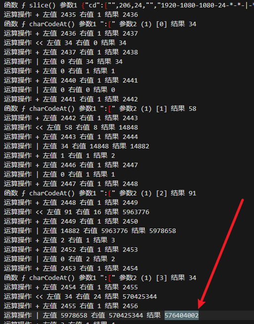

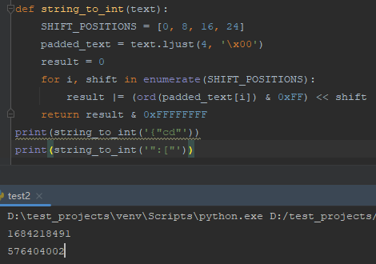

知道明文和密文了，最重要的还是要找到四位加密密钥

有两种方法来找

一种是技术型：根据加密算法的逻辑来分析日志找密钥

一种是懒人型：直接把日志片段扔给AI让它来找

建议各位先自己分析找找，看懂了算法去找其实很快的

实在找不到就用AI吧，我试过几个下来

还是deepseek的深度思考模型靠谱点，就是思考一次得5分钟

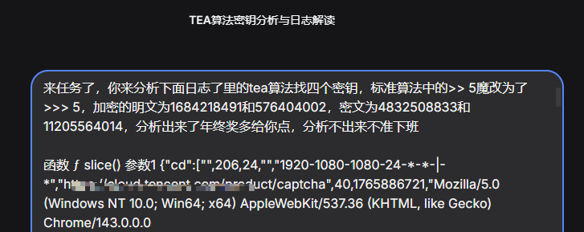

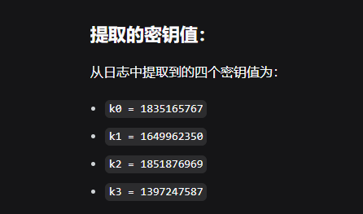

用AI给到的密钥套入试试

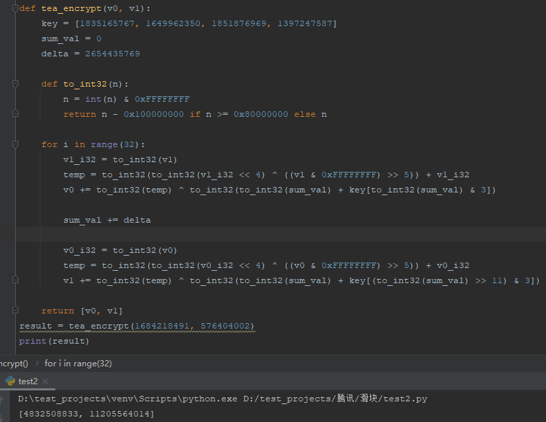

结果一致了

最后将所有计算出来的乱码字符串相加

进行base64编码就是最终的结果 collect 了

为了证明我们的算法是正确的

在浏览器上将 tdc.js 代码固定住

滑动验证码通过后获取 collect

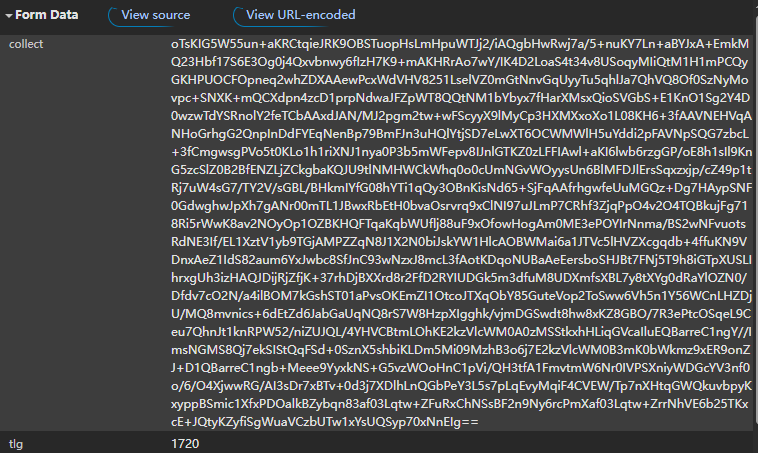

正向算法有了，逆向的算法那不是随便写

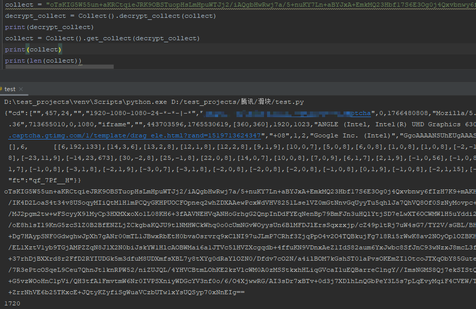

完美，加解密都ok

为什么我要固定js后再拿collect来测试

因为tea加密算法中的4个密钥也是随着tdc.js文件动态的

一个js一份密钥

想要自动获取这个密钥还是要分析日志看计算方式，这里我就不细说了

分析到这一步，密钥也差不多能自己拿下来了吧

还有就是加密的明文有固定的有动态的有需要计算的，都可以跟着日志慢慢分析

## pow参数分析

在校验接口的参数中

除了 collect 还有两个是需要逆向的

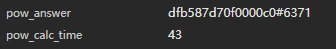

pow_answer 井号后面的数字和 pow_calc_time

搜索关键词可以定位到一处位置

断点过去发现参数已经有了

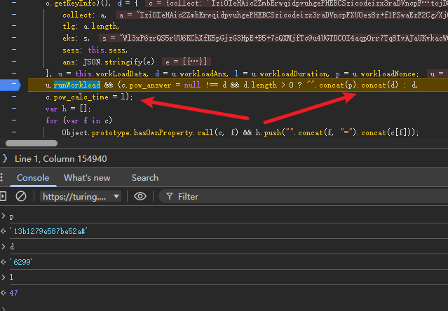

p 是从获取验证码信息的接口返回的

d 和 p 进行拼接就是 pow_answer

l 就是 pow_calc_time

再看更上面赋值过程

u = this.workLoadData

d = u.workloadAns

l = u.workloadDuration

再搜索关键词 workLoadData

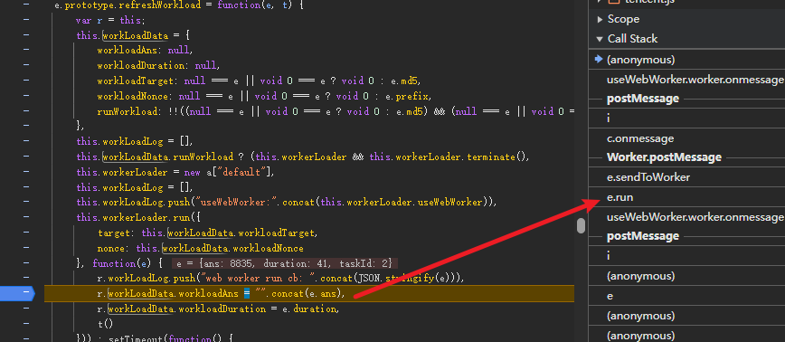

可以看到在这里也已经有值了，我们往上看堆栈信息

定位到 e.run 位置过去，很像启动点

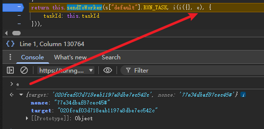

这里用了验证码接口返回的两个参数

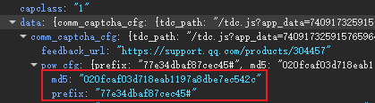

接着往下调试可以到如下位置

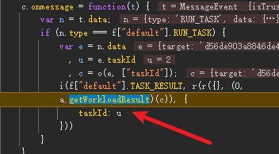

进入 a.getWorkloadResult 方法就是核心的算法位置了

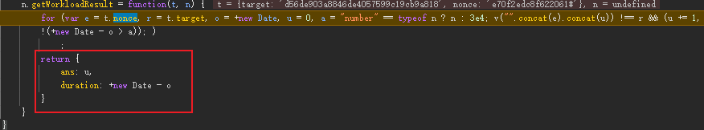

还原如下

```
def get_workload_result(self, nonce, target, timeout=30000):
    """
    工作量证明函数

    参数:
        nonce: 基础字符串
        target: 目标MD5哈希值
        timeout: 超时时间(毫秒)，默认30秒

    返回:
        dict: {'ans': 找到的数字, 'duration': 耗时(毫秒)}
    """
    start_time = time.time()
    timeout_seconds = timeout / 1000.0
    ans = 0

    while True:
        # 计算 MD5(nonce + ans)
        hash_input = f"{nonce}{ans}".encode('utf-8')
        md5_hash = hashlib.md5(hash_input).hexdigest()

        # 检查是否匹配目标
        if md5_hash == target:
            duration = int((time.time() - start_time) * 1000)
            return {
                'ans': ans,
                'duration': duration
            }

        ans += 1

        # 检查是否超时
        if time.time() - start_time > timeout_seconds:
            duration = int((time.time() - start_time) * 1000)
            return {
                'ans': ans,
                'duration': duration
            }
```

## 轨迹

虽说轨迹没有校验

但是不加的话 collect 长度太短了有强迫症

补环境在监听事件中处理

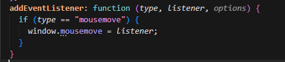

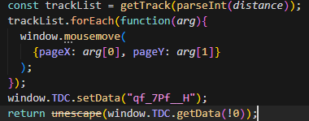

在 setData 之前将轨迹加入就行了

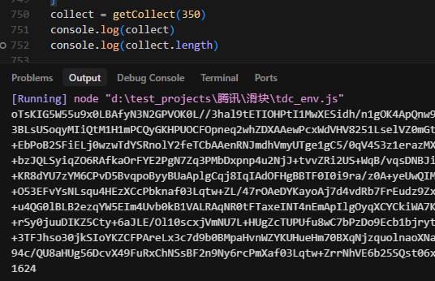

算法可以看日志，将坐标转换后又和上面大环境对象一样进行了切割处理和计算

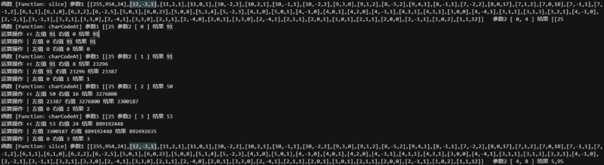

## 结果验证

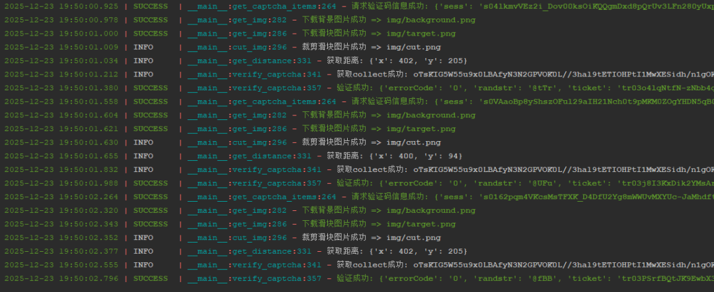
