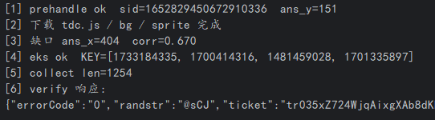
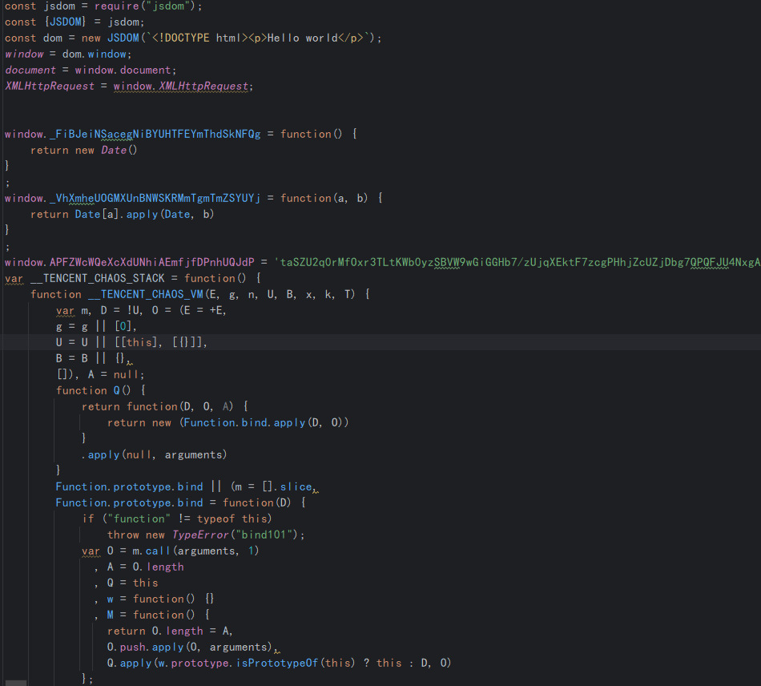
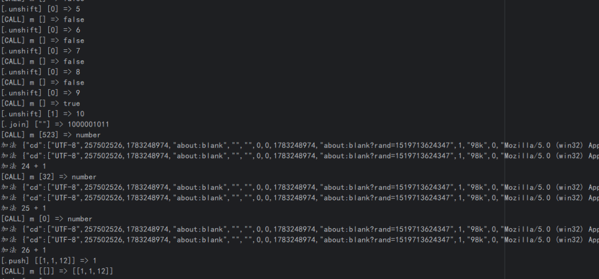
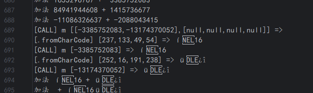
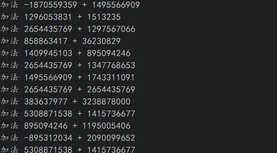
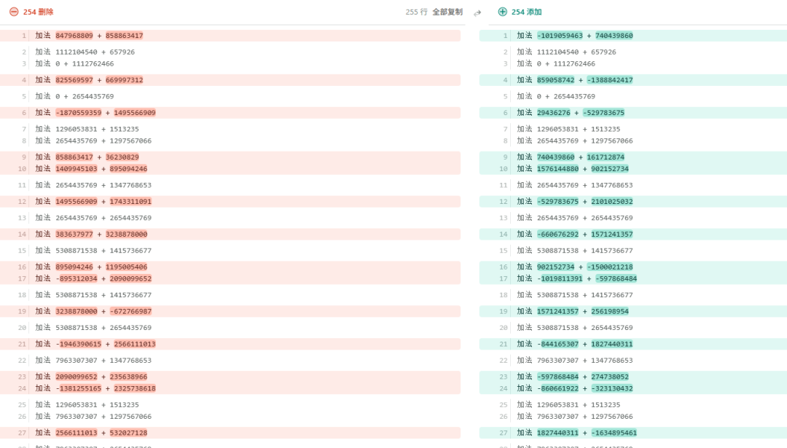
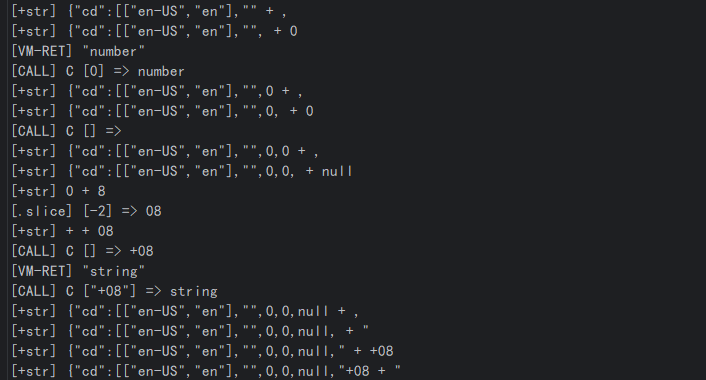
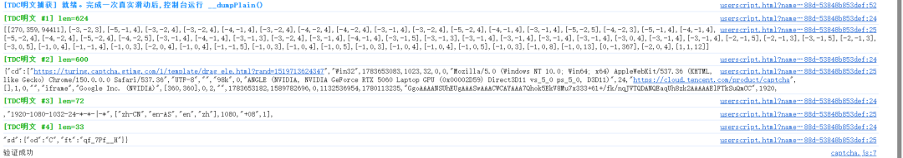
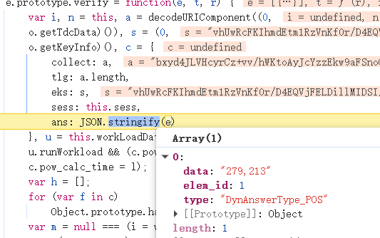
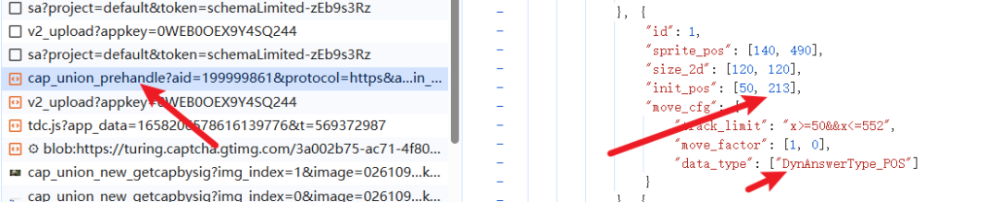

# 腾讯 TDC 滑块半纯算：jsvmp 插桩还原 XTEA 与动态 key 提取

> 来源: 微信公众号：猿人学Python（[原文](https://mp.weixin.qq.com/s/Z9JmapU1P6qTON8rf8Ma3Q)）
> 作者: 琴殇（投稿）
> 原始发布时间: 2026-08-13
> 归档日期: 2026-09-26
> 分类: web-reverse
>
> 腾讯 TCaptcha 滑块的 `collect` 由 `tdc.js` jsvmp 生成。在本地 IDE + jsdom 里给函数调用、方法调用（`charCodeAt` / `fromCharCode` / `slice` 等白名单）、加法和常量载入 handler 插桩，由魔数 `0x9E3779B9` 与 `((x<<4)^(x>>5))+x`、`key[(sum>>11)&3]` 判定为 XTEA；明文 4 字符小端打包成 v0/v1，密文小端拆字节，空格补齐到 8 的倍数后 base64 + URL 编码。key 随每次动态下发的 `tdc.js` 变化：注入加法 handler 统计「一个加数是 33 个 sum 值之一」的另一加数，去掉 DELTA 取前 4，再用 24 种排列试解出含 `"cd"` 的明文定序。环境指纹 `cd/sd` 与 `eks` 仍靠 jsdom 跑 tdc 现取，所以是「半纯算」；缺口用带 mask 的多尺度 `TM_CCOEFF_NORMED`，`pow_answer` 为 md5 前缀爆破。

## 收录说明

原文标题「某滑块纯算版全流程全讲解」，2026-08-13 10:43（UTC+8）发布于公众号「猿人学Python」，署名琴殇投稿，公众号标注原创。归档时用公开文章 URL 纯 HTTP 拉取（桌面 Chrome UA，无需登录、未遇验证页），`#js_content` 转 Markdown。10 张图已下载到 `web-reverse/tencent-tdc-slider-xtea-purecalc/`。正文按原结构保留（含作者自带的「1. 1.」重复编号和「•」列表符）。文末公众号征稿与业务推广（「长期征稿」「猿人学的业务」）按库规则截掉，保留「本文由 琴殇 投稿」。

作者没给油猴 hook 脚本和完整请求代码。文中 `pow_cfg` 前缀 / md5、截图里的 aid、appkey、指纹明文都是作者的样本值。

相关地图：

| 主题 | 文档 |
|------|------|
| 腾讯 TCaptcha / TDC 链路（prehandle / collect / eks / ans / PoW） | [tencent-captcha.md](./products/tencent-captcha.md) |
| 安全产品命中索引 | [products.md](./products.md) |
| AI 辅助 Web 逆向（JSVMP 是否拆 opcode） | [ai-assisted-web-reverse-compilation.md](./ai-assisted-web-reverse-compilation.md) |
| 魔改哈希与 TEA 家族密码笔记 | [xfq-crypto-notes-compilation.md](../signature-algorithms/xfq-crypto-notes-compilation.md) |
| 补环境浏览器对象面 | [browser-env-objects.md](./browser-env-objects.md) |
| 無色逆向腾讯滑块 vmp 上篇（cap_union 三接口 / 补环境检测点） | [tencent-tdc-slider-vmp-part1-env-patch.md](./tencent-tdc-slider-vmp-part1-env-patch.md) |
| 無色逆向腾讯滑块 vmp 下篇（CHAOS_VM 插桩 / 魔改 TEA collect / pow） | [tencent-tdc-slider-vmp-part2-tea-collect-pow.md](./tencent-tdc-slider-vmp-part2-tea-collect-pow.md) |

> 断断续续弄了一个月，但是感觉之前写的文章太烂了，没好意思接着写，重新开一篇，希望大家多多关注多多点赞，让作者开心一下（乐）。

**说在最前面**：t滑块没办法纯算，原因在于XTEA算法的密钥存在于tdc.js文件中的字节码中。并且tdc.js是动态的，密钥也是动态的。所以只能每次都要获取一次。但是这并不耽误咱们这样的一颗纯算的心，和破解jsvmp神奇魔盒的决胜心。

另外，有些地方是站在了巨人的肩膀上，但我会尽可能的讲的明白一些。

好，废话不多说，我们开始t滑块纯算的全流程讲解。

先放一个成果图吧。



在此之前，有无数先贤对t滑块进行了彻头彻尾的分析，于是，整个抓包流程，我简单给大家过一遍。

1、点击体验滑块，触发cap_union_prehandle接口。

2、跟栈打断点找到`window.TDC && "function" == typeof window.TDC.getData ? window.TDC.getData(!0) || "---" : "------"`加密入口。

3、jsvmp

**啰嗦一嘴**，其实有很多东西都是前后呼应的，如果没办法当个先知，那就用到了再说。

所以说，我们暂时也只需要拿一下tdc.js的后缀，然后请求js，拿到这个js。

这里可以直接写请求逻辑，当然，也可以先全复制下来（先分析jsvmp），等动态请求的时候**再说**

好了，我们把它拿到本地的IDE中。那么这时候就有人要问了，不在浏览器中做替换打断点插桩看日志这样去弄jsvmp吗，那你的这个环境指纹等等怎么办啊，这里是不是还有轨迹呢？

问的好，我的答案是，遇到了再说。路有很多，咋走都行，你补环境这个也能做。我IDE自然也能做，接着看。



如图所示，为了讲解，我重新抓了一个最热乎的js，拿出来之后，我们对它进行第一步，补jsdom。这就是我们在IDE中做，需要付出的代价，环境缺失。的确，环境的不同，会造成加密结果的不同，这是一定的。但是，换句话来说，加密一般是怎么形成的。是一些时间戳，环境信息，轨迹等等动态静态的东西，经过某种加密算法得来的加密字符串，那么好，我们要看的，就是这个加密过程，整个加密过程，是固定不变的，是由字节码决定的。所以，接下来，我们要开始插桩，去看日志信息，分析，或者说去猜，这是个什么算法。

## 插桩大法——妖魔鬼怪快离开

上文说到了，我们要进行插桩，诶？那我们插在哪里呢。

众所周知，jsvmp是在opcode handler中写的操作，也就是说，无论你是什么妖魔鬼怪的字节码，最终，一定会走handler。那么很清晰了，我们要看整个代码是怎么操作的，那就需要去在handler中，进行插桩。

在说插桩之前，我们写一个输出的日志函数，原因是日志输出庞大，单凭print控制台是看不全的，所以我们需要写在txt中。

```
var fs = require('fs');
var __TRACE = false;          // 全局门控:加载/init 期间保持 false
var __buf = [];
// 抓 TEA 第一块的全部加法,用来还原 key(key恒定/sum每轮+delta)
var __teaCap = false, __teaDone = false, __teaBuf = [];
// 抓 明文块→密文块 配对,用来 encrypt-and-match 锁定key顺序/变种
var __sawDelta = false, __ctDone = false, __pt = [];
// 抓喂给打包的明文片段(被4宽切片的长字符串)
var __plainArr = [], __plainSeen = {};
// 抓第一块的完整位运算流(前80个),用来重建精确轮体
var __opBuf = [];

function LOG() {
    if (!__TRACE) return;     // ← init 阶段直接返回,杜绝污染
    __buf.push(Array.prototype.map.call(arguments, function (x) {
        try {
            return typeof x === 'string' ? x : JSON.stringify(x);
        } catch (e) {
            return String(x);
        }
    }).join(' '));
    if (__buf.length >= 5000) {
        fs.appendFileSync('trace.txt', __buf.join('\n') + '\n');
        __buf = [];
    }
}

function FLUSH() {
    if (__buf.length) {
        fs.appendFileSync('trace.txt', __buf.join('\n') + '\n');
        __buf = [];
    }
}

fs.writeFileSync('trace.txt', '');   // 每次跑清空
;;;//vmp代码
//尾部
var _getData = window.TDC.getData;
window.TDC.getData = function () {
    __TRACE = true;                          // ← 只有这一段被记录
    var r = _getData.apply(this, arguments);
    __TRACE = false;
    FLUSH();
    return r;
};
var collect = window.TDC.getData(true);
FLUSH();
fs.writeFileSync('collect.txt', collect);
fs.writeFileSync('plainpieces.txt', __plainArr.join('\n=====PIECE=====\n'));
console.log('done. collect length =', collect.length, ' pieces =', __plainArr.length);
```

> AI味十足，没错，AI写的。合理使用工具，重要的是思路。这里有看不懂的暂时先放下，后面会说到。
>
> 简单来说，就是让想看到的东西显现出来。当然，这里是直接把所有处理到的地方都写出来了，自己做日志的时候可以一点点来。

### 函数调用处

插桩前

```
function() {
            var D = g[E++]// ① 取参数个数
              , O = D ? U.slice(-D) : [];// ② 把栈顶 D 个元素当作实参数组
            U.length -= D, // ③ 把这 D 个实参从栈上移除
            U.push(U.pop().apply(n, O))// ④ 弹出函数、以 this=n 调用、结果压回
        }
```

为了更好理解插桩后的内容，我们先理解一下插桩前在干什么。

在这里，我把注释打好了，那么也不难看出，O是函数的参数数组，U.pop()就是函数，而U.pop().apply(n, O)，就是函数执行后的结果。所以，开始插桩

插桩后

```
, function () {
    var D = g[E++], O = D ? U.slice(-D) : [];
    U.length -= D;
    var fn = U.pop();                        // ← 先把函数单独取出来(为了拿 fn.name)
    var ans = fn.apply(n, O);                // ← 结果单独存 ans(为了打印)
    if (__TRACE) LOG("[CALL]", (fn && fn.name) || "(anon)", O, "=>", ans);
    U.push(ans);
}
```

### 方法调用处

除了函数之外，方法调用也是必不可少的。记录"在哪个对象上调了哪个方法、参数、返回值"。

那么就有人要问了，为什么这重要啊，函数调用还能理解，很常见。那方法调用和我们这个加密逻辑，有神马关系。

那么好，有几个方法需要特别关注，'charCodeAt','fromCharCode''indexOf','charAt','toString'......

这么一说，是不是突然明白为什么要在这进行插桩了。没错，我们的目标就是精准打击所有对字符串动手的方法。让加密无处遁形。

插桩前

```
function () {
                var D = g[E++]// ① D 先当"参数个数"
                    , O = D ? U.slice(-D) : []// ② 用旧 D 切出栈顶 D 个实参
                    , D = (U.length -= D,// ③ 先用旧 D 砍掉实参
                    U.pop());// ④ 再 pop，D 被重新赋值为引用单元 [obj,key]
                U.push(D[0][D[1]].apply(D[0], O))// ⑤ obj[key](args)，this=obj，结果压栈
}
            }
```

还是老规矩，我们先看看插桩前干了些什么。

单看注释不是很好理解，那么举一个例子，或许能明白许多。

假设我们想执行Math.max(3, 8)，并且栈目前是这样的 [ [Math,"max"], 3, 8 ]

| 步 | 表达式 | 结果 |
|---|---|---|
| ① | `D = g[E++]` | `D = 2`（参数个数） |
| ② | `O = U.slice(-2)`取栈顶 | `O = [3, 8]` |
| ③ | `U.length -= 2`取完就砍掉 | 栈 → `[ [Math,"max"] ]` |
| ④ | `D = U.pop()`拿出来 | `D = [Math, "max"]` |
| ⑤ | `D[0][D[1]]` | `Math["max"]` = `Math.max` 函数 |
| ⑤ | `.apply(D[0], O)` | `Math.max.apply(Math, [3,8])` = `8` |
| ⑤ | `U.push(8)` | 栈 → `[ 8 ]` |

以一个具体的例子，讲了一下方法调用的发生过程，那么接下来，我们就要进行插桩处理

插桩后

```
, function () {
    var D = g[E++], O = D ? U.slice(-D) : [];
    U.length -= D;
    var pair = U.pop(), obj = pair[0], key = pair[1];   // 拆成 对象 obj、方法名 key
    var ans = obj[key].apply(obj, O);
    if (__TRACE) {
        var FOCUS = ['charCodeAt','fromCharCode','push','join','shift','unshift',
                     'concat','replace','split','slice','substring','indexOf','charAt','toString'];
        if (FOCUS.indexOf(key) > -1) LOG("[." + key + "]", O, "=>", ans);   // 只记白名单里的方法
    }
    U.push(ans);
}
```

紧接着，一个小问题，为什么我们要FOCUS来进行处理。因为如果所有方法都打印的话，日志过于庞大，难以阅读。所以我们只对这些字符串类操作的方法进行日志输出。

### 字符串加法处

插桩前

```
, function () {
                U[U.length - 2] = U[U.length - 2] + U.pop()
            }
```

这里是最好理解的handler了，这个handler不仅是字符串加法，同时也是数字加法。这也就是为什么在下面插桩的时候加入了判断类型为字符串时的原因。

由于其简单，我们就直接说不举例了，这里实际上就是取了栈顶的两个元素，一个栈顶U.pop()，另一个栈顶的下一个U[U.length - 2]，而后相加赋值给U[U.length - 2]，也就是栈顶元素（因为在写U.length - 2的时候U还没弹出栈顶元素，所以在弹出之后它是栈顶）

插桩后

```
, function () {
        LOG(“加法”,U[U.length - 2], "+", U[U.length - 1]);
    U[U.length - 2] = U[U.length - 2] + U.pop()
}
```

## 日志输出分析

在插桩结束后，进行第一轮的日志分析。

### 一些环境检测



### 字符串拼接



**两个 32 位密文字,按小端序各拆成 4 字节,组成 8 字节密文块 `í16ü¿î`,并写入密文串的第一块**。后面几组同样的 `m/fromCharCode/加法`

仅仅这些内容，够不够我们判断出它是什么加密呢。我豆包了一下，还是不够的，我们还需要找别的东西进一步的验证



机智的你很快发现，每一次拼接加密字符串前，都会进行很多的计算，那么，我们尝试将两次计算重叠对比，看看有啥相似处没。



两次计算对比，发现确实有重叠地方，说明了，其中的计算是有重复值存在的，先找出重复出现的值，再去搜一下，看看是不是特征值。结果就可以发现2654435769，TEA特征，魔数。在此致敬所有摸索算法特征算法结构算法本质的先辈。

### TEA算法

在这里，我们先去学习一下，标准的TEA是怎么进行加密的，这样，才能更好的理解分析日志信息。

```
void encrypt(uint32_t v[2], uint32_t k[4]) {
    uint32_t v0 = v[0], v1 = v[1];
    uint32_t sum = 0;
    uint32_t delta = 0x9E3779B9;          // 魔数
    for (int i = 0; i < 32; i++) {         // 32 轮
        sum += delta;
        v0 += ((v1 << 4) + k[0]) ^ (v1 + sum) ^ ((v1 >> 5) + k[1]);
        v1 += ((v0 << 4) + k[2]) ^ (v0 + sum) ^ ((v0 >> 5) + k[3]);
    }
    v[0] = v0; v[1] = v1;
}
```

> TEA（Tiny Encryption Algorithm，微型加密算法）是 1994 年由剑桥大学的 David Wheeler 和 Roger Needham 设计的**分组对称加密算法**。它的最大特点是**实现极其简单**——核心代码只有几行,没有 S 盒、没有查表,纯粹靠移位、加法和异或。

先来简单说一下这个算法`本代码为c`。

先看参数，由**64 位**(2 个 uint32:v0, v1)明文和**128 位**(4 个 uint32:k[0..3])密钥构成，讲明文分为两个32位变量。每轮就干两件事，用v1的值算v0，再用v0的值算v1。搭配密钥，魔数来进行整个加密过程，总共重复32轮。而魔数的作用是，**每一轮把 `sum` 累加 delta,让每一轮的常量都不同**,破坏各轮之间的对称性。

好，我们学会了标准的TEA，那就可以反过来，对插桩进行一些细微的增加，来让计算过程更明晰。以此证明，是否是标准的TEA。

### 插桩——载入常量

插桩前

```
 , function () {
                U.push(g[E++])
            }
```

插桩后

```
, function () {
    var c = g[E++];
    if (c === 2654435769) {                  // 0x9E3779B9 = TEA delta 魔数
        if (__TRACE) LOG("TEA delta(0x9E3779B9) 载入");
        if (!__teaDone) __teaCap = true;
    }
    U.push(c)
}
```

我们在此插桩，以此快速找到TEA开始的地方，同时，在此设计一个计算门槛，当计算门槛为true时，其余计算开始日志输出

### 插桩——明晰算法

我们既然想要看清楚算法本质运算过程，那么与TEA相关的运算符号，我们都要进行插桩。

**>>**

```
if (__teaCap && __opBuf.length < 80) __opBuf.push(">> " + (U[U.length - 2] >>> 0) + " " + (U[U.length - 1] >>> 0));
```

**>>>**

```
if (__teaCap && __opBuf.length < 80) __opBuf.push(">>> " + (U[U.length - 2] >>> 0) + " " + (U[U.length - 1] >>> 0));
```

&

```
if (__teaCap && __opBuf.length < 80) __opBuf.push("& " + (U[U.length - 2] >>> 0) + " " + (U[U.length - 1] >>> 0));
```

**^**

```
if (__teaCap && __opBuf.length < 80) __opBuf.push("^ " + (U[U.length - 2] >>> 0) + " " + (U[U.length - 1] >>> 0));
```

**<<**

```
if (__teaCap && __opBuf.length < 80) __opBuf.push("<< " + (U[U.length - 2] >>> 0) + " " + (U[U.length - 1] >>> 0));
```

**+**

```
if (__teaCap && __opBuf.length < 80)
                    __opBuf.push("+ " + (U[U.length - 2] >>> 0) + " " + (U[U.length - 1] >>> 0));
```

补充内容

还记得之前写过那一堆变量的定义吗。在这里，为大家说明\_\_teaCap，\_\_opBuf，\_\_teaDone在我们代码中的作用

\*\*`__teaCap`\*\*在载入 delta 时 → `if (!__teaDone) __teaCap = true`**它唯一的作用是让那些记录代码分清——"现在这次运算,到底是不是 TEA 的一部分,要不要记下来。**

而\_\_teaDone，是为了保证记录完整一次计算的门锁，我们只需要看一次就够了，这样就能知道这个算法是否是标准算法。

\_\_opBuf，看到那个push了吗，我们可以保证不污染原日志的基础上，新写一个TEA观察计算的日志信息。而这个opbuf就是装日志的桶。

```
, function () {
                var D = g[E++], O = D ? U.slice(-D) : [];
                U.length -= D;
                var pair = U.pop(), obj = pair[0], key = pair[1];   // 拆成 对象 obj、方法名 key
                var ans = obj[key].apply(obj, O);
                if (__teaCap && key === 'fromCharCode') {   // 第一块 TEA 结束，落盘全部加法
                    __teaCap = false;
                    __teaDone = true;      // 关闸，且防止后续 delta 重新点火
                    fs.writeFileSync('tea.txt', __teaBuf.join('\n'));
                    fs.writeFileSync('ops.txt', __opBuf.join('\n'));
                }
                if (__TRACE) {
                    var FOCUS = ['charCodeAt', 'fromCharCode', 'push', 'join', 'shift', 'unshift',
                        'concat', 'replace', 'split', 'slice', 'substring', 'indexOf', 'charAt', 'toString'];
                    if (FOCUS.indexOf(key) > -1) LOG("[." + key + "]", O, "=>", ans);   // 只记白名单里的方法
                }
                U.push(ans);
            }
```

最后，在方法调用处的插桩再做处理，这样，再跑一遍，去看日志。

为了清晰的说明，我直接把日志输出拿过来

```
+ 0 2654435769
>>> 2654435769 11
& 1296111 3
>>> 2654435769 11
& 1296111 3
<< 1125677595 4
>>> 1125677595 5
^ 830972336 35177424
+ 866083424 1125677595
>>> 2654435769 11
& 1296111 3
+ 1296053831 1513235
+ 2654435769 1297567066
^ 1991761019 3952002835
+ 842083377 2637765480
& 3 2654435769
& 3 2654435769
<< 3479848857 4
>>> 3479848857 5
^ 4137974160 108745276
+ 4041157548 3479848857
& 3 2654435769
+ 2654435769 1347768653
^ 3226039109 4002204422
+ 1125677595 784709699
+ 2654435769 2654435769
>>> 1013904242 11
& 495070 3
>>> 1013904242 11
& 495070 3
<< 1910387294 4
>>> 1910387294 5
^ 501425632 59699602
+ 510514290 1910387294
>>> 1013904242 11
& 495070 3
+ 1013904242 1415736677
^ 2420901584 2429640919
+ 3479848857 10315271
& 3 1013904242
& 3 1013904242
<< 3490164128 4
>>> 3490164128 5
^ 8051200 109067629
+ 117106541 3490164128
& 3 1013904242
+ 1013904242 1415736677
^ 3607270669 2429640919
+ 1910387294 1205073370
+ 1013904242 2654435769
>>> 3668340011 11
& 1791181 3
>>> 3668340011 11
& 1791181 3
<< 3115460664 4
>>> 3115460664 5
^ 2602730368 97358145
+ 2666468033 3115460664
>>> 3668340011 11
& 1791181 3
+ 3668340011 1347768653
^ 1486961401 721141368
+ 3490164128 1918534785
& 3 3668340011
& 3 3668340011
<< 1113731617 4
>>> 1113731617 5
^ 639836688 34804113
+ 607138689 1113731617
& 3 3668340011
+ 1296053831 1513235
+ 3668340011 1297567066
^ 1720870306 670939781
+ 3115460664 1097850663
+ 3668340011 2654435769
>>> 2027808484 11
& 990140 3
<< 4213311327 4
>>> 4213311327 5
^ 2988471792 131665978
```

```
<< 1125677595 4          ← v << 4
>>> 1125677595 5         ← v >>> 5
^ 830972336 35177424     ← (v<<4) ^ (v>>5)
+ 866083424 1125677595   ← ((v<<4)^(v>>5)) + v
```

看这段，先说明，c语言中的>>等价于js中的>>>，这四行操作，恰恰是 **XTEA 的招牌内层 `((x<<4) ^ (x>>5)) + x`。标准 TEA 永远不会把一个数的 `<<4` 和 `>>5` 直接异或**——标准 TEA 是 `((v<<4)+k0)` 和 `((v>>5)+k1)` 两个**分开的项各自先加 key**。

紧接着

```
>>> 2654435769 11        ← sum >> 11
& 1296111 3              ← (sum>>11) & 3
+ 2654435769 1297567066  ← sum + key[idx]
^ 1991761019 3952002835  ← 内层 ^ (sum+key)
+ 842083377 2637765480   ← 数据字 += 上面整个结果
```

`(sum >> 11) & 3` 这种**用 sum 现算 key 下标**的动作,是 XTEA 独有的(另一半用 `sum & 3`,输出里 `& 3 2654435769` 就是)。**标准 TEA 的 key 是写死的 k0/k1/k2/k3,根本不会去算下标。**

拼起来，就是标准的XTEA半轮。

```
data += ( ((x<<4) ^ (x>>5)) + x ) ^ ( sum + key[(sum>>11)&3] )
```

所以，到此，我们确定了，该加密算法为TEA家族中的XTEA。

## 神奇的指纹，探索XTEA的入参

说完加密方法，那就要说回它加密了什么，也就是大家最关心的，环境指纹和轨迹。

这段内容在我们插桩打日志的时候就已经发现了，有一段cd:....并且是在加法处出现的



那么，我来梳理一下思路。我们现在的目标就是两个，第一，弄清楚这个环境明文是怎么变成XTEA算法的参数的。第二，弄清楚真实浏览器环境下的明文到底是什么。

我们一个一个来。

### 明文变参数

想弄清楚明文是怎么变成加密参数的，那就还是要从日志下手。

> 各位大佬看到这，小弟先给打个预防针，t滑块没办法纯算，甚至我们需要用到一定的补环境，才能够使用自写的算法去请求。所以补环境或许是t滑块的最佳选择，不过为了研究算法本质，我们走了纯算的路。

```
[.slice] [0,4] => [[1,
[.charCodeAt] [0] => 91
[.charCodeAt] [1] => 91
[.charCodeAt] [2] => 49
[.charCodeAt] [3] => 44
[CALL] C ["[[1,"] => 741432155
[.slice] [4,8] => 1,12
[.charCodeAt] [0] => 49
[.charCodeAt] [1] => 44
[.charCodeAt] [2] => 49
[.charCodeAt] [3] => 50
[CALL] C ["1,12"] => 842083377
```

我们先把一小段日志拿过来，去分析。

```
[.charCodeAt] [0] => 91     ← '['
[.charCodeAt] [1] => 91     ← '['
[.charCodeAt] [2] => 49     ← '1'
[.charCodeAt] [3] => 44     ← ','
[CALL] C ["[[1,"] => 741432155
```

最后 1 行:把这 4 个编号**打包成一个 32 位数字 `741432155`**。这个数字就是喂给加密的 **v0**。

紧接着842083377就是喂给加密的v1。

那C函数是怎么把四个字符变成的一串数字呢。我们就以v1为例

```
'1' = 49  →  49
',' = 44  →  44 × 256      = 11264
'1' = 49  →  49 × 256×256   = 3211264
'2' = 50  →  50 × 256×256×256 = 838860800
                       相加 = 842083377   ← 正好等于日志里的 C["1,12"] => 842083377
```

**第 1 个字符占最低 8 位,第 2 个字符往左挪 8 位,第 3 个挪 16 位,第 4 个挪 24 位,加起来。**

由此，我们得知，这两个数,就是「明文变成的参数」

### 参数变密文

这一段在讲TEA的时候就已经探明，不过，在前面我们并没有把XTEA的算法写出来，所以，本小节只放XTEA的算法，以表现出参数是如何变为密文的。

> 算法见下。

### 密文变字符

同样要看日志

```
[CALL] C [[1322355561,1837031786]] =>
[.fromCharCode] [105,139,209,78] => i‹ÑN
[CALL] C [1322355561] => i‹ÑN
[.fromCharCode] [106,225,126,109] => já~m
[CALL] C [1837031786] => já~m
[+str] i‹ÑN + já~m
```

这个 `[1322355561, 1837031786]` 就是加密结果 **(c0, c1)**——v0/v1 转 32 轮后的密文。然后把这两个数字**拆回字符**:

`fromCharCode` 是 `charCodeAt` 的反操作:**把编号变回字符**。这里说明 `C(1322355561)` 内部先把 c0 拆成 4 个字节 `105 139 209 78`,再变成字符串 `iÑN`。

和刚才一样，你可能会不理解，`[.fromCharCode] [105,139,209,78]`，这四个数是哪来的。

```
1322355561 换成 16 进制 = 4E D1 8B 69
小端(从低位往高位读):69, 8B, D1, 4E = 105, 139, 209, 78
                                     ↑ 正好是日志里 fromCharCode 的入参
```

就是这样~~

> AI+先辈的探索得来

### 算法还原

```
DELTA = 0x9E3779B9
MASK  = 0xFFFFFFFF
# ---------- 1) 核心:加密一个 8 字节块 (v0, v1) ----------
def encrypt_block(v0, v1, key):
    s = 0
    for _ in range(32):
        f  = ((((v1 << 4) & MASK) ^ (v1 >> 5)) + v1) & MASK
        v0 = (v0 + (f ^ ((s + key[s & 3]) & MASK))) & MASK

        s  = (s + DELTA) & MASK

        f  = ((((v0 << 4) & MASK) ^ (v0 >> 5)) + v0) & MASK
        v1 = (v1 + (f ^ ((s + key[(s >> 11) & 3]) & MASK))) & MASK
    return v0, v1
# ---------- 2) 打包 / 解包(小端)----------
def pack(s4):
    b = [ord(c) for c in s4]
    return (b[0] | (b[1] << 8) | (b[2] << 16) | (b[3] << 24)) & MASK
# ---------- 3) 整串加密 ----------
def unpack(w):
    return ''.join(chr((w >> (8 * i)) & 0xFF) for i in range(4))

def encrypt(plain, key):
    if len(plain) % 8:
        plain += ' ' * (8 - len(plain) % 8)
    out = []
    for i in range(0, len(plain), 8):
        v0 = pack(plain[i:i+4])
        v1 = pack(plain[i+4:i+8])
        c0, c1 = encrypt_block(v0, v1, key)
        out.append(unpack(c0) + unpack(c1))
    return ''.join(out)
```

这里还有个key，这个key也就是导致无法纯算tx滑块的原因，后面我们放一大节去讲怎么取。

### 油猴取加密明文

既然我们已经明白了，明文是怎么转化成加密字符的。那么我们的目标就很明确了，去拿一次真正的明文。

那么问题来了，我们的油猴该怎么写，才能抓到明文呢。

**tdc 要打包明文,就必须调用 `slice` 把明文切成 4 字符一块;而我们把 `slice` 这个方法本身换成了自己的——于是明文每次经过 `slice`,都先从我们手里过一遍。**

所以，目标就是hook这个slice。

```
油猴脚本我就不放了，有需要的可以私信我，或者自己凭借思路去ai一个，这里我就只放思路了
```

> 1. 1. **滑动完成**,tdc 把环境+轨迹拼成一条大串,比如 `collect = "[[1,1,12]]......(几百上千字符)"`。
> 2. 2. tdc 要加密它 → 要打包 → 于是调用 `collect.slice(0, 4)` 取第一块。
> 3. 3. 这一下**被路由进我们的 `wrapped`**。此刻:
> 4. 4. `wrapped` 再调用原生的 `nativeSlice.apply(this, [0,4])`,把 `"[[1,"` 正常返回给 tdc。**tdc 拿到它要的东西,毫无察觉。**
> 5. 5. tdc 接着 `collect.slice(4,8)`、`slice(8,12)`……又一次次进 `wrapped`,但 `this` 还是同一条 `collect`,`SEEN` 里已经有了 → **跳过不再打印**。

效果图：



## 密钥——揭开算法的面纱

行文至此，想必大家已经清晰了整个链路，但是我们还棋差一招。key。

想要拿到XTEA的key，就必须要在tdc.js中动手，因为tdc.js是随着每次准备接口返回回来的数据而动态的，key是动态在字节码中的。这才是最关键的难点。

其实也没有那么麻烦，我们不妨重看一遍XTEA算法。

```
def encrypt_block(v0, v1, key):
    s = 0
    for _ in range(32):
        f  = ((((v1 << 4) & MASK) ^ (v1 >> 5)) + v1) & MASK
        v0 = (v0 + (f ^ ((s + key[s & 3]) & MASK))) & MASK

        s  = (s + DELTA) & MASK

        f  = ((((v0 << 4) & MASK) ^ (v0 >> 5)) + v0) & MASK
        v1 = (v1 + (f ^ ((s + key[(s >> 11) & 3]) & MASK))) & MASK
    return v0, v1
```

仔细看，每一次的加密过程，固定不变的是什么

key和DELTA

那MASK是什么？

> `MASK = 0xFFFFFFFF`,就是**32 个 1**(二进制 `1111...1111`,共 32 位),数值上等于 2³²−1 = 4294967295。
>
> 它的作用只有一个:**`x & MASK` = 只保留 x 的最低 32 位,高于第 32 位的部分全部丢掉。**

那v0和v1呢？这两个每次加密都是不一样的，所以不能算在内。

那也就是说，**只监听加密过程中的加法,排掉魔数 DELTA,剩下频率最高的 4 个数就是 key;再按它们各自配对的 sum 下标排好 key[0..3],密钥就齐了**

> 再做个小说明，我做的这版半纯算，**算法是纯的**:XTEA 加解密、打包、取 key,全是自己实现,不靠浏览器;**解题是真的**:缺口用 CV 识别、轨迹自己造、POW 自己算、答案自己填;**环境指纹是补的**:那堆 cd/sd 字段没法离线纯算(依赖真实浏览器 API),所以让 jsdom 补一份伪造值顶上——**这就是"半"字的由来**。

好，那么接下来，就到了最激动的时刻了。我们怎么在动态的js中获取这些呢。咱们就一次性的看。

主要分为三块

slice-hook 抓明文片段，加法捕获key，真轨迹

在这里把源码放出来了，原理之前都有讲过。

```
// 从新 tdc.js 抽 XTEA key调度 + eks + 明文片段 + JS collect(用于本地校验)
const jsdom = require("jsdom");
const { JSDOM } = jsdom;
const dom = new JSDOM(`<!DOCTYPE html><p>x</p>`, { url: "https://turing.captcha.gtimg.com/" });
window = dom.window;
document = window.document;
XMLHttpRequest = window.XMLHttpRequest;
window.TCaptchaApiDomain = "https://turing.captcha.qcloud.com";
window.AqSCodeCapDomain = "https://turing.captcha.qcloud.com";

const fs = require("fs");
const TDC_PATH = process.argv[2] || "tdc_fresh.js";
const OUT = process.argv[3] || ".";
let js = fs.readFileSync(TDC_PATH, "utf-8");

// 1) slice-hook 抓明文片段(4宽切片的长串)
global.__pieces = []; global.__seen = {};
const _slice = String.prototype.slice;
String.prototype.slice = function (a, b) {
    if (typeof this === "string" && this.length > 6 && typeof a === "number" && typeof b === "number" && b - a === 4) {
        var s = String(this); if (!__seen[s]) { __seen[s] = 1; __pieces.push(s); }
    }
    return _slice.apply(this, arguments);
};

// 2) 注入加法捕获(频率分析 + 还原调度)
global.__adds = [];
const NEEDLE_RE = /([A-Za-z_$][\w$]*)\[\1\.length-2\]=\1\[\1\.length-2\]\+\1\.pop\(\)/;
const m = js.match(NEEDLE_RE);
if (!m) { console.log("NEEDLE_NOT_FOUND"); process.exit(1); }
const NEEDLE = m[0];
const g = m[1];
const INJ = 'if(typeof ' + g + '[' + g + '.length-2]==="number"&&typeof ' + g + '[' + g + '.length-1]==="number"&&__adds.length<40000)__adds.push((' + g + '[' + g + '.length-2]>>>0)+","+(' + g + '[' + g + '.length-1]>>>0));' + NEEDLE;
js = js.replace(NEEDLE, function () { return INJ; });

let collect = "";
try { eval(js); } catch (e) { console.log("EVAL_ERR:", e.message); }

// 模拟从 x=50 滑到缺口,让 TDC 录真轨迹
const GAPX = parseInt(process.argv[4] || "0");
if (GAPX > 0) {
    try {
        const fire = (type, x, y) => window.document.dispatchEvent(
            new window.MouseEvent(type, { clientX: x, clientY: y, bubbles: true, cancelable: true, view: window }));
        let sx = 50, sy = 300, steps = 45;
        fire("mousedown", sx, sy);
        for (let i = 1; i <= steps; i++) {
            let x = sx + Math.round((GAPX - sx) * i / steps);
            fire("mousemove", x, sy + (i % 4 ? 0 : 1));
        }
        fire("mousemove", GAPX, sy);
        fire("mouseup", GAPX, sy);
    } catch (e) { console.log("SLIDE_ERR:", e.message); }
}

try { collect = window.TDC.getData(true) || ""; } catch (e) { console.log("GETDATA_ERR:", e.message); }

let eks = "";
try { eks = (window.TDC.getInfo() || {}).info || ""; } catch (e) { }
console.log("ADDS=" + __adds.length + " PIECES=" + __pieces.length + " COLLECT_LEN=" + collect.length);
console.log("EKS=" + eks);
fs.writeFileSync(OUT + "/adds.txt", __adds.join("\n"));
fs.writeFileSync(OUT + "/pieces_fresh.txt", __pieces.join("\n=====PIECE=====\n"));
fs.writeFileSync(OUT + "/collect_fresh.txt", collect);
fs.writeFileSync(OUT + "/eks.txt", eks);
```

当然，还没有结束，我们只说了如何找，如何拿，还没有说如何取

所以，从现在开始，我们要开始编织py的网。

刚才那一步我们拿到了adds.txt，所以这一步，我们就要开始炼钥匙。

### 第 1 步:读加法

```
adds = []
for line in open(HERE + '/adds.txt', encoding='utf-8'):
    line = line.strip()
    if ',' in line:
        a, b = line.split(',')
        adds.append((int(a), int(b)))
```

`adds.txt` 每行是一次加法的两个操作数 `a,b`,读进来变成一堆 `(a, b)` 数对。里面什么加法都有:`s+=delta` 的、`f+v` 的、`v+=…` 的,当然还有我们真正要的 `s + key`。

### 第 2 步:列sum

```
valid_sums = set()
for i in range(33):
    valid_sums.add((i * DELTA) & MASK)
```

`s` 从 0 开始每轮 `+= delta`,32 轮下来只会是这 **33** 个值:`0, delta, 2delta, …, 32delta`。**这串数是死的,跟明文无关,提前算出来备用。**

### 第 3 步:抓 key

```
counter = Counter()
for a, b in adds:
    if a in valid_sums:
        counter[b] += 1
```

key 在算法里**只出现在 `s + key[idx]` 这一处**,而这里的 `s` 一定是上面那 33 个 sum 值之一。**所以规则极其干净——凡是"一个加数是 sum 值"的加法,它的另一个加数就是 key。** 扫一遍所有加法,把这种加法的另一半 `b` 投票计数即可。

### 第 4 步:去魔数

```
candidates = []
for value, _cnt in counter.most_common(8):
    if value != DELTA:
        candidates.append(value)
    if len(candidates) == 4:
        break
```

### 第 5 步:定顺序

```
KEY = None
for perm in itertools.permutations(candidates):        # 4! = 24 种
    if '"cd"' in decrypt_collect(collect_ref, list(perm))[:12]:
        KEY = list(perm)
        break
```

在有 4 个 key 值,但**不知道谁是 `key[0]`、谁是 `key[3]`**。而算法里下标是 `s&3`、`(s>>11)&3` 现算的,顺序错一位,结果全崩。办法很粗暴也很聪明——**24 种排列全试一遍,哪种能把 collect 解成人话,哪种就对**:

`decrypt_collect` 就是 XTEA 解密。明文是一段指纹 JSON,**开头十来个字符里必带 `"cd"`**。只要某个排列解出来带 `"cd"`,就说明这组 key 的**值和顺序全对了**

### 第 6 步:解明文

```
core = decrypt_collect(collect_ref, KEY)
core = core[:core.rfind('}') + 1]
```

用敲定的key解密,得到完整明文 `core`。因为加密前明文被空格补齐到 8 的倍数,解出来尾巴会拖一串空格;`rfind('}')` 找到最后一个 `}` 切掉,就是干净的指纹 JSON。**这个 `core`,就是我们下一步要往里塞真轨迹的模板。**

## 滑块——轨迹的祖先

要解轨迹问题，首先就要解决滑块的识别问题。

```
bg:背景大图(带缺口)
sprite:精灵图(一张大图,拼图块切在里面)
answer_elem:prehandle 里挑出来的答案拼图块配置
```

那么讲讲思路。

拼图块是从**背景原图上抠下来的一小块**,带着原图纹理;而背景上的缺口,就是**同一块地方被压暗**留下的坑。两者纹理一模一样,只是亮度不同。所以找缺口 = 拿拼图块当模板,在背景里做模板匹配。但直接比像素会被"压暗"骗到,于是用 **`TM_CCOEFF_NORMED`**（OpenCV `matchTemplate`(模板匹配)的一种**打分方式**）——它**先把两边各自减掉均值再比**,只看纹理起伏、不看绝对亮度,压暗多少都不怕。**这是整个识别的整体思路。**

### 第1步：背景转灰度

```
bg_gray = cv2.cvtColor(bg, cv2.COLOR_BGR2GRAY).astype(np.float32)
sprite  = np.array(Image.open(io.BytesIO(sprite_bytes)).convert('RGBA'))
```

背景转灰度(匹配只要纹理);精灵图带 alpha,因为拼图块是**不规则形状**,得靠 alpha 分清哪是实体、哪是透明。

### 第2步：抠图,再剪

```
box = sprite[spy:spy+ph, spx:spx+pw]              # 按 sprite_pos/size_2d 抠出方框
ys, xs = np.where(box[:, :, 3] > 10)              # alpha>10 = 不透明的实体像素
x0, y0, x1, y1 = int(xs.min()), int(ys.min()), int(xs.max()+1), int(ys.max()+1)
left_inset = x0                                    # 实体距方框左边的空白宽度
piece = box[y0:y1, x0:x1]                          # 只留实体块
```

### 第3步：算出滑轨能到的 x 范围

```
lo, hi = 50, 552
nums = re.findall(r'\d+', elem.get('move_cfg', {}).get('track_limit', ''))
if len(nums) >= 2: lo, hi = int(nums[0]), int(nums[1])
```

从 `track_limit` 抠两个数,把搜索限制在滑轨可达区间,免得匹配到轨道外的干扰。

### 第4步： 多尺度模板匹配

```
for scale in (0.78, 0.85, 0.92, 1.0, 1.08):        # 缺口渲染高度不固定,试几档
    th = max(8, int(round(piece.shape[0] * scale)))
    tmpl = cv2.cvtColor(cv2.resize(piece[:, :, :3], (piece_w, th)), cv2.COLOR_RGB2GRAY).astype(np.float32)
    mask = (cv2.resize(piece[:, :, 3], (piece_w, th)) > 10).astype(np.uint8) * 255
    mask = cv2.erode(mask, np.ones((5, 5), np.uint8))        # 削掉边缘白边
    res  = cv2.matchTemplate(bg_gray, tmpl, cv2.TM_CCOEFF_NORMED, mask=mask)
    res[~np.isfinite(res)] = -1                              # mask 匹配可能出 NaN,压成 -1
    c0, c1 = max(0, lo+left_inset), min(res.shape[1], hi+left_inset)
    _, corr, _, loc = cv2.minMaxLoc(res[:, c0:c1])           # 只在可达区间取最高点
    if corr > best_corr:
        best_corr, best_x = corr, loc[0] + c0
```

注：

- • **mask**:拼图块是异形,mask 让匹配只算实体像素、忽略透明方框;`erode` 再削掉一圈白边,更准;
- • **多尺度**:缺口在背景上的渲染比例不固定,纵向缩放试 0.78~1.08 几档,取相关系数最高那档;
- • **限范围**:`res[:, c0:c1]` 只在滑轨可达区间里找峰值。

### 第5步：换算坐标

```
ans_x = best_x - left_inset
ans_x = max(lo, min(hi, ans_x))
return ans_x, round(best_corr, 3)
```

`best_x` 是**实体块左边缘**在背景里命中的位置(= 缺口左边缘)。但拼图块是按**方框**定位的,方框左边比实体左边多出 `left_inset` 的空白,所以真正的答案 `ans_x = best_x − left_inset`,最后夹进 `[lo, hi]`。

返回的 `best_corr` 是相关系数,当**置信度**用:越接近 1 越稳,太低就说明这次识别不靠谱

好了，这回咱们所需要的所有东西，差不多都搞定了，只需要串联到一起，就可以完整的请求verify接口了。接下来，我会先把轨迹说完。

## 轨迹——你可识得此阵

有了ans_x和core，我们就要制作完整的明文参数了。

### 伪造轨迹数组

```
points = [[50, 360, 120]]                 # 起点锚: 从 (x=50, y=360) 按下
moved = 0
distance = ans_x - 50                      # 总共要横移这么远
for i in range(50):                        # 分 50 步走完
    target = distance * (1 - (1 - (i + 1) / 50) ** 2.2)   # ease-out 曲线
    dx = max(1, int(round(target - moved)))               # 这一步该挪多少
    moved += dx
    points.append([dx, random.choice([0, 0, 1, -1, 0]), random.randint(6, 24)])
```

轨迹是一串三元组:首个 `[50,360,120]` 是**按下的起点**,后面每个 `[dx, dy, dt]` 是**一步的横移、纵向抖动、耗时**。

### 塞进模板

```
core_with_track = core.replace('[[1,1,12]]', json.dumps(points, separators=(',', ':')))
```

## collect加密参数制作

到了这一步，实则就是把前面所有做过的事情串联起来，形成一条完整的链路。

还记得"算法还原"那节的 `encrypt` 吗?它产出的是**密文字符串**。但真正要塞进请求的 `collect` 参数,后面还差一层**打包**——base64 + URL 编码。把"加密 + 打包"一步做完的,就是 `build_collect`

```
def build_collect(plaintext, key):
    text = plaintext
    if len(text) % 8 != 0:
        text += ' ' * (8 - len(text) % 8)              # ① 空格补齐到 8 的倍数
    out = bytearray()
    for i in range(0, len(text), 8):                   # ② 每 8 字符一块
        c0, c1 = xtea_encrypt_block(pack_le(text[i:i+4]), pack_le(text[i+4:i+8]), key)
        for n in (c0, c1):                              # ③ 每个密文字小端拆 4 字节
            out += bytes([n & 0xFF, (n >> 8) & 0xFF, (n >> 16) & 0xFF, (n >> 24) & 0xFF])
    b64 = base64.b64encode(bytes(out)).decode()         # ④ 整个字节流 base64
    return urllib.parse.quote(b64, safe="!~*'()")       # ⑤ URL 编码
```

最难的加密参数到这里就告一段落了，不过既然是全流程讲解，那就肯定还要讲讲验证接口别的请求参数。

## pow_answer

说回到 **prehandle 接口**，里面有很多重要的参数，也包括了，解pow_answer的参数。我直接给拿来。

```
"pow_cfg": {
                "prefix": "fd8c6ce82657518#",//一段固定前缀
                "md5": "35417e5c3b3657e8bcc39bcb085f2032"//一个目标哈希值
            }
```

这个pow就是废算力的，它需要强算硬撞，应该是为了防大规模并发的。

```
nonce = 0
while hashlib.md5((pow_cfg['prefix'] + str(nonce)).encode()).hexdigest() != pow_cfg['md5']:
    nonce += 1
pow_answer = pow_cfg['prefix'] + str(nonce)
```

把前缀拼上当前猜的数字,算 md5;然后跟目标比,**没撞上就 `nonce += 1` 接着试**;一旦相等,循环停,此时的 `nonce` 就是服务器想的那个数

## eks

`eks` 是 **tdc.js 内部生成的一个加密令牌**,和本次环境绑定,每个 session 都变。它是 tdc 黑盒的一部分,**离线纯算不出来**——所以让 jsdom 跑一遍 tdc,调它的 `getInfo().info` 把结果读出来落进 `eks.txt`。

换句话说:eks 和前面的 key 一样,都是**每次都得靠补环境跑 tdc 现取**的东西。这也是这套方案叫"半纯算"、离不开 jsdom 的原因之一。

## ans





两张图，共同说明了，解决x就行，而x是ans_x

## 结语

这篇文章整整写了一周，耗费很多的心力，从开始学习反编译jsvmp，再到后来的插桩翻日志，每一步都很艰难。他们说t滑块的jsvmp是所有vmp里简单的那一批，可我却觉得，每一步都饱含泪水。逆向的过程从来都是迎难而上。未来继续努力吧，最后，**愿我们在高处相见，亦或在深处重逢**

### 本文由 琴殇 投稿
