# TikTok Web 评论接口 X-Bogus / X-Gnarly / msToken：webmssdk.js 补环境导出与 strData 定位

> 来源: 微信公众号：無色逆向（[原文](https://mp.weixin.qq.com/s/WCxxC3p1nstT9EMrrr5Neg)）
> 作者: 無色逆向
> 原始发布时间: 2025-10-31
> 归档日期: 2026-09-26
> 分类: web-reverse
>
> TikTok Web 视频评论接口的三个参数。X-Bogus 与 X-Gnarly 都在 webmssdk.js：执行 SDK 生成 `window.byted_acrawler` → `byted_acrawler.init` 多次重写 `window.fetch` → 调用被重写的 fetch 时出值。作者用 `Object.defineProperty` hook `window.fetch` 的 setter 找到重写点，把整份 JS 拿到本地补环境（约二百行，重点是 canvas 和 toString 保护），再把两个加密函数赋值到 window 上导出调用（`encrypt_x_b.v` / `encrypt_x_g.v`）。msToken 现在由日志上报接口 report 的响应头下发，载荷密文 `strData` 由同一 SDK 的 VMP 生成：在 VMP 寄存器函数 `C` 上按参数长度 >4000 打条件日志，按环境关键字和 `n.o` 值逐步收窄到加密入口，同样赋值导出。验证码、verifyFp 不在本文范围，纯算作者还没做完。

## 收录说明

原文标题「TikTok逆向分析X-Bogus、X-Gnarly、msToken」，2025-10-31 18:28（UTC+8）发布，公众号标注原创。归档时用公开短链纯 HTTP 拉取（桌面 Chrome UA，无需登录、未遇验证页），`#js_content` 转 Markdown。35 张图已下载到 `web-reverse/tiktok-xbogus-xgnarly-mstoken-env-patch/`。原文小标题是普通段落，归档时提为 Markdown 标题（声明 / 前言 / 逆向目标 / 分析过程 / 补环境调用X-Bogus和X-Gnarly / msToken分析 / 结果验证），正文文字未改。

作者说明写文期间目标版本有小更新，个别代码截图可能对不上，但主流程不变；目标站点地址是作者写的 base64，照原样保留。截图里的 msToken / X-Bogus / X-Gnarly 是作者当时的样本值，结果截图里是公开视频下的评论用户名和评论。

相关地图：

| 主题 | 文档 |
|------|------|
| TikTok Web 签名面（端点合同、两代 SDK、fail-closed） | [tiktok-web-signing-planes.md](./tiktok-web-signing-planes.md) |
| TikTok 旁路签名面（frontierSign / ticket-guard / Shop BSID） | [tiktok-frontier-ticket-shop-case.md](./tiktok-frontier-ticket-shop-case.md) |
| 抖音 Web 请求面 | [douyin-web-request-planes.md](./douyin-web-request-planes.md) |
| 抖音 a_bogus 命中特征 | [douyin-a-bogus.md](./products/douyin-a-bogus.md) |
| 补环境浏览器对象面 | [browser-env-objects.md](./browser-env-objects.md) |

## 声明

本文章中所有内容仅供学习交流使用，不用于其他任何目的，严禁用于商业用途和非法用途，否则由此产生的一切后果均与作者无关！若有侵权，请联系公众号【無色逆向】删除。

## 前言

突然想研究下tiktok，想着先找找文章看点流程，嗨，找一圈下来都是旧版的，也不知道现在的版本啥时候更新的，那就硬刚吧。难受的是，等我刚补完环境好不容易成功了，立马就有佬纯算流程都分享出来了。本来不想写文章了，主要难度也不高，但想想还是为了自己做个笔记吧。

## 逆向目标

目标网站：

aHR0cHM6Ly93d3cudGlrdG9rLmNvbS8=

## 分析过程

这次目标是视频评论接口

主要就这三个加密参数

当然还有其它风控如验证码、verifyFp指纹等本文不深入研究

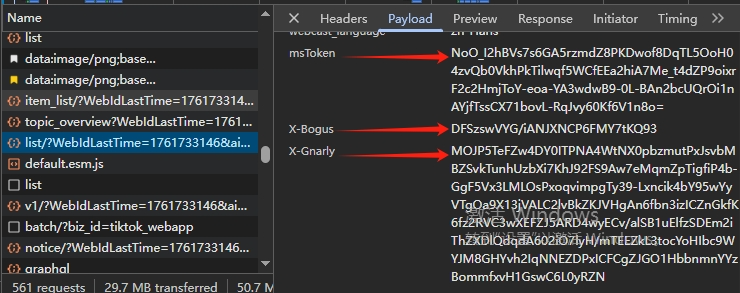

先说X-Bogus、X-Gnarly，这两兄弟在一块

全局搜索即可定位到加密入口位置在 webmssdk.js 文件中

（作者在写文章的过程中目标版本进行小更新，代码变了点但主流程未变，如果后文有代码未匹配的部分请忽略）

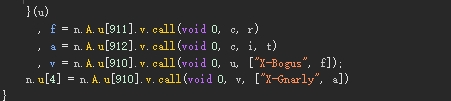

下断点过去

很明显两个加密参数都是在这生成的

f 结果是X-Bogus，a 结果是X-Gnarly

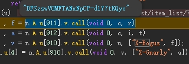

再下一步进去看看

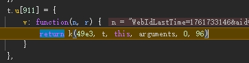

调用了这个方法

那么我们目标就是补完环境后导出这个方法进行调用

接着我们往上看看堆栈是如何进入这个方法

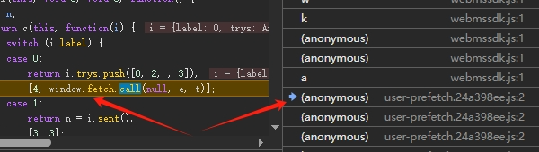

可以看到这里是调用了window.fetch然后就进入了webmssdk.js文件中

正常window.fetch是一个内置函数

在控制台我们输出看一下

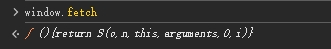

对比下正常的

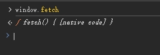

很明显对window.fetch进行了重写

然后调用重写后的window.fetch后就能到加密位置

那么首先我们需要找到它是什么时候重写的

最简单方法直接写hook脚本

```
(function() {
    let _fetch = window.fetch;
    Object.defineProperty(window, 'fetch', {
      get() { return _fetch; },
      set(v) { _fetch = v; debugger; }
  })
})()
```

我这里有点问题，我直接在控制台执行hook脚本有时候能hook住有时候又hook不住，如果你也有问题的话，建议用油猴或其他方式注入吧

还有他对window.fetch重写了好几次，需要多跳几次，可以每次hook到时候控制台执行一下window.fetch.toString()看下和上面对比的时候是否代码一致

然后定位到如下进行重写的代码位置

往上找堆栈可以看到入口处有个init方法

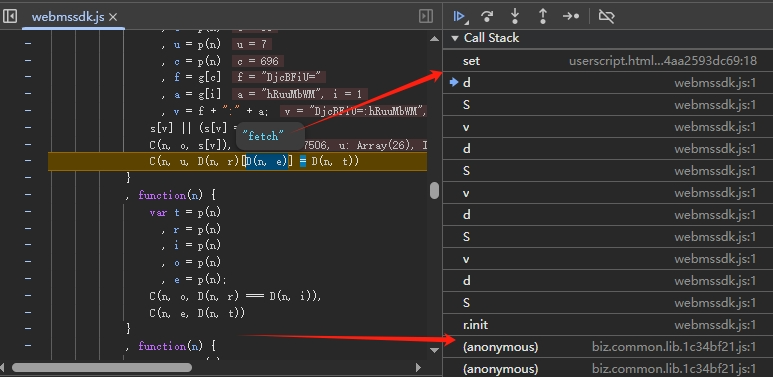

调用了window.byted_acrawler.init方法进行初始化操作后重写了window.fetch

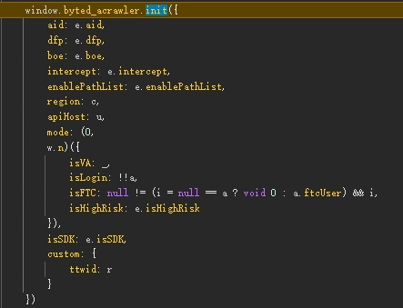

控制台可以看到包含不少方法

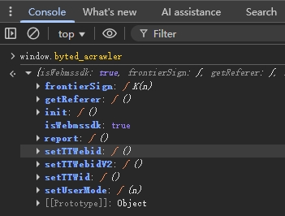

那么就需要找到window.byted_acrawler是什么时候生成的

我们先在webmssdk.js文件第一行打上断点

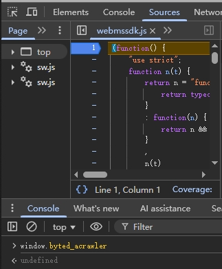

可以看到这时候还未生成

整个js代码是一个自执行函数，所以我们直接按F10，让整个js文件加载完后我们再看看

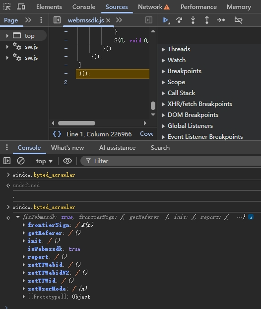

js执行完后window.byted_acrawler也生成了

梳理一下流程

1. 执行webmssdk.js生成window.byted_acrawler
2. 调用window.byted_acrawler.init重写window.fetch
3. 调用window.fetch生成加密参数

## 补环境调用X-Bogus和X-Gnarly

先看下window.fetch用到的参数

再次下断点到加密位置后往上找堆栈到window.fetch调用位置

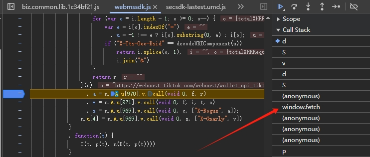

可以看到用到的参数

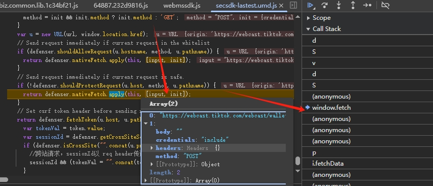

接着我们把整个js文件拿到本地

补全调用流程

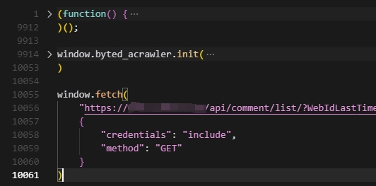

然后就开始补环境吧

具体补了哪些环境就不多说了

属于比较简单的了，没有什么复杂的原型链需要补

重点注意补canvas和toString保护函数就行

我也就补了二百来行

环境正常补完出值后

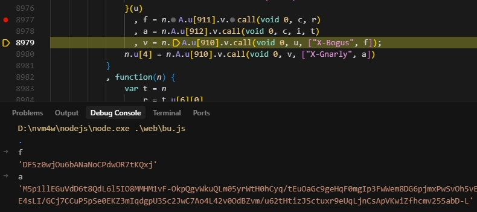

接着研究如何将其调用方法导出

断点到X-Bogus加密位置处可以看到加密所需的参数

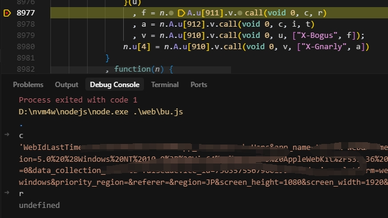

我们下一步进入方法里面去看看

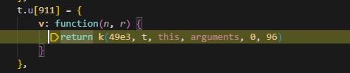

直接赋值导出方法即可，两个加密方法同理

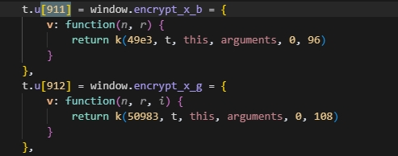

```
x_bogus = window.encrypt_x_b.v.call(void 0, param, undefined);
x_gnarly = window.encrypt_x_g.v.call(void 0, param, undefined, url);
```

到此X-Bogus和X-Gnarly说完了

接着是msToken

## msToken分析

早些时候版本的msToken可以用随机数

现在是从接口返回的

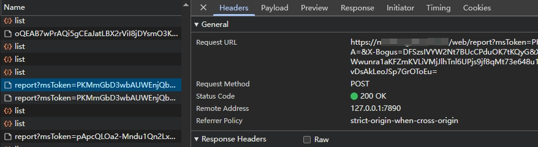

report接口是tiktok的日志上报接口

会收集当前的环境情况提交上去

校验通过会在响应头里返回可用的msToken

载荷内容

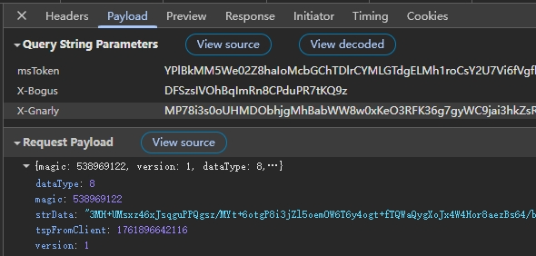

明显有个密文strData

而我们的主要目标也是它

需要找到它的加密参数和方法

试试全局搜索strData

可以定位到如下位置，也是在webmssdk.js文件中

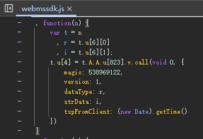

下断点过去

到这的时候 i 也就是 strData 已经生成了

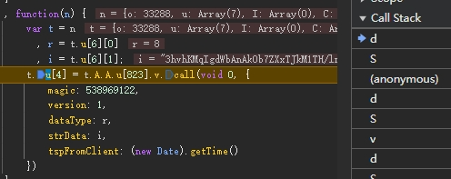

往上跟栈

就到了核心的地方

这是整个vmp的总流程调用处

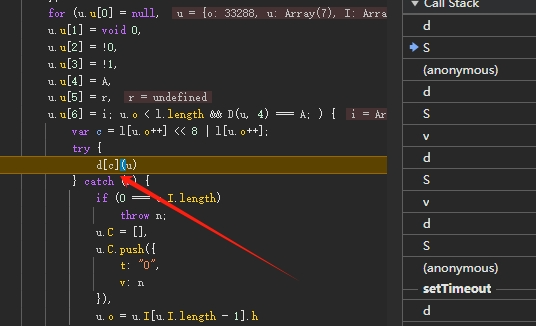

但我们没办法在这插桩

这里调用次数太多了日志直接爆了且没有太多可用信息不利于分析

再往上跟一个栈

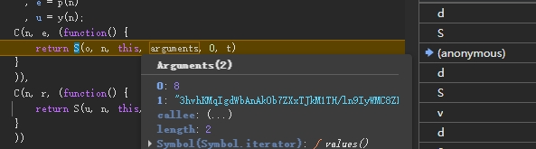

这里主要看C方法，C方法参数里有strData

跳转到C方法位置

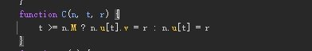

这个C方法其实就是vmp的寄存器位置

所以我们在这里下条件断点

strData长度应该在5000左右，那么加密的环境也不会短

我这里判断大于4000输出日志

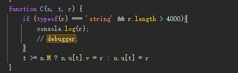

看日志到到断点到位置最后也输出了strData

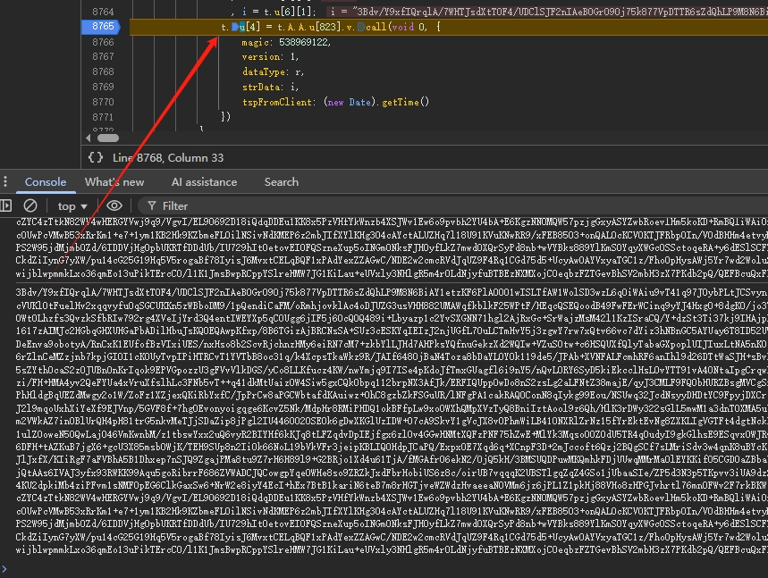

往上翻翻日志很容易就可以找到我们所需要的要加密的环境数组

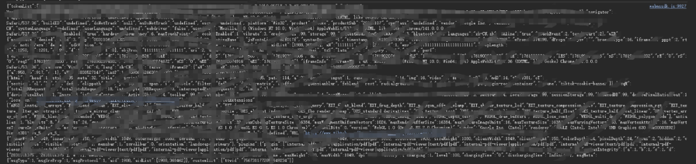

那么根据环境中的关键字再精确一下条件判断

这时候把debugger也加上

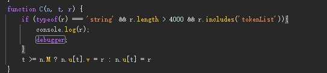

每次断住的时候需要记住一个 n.o 值

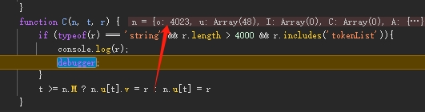

直到断点strData生成后的位置

然后再精确一下条件断点

那么再到这里就加密的入口了

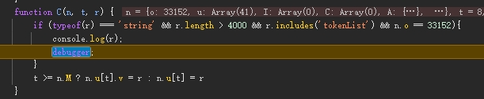

往下调试可以找到加密的调用位置

执行完后也生成了strData

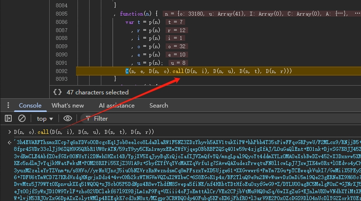

再继续走

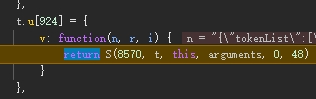

眼熟吧，和分析X-Bogus一样进行赋值导出即可

## 结果验证

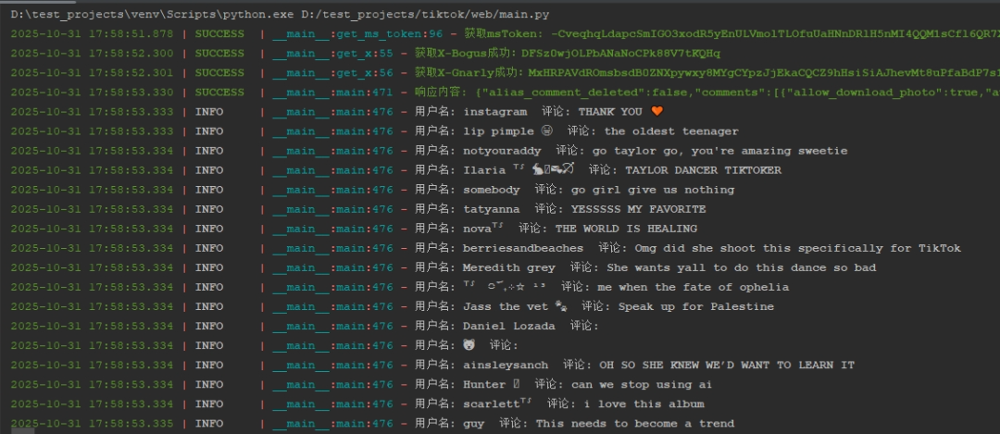

算法还在研究，学学人家写了个ast代码插桩但是只能把方法插出来，想把逻辑运算也插出来但一直有问题啊难受啊！！
