# 招投标公告电话字段 WASM 解密：抠 JS 同步加载 WASM 与一句话让 AI 还原 SM2 + SM4 链

> 来源: 微信公众号：無色逆向（[原文](https://mp.weixin.qq.com/s/qfJ0QfJTSyoO4wTaEs7hsw)）
> 作者: 無色逆向
> 原始发布时间: 2026-03-26
> 归档日期: 2026-09-26
> 分类: web-reverse
>
> 某招投标公告详情接口里的联系电话是密文，页面能显示明文，解密在 WASM 的 `secure_decrypt_data` 里。传统做法：全局搜 `decrypt` 定位到 `_0x2be3ab(固定参数, 密文)`，补齐 WASM 导出对象 `_0x5aadb9`，把 `fetch` + 异步 instantiate 的初始化改成 `fs.readFileSync` + `new WebAssembly.Module` / `Instance` 同步加载本地 `.wasm`，然后直接调用。之后作者在 Cursor 里用 claude-4.6-opus-high-thinking，只输入「分析js复现出wasm中的加密算法」：模型自己列 todo，装 wasm2wat / wasm-decompile 反编译，从函数名先猜 SM2，再写测试验证。截图给出的链路：参数 1 URL 解码 → base64 → SM2 解密（C1C3C2，硬编码私钥）→ 再 base64 解码得 16 字节 SM4 key；参数 2 URL 解码 → base64 → SM4-ECB + PKCS7 解密得明文。约 15 分钟、300 万 token。

## 收录说明

原文标题「我用一句话让AI逆向出WASM中的加密算法」，2026-03-26 10:55（UTC+8）发布，公众号标注原创。归档时用公开短链纯 HTTP 拉取（桌面 Chrome UA，无需登录、未遇验证页），`#js_content` 转 Markdown。30 张图已下载到 `web-reverse/wasm-decrypt-ai-one-prompt-recovery/`。原文小标题是普通段落，归档时提为 Markdown 标题（声明 / 前言 / WASM简介 / 逆向目标 / 抓包分析 / 逆向分析 / AI分析 / 总结），正文文字未改。同步加载代码块里的 `function_0x3c5175()` 缺空格是原文页面本身如此，未改；AI todo list 原文就是 1、2、4、5 编号。

目标站点地址是作者写的 base64，照原样保留。截图里的 SM2 私钥只露了前几位，解密出的电话号码已被作者打码；测试用的密文参数是作者样本值。

相关地图：

| 主题 | 文档 |
|------|------|
| AI 辅助 Web 逆向合集 | [ai-assisted-web-reverse-compilation.md](./ai-assisted-web-reverse-compilation.md) |
| 国密 / 魔改哈希密码笔记（含 SM4） | [xfq-crypto-notes-compilation.md](../signature-algorithms/xfq-crypto-notes-compilation.md) |
| hCaptcha 无感补环境（hsw.js 同样由 JS 加载 WASM） | [hcaptcha-invisible-hsw-env-patch.md](./hcaptcha-invisible-hsw-env-patch.md) |
| 同作者：aws-waf-token 纯算 | [aws-waf-token-challenge-purecalc.md](./aws-waf-token-challenge-purecalc.md) |

## 声明

本文章中所有内容仅供学习交流使用，不用于其他任何目的，严禁用于商业用途和非法用途，否则由此产生的一切后果均与作者无关！若有侵权，请联系公众号【無色逆向】删除。

## 前言

距离上一次更新文章，已经过去近两个月了。一方面是借着春节假期，给自己放了个短假，稍作休整；另一方面，这两个月里AI相关技术迎来了新一轮爆发式突破——就像OpenClaw的出圈，直接引爆了“养虾领域”的技术热潮。始终记得“落后就会挨打”的道理，我也投入了大量时间和精力，紧跟技术前沿，认真学习、消化这些新变化。

与此同时，逆向领域也有不少新动态，不少技术大佬陆续开源了MCP插件、Skills等实用工具，让整个逆向圈子多了很多可借鉴、可学习的资源和新的研究方向。

曾经我还侥幸认为，AI对逆向工种的替代，会比普通程序员晚一些、温和一些，可现实却给了我一记警醒——这把“替代之刃”，早已悄然悬在我们头顶，容不得半点懈怠。

## WASM简介

结合近期的技术学习与行业动态，今天就和大家聊聊当下备受关注的WASM技术。WASM全称WebAssembly，是一种为栈式虚拟机设计的二进制指令格式，作为可移植的编译目标，支持C/C++、Rust、Go等多种编程语言，既能部署在Web端，也能应用于服务器、边缘计算等非Web场景，已成为贯通多场景计算的核心底层技术之一。

WASM的核心优势的在于高效、安全与可移植性：其紧凑的二进制格式加载速度远快于JavaScript文本格式，解析时间可减少60%以上，能以接近原生机器码的速度执行，有效弥补了JavaScript在重计算场景下的性能短板；它运行在内存安全的沙箱环境中，无法直接访问宿主系统资源，能严格遵循浏览器的安全策略，降低安全风险；同时其字节码可在不同操作系统、CPU架构下运行，无需重新编译，实现了真正的跨平台兼容。

很多人会误以为WASM是JavaScript的替代品，实则二者是互补关系——JavaScript擅长处理页面交互、DOM操作等逻辑，负责“交互面”；WASM主打密集型计算，负责“计算层”，通过导入/导出机制实现高效互操作，共同构建更强大的应用体系。从应用场景来看，WASM已广泛用于3D渲染、音视频编解码、云端CAD、边缘计算、区块链等领域，Figma、Unity等知名产品均有其深度应用，随着2025年底Wasm 3.0的发布，其生态正进入爆发期，也成为逆向领域和AI技术融合的重要载体之一。

更恐怖的是WASM正在与VMP进行结合，如此一来定会加大逆向分析的难度。

## 逆向目标

aHR0cHM6Ly93c3NjLmhiZ2d6eS5jbi9hbm5vdW5jZW1lbnREZXRhaWw/aWQ9NTkzNTY5JmFubm91bmNlbWVudFR5cGU9b3JkZXI=

## 抓包分析

这是一个招投标相关的公告内容

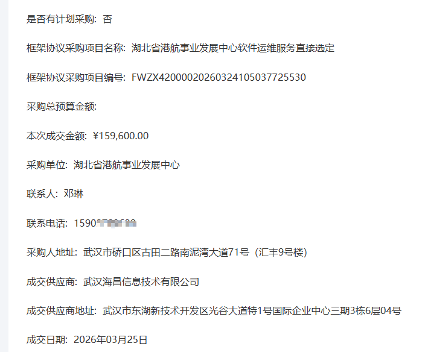

所有的字段数据都在接口里

这里我们主要看的是联系电话这个字段，网页上是能正常显示号码的

但是在接口里获得的是一段加密的密文，需要解密后才能正确展示

实际分析后发现解密方法是在 WASM 代码中

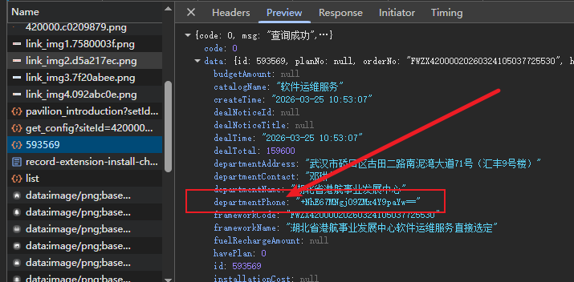

## 逆向分析

老手艺人的最后绝唱

看到加密参数，习惯性的全局搜索一下decrypt、encrypt关键字

目标是解密所以搜索decrypt

定位到一个明显的位置

secure_decrypt_data

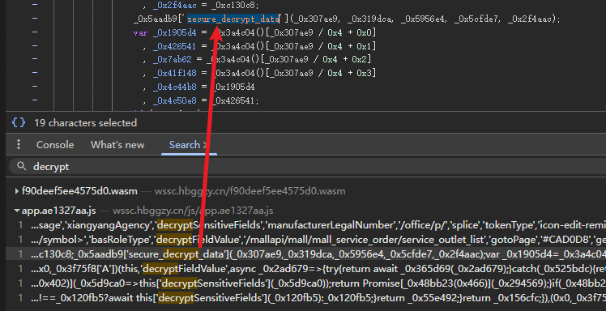

下断点过去

先看这个函数最终返回的结果

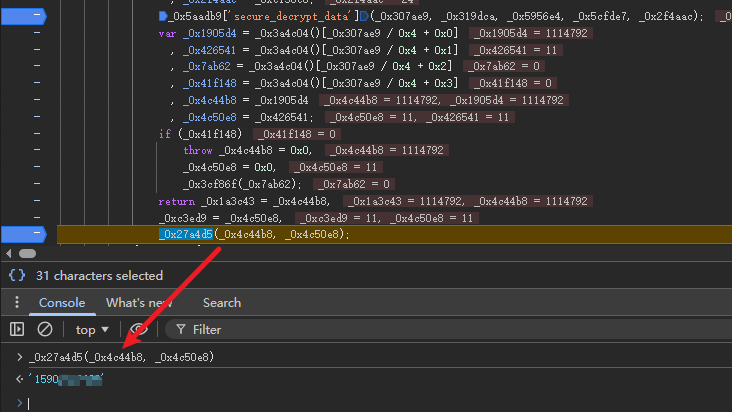

结果正确，就是解密后的号码

看看函数 _0x2be3ab 的传参

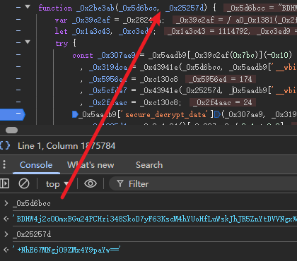

参数1是个固定值

参数2就是要解密的值

把这个函数拿到本地，开始抠代码，缺啥抠啥

最重要的就是补_0x5aadb9这个对象

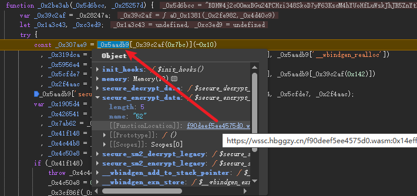

这个对象里包含了一些方法，点开后很明显看出都是从 WASM 导出的对象和方法

再全局搜索 _0x5aadb9 =

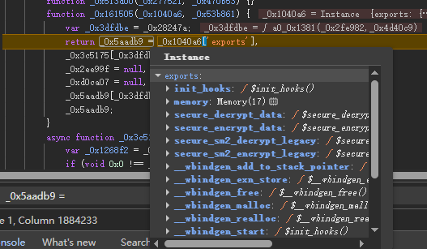

定位到了 exports 导出的位置

再往上跟栈

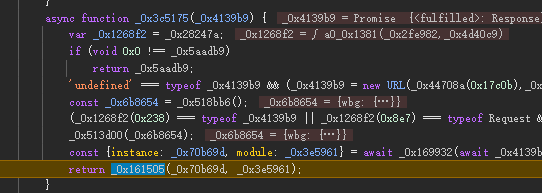

我们进行提炼一下

```
async function _0x3c5175() {
    let _0x4139b9 = new URL("/f90deef5ee4575d0.wasm", URL);
    const _0x6b8654 = _0x518bb6();
    _0x4139b9 = fetch(_0x4139b9);
    const {instance: _0x70b69d, module: _0x3e5961} = await _0x169932(await _0x4139b9, _0x6b8654);
    return _0x161505(_0x70b69d, _0x3e5961);
}
```

这里使用了异步方法用fetch网络请求获取 WASM 文件后初始化 WASM 实例

我们也可以将其改为同步方式，并且调用本地 WASM 文件

```
function_0x3c5175() {
    const _0x6b8654 = _0x518bb6();
    const _0x70a7d8 = fs.readFileSync("./f90deef5ee4575d0.wasm");
    const _0x3e5961 = new WebAssembly.Module(_0x70a7d8);
    const _0x70b69d = new WebAssembly.Instance(_0x3e5961, _0x6b8654);
    return _0x161505(_0x70b69d, _0x3e5961);
}
```

所以基本逻辑就是执行 _0x3c5175 方法初始化 WASM

然后执行 _0x2be3ab 方法传参进行解密

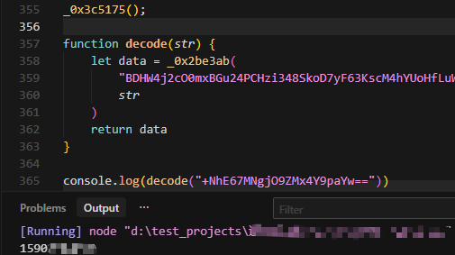

按照以往的方式，到这基本结束了，写个接口调用就行了

但我突然想试试用AI能否直接还原出算法来

## AI分析

我用的 cursor，选择 claude-4.6-opus-high-thinking 模型

在对话框里我只简单的输入了一句话

```
分析js复现出wasm中的加密算法
```

原本只是想看看实力，谁曾想直接一把梭哈，直接还原了算法，

不到50行代码给到我，去掉一些空白行注释啥的也就不到30行了

下面是它具体的思考逻辑

它会先分析完成任务大概需要哪几个步骤并列出todo list

```
1、完整读取 test.js，理解所有函数和 wasm 桥接逻辑
2、分析 wasm 导出函数（尤其是 secure_decrypt_data）
4、尝试用 wasm2wat/wasm-decompile 反编译 wasm
5、复现加密算法为纯 JS 实现
```

它会自己安装模块反编译 wasm 用于分析

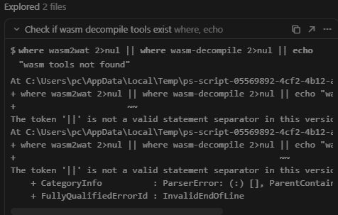

分析函数名给出了疑似SM2加密的言论

（这里搜索了kou.js文件实际是我另一个项目文件，完全不相关的，

建议还是单独放一个工程里面免得出现多余操作浪费token）

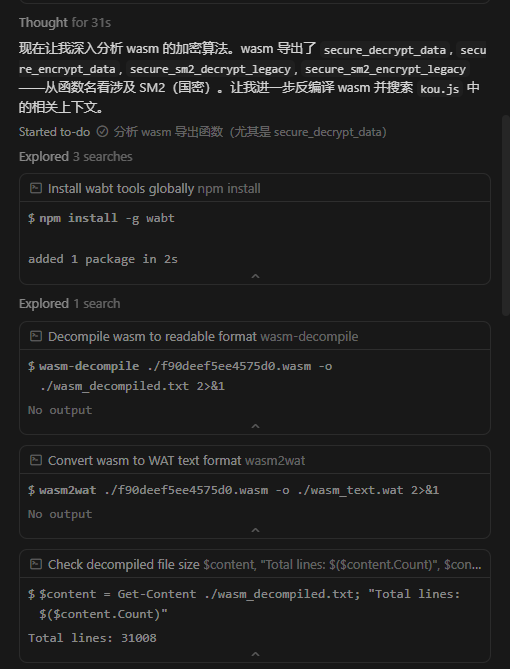

再紧接着分析反编译后的文件并给出了分析步骤

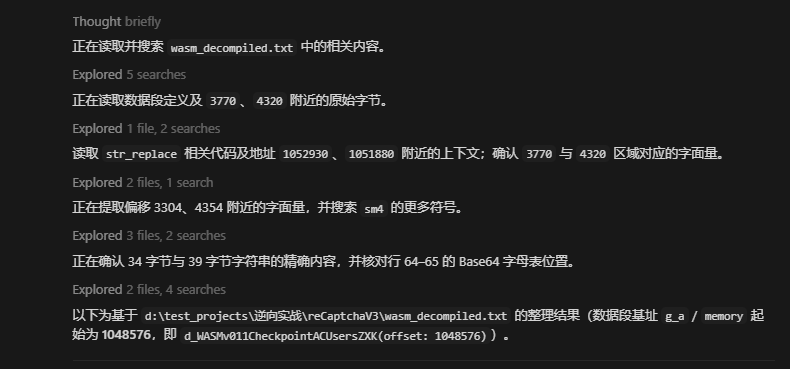

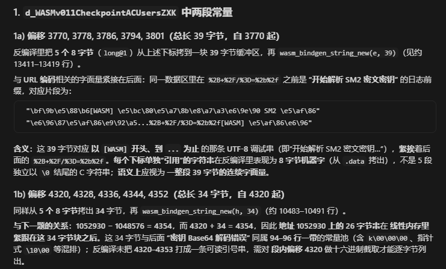

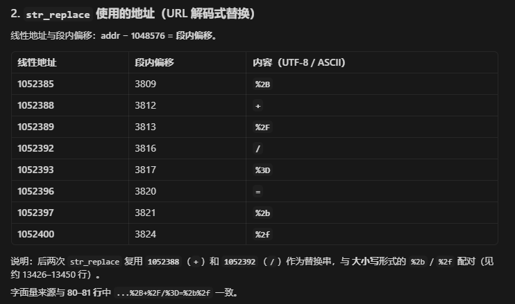

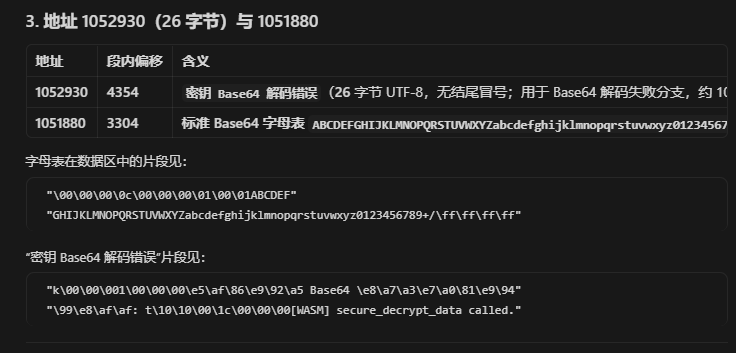

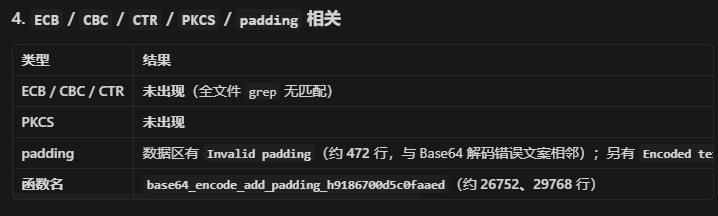

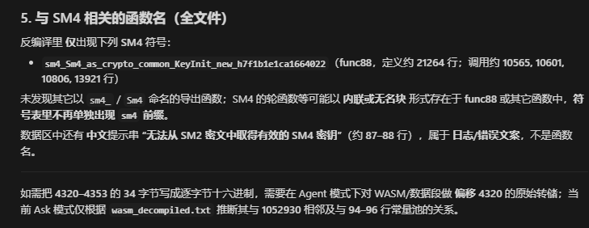

分析完后给出分析报告

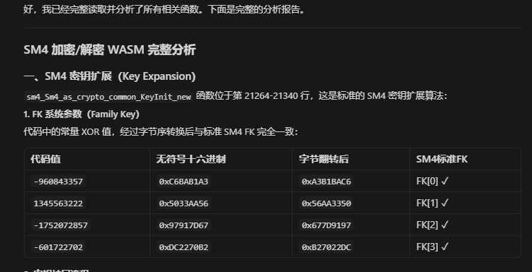

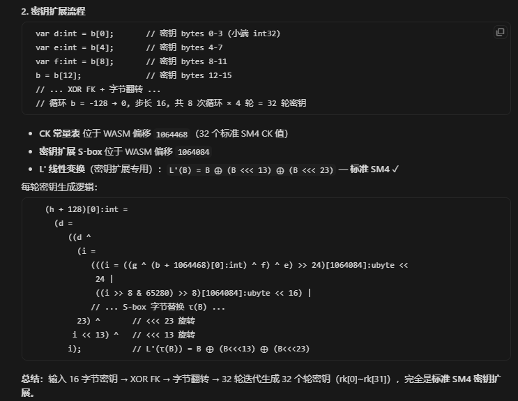

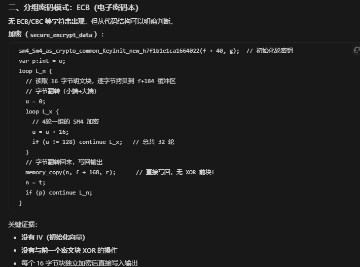

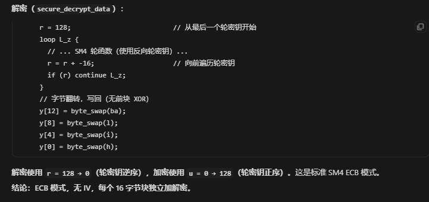

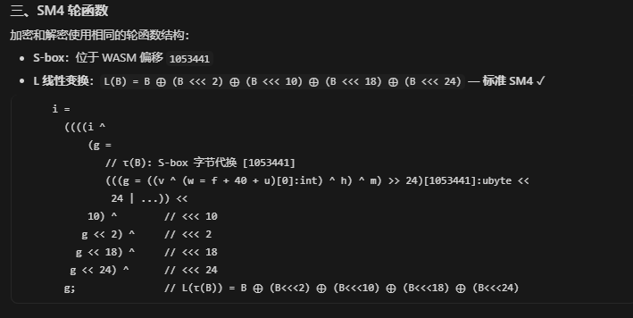

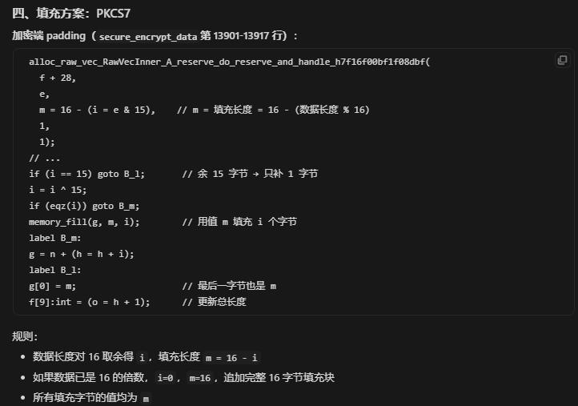

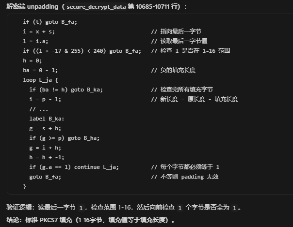

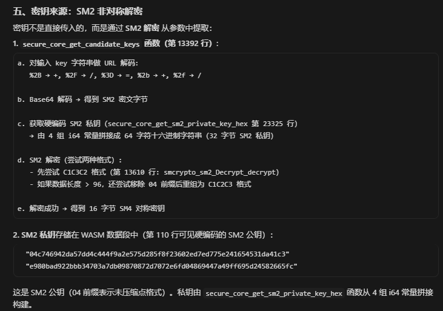

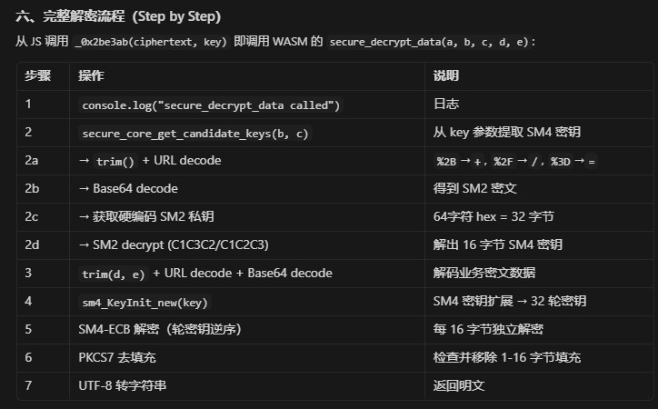

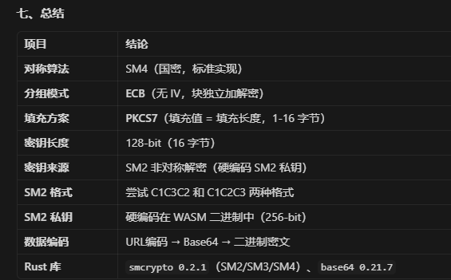

最后，编写代码进行测试论证

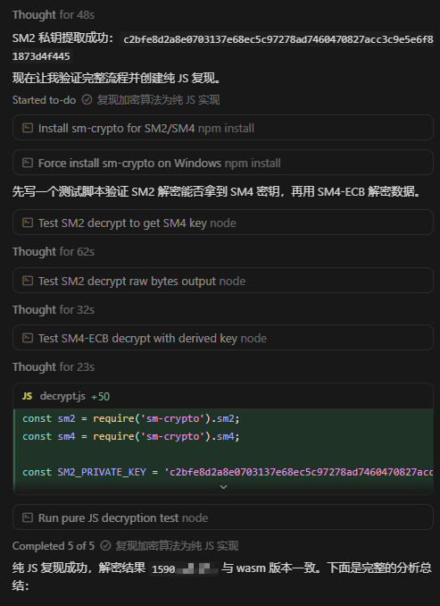

还给出了算法链路

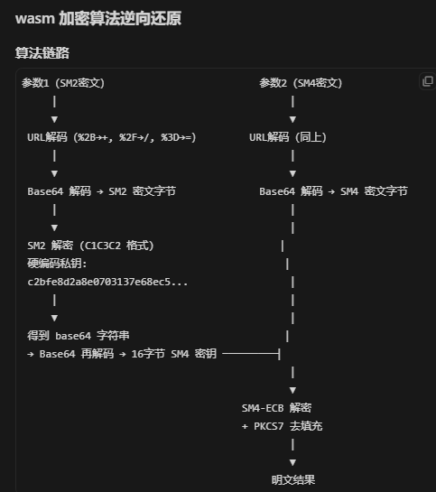

结果完美

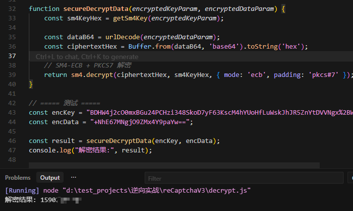

## 总结

这次分析的过程也有不少感悟，我是先抠完JS让其正常运行后，再让AI分析得出的算法。其实换个思路，也可以尝试让AI通过MCP直接接管浏览器，自动加载JS、分析堆栈内容，进而给出算法，我觉得这也会是未来的发展趋势。不过这次分析的成本确实不低，总共耗时十五分钟左右，消耗了足足三百万token，说真的，这个量远超预期。要知道一百万token差不多要1美刀，可能也是我选用的旗舰模型最贵的原因，但这也能看出，成本现在确实是限制AI普及的问题之一，但要用肯定还是用最顶尖的模型，用那些个便宜的傻蛋你看一把能梭哈出来吗。
